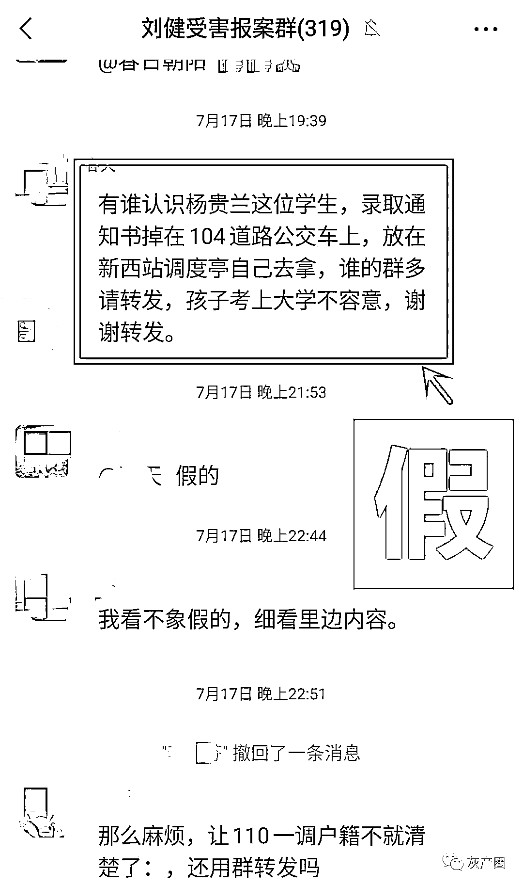
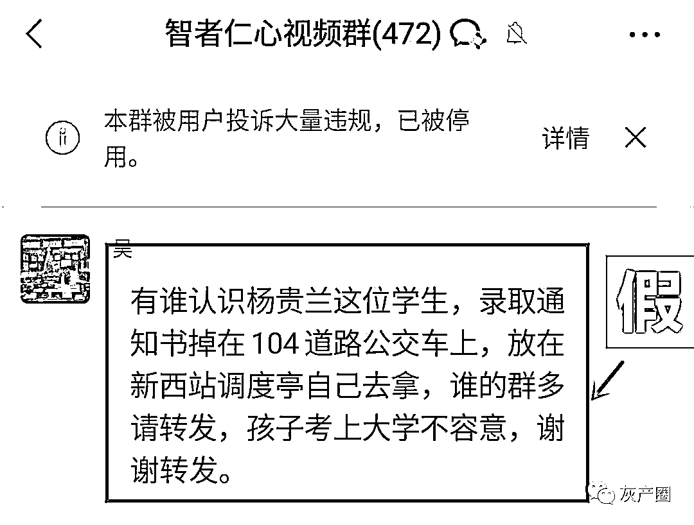
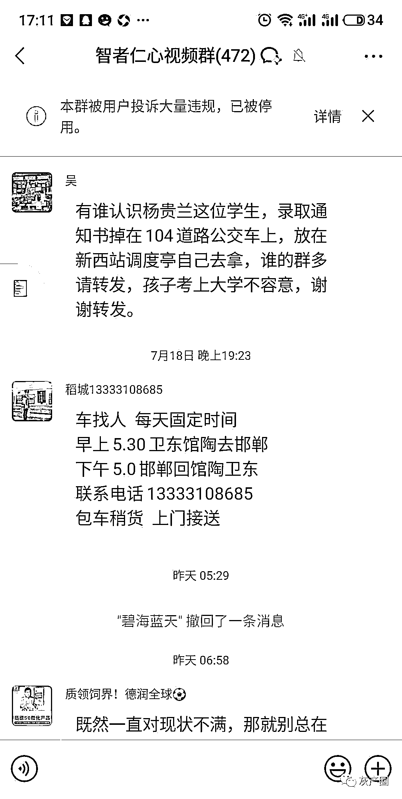

# “杨贵兰”的录取通知书又丢了？假新闻的嘴！骗人的鬼！

> 原文：[`mp.weixin.qq.com/s?__biz=MzIyMDYwMTk0Mw==&mid=2247517661&idx=5&sn=00b8861e2f82a57a11f5709d34272773&chksm=97cb4ee5a0bcc7f356107f4161c78c283896bd453f892f90a6f7cd477f358a893ea73a3f55f9&scene=27#wechat_redirect`](http://mp.weixin.qq.com/s?__biz=MzIyMDYwMTk0Mw==&mid=2247517661&idx=5&sn=00b8861e2f82a57a11f5709d34272773&chksm=97cb4ee5a0bcc7f356107f4161c78c283896bd453f892f90a6f7cd477f358a893ea73a3f55f9&scene=27#wechat_redirect)

最近正是各大高校录取通知书发放时间，记者发现微信群里一则“杨贵兰，你的录取通知书丢了”的消息刷屏了，大致内容是山东省济南市一名叫“杨贵兰”的考生，不小心把通知书丢了，希望大家在微信群接力转发，帮她找回。7 月 19 日，“山东公安”微信公众号辟谣，证实此消息是虚假消息。

记者觉得“杨贵兰”这个名字似曾相识，经过搜索发现，2019 年 8 月，重庆确实有个叫杨贵兰的同学丢过录取通知书，正是通过网络接力转发的形式让她当天就找回了通知书。此后，2020 年、2021 年每年录取通知书发放时间，“杨贵兰”就会在网上“丢”一次录取通知书，很多不明实情的热心人纷纷转发，引发了每年一次的“炒冷饭”式的假新闻传播。

记者查询发现，近两年来“杨贵兰”的录取通知书，不仅“丢”在了山东济南，而且在福建厦门、湖南衡阳、四川成都、山西阳泉、广东惠州等地每年也都有一次传播，相关地区的警方也都进行了官方辟谣。

每年同样的话题，换汤不换药的骗术，却每年都有好心人被“套路”。在每年中高考季、毕业季等时间节点，以考试、毕业为话题的网络谣言、网络诈骗增多，基本都是考前丢身份证、考后丢通知书。

**警惕假新闻后面的“吸费”陷阱**

**2020 年 7 月，教育部联合中央网信办、公安部等部门梳理汇总了近年来出现频率较高的高考假新闻、假信息，提醒网民擦亮眼睛，其中之一就是“网上经常流传××考生准考证丢失的信息”。网民看到后替考生着急，迅速在群内转发，短时间内形成了影响范围较大的舆情。**

**有不法分子往往借此虚构情景骗取网民同情，提供虚假信息，所留手机号码多为吸费音讯电话。若有好心人按照电话号码回拨，并且按电话提示音操作，就可能掉入“吸费”陷阱。**

****用法律的“笼子”管住假新闻的“嘴”****

****虚假新闻，对社会正能量是一种伤害。管住假新闻的“嘴”，需要法律的“笼子”，更需要打出监督、治理、宣教等“组合拳”。首先，相关主管部门应该加强网上信息的监督和管理，及时发现、迅速辟谣，剪掉假新闻的“腿”。其次，要不断完善法律法规，结合民事、刑事法律，织就一个具有清晰边界的法律“笼子”，以此明确网络虚假信息制造者、传播者中涉及的各类主体的责任边界，从源头上铲除假新闻。三要加大对群众的防范宣传，让群众警惕对待网络信息，防止好心人被利用。****

****希望明年此时，“杨贵兰”的录取通知书不会又双叒“丢”了。****

****来源：中国新闻网，来源：利箭在行动****

********

****← 向右滑动与灰产圈互动交流 →****

********