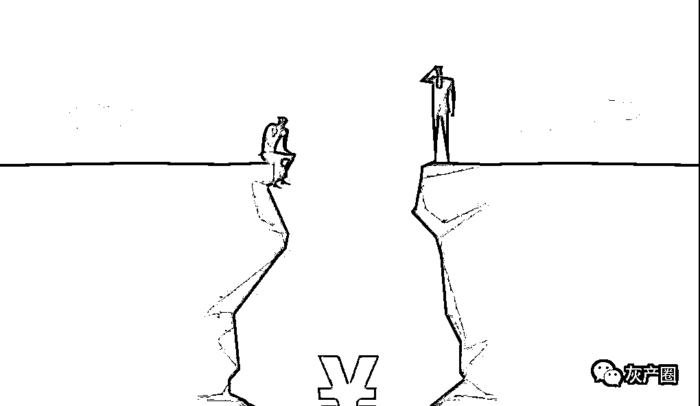
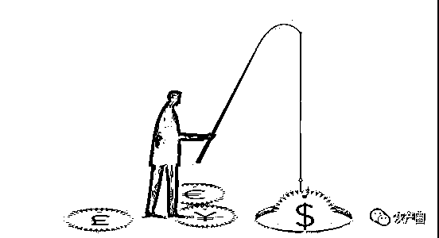

# 1 元“私密直播”骗走 30 万，武汉男子一夜遭遇 5 连骗

> 原文：[`mp.weixin.qq.com/s?__biz=MzIyMDYwMTk0Mw==&mid=2247517661&idx=6&sn=dcfdca2709a2632723bc579faebadf3f&chksm=97cb4ee5a0bcc7f39dbf5072380c22b905e7a2573b63cd3cd56456612877c6c03fd12bdeeb29&scene=27#wechat_redirect`](http://mp.weixin.qq.com/s?__biz=MzIyMDYwMTk0Mw==&mid=2247517661&idx=6&sn=dcfdca2709a2632723bc579faebadf3f&chksm=97cb4ee5a0bcc7f39dbf5072380c22b905e7a2573b63cd3cd56456612877c6c03fd12bdeeb29&scene=27#wechat_redirect)

年过三十的岳刚（化名）一直单身，由于工作忙，想在网上结识女友，不料落入网络“养鱼”“杀鱼”骗局。一名化身美女的骗子让他“充值一元观看私密直播”，让他一步步跌入陷阱连环被骗，一夜之间损失 30 万余元。

武汉铁路公安处接到报案后展开侦查，顺藤摸瓜抓获这伙骗子，7 月 16 日，向受害人发还 19 万元被骗款。办案民警介绍，经武汉铁路运输法院一审判决，团伙成员刘某、陈某、徐某、林某、李某等人分别被判处四年二个月、三年二个月至拘役四个月不等有期徒刑，并处罚金 3 千元至 1.5 万元。

“一元充值看视频”被骗 1800 元

“我当时都不想活了，我一只脚已经跨上了房间内的窗户，想跳楼，又不想让那些骗子逍遥法外……”

7 月 16 日，受害人岳刚讲述了被骗前后的经过，仍感不可思议。

岳刚是武汉人，年过三十，是武汉某公司技术人员，因为工作较忙，一直是单身，住在武汉市武昌区。2020 年 8 月，他加入了一个名叫“武汉 95 后 00 后交友”聊天群，在群里认识了“美女”刘某。

事实上，刘某是一名男子，23 岁，河南焦作人，在老家当快递员，在工作之余喜欢上网聊天。刘某落网后交代，他在网上认识了从事网络代聊的网友“无名”，“无名”告诉他可以假冒女性身份聊天，骗红包当零花钱，并将其拉入了一个相关的“渔夫群”，这是专门寻找受害者的“钓鱼群”。

于是，刘某用心研究一些小骗术，想成为一名“钓鱼者”挣点外快。

2020 年 7 月，刘某在网上购买了一名女子的生活照、艺术照，自称是一名女主播，并化名“小杨”开始在网络上寻找目标。当年 8 月，刘某在群内看到岳刚加入群后，故意在群内聊了几句，随后两人单独互加了 QQ、微信，偶尔嘘寒问暖，经过网络聊天逐步取得岳刚信任。

“我们聊了这么久了，你想在我的直播室看我的私密视频吗？充值一元钱就可以了。”对于“小杨”的要求，岳刚满口答应。

像岳刚这样的人，被诈骗团伙成员称为“鱼”。

“有‘鱼’来了！”

2020 年 10 月 19 日 20 时许，刘某在“渔夫群”里说需要“私密直播”APP 的虚假充值链接。群主陈某提供了链接。

陈某在骗子圈内被称为“渔夫”，专门为“钓鱼者”提供链接，并贩卖“鱼”给上线继续诈骗。

随后，刘某将陈某提供的链接发给岳刚，谎称下载“私密直播”APP，注册后每次扫码充值 1 元便能成为会员，岳刚充值两次“显示失败”，但紧接着收到两次成功扣款 900 元的短信，总共被扣款 1800 元。

岳刚向刘某索要多充值的 1799 元钱，刘某询问陈某该怎么办，陈某说：“成功了，哥们，你让岳刚加我私聊，我来谈‘退款’的事，这单提成我全部给你！”

岳刚被扣的 1800 元进了陈某控制的平台，陈某给刘某转账 1570 元提成，刘某却对岳刚说：“系统有误，你找我们的财务人员来谈退款的事。”

刘某事后交代，他知道诈骗太多的钱风险大，不敢进一步骗取岳刚的钱财，但陈某已经给了他提成，于是他把自己与岳刚的聊天记录全部发给陈某，让陈某去应付岳刚。

此时，岳刚的噩梦才开始。如果把刘某算作 1 号骗子，紧接着 2、3、4 号骗子接连登场。

2 号骗子陈某对岳刚说，他本人只能登记确认，只有客服才能办理退款，又把与岳刚聊天记录打包转给其在另一诈骗聊天群的 3 号骗子徐某。徐某则以“午夜客服”的网名冒充客服，假装办理退款，谎称要退款必须先扫码付款，证明前期存在“充值失误”行为，诱导岳刚充值 Q 币 6000 元，后在某平台上转手卖了 4800 元，与陈某五五分成。

“有‘鱼’可以杀，谁想接后续？”面临岳刚再次索要退款，徐某自觉诈骗手段不高明，在诈骗聊天群发话。此时，住在广东的 4 号骗子林某上场接单。

徐某将先前所有聊天记录转给了林某，对岳刚说：“我的权限不够，只有公司财务人员才能办理退款。”接着，林某假冒财务人员登场。

当时，4 号骗子林某尚未满 18 周岁，曾因涉嫌诈骗被上海警方抓获，还处在取保候审状态，但他的诈骗经验已相当老到。

5 号骗子下重手榨干受害人

与岳刚接上话之后，林某又以“客服 001”的网名假冒客服协助退款，退还了岳刚首次充值的两笔钱共 1800 元钱。岳刚要求退还第三次充值的 6000 元钱，林某则称退款要先转款，“转款肯定不会成功，但公司需要你那张‘转款失败’的截图……”岳刚不知有诈，向林某指定账户转账 49998.11 元。

林某感觉进一步骗取对方钱财出现困难，又称只有“财务总监”才有权限退款，询问他在贵州的“师傅”——5 号骗子李某是否能接单，得到肯定答案后，林某将之前的诈骗聊天信息全部发给李某。此后，“财务总监”“总经理”接连找到岳刚。“你还想要回之前被骗的钱吗？那你就按照我说的做！”

李某询问了岳刚的银行账户余额后，说只要不及时输入转账验证码，在几分钟后进行转账就不会成功，要求其截取“转账不成功”的截图。岳刚尽管将信将疑，但此时的他一心想要回之前被骗的钱，抱有一丝侥幸心理的他，最后不得不照做。

“你怎么又转了将近 5 万元钱到我账户了！我要想办法退给你呀！”次日凌晨 2 时许，李某再度故伎重演，诱使岳刚前后向其不同指定账户转款 3 笔，每笔 49998 元，合计 149994 元。

此时，李某化身最终具有退款权限的“董事长”登场，岳刚又被骗走 10 万，至此，岳刚当晚被骗 30.59 万余元。

警方提醒网上转账须谨慎

岳刚终于明白被骗惨了，一夜未眠。20 日一早向单位请假后，急匆匆来到武汉铁路公安处刑警一大队报案。

武汉铁路警方迅速抽调刑侦、网安、派出所等精干力量成立专案组，同时对受害人岳刚资金转入提供的 5 张涉案银行卡账户进行第一时间冻结，由于错过最佳报案时间，仅冻结了涉案资金 3 万余元。同时，对所有打款账户卡主信息开始摸排，根据资金流向线索，分赴河南、广东、贵州等多地，将刘某、陈某、徐某、林某、李某等 5 人抓获。

期间，民警在梳理案件过程中发现，这些诈骗人员在现实生活中基本都不认识，“钓鱼者”刘某是有固定工作，见到现在网络诈骗很多，也意欲参与骗些“小钱”；年龄最大的李某 25 岁，在诈骗圈子内“名气”很大，最后下手“杀鱼”，手法熟练、毒辣，先后 4 次被公安机关打击处理；专门在网上养“钓鱼者”的陈某年仅 18 岁，林某作案时差 2 月才满 18 周岁。这些嫌疑人不少初中即辍学，日常都是出入网吧、宾馆、酒吧等地，长期在各种聊天软件群内活动，以“租借”个人银行卡、网络骗术谋生。

武汉铁路警方提醒广大群众切实提高防范电信诈骗意识，不要点击来历不明的支付链接，保护好自己的支付密码，切实做到不轻信、不汇款、不扫陌生码、不点击陌生链接；遇到情况主动询问公安机关，在网上交友更要特别谨慎，切勿随意转账，以防上当受骗。

来源：湖北长安网，利箭在行动

← 向右滑动与灰产圈互动交流 →

