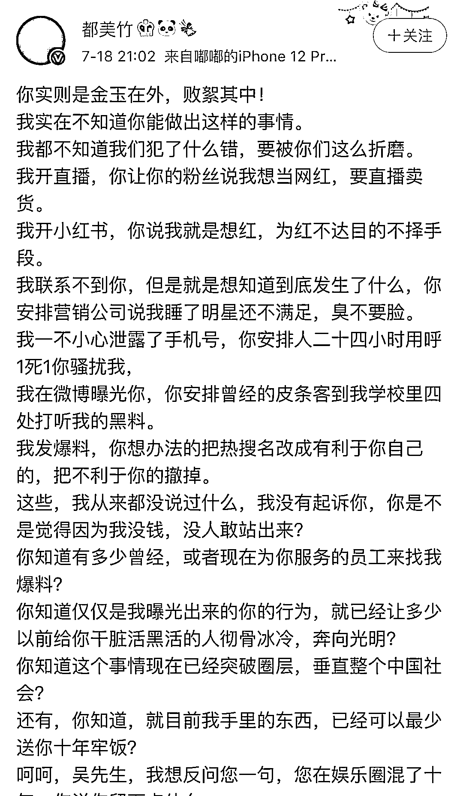
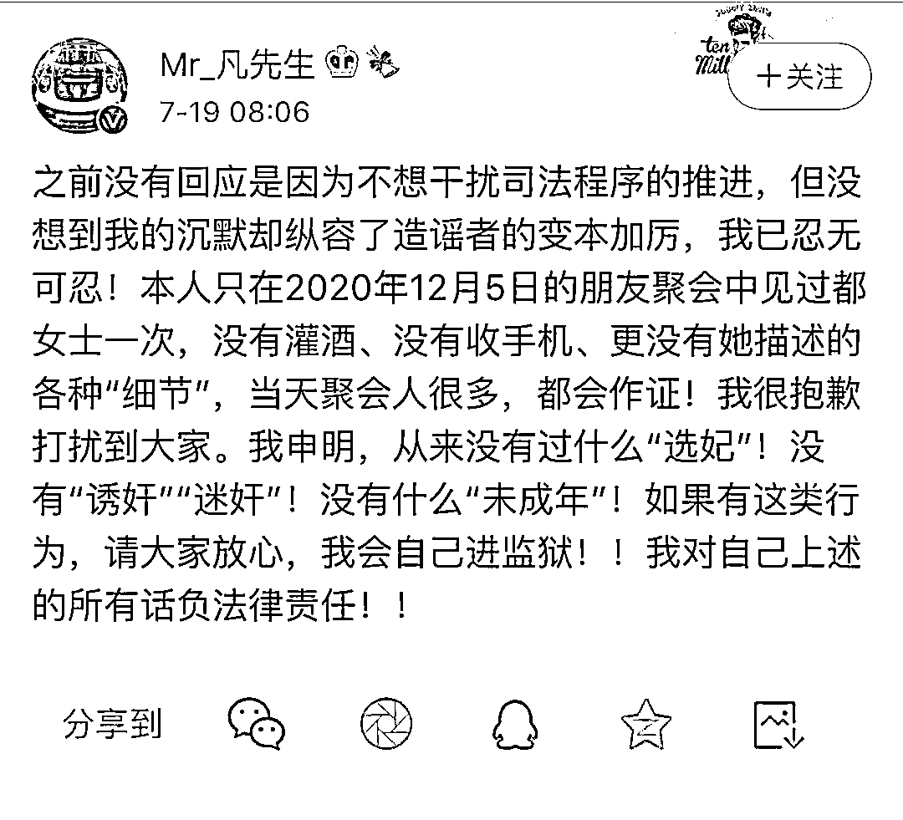
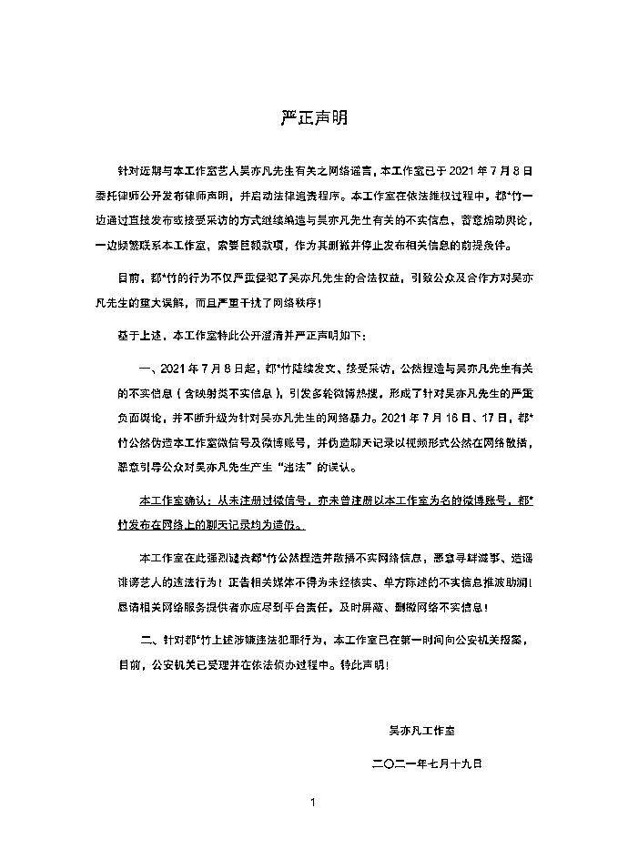

# 警方通报吴亦凡事件：聚会饮酒后发生过性关系，同时牵出诈骗案

> 原文：[`mp.weixin.qq.com/s?__biz=MzIyMDYwMTk0Mw==&mid=2247517737&idx=1&sn=2ba4aedeb5c13fd1f0f5ffddd3c4596e&chksm=97cb4d11a0bcc407dc5a31b4432d0ac7dc7f5fe56c20ff5c821a0b540b39649f82cf430f7fd6&scene=27#wechat_redirect`](http://mp.weixin.qq.com/s?__biz=MzIyMDYwMTk0Mw==&mid=2247517737&idx=1&sn=2ba4aedeb5c13fd1f0f5ffddd3c4596e&chksm=97cb4d11a0bcc407dc5a31b4432d0ac7dc7f5fe56c20ff5c821a0b540b39649f82cf430f7fd6&scene=27#wechat_redirect)

屡登热搜的吴亦凡和都美竹网络互相爆料一事有了新进展。

7 月 22 日，北京朝阳警方发布了针对都美竹通过网络反映受到侵害和吴亦凡一方报警称被敲诈勒索的情况进行了通报。经过警方调查，吴亦凡和都美竹确有过两性关系发生，2021 年 6 月，都美竹为了提升网络知名度，先后在网上发布被吴亦凡“冷暴力”的博文。当月，本事件中查明的犯罪嫌疑人刘某迢看到网络信息后产生对双方进行诈骗的想法，虚构了三个身份对都、吴双方实施了诈骗，最终获利 18 万元。

目前，刘某迢已经被朝阳警方依法刑事拘留。此外新京报记者从朝阳警方了解到，事发至今未曾接到都美竹本人报警，针对网民举报的“吴亦凡多次诱骗年轻女性发生性关系”及近期网络互曝的有关行为，警方仍在调查中，将根据调查结果依法处理。

网络论战：双方都自称报案

*   **男方被指“选妃”“涉未成年人”  女方被指“造谣”、“勒索”**

7 月 8 日，都美竹微博爆料称，吴亦凡把女孩们叫去玩酒桌游戏、灌酒、把女孩照片摆出来像商品一样挑选，并指出涉事的女孩子中有“未成年人”，由此将男明星吴亦凡推向网络风口浪尖。

当晚，吴亦凡发律师声明要告都美竹，但此举并没能让都美竹删除上述微博，反而在后几日接受公开采访时进一步描述了吴亦凡酒局“选妃”的过程，称他会专挑未成年下手，甚至会灌醉女生后发生性关系。

至此，上述关于对吴亦凡的指控中涉及的几个关键词，将一件原本属于娱乐圈的八卦事件，正逐渐演化成了一起法律案件和公共事件。 

16 日，都美竹进一步的爆料中提到自己已经“报警”。

▲7 月 18 日都美竹发布的一条千余字爆料文，据后来网络写手徐某交代，该文是由都美竹提供素材，他撰写而成，文章内容经过“包装加工”。图片来源：都美竹微博截图 

18 日，在接受采访时都美竹描述了吴亦凡以“面试演员”之名选择女孩发生关系的方式：是由粉丝牵头人从后援会中选漂亮女粉丝或者是由已发生关系女孩相互介绍等方式来找新的猎艳对象，她称自己就是被灌醉后与吴亦凡发生了关系。

连续的爆料将舆论推向最高潮，除了都美竹外，网络上开始有越来越多的女孩自称陷入类似“套路”，成为或者差点成为了吴亦凡的猎艳对象。

▲7 月 19 日吴亦凡发布的声明，否认“诱奸”、“迷奸”等行为。图片来源：吴亦凡微博截图。

7 月 19 日、20 日，吴亦凡工作室连续发布多条声明，对指控进行了否认。声明称，吴亦凡仅见过都美竹一次，没有没收手机，没有灌酒，也没有迷奸。至于爆料中所讲的“选妃”和“未成年”，也都逐一否认，并反手指控上述信息都是都美竹“捏造并散播不实网络信息，恶意寻衅滋事、造谣”。此外，该声明还透露都美竹“联系本工作室，索要巨额款项”。

▲7 月 19 日，吴亦凡工作室发布的声明，指控都美竹公然捏造并散播不实网络消息，工作室已报警 。图片来源：吴亦凡工作室官方微博。

吴亦凡方面称，事发后也在第一时间向公安机关报案。

7 月 22 日下午，北京朝阳警方对此事进行调查并通报结果。

**北京警方：嫌疑人利用二人网络信息实施诈骗 ******

****通报称，2020 年 12 月 5 日 22 时许，时任吴亦凡执行经纪人冯某以挑选 MV 女主角面试为由，约都美竹到吴亦凡家中参加聚会，10 余人共同玩桌游并饮酒。当晚，都美竹酒后在吴亦凡家中留宿，两人发生性关系。12 月 8 日，吴亦凡给都美竹转账 3.2 万元用于网络购物。此后至 2021 年 4 月期间，二人保持微信联系。****

****2021 年 6 月，都美竹与好友刘某文商议，在网上公开与吴亦凡交往过程以提升网络知名度，刘某文于 6 月 2 日在微博发布了都美竹被吴亦凡“冷暴力”的博文。7 月 8 日至 7 月 11 日，都美竹跟进发布 3 篇博文。7 月 13 日，网络写手徐某又撰写了“决战”等 10 余篇微博文案，后在 7 月 16 日起由都美竹通过微博账号陆续发布。****

****2021 年 7 月 14 日，吴亦凡的母亲报警称遭到都美竹敲诈勒索。当日警方依法进行了受理和调查，锁定犯罪嫌疑人刘某迢，并于 2021 年 7 月 18 日在江苏省南通市将该人抓获。****

****经查，2021 年 6 月，犯罪嫌疑人刘某迢虚构女性身份，以曾被吴亦凡欺骗感情欲共同维权的名义骗取都美竹的信任，进而获取都美竹与吴亦凡部分交往情况信息。此后，他分别又冒充了都美竹和吴亦凡律师联系，索要 300 万元赔偿，冒充吴亦凡律师要求都美竹签署和解协议。

在吴亦凡母亲分两次向都美竹账户转账 50 万元后，未得到钱款的刘某迢继续冒充都美竹，向吴亦凡律师索要剩余 250 万元未遂。后又冒充吴亦凡律师要求都美竹签署和解协议，否则索回 50 万元。都美竹同意退款后，刘某迢冒充吴亦凡律师将本人的支付宝账号提供给都美竹，都美竹陆续向该账号转账 18 万元。****

****刘某迢被抓获后，对其诈骗犯罪事实供认不讳。目前，该人已被朝阳公安分局依法刑事拘留。****

****案情细节 ****

****嫌疑人一人假扮仨身份 获利 18 万****

********

******针对上述通报，新京报记者今日采访了北京朝阳公安分局相关负责人，就公众所关心的问题进行进一步解答。******

********新京报：**警方接到吴亦凡母亲报警后如何展开工作的？****** 

********朝阳警方：**报警人提供了电子邮件、对话截图等一些证据，称被都美竹诈骗。邮件是以都美竹的名义发出的，先后有 8 封，称要曝光吴亦凡的犯罪事实。另外，报警人还提供了一个自称是都美竹的微信号和吴亦凡律师联系，索要 800 万（后协商至 300 万）和解赔偿费的相关信息。报警人称，吴亦凡被都美竹敲诈勒索。******

******我们通过调查发现，报警人收到的这些信息并非是都美竹本人发出的，后来锁定了犯罪嫌疑人刘某迢。******

********新京报：**犯罪嫌疑人交代的犯罪目的是什么？******

********朝阳警方：**犯罪嫌疑人刘某迢是男性，初中学历，他自己供述是在 6 月看到了双方的事件在网络发酵后，觉得有利可图，注册了新的微博、微信以及支付宝账号，一人扮演 3 个身份，分别和都美竹和吴亦凡工作室有关人员线上沟通，实施了诈骗。******

********新京报：**具体是怎么一个诈骗经过？他假扮了哪三个人的身份？******

********朝阳警方：**第一个身份是“女性受害者”。他注册了新的微博号与都某竹联系，自称是被吴亦凡欺骗的受害者，取得都美竹信任后又添加了她的微信，从她口中“套”出许多有关和吴亦凡交往的细节，这些其实都是在为他假扮后面的身份做准备。******

******刘某迢假扮的第二个身份是都美竹，以都美竹的名义联系了吴亦凡的律师，索要 800 万的和解赔偿款，对方没有同意，最后金额协商至 300 万元。他把自己和都美竹的收款卡号都给了对方。当时他还是在以都美竹的名义在和对方联系，他告诉对方，另一个收款账号是其他受侵害者的家属。******

******但吴亦凡方仅仅给都美竹账号转了 50 万元钱，这就让他第一次诈骗计划失败。****** 

******没从吴亦凡处得到钱，刘某迢开始假扮第三个身份——吴亦凡的律师。他以律师名义联系了都美竹要求签署和解协议，都美竹认为协议对其不利拒绝签署。刘某迢继续冒用律师名义要求索回 50 万，并留下了本人的支付宝账号，都美竹同意后陆续将其中 18 万退回到上述账号上。******

********新京报：**都美竹和吴亦凡实际上没有就此事直接联系，并且有金钱往来？******

********朝阳警方：**对，包括吴亦凡本人、母亲、律师，工作人员，都美竹都没联系过，她当时收到那 50 万元的时候还很意外。至于为何后来只陆续“退回”了 18 万，我们了解到的是，支付宝转账每天都限制，都美竹每天转一些，到刘某迢被抓时，共收到了 18 万。******

******舆论焦点****** 

******都、吴二人是否存违法行为还在进一步调查******

************

********新京报：**有关于都美竹与吴亦凡二人的交往，还有哪些细节？******

********朝阳警方：**根据我们的调查，二人在吴家中聚会饮酒后发生性关系属实，成为微信好友后前期曾联系频繁，后来逐渐减少，直到今年 4 月份吴亦凡不再回复微信。另外，都美竹提到聚会时手机被收走，吴亦凡公开发文否认了这一点。但根据我们后来的调查，他们这种聚会，在开始前都会将手机收起集中统一保管。******

********新京报：**对于都美竹对吴亦凡的公开指控，目前有哪些调查进展？******

********朝阳警方：**截至目前，我们并没有收到都美竹或者是其他自称是受害者的报案。******

********新京报：**通报中提到了另外两名相关人员，都美竹的好友刘某文和网络写手徐某，这两个人在此次事件中起到了什么作用？******

********朝阳警方：**根据我们调查了解到，都美竹一开始在网络发文章的目的就是想提高网络知名度。刘某文是她的第一个帮手，在 6 月发出第一篇炒作文章。****** 

******徐某是在事件已经开始发酵的时候，7 月 13 日主动联系了都美竹，帮她写了自 7 月 16 日以后的 10 余篇微博文章。徐某和我们讲，这些文章都是都美竹提供素材，他“包装加工”后完成的。****** 

******徐某说，他看到都美竹在网上炒作自己后觉得她今后可以“红”，所以想包装她，还有以后做她经纪人的想法，到目前为止没有收过酬劳。但自 7 月 15 日来到北京以后，都美竹负责了他的食宿。******

******另外，根据今日朝阳公安发布的通报，针对网民举报的“吴亦凡多次诱骗年轻女性发生性关系”及近期网络互曝的有关行为，警方仍在调查中，将根据调查结果依法处理。******

******来源：新京报******

******灰产圈在线客服******

************

******← 向右滑动与灰产圈互动交流 →******

************