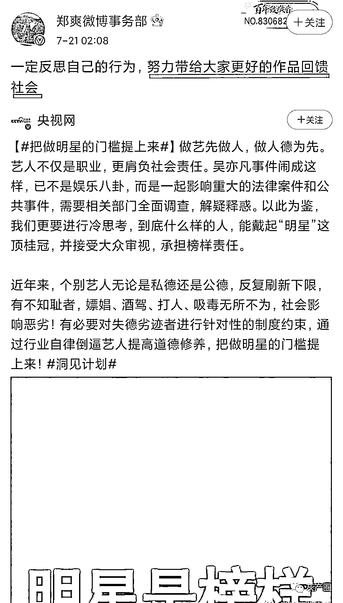
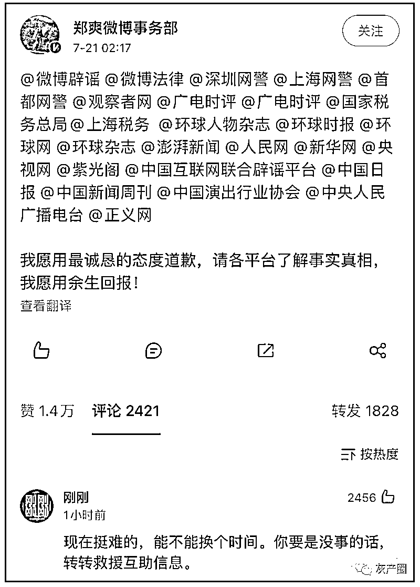
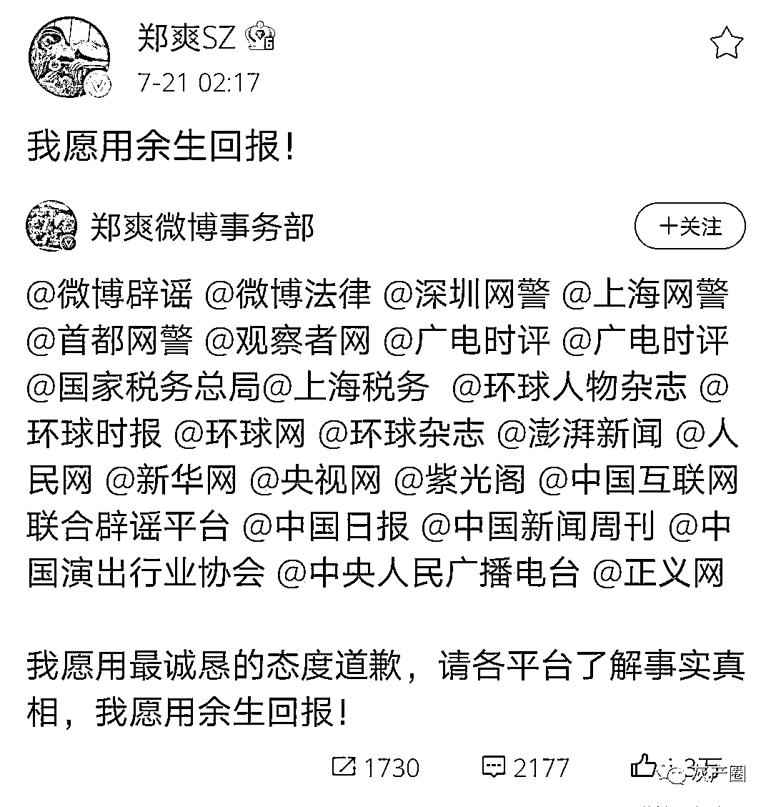
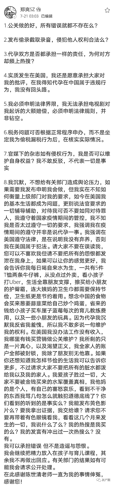
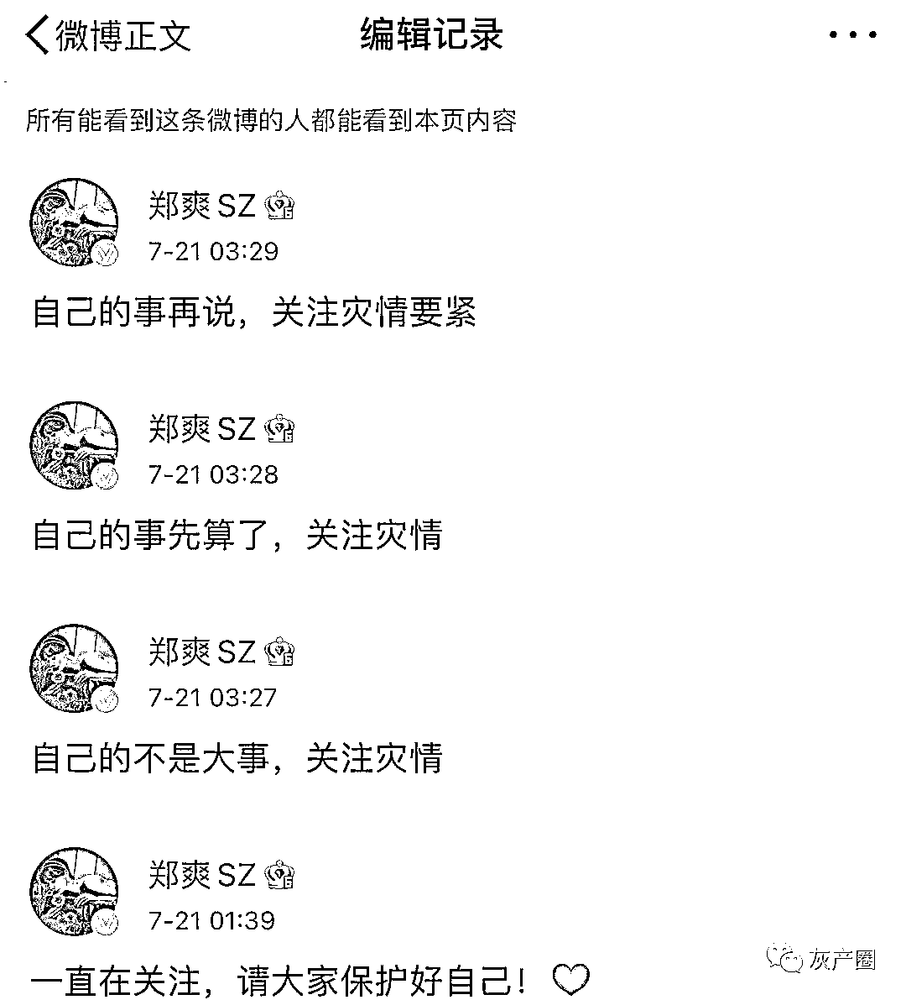
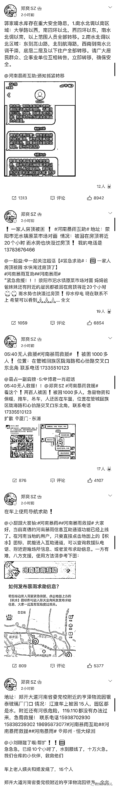
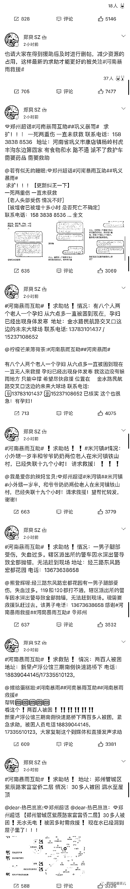
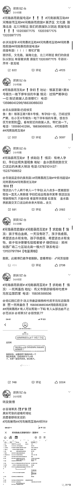

# 代孕被“封杀”的郑爽“疯狂跪求复出”，看来是真急了，大晚上给自己洗白！

> 原文：[`mp.weixin.qq.com/s?__biz=MzIyMDYwMTk0Mw==&mid=2247517737&idx=2&sn=cb7c2ab6ead69f2727430461e26ec551&chksm=97cb4d11a0bcc4070e73b611e93eae2b63f8746f7d6b5f6f798345f0091a4f57e356a63f1c52&scene=27#wechat_redirect`](http://mp.weixin.qq.com/s?__biz=MzIyMDYwMTk0Mw==&mid=2247517737&idx=2&sn=cb7c2ab6ead69f2727430461e26ec551&chksm=97cb4d11a0bcc4070e73b611e93eae2b63f8746f7d6b5f6f798345f0091a4f57e356a63f1c52&scene=27#wechat_redirect)

受代孕弃养事件风波影响，郑爽每个官媒点名批评，丢掉了很多的代言和工作。本以为她就会这么被“封杀”，但是，在这次全网声讨吴亦凡的时候，郑爽开始在微博发文道歉，寻求复出。
7 月 20 晚到 21 日凌晨，微博上全网都在关注河南暴雨的时候，郑爽开始了她的表演： 这道歉方式，给网友看呆了只能说，这种方式很“郑爽” 不禁想问：你回报什么？拙劣的演技？ 买来的热搜？ 烦人的水军？ 疯狂的粉丝？ 轻松收钱的演员生活才是你最想要的吧！ 这是郑爽对自己的解释：

向下滑动查看

这种突如其来的跪求复出方式，正赶上郑州暴雨的最关键时刻，毫无意外郑爽被骂了 在干完自己的事后，郑爽开始了她的下半场表演 别人的求救信息成了她的洗白工具，在微博疯狂刷屏 

向下滑动查看

* * *

**太棒了我逐渐理解一切:**大家理解一下，这是好久没戏演了，憋得难受

**汤圆里加 coco:**笑死了 果然娱乐圈真赚钱

**西瓜波波冰 o:**看得出来复出赚钱心切，被喷了就开始删博转发求助，正常人这么多别想通过这种洗白哈😅

**爱 Khuntoria 的魔女:**毕竟这是唯一洗白的机会，早不出晚不出来说明，一看吴亦凡事件那么多人骂他，就出来发声明了

**邸玉照 _ :**这一夜的郑爽，她精神百倍，上蹿下跳，为了复出，苦苦哀求。又是艾特官媒，又是发誓的，仿佛大病上身。写了些牛头不对马嘴的长文。经历了一个漫长的中午。她终于被骂了。赶紧转换思路。她为了复出也是辛苦。

来源：微博那些事儿

灰产圈在线客服

← 向右滑动与灰产圈互动交流 →

