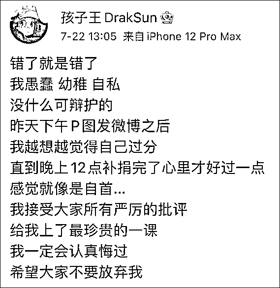

# 捐款 100 元却 P 成 18000，说唱歌手道歉！

> 原文：[`mp.weixin.qq.com/s?__biz=MzIyMDYwMTk0Mw==&mid=2247517737&idx=3&sn=81ac0a41deac849ed2aec38cf4cf653b&chksm=97cb4d11a0bcc4078b8f96ae26ce00adafe20ea35408bbd4cc9ac568df98f90cf0998335069f&scene=27#wechat_redirect`](http://mp.weixin.qq.com/s?__biz=MzIyMDYwMTk0Mw==&mid=2247517737&idx=3&sn=81ac0a41deac849ed2aec38cf4cf653b&chksm=97cb4d11a0bcc4078b8f96ae26ce00adafe20ea35408bbd4cc9ac568df98f90cf0998335069f&scene=27#wechat_redirect)

Rapper 孩子王为河南暴雨捐款 100 元，却 P 图谎称捐款 1.8 万元后引发众怒，今天，他道歉称，“错了就是错了，我一定会认真悔过，希望大家不要放弃我。”随后，其正在参加的《少年说唱企划》官宣，孩子王退出录制。

孩子王，1997 年出生，是《中国有嘻哈》说唱女歌手 Vava 的男朋友，今年，他参加了说唱节目《少年说唱企划》。

近日，河南暴雨牵动着全国民众的心，一方有难，八方支援，多家企业、个人第一时间捐款或筹措救灾物资驰援河南，不少公众人物也纷纷站出来捐款捐物。

昨天（21 日），rapper 孩子王也在微博晒了一张自己的捐款明细图，称“所有零钱都捐了，多少贡献点力量”，从图中可以看到，他向郑州红十字会捐款 18000 元。

在这张图中，有具体的交易时间、单号、商户单号，看起来十分逼真。

在网友晒出的图中，孩子王在捐款后非常开心，立刻去粉丝群说了这条消息，还“谦虚”表态，“我觉得 18000 真的很少了，别的 rapper 都几十万，我都想 P 成 18 万”，“量力而行，心意到了”。

然而，正当大家点赞时，有网友发现，**用孩子王的“捐款商户单号”查询，孩子王的真正捐款金额是 100 元，根本没有他所说的“很少的”18000，而他晒出来的图其实是 P 图。**

这种时候还诈捐作秀？如此行为让网友表示非常反感与愤怒，“捐了 100 也没人说你，还 P 图，是故意找骂？”“觉得自己很幽默吗？”

被骂后，到了晚上，他又晒出了一张自己给郑州红十字会捐款后拿到的捐款证书，其中显示，他重新捐了 18000 元。

如此做法大家并不买账，“没被发现是不是不会补捐？”

此外，还有网友指出，虽然孩子王晒出了补捐 18000 元的捐赠记录，但该记录无法查到，不过，由于本次捐款渠道很多，他是否通过其他渠道捐款也并不清楚。

今天中午，**孩子王在个人微博道歉，承认此前 18000 元是“P 图发微博”**，称“很愧疚，直到补捐后才心里好过一点”，“接受大家所有严厉的批评，给我上了最珍贵的一课，我一定会认真悔过，希望大家不要放弃我。”对于被质疑补捐也是诈捐一事，他并未做出过多说明。

随后，《少年说唱企划》官宣，孩子王退出节目录制，孩子王称，接受退赛，承担所有后果。

来源：观察者网 

灰产圈在线客服

← 向右滑动与灰产圈互动交流 →

