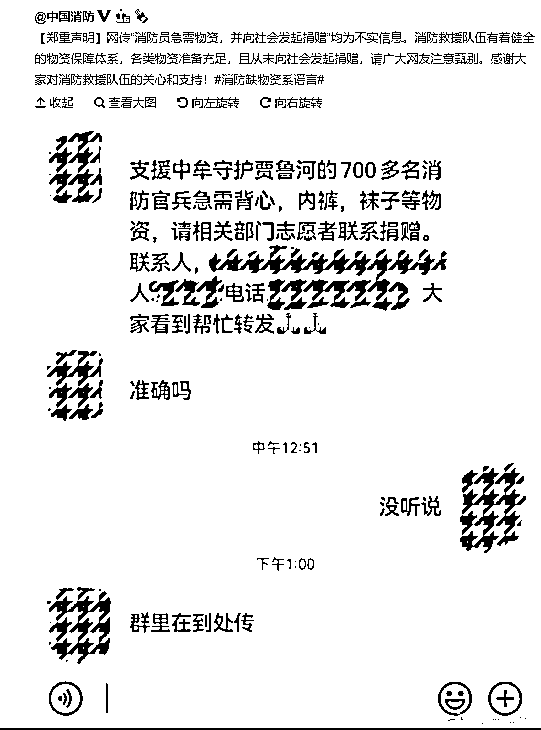

# 想利用灾情行骗？

> 原文：[`mp.weixin.qq.com/s?__biz=MzIyMDYwMTk0Mw==&mid=2247517737&idx=4&sn=513305e2fb83f153ae0d6781433ddf6f&chksm=97cb4d11a0bcc407792679cf03922b3ceaa397e9e130e49866cf43ed24af34ac4791debacb96&scene=27#wechat_redirect`](http://mp.weixin.qq.com/s?__biz=MzIyMDYwMTk0Mw==&mid=2247517737&idx=4&sn=513305e2fb83f153ae0d6781433ddf6f&chksm=97cb4d11a0bcc407792679cf03922b3ceaa397e9e130e49866cf43ed24af34ac4791debacb96&scene=27#wechat_redirect)

河南近日遭遇特大暴雨

汛情牵动着所有人的心

大家肯定都想为灾区同胞尽一份力

但同时，我们也不得不提防那些浑水摸鱼的骗子

我们整理了几类可能利用灾情行骗的骗局类型

希望大家在献爱心的同时能避免上当

**一、捐款诈骗类**

骗子**仿冒慈善机构、受害灾民**等，在网上发布捐款需求，以此诈骗群众的爱心捐款；或**仿冒学校老师、公司领导，**混入家长群和工作群，以捐款的名义诈骗群成员的钱财。

如中国消防今天就发布了声明，网传需要捐赠的信息不实，**所以大家捐款的时候务必擦亮眼睛，认准官方机构。**

**二、灾情补贴类**

骗子冒充官方机构，以电话、短信的形式告知可以**领取灾情补贴**，引导受害人点击**钓鱼网站**；或告知针对受灾群众可以进行低息、无息贷款，但要先交付**保证金和手续费**，而交钱后则会被拉黑。

**三、快递诈骗类**

因遭遇灾情，不少快递公司会调整派送范围。骗子会趁机**伪装成快递员或公司客服**，谎称快递遭遇灾情被毁，现在可以申请理赔，实际引导你到金融 App 进行**贷款**，或引导点击**钓鱼链接**，套取**银行卡账号和密码**。

**四、机票/车票改签类**

不法分子通过发送短信或者拨打电话,称“航班/列车因灾情被取消，办理**退改签可获赔偿**”，诱导受害人登陆短信中的**钓鱼网址**或**通过语音提示进行操作**，进一步套取受害人的**银行卡号、密码、手机验证码**等，将余额转走。

我们也再次提醒大家

**捐款认准官方通道，警惕各类灾情诈骗**

让你的爱心能及时、有效地帮到需要的同胞

如果在微信里发现有此类诈骗现象

可以到微信客户端、小程序投诉举报

天灾无情人有情

一起为河南加油

来源：微信 110

灰产圈在线客服

← 向右滑动与灰产圈互动交流 →

