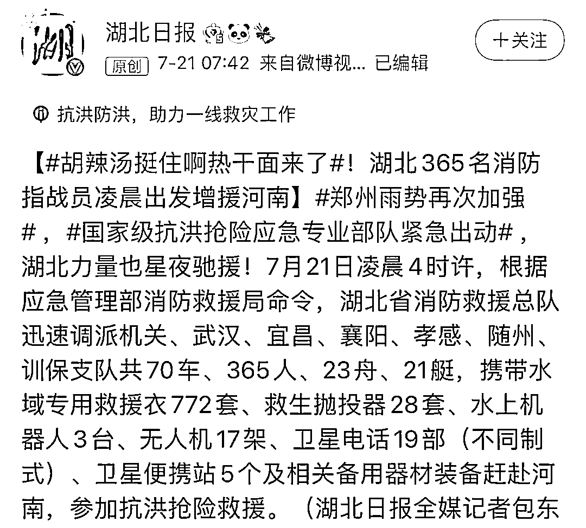
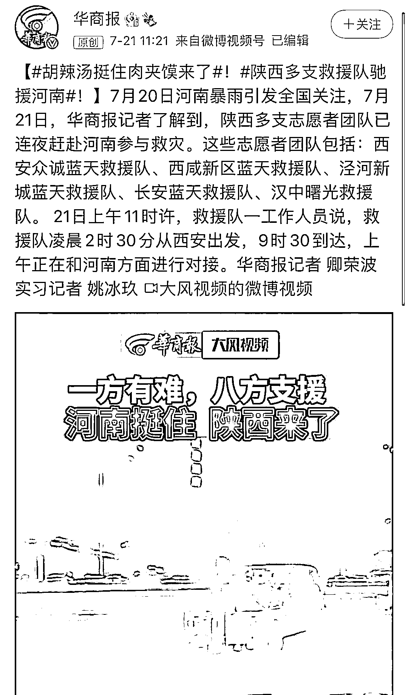
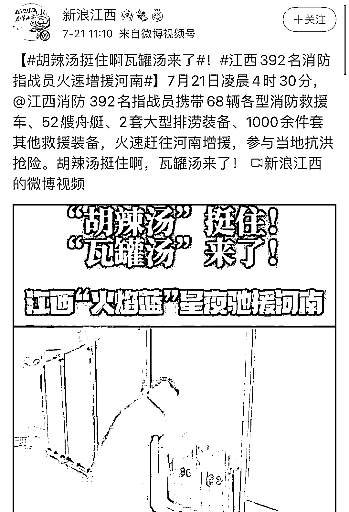
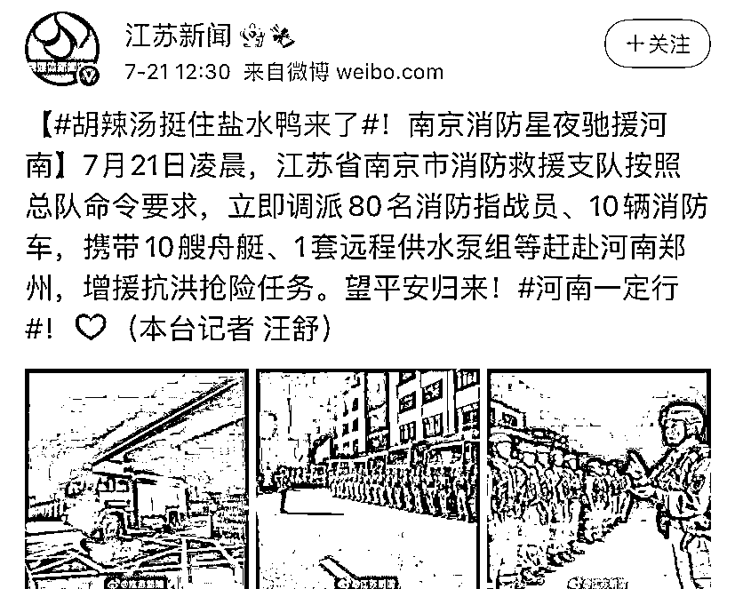
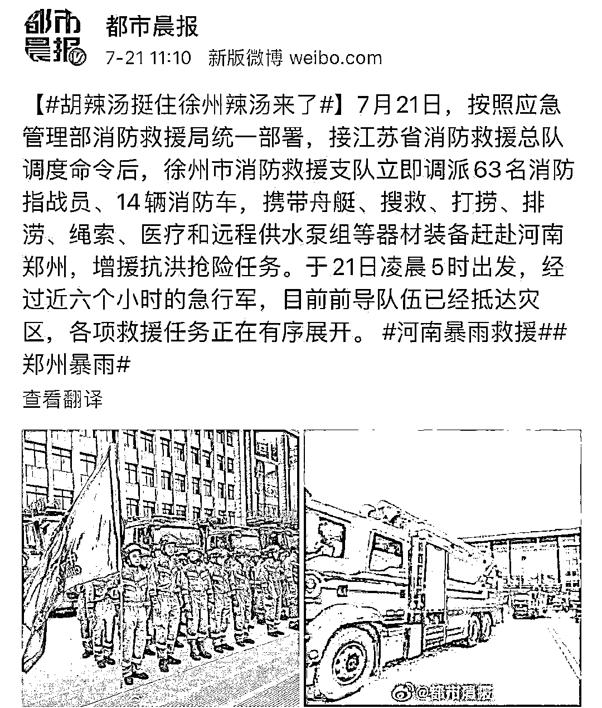
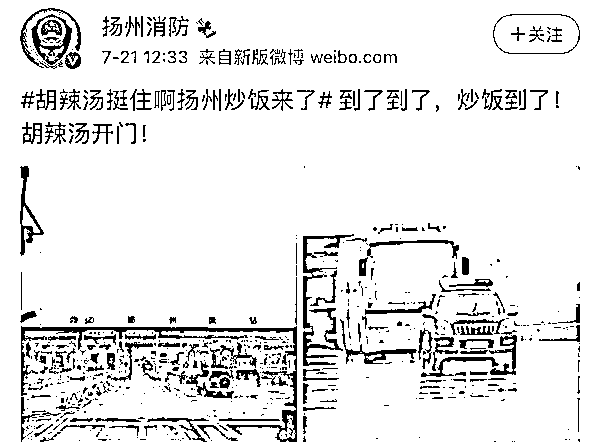
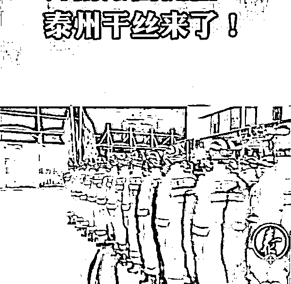
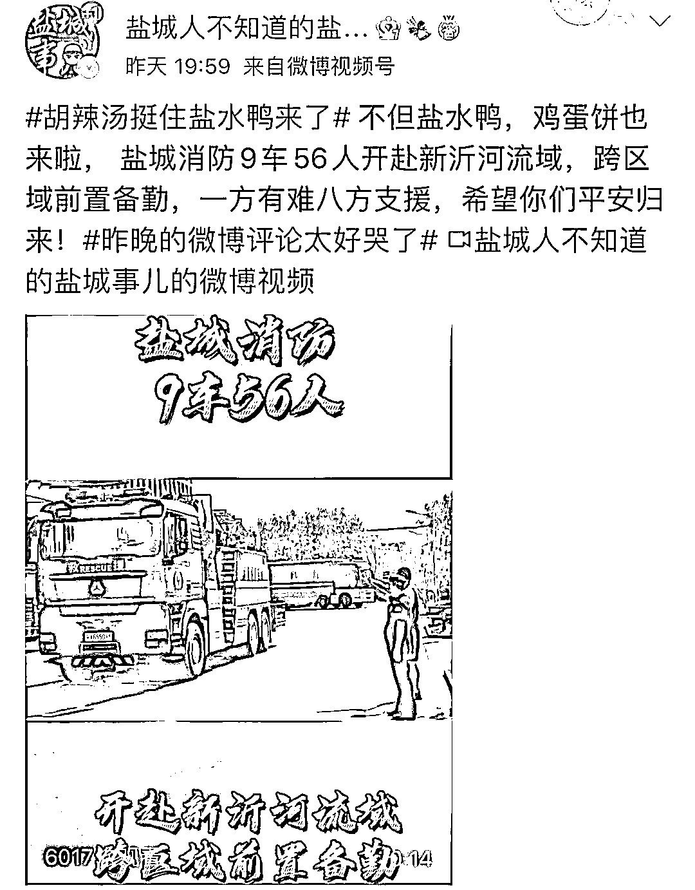

# 驰援河南！江苏来了！

> 原文：[`mp.weixin.qq.com/s?__biz=MzIyMDYwMTk0Mw==&mid=2247517737&idx=5&sn=08d77647a54d2bf77bf4becbe50f40f6&chksm=97cb4d11a0bcc407860e3c48a7c07c81c2c3d555a7da0200e48e68a9e660d44be03a4127c80c&scene=27#wechat_redirect`](http://mp.weixin.qq.com/s?__biz=MzIyMDYwMTk0Mw==&mid=2247517737&idx=5&sn=08d77647a54d2bf77bf4becbe50f40f6&chksm=97cb4d11a0bcc407860e3c48a7c07c81c2c3d555a7da0200e48e68a9e660d44be03a4127c80c&scene=27#wechat_redirect)

河南暴雨引发洪涝等灾害，全国各省迅速调派人手、装备驰援，散装依旧的“苏大强”又成了一道靓丽风景线。 

是的，和去年新冠疫情时一样，江苏省的驰援队伍这回又是各管各奔赴河南，“散装”人设屹立不倒。

去年湖北武汉爆发新冠疫情，全国各省医疗队、志愿者驰援。当时为了凸显地域特色并且缓解公众对于疫情的紧张情绪，时兴用本土特色美食作为各地驰援代表队的代号。

这个操作也沿用到了此次抗击洪灾中，20 日晚紧急集结后，各地救援代表队在前往河南受灾地区时，几乎都会用上一句“胡辣汤挺住 XXX 来啦”的句式。

图自@陈小桃 momo

湖北省的代表是热干面；

安徽省是板面；

陕西省是肉夹馍；

江西省是瓦罐汤；

徜徉在这个话题里的网友感动地留下了哈喇子……

而镜头一转到江苏省，画风突变。其他省份都是一道菜，江苏直接整出一桌子“满汉全席”——

南京“盐水鸭”、徐州“辣汤”、扬州“炒饭”、泰州“干丝”、盐城“鸡蛋饼”……

网友：好家伙还整得荤素搭配，你们是去给河南“上菜”了吗？

唯一的异类，南通，想来想去好像只有试卷……

而随着救援工作的不断深入开展，这回江苏驰援甚至已经精细到 XX 县 XX 区的救援队了，狠起来是连地级市都开始忽略的程度。

县不服市，市不服省，不愧是你，散装江苏。

@江苏新闻 昨天发布南京消防星夜驰援河南的新闻下，位居第一、点赞量高达 4.1 万的热评就是：他来了他来了，“散装江苏”他来了。

“江苏十三太保”邪魅一笑：没错，惊喜吧，这回我们又是各干各的。

而作为全国知名的“内斗”大省，在驰援这件事上江苏网友也是少不了“内讧”“揶揄”。

别人家的省会是“团宠”，而南京向来被调侃是“团欺”的存在，连比其他城市的队伍晚到一点都要被“嘲讽”：才这么一会儿没见你怎么这么拉了，我地锅鸡、蛋炒饭、辣汤早到了，快点吧你！

就连上热搜这事都恨不得掐一架，“凭什么南京驰援上全国热搜，我扬州、徐州不配吗！”

不过玩笑归玩笑，这一回南京驰援非常受关注的原因，不仅仅因为它是江苏省会，还因为当前南京的新冠疫情也出现了反弹。

按网友的话来说，南京“盐水鸭”这回千里迢迢赶去帮河南“胡辣汤”，是“挂着吊瓶”去的，一番话说得让人“又好笑又心疼又感动”。

还有网友 P 了张图，画上是只盖着检疫合格章的盐水鸭。南京网友：大家莫担心，我们派去河南救人的都是健康的鸭鸭！

当然，说江苏“散装”主要还是在调侃，更多的其实也是在夸赞江苏下属的各个城市乃至区县都实力强劲，每个拉出来单打独斗也不在话下，那就更不用说团结起来的力量了。

去年新冠疫情爆发时，正是因为江苏本土病例少且自身实力强，所以在湖北对口支援关系中被安排了驰援除武汉市以外确诊人数最多的孝感市。

当时江苏也派出了无数只队伍，大到市级，小到村级，连@江宁婆婆 都曾发帖感慨，直到疫情结束湖北人民可能都不知道江苏到底派出了多少医疗队，而江苏人也不知道。

这回河南遭遇极端强降雨，在多地造成洪涝灾害。国家应急管理部共调 7 省消防和水上救援队伍，指战员累计 1800 人左右。

其中，@江苏消防 紧急调集的指战员就有近 500 人，还随队配置 96 辆救援车、70 艘舟艇、12 台远程供水泵组、5 台龙吸水等赶赴河南郑州，增援抗洪抢险任务。

再说这回南京疫情反弹，江苏各市虽然平时“打得凶”，但关键时刻还是团结一心，多地迅速派出了医疗队和志愿者赶往南京，协助核酸普测工作。

有网友说，“散装”的江苏是形散神不散，其实内心还是“集装”的，关键时刻不掉链子。

来源：观察者网

灰产圈在线客服

← 向右滑动与灰产圈互动交流 →

