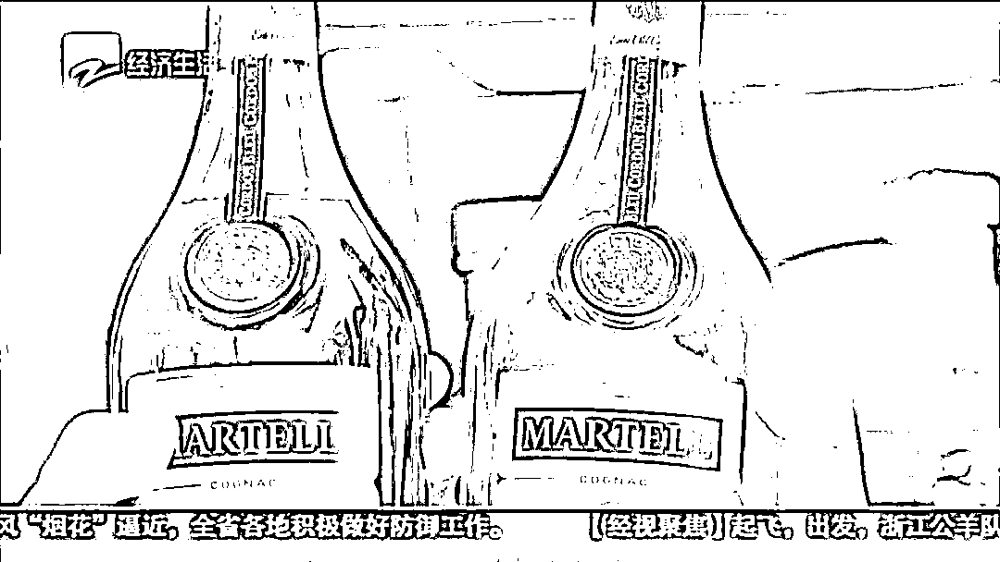
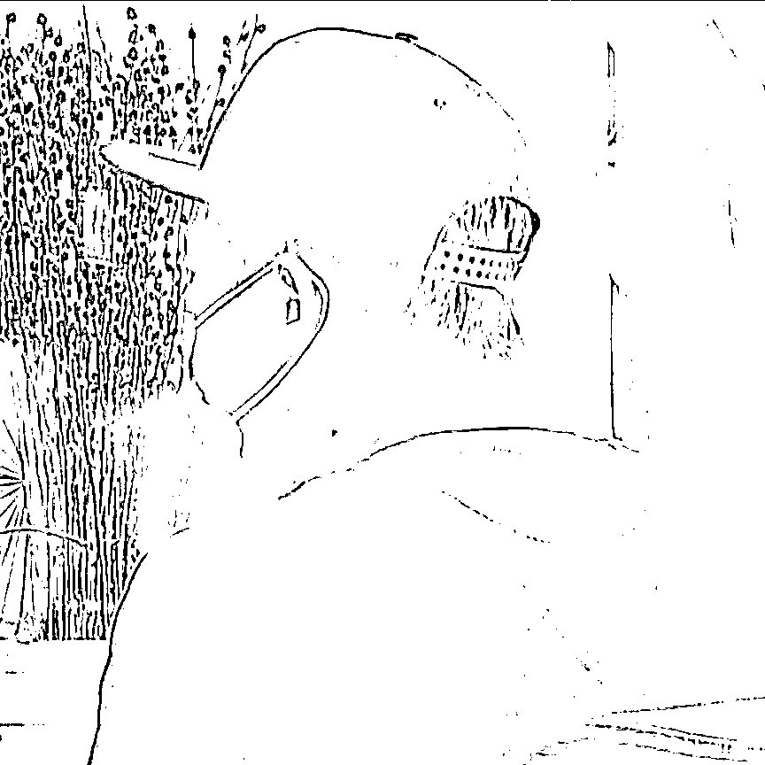
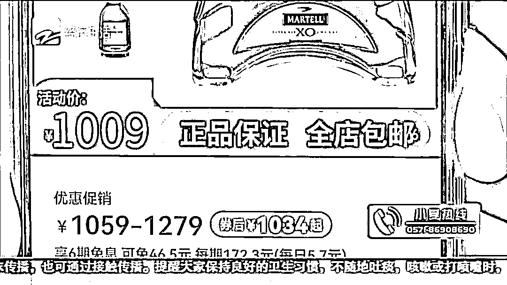
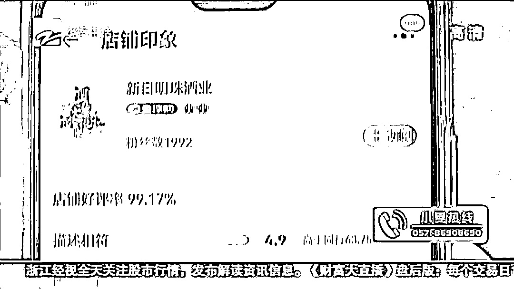
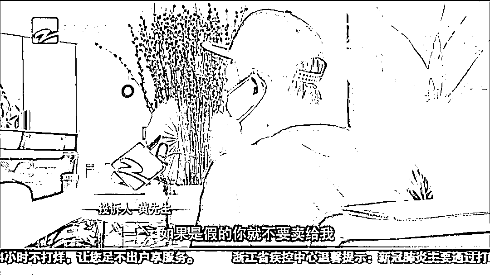
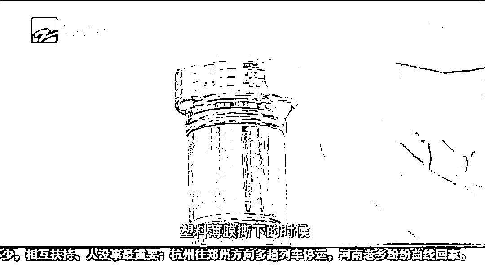
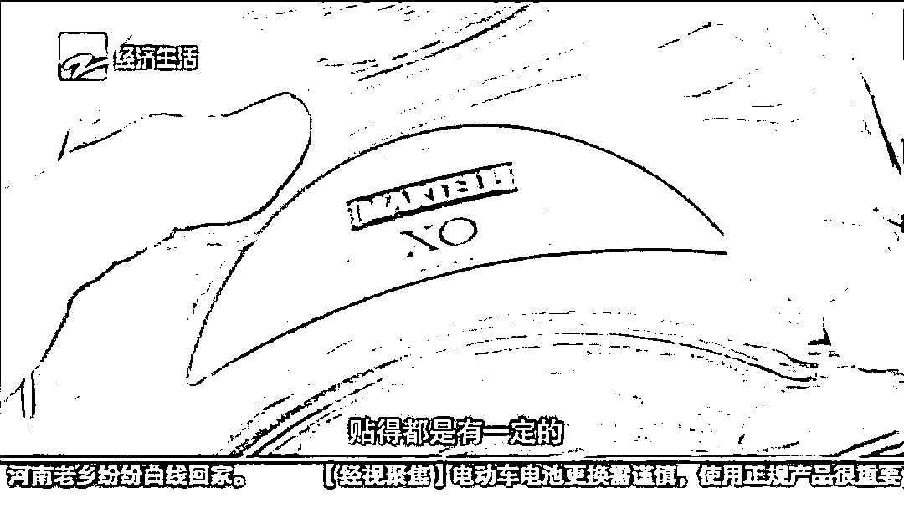
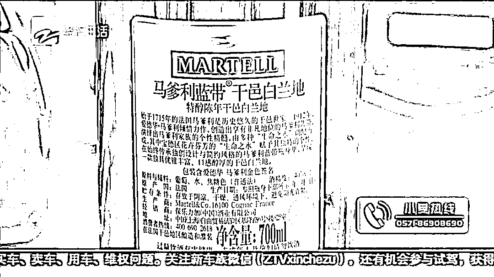
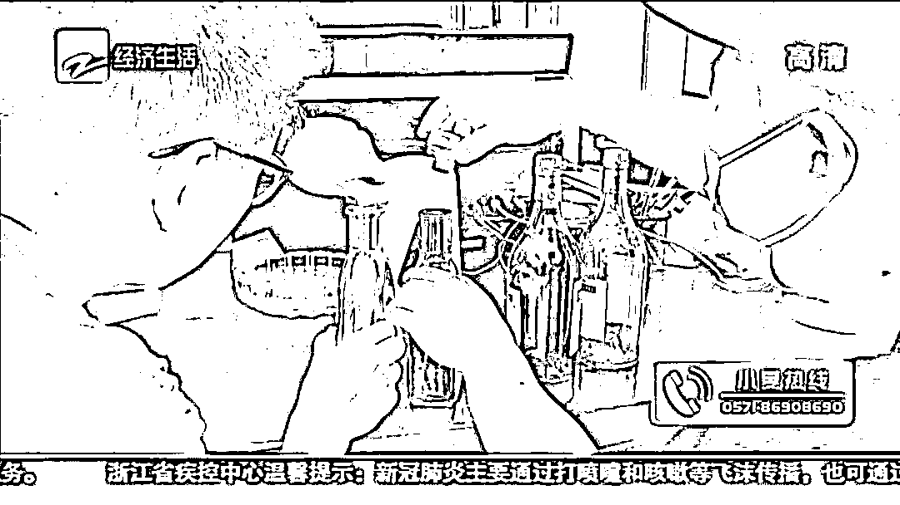

# 某宝又又又出事了，全球购买到假酒！

> 原文：[`mp.weixin.qq.com/s?__biz=MzIyMDYwMTk0Mw==&mid=2247517737&idx=6&sn=4d7379cacd7bc8c87f08abfeb5e0d83d&chksm=97cb4d11a0bcc4079e8736edc679a5cab4a887401edca8690b658a8c9c578a19c8609e6cb06d&scene=27#wechat_redirect`](http://mp.weixin.qq.com/s?__biz=MzIyMDYwMTk0Mw==&mid=2247517737&idx=6&sn=4d7379cacd7bc8c87f08abfeb5e0d83d&chksm=97cb4d11a0bcc4079e8736edc679a5cab4a887401edca8690b658a8c9c578a19c8609e6cb06d&scene=27#wechat_redirect)

精彩视频：

[`mp.weixin.qq.com/mp/readtemplate?t=pages/video_player_tmpl&action=mpvideo&auto=0&vid=wxv_1968476326252593165`](https://mp.weixin.qq.com/mp/readtemplate?t=pages/video_player_tmpl&action=mpvideo&auto=0&vid=wxv_1968476326252593165)

黄先生是一名品酒爱好者，对于分辨真假酒也算是行家了，可他万万没想到，他这些“资深”的经验，却在一家淘宝店铺买酒的时候"翻车了"...

01**资深酒客网购“马爹利”翻车？**

黄先生表示，品鉴美酒是他的一大爱好，平常也会通过各种渠道购买世界各地的美酒，算是一名资深的酒客。7 月 6 日，他在一家名为“新日明珠”的淘宝店铺里分别花费了 1009 元和 816 元，购买了“马爹利 XO”和“马爹利蓝带 XO”两瓶法国白兰地。

投诉人 黄先生

我当时跟淘宝店主说，你这个酒会不会有问题，他说一定是真的。我也反复跟他强调，我是长期购买和使用的，如果是假的就不要卖给我。

有了淘宝店主的承诺，加上店铺的双蓝冠等级、淘宝全球购的标签以及“正品保证”的字样，黄先生卸下了防备。

投诉人 黄先生

因为我看到这个店铺首先是有全球购，所以我相信它肯定是进口的，一般不会假。

02**洋酒一开，疑点频出？**

几天之后，黄先生顺利地收到了网购的两瓶洋酒。但在和朋友准备小酌几杯的时候，一打开洋酒的外包装，黄先生发现了问题。

投诉人 黄先生

开酒的时候有一层塑料薄膜，我们当时就感觉很奇怪。发现撕下塑料薄膜的时候连盖子的金属都褪色了。另外就是商标，贴的角度都不太对。

黄先生表示，这次网购的洋酒酒瓶和自己之前买的有很大的差别，尤其是瓶塞，与真酒瓶塞相比显得更加粗糙，材质也有很大不同。在拧开两瓶酒的瓶盖并仔细闻了酒的气味之后，黄先生更是发现了问题。

投诉人 黄先生

打开正常的酒瓶子，它是非常甘甜的味道。再打开这个酒瓶，就是纯粹的工业酒精的味道，完全不一样。

03**网购高价酒水需警惕！**

据黄先生介绍，正品的马爹利白兰地，闻起来的味道是酒香夹杂着回甘，但是他网购的这两瓶酒，一打开只能闻到刺鼻的酒精味。那么，这两瓶网购的洋酒究竟是不是假酒呢？在黄先生和这家淘宝店铺取得联系之后，店主当即表示，黄先生可以退货。

投诉人 黄先生

假如退货，我是可以把钱拿回来，但如果有消费者不是很清楚这个酒的话，他就可能会上当受骗。

黄先生希望自己的这段经历能够给广大的消费者提个醒，以后在通过线上平台购买高价酒水时，一定要多留个心眼。对此事件，记者拨打了淘宝的客服热线，得到了回应。

淘宝客服

对于会员的两个诉求：假一赔十和处罚商家。我们这边 24 小时内会有一个高级专员告知您处理结果，您需要耐心等待一下。

根据《食品安全法》第 148 条规定，生产不符合食品安全标准的食品或者经营明知是不符合食品安全标准的食品，消费者除要求赔偿损失外，还可以向生产者或者经营者要求支付价款十倍或者损失三倍的赔偿金。而截止报道发出之前，淘宝方面还并未给出官方回应。

对于黄先生而言，索要赔偿并不是他维权的根本目的。他的主要目的是希望此次事件给广大顾客提个醒，并给这个商家该有的惩罚。如何惩戒售卖假货的商家，避免更多的消费者重蹈覆辙，应成为赔付之外更加值得关注的问题。对此，我们还会持续进行关注！

文章来源：经视新闻

灰产圈在线客服

← 向右滑动与灰产圈互动交流 →

