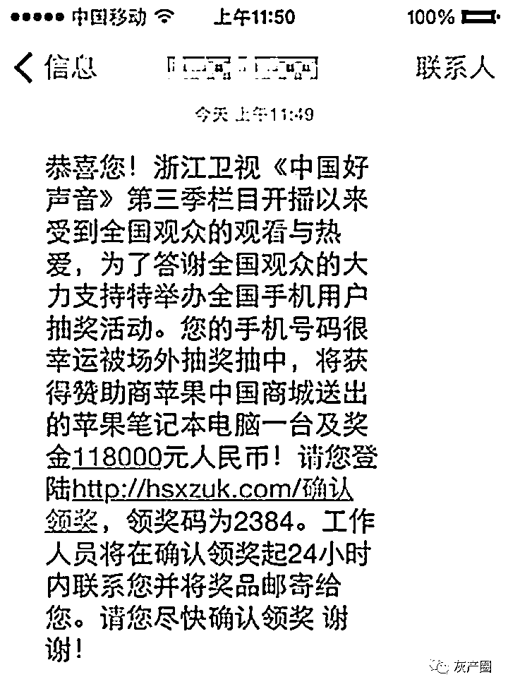
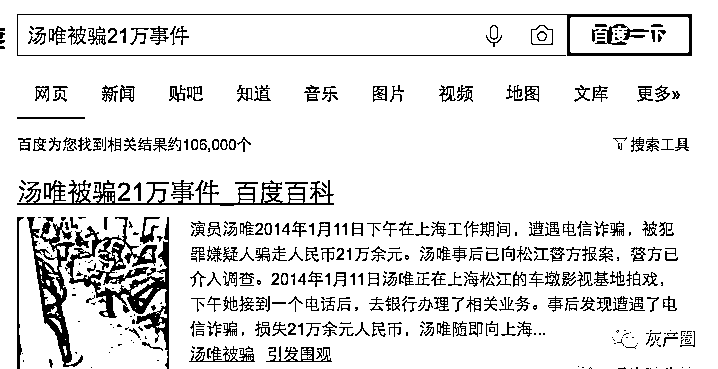
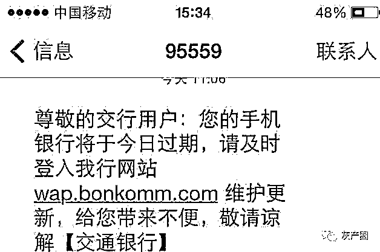
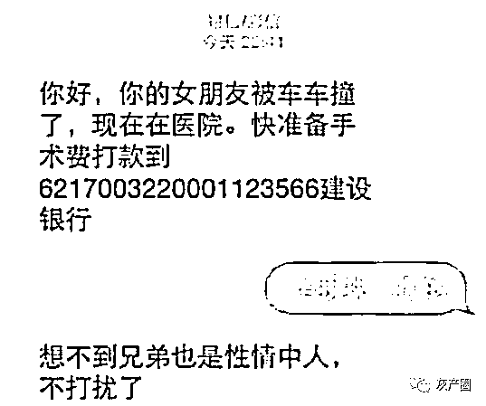
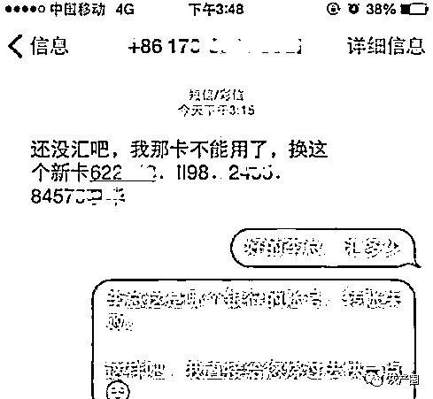

# 为什么诈骗短信看上去都很假，还有那么多人被骗？

> 原文：[`mp.weixin.qq.com/s?__biz=MzIyMDYwMTk0Mw==&mid=2247517737&idx=7&sn=0b635550b4de441a3357f959420994c6&chksm=97cb4d11a0bcc407d49451e8e5fe32b610bca1786fe1ed618d5a026133df9116ef1cab1c7246&scene=27#wechat_redirect`](http://mp.weixin.qq.com/s?__biz=MzIyMDYwMTk0Mw==&mid=2247517737&idx=7&sn=0b635550b4de441a3357f959420994c6&chksm=97cb4d11a0bcc407d49451e8e5fe32b610bca1786fe1ed618d5a026133df9116ef1cab1c7246&scene=27#wechat_redirect)

你是不是也曾经怀疑过，为什么那些看上去无比拙劣的诈骗短信，还能骗到钱？在采访过一位因电信诈骗入狱的朋友后，我才明白这都是故意为之，也恰恰是骗子取得成功的关键所在。这位因电信诈骗入狱的朋友，暂且叫他 K 君吧。他当时从 PHP 培训机构出来找工作，找我做面试咨询：lucky 酱你好，我正在求职中。之前坐过牢，在面试的时候要不要实话实说？隐瞒的话会被调查出来吗？我当即吓了一跳，问：你咋进去（监狱）了？他回，电信诈骗。怀着好奇的心态，我和他约在人民广场吃了一顿饭，问了很多问题，其中也包括题主疑惑的这个。聊完豁然开朗，果然一行有一行的学问。「城市套路深，我要回农村」，我打趣道。

01

短信诈骗这事，就和屌丝约炮一样——「广撒网」是第一要义。

大多数女性面对交友 App 里群发的约炮私信肯定是置之不理，但屌丝只要网撒得够广，总能网到一两个愿意上钩的。

诈骗短信也是一样。而且这一行还有成熟的产业链和细致的内部分工—— 有策划实施诈骗业务的骗子，有专打诈骗电话的基层员工，也有专门承接群发诈骗短信业务的「技术兵」。他们通过聊天软件联系业务，只需要三五百元钱，就能群发一万条诈骗短信。而拙劣的诈骗短信，利用可被发现的漏洞，过滤掉受教育程度高、对诈骗警惕性高的人，梳理出那些不具备辨别能力、容易上当的人群，使得后续的诈骗成功率提升。在广撒网的前提下，总有一些辨别能力低的人会上当，在骗子的一步步引诱中中了圈套。况且即使是受过高等教育的人，也不是一定不会被骗，女神汤唯在央戏念过书，肯定是高知女性吧？还是被电信诈骗过 21 万。当时汤唯被骗 21 万的细节：全剧组均收到诈骗短信，只有她上当。

02

**诈骗短信的两大「杀器」**

也有很多骗子走的是这个路线，提高诈骗短信的可信度，甚至能吊到警惕性较高的人上钩（比如差点中招的我）。相比上一种容易被识破的诈骗短信，这种才是我们更需要去了解、去警惕的。骗子是怎么提高诈骗短信可信度的呢？最主要有两大杀器：**一是配合被泄露的个人信息，骗子发送「精准定向」的诈骗短信。**比如你是某网游的玩家，在个人信息被打包泄露后，骗子给玩家们发送相关的诈骗短信—— XX 游戏的幸运玩家 YY，恭喜你中奖了，得到了某某装备 balabalance…是不是会有不少人上当？再比如网购后，被泄露了个人信息，然后骗子在掌握网购订单的详细信息后发来诈骗短信，也是有很多人中招的。**第二个诈骗分子的杀器，我也遇到过，而且差点中招了，那就是「伪基站」发送的诈骗短信。**伪基站一般由主机和笔记本电脑组成，可以通过瞬时的大功率发射，挤掉正常基站，直接冒充银行客服、运营商的号码发送诈骗短信，遇上这种，一般人是防不胜防的。被收缴的伪基站▼诈骗产业链里，有专门承接用伪基站群发短信这种业务的人，只要提出要求，他们可以冒充银行客服、运营商、航空公司等机构群发诈骗短信：比如咱们收到这条短信，一看是由 95559 发送来的，肯定以为是由交通银行客服发过来的▼伪基站在作案的时候一般是在车里，开到人群密集的地方作业▼

03

最后再多写一点，怎么防止受骗。

首先是个人提高警惕，那种非常拙劣的诈骗短信很好识别，稍微有点防骗意识的人都很少会中招。诈骗手段日新月异，所以学习防骗知识很重要，关注**“灰产圈”**，掌握骗子最新的诈骗手段。 伪基站和个人信息泄露这两大杀器，还是很难防范，所以一味地让个人提高警惕是没啥用的，更重要的是国家相关部门和各地公关对犯罪分子的打击和治理。这就好比治理空气污染，提高个人警惕相当于在家开空气净化器，相关部门和公安打击犯罪相当于关停违规排放废气的工厂，后者才是治标又治本的根源性解决方法。最后分享一个我的个人秘诀，就是怎么调戏骗子。据 K 君说，专职打诈骗电话的骗子，其实是希望警惕性高的客户立即挂断电话的，这样节省他们的工作时间。从那以后，我接到诈骗电话会先假装上当受骗，等到调戏够了才揭穿。附两个我特别喜欢的调戏案例：来源：反诈骗先锋，知乎

灰产圈在线客服

← 向右滑动与灰产圈互动交流 →

