# “趁水打劫”！看看都有哪些企业借机发国难财

> 原文：[`mp.weixin.qq.com/s?__biz=MzIyMDYwMTk0Mw==&mid=2247517786&idx=2&sn=baaeecfcaa88239a99fa848a6bdfd187&chksm=97cb4d62a0bcc474134425880436b1a153c89057afa47a4ae811b97d56ea2692a89097053651&scene=27#wechat_redirect`](http://mp.weixin.qq.com/s?__biz=MzIyMDYwMTk0Mw==&mid=2247517786&idx=2&sn=baaeecfcaa88239a99fa848a6bdfd187&chksm=97cb4d62a0bcc474134425880436b1a153c89057afa47a4ae811b97d56ea2692a89097053651&scene=27#wechat_redirect)

[`mp.weixin.qq.com/mp/readtemplate?t=pages/video_player_tmpl&action=mpvideo&auto=0&vid=wxv_1968815599963176965`](https://mp.weixin.qq.com/mp/readtemplate?t=pages/video_player_tmpl&action=mpvideo&auto=0&vid=wxv_1968815599963176965)

视频来源：新华社

河南遭受强降雨，河南人民的遭遇让每一个热爱祖国的华夏儿女揪心不已，然而总有这么一些“趁水打劫”，发“国难财”的人！

博蓝共享、社群共创“趁水打劫”

这个平台已经被多地警方与市场监管局预警，涉嫌非法集资，然而这一次还“趁水打劫”。

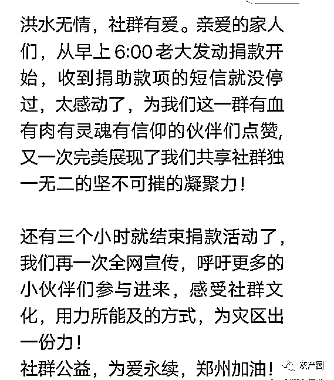

千万别认为有爱心歌曲配音就不是搞违法犯罪的事情！

[`mp.weixin.qq.com/mp/readtemplate?t=pages/video_player_tmpl&action=mpvideo&auto=0&vid=wxv_1969203402760912898`](https://mp.weixin.qq.com/mp/readtemplate?t=pages/video_player_tmpl&action=mpvideo&auto=0&vid=wxv_1969203402760912898)

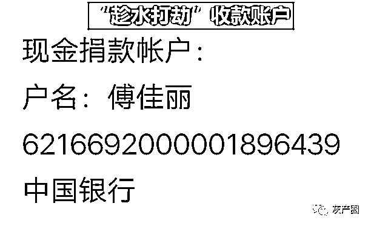

这个“傅佳丽”是什么人？看下面截图就明白了。

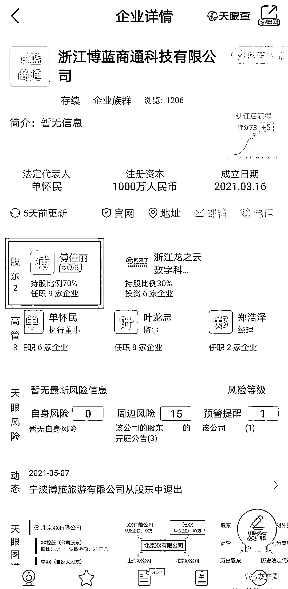

为什么说是“趁水打劫”？本来这个平台就是干着涉嫌传销的勾当，骗大家钱财，在曾经的许多互联网项目里面，都出现过捐款捐物。目的是为了做秀，哄骗参与的会员，“你看我这个平台好有爱心，能骗人么？”，如:善心汇，几乎每天都有给困难人员捐款捐物，结果呢？？？

为什么说是“趁水打劫”？这平台真正要捐款，不应该是个人账户收款，而且还是收会员的款！应该让大家直接转款到红十字会账户或者慈善公益组织的对公账户，既然能转到你博蓝平台的个人账户上，为什么参与者就不能直接转账到红十字会账户或者慈善公益组织的对公账户？

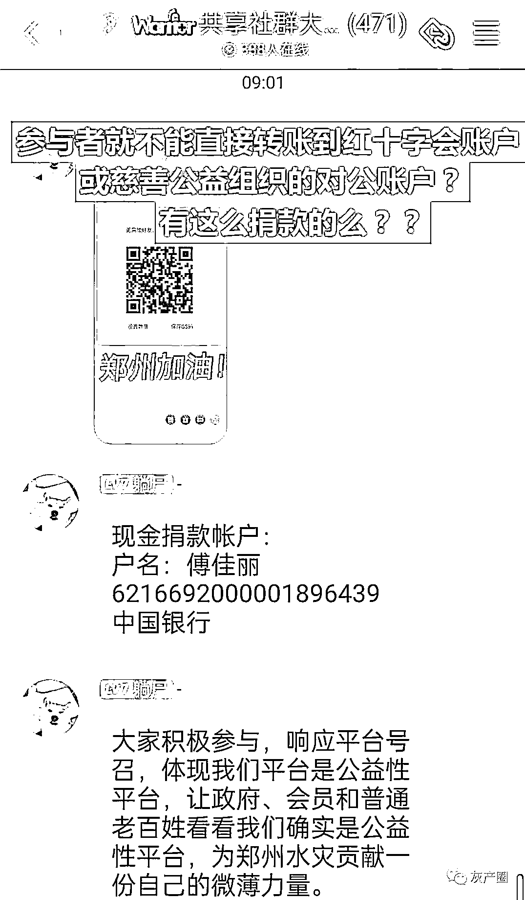

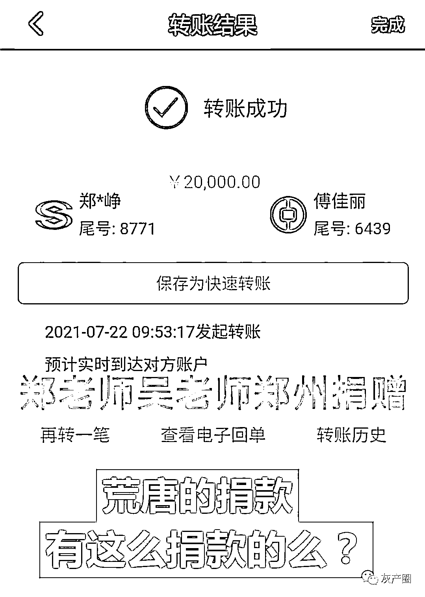

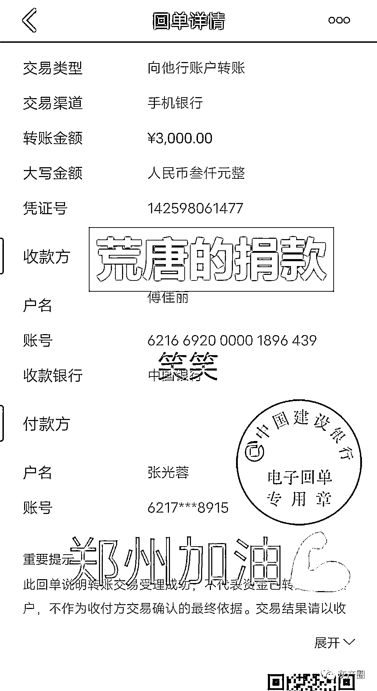

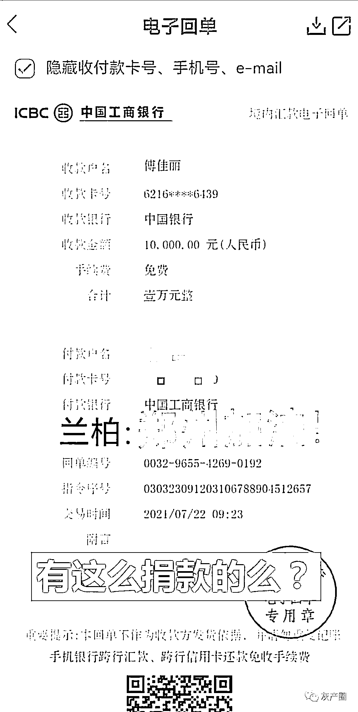

即使这个个人账户的捐款到了河南的红十字会账户或者慈善公益账户上，只是“傅佳丽”一个人获得了荣誉，而交钱的许许多多人就只能当无名英雄了......利箭在行动不能否认一些人是真的捐款，但是捐款要打到合法的慈善公益组织账户上呀！

因此“博蓝共享”无论是真捐款还是假捐款，这个个人账户收款是违法的，法律是不允许个人账户以“慈善公益”名义收款的！哪怕是公益组织的法定代表人的账户都不行！何况还是涉嫌传销的组织。

**正确的捐款方式：**

到河南慈善网中直接捐款，网址：http://www.henancishan.org/

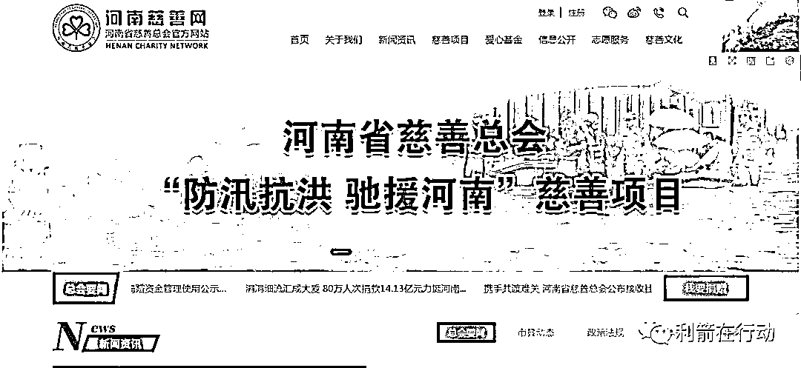

郑州希岸酒店坐地起价“趁水打劫”

7 月 21 日，因暴雨滞留在河南郑州的旅客@艺梵梵梵 称，20 日晚高铁站希岸酒店涨价到近 3000 元一晚。对此，希岸酒店发布致歉声明，称该加盟店违规操作，将积极配合相关部门监督检查，向该客人表示歉意，并承诺郑州所有门店将免费提供救援人员的住房。

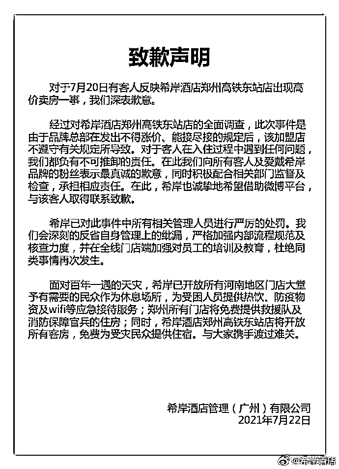

200 元—300 元一晚的酒店房间，坐地起价到 2888 元一晚，这与“抢劫”有什么区别？？这是不是“趁水打劫”？

郑州几个房地产公司“趁水打劫”

自 7 月 16 日以来，一场罕见的大雨席卷中原大地。身为河南省会的郑州，更是首当其冲。暴雨无情，人间有爱，一方有难，八方支援。全国各地的支援，也在第一时间到位。面对这场暴雨而酿成的灾难，全国的关注都聚集在了郑州身上。为郑州加油！为河南祈福！希望这场灾难，能够尽快度过！ 

在如此多的善举之下，在这样的灾难面前，依旧有一部分企业，有些不识时务。在 7 月 20 日，河南郑州的几个房地产公司，打了一波广告。而这几家公司的广告一经宣传，很快就在网上引起了热议。

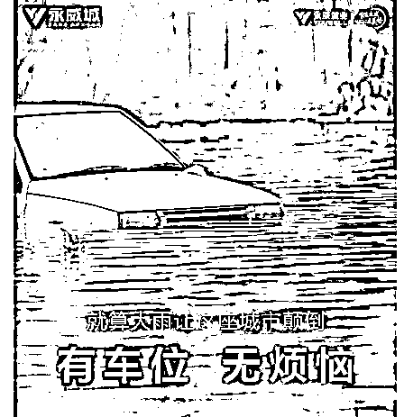

本来，这几家房产公司的宣传广告，如果放在平时，反而能够吸引一下购房者的注意。但是不知他们公司作何想法，却在这个大是大非之际做出了如此不明智的做法，实在让人感到惊讶。 

在网上，很多网友痛斥这几家公司的恶劣行为。不过反向看，这几家公司这波反向营销，给他们的企业“打出了”名气，不是吗？从危机公关角度来说，这几家公司无疑是在给自己制造危机。

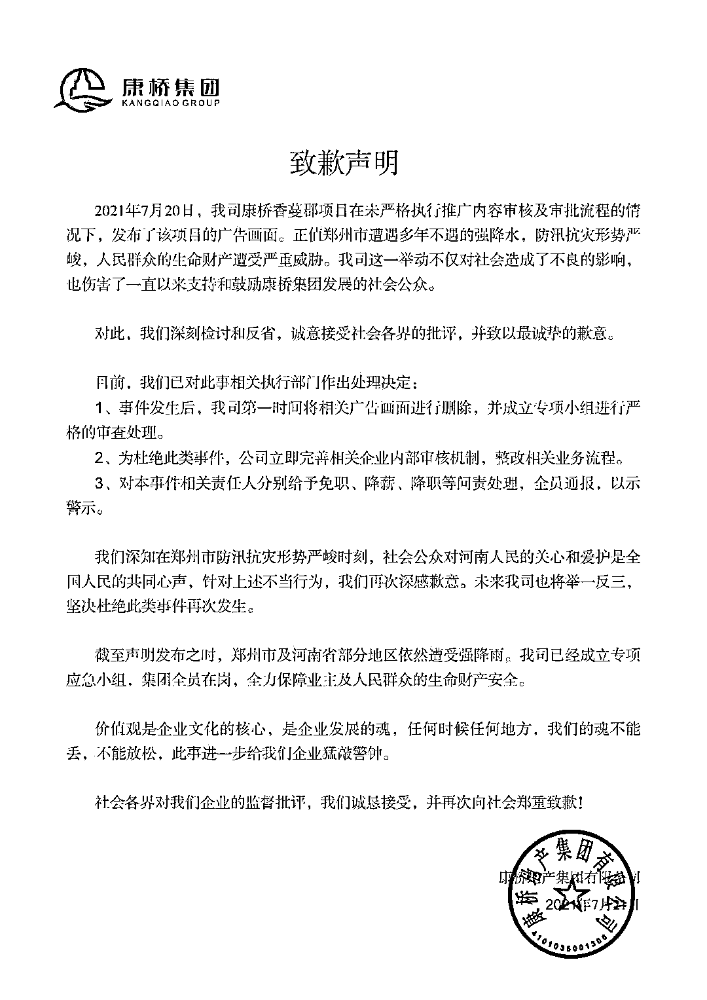

似乎是意识到了自己这波广告宣传，有可能导致企业形象受损，也会给自己企业带来危机。康桥地产（下称康桥）很快就将相关的宣传广告删除，并立刻发表致歉声明。

从危机公关五原则角度来分析这则声明，康桥这则声明符合五原则之中的真诚沟通原则、承担原则、系统运行原则。可以说，这封致歉声明，已经合格了。尽管没有权威证实，但是康桥让社会各界监督，也算是变相的让权威监督了。至于速度第一原则，则完全没有体现出来。

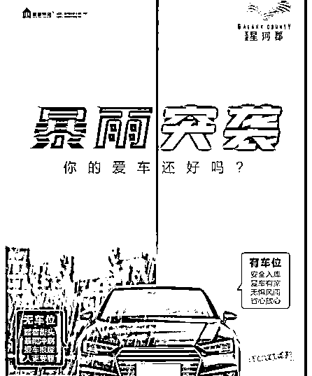

而对于其他两家地产公司，相关的声明解释，笔者并没有查到。不过从永威置业（下称永威）的公众号上，发现了一条在 7 月 21 日的捐款助力防汛救灾的公众号文章。利用捐款，来弥补自己的过错。从危机公关角度来说，这确实是一个办法。但是，连相应的致歉声明都没有，企图以此蒙混过关，永威当受批评。

至于另一家亚星集团（下称亚星），不管微博公众号，并没有做出解释。也不知晓是不是在其他地方发表了声明。亦或者用其他方式，来为自己这次犯下的错误买单了。

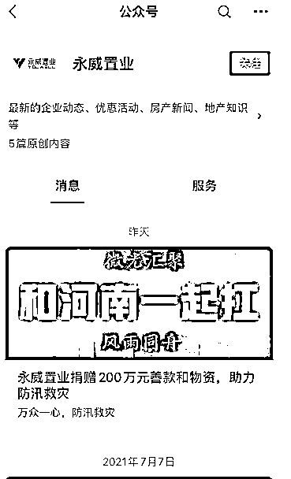

再来看看这次这三家出现的危机。在不合时宜之际，利用反向营销的方式，为自己做宣传。无疑是在，为自己的企业抹黑，制造危机。

而在事情发生后，除了康桥在隔天发表了相关的声明致歉，其他两家一点也没有危机意识，这将会为企业带来更多的形象损失。

再说永威，永威用捐赠善款之举，转移大众的视线，不得不说是一个绝佳的方法。但是，你犯下了错误，难道连一声解释道歉都没有吗？在危机处理之中，发表声明解释，是能够化解危机的一部分影响的。

至于亚星，声明解释没有，用其他的方式来化解这次的形象影响也没有。无疑是，让亚星的处境，会变得更加困难。亚星有危机意识吗？ 

而现在，想要化解这次舆论危机，给企业带来的形象损失。以下这些方式，可以作为参考。

其一，发表声明解释致歉。在这样一个大是大非的环境下，任何触动人心违反道德举动，都会无限放大。而做出解释并致歉，这也符合真诚沟通原则，也是让危机的影响稍减。 

其二，承担起自己一个企业在社会上的责任。灾难面前，一个企业能够勇于承担应有的责任，帮助受难的大众，此举不仅仅善举，更能得到社会各界的赞扬与认可。

其三，加强系统内部管理。在这样一个时间，你可以去行善，你可以去帮助受难人群。但是却不能在这样的时候，用灾难来为自己宣传。成立相关的督查小组，加强内部管理，改进相关的审核制度。系统内部的管理，很有问题。否则，也就不会出现这次的舆论形象的危机了。

其四，邀请权威机构及社会各界，对自己进行监督。这一次，不知晓三家企业内部有没有相应的监督机制。但是现在已经产生了危机，对企业造成了影响，监督机制必须得到加强。 

其五，加强危机意识培训。从这次事件中，很能明显的看出这三家企业的危机意识淡薄，如果企业有预防危机的意识，就不会造成现在的舆论形象危机。

最后，再次为郑州加油，为河南祈福！祝愿河南，早日度过这次的难关！

来源：菲凡烽火台，利箭在行动

灰产圈在线客服

← 向右滑动与灰产圈互动交流 →

