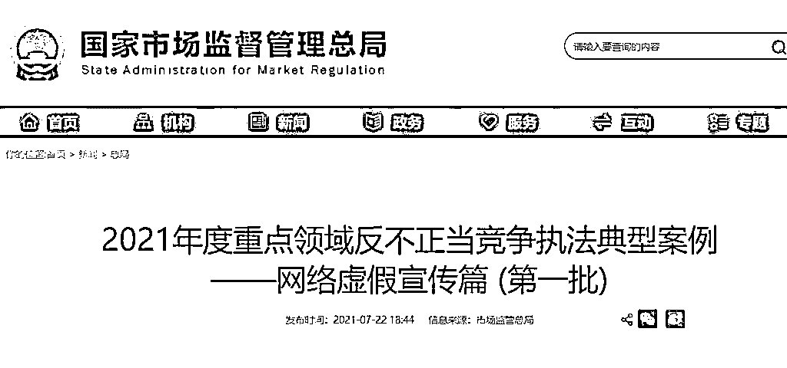

# 买“好评”刷“销量”最高被罚 200 万元！第一批网络虚假宣传案例曝光

> 原文：[`mp.weixin.qq.com/s?__biz=MzIyMDYwMTk0Mw==&mid=2247517786&idx=3&sn=95bdae483a3019178b80634763b152df&chksm=97cb4d62a0bcc474cae5949638f73e36e7f83595051b620e4c714f47d137361aa3e155ab8e29&scene=27#wechat_redirect`](http://mp.weixin.qq.com/s?__biz=MzIyMDYwMTk0Mw==&mid=2247517786&idx=3&sn=95bdae483a3019178b80634763b152df&chksm=97cb4d62a0bcc474cae5949638f73e36e7f83595051b620e4c714f47d137361aa3e155ab8e29&scene=27#wechat_redirect)

在电商平台上，用户评价往往是消费者选择商品的重要参考因素。也正因如此，一些不良卖家为吸引消费者的注意力、获取更多交易机会，寻找 " 刷手 " 进行虚假交易，以不正当方式提高商品销量、用户好评度和店铺信誉。7 月 22 日，市场监管总局公布第一批网络虚假宣传不正当竞争典型案例共 10 起，涉及三种不同类型的刷单方式，对利用 " 网红效应 " 虚构评价，组织员工、亲友等熟人，雇佣专业团队或 " 刷手 " 等方式 " 刷单炒信 " 的行为进行曝光。 

截至 2021 年上半年，全国各级市场监管部门共查办各类不正当竞争案件 3128 件，罚没金额 2.06 亿元。 

利用 " 网红效应 " 虚构评价等方式 " 刷单炒信 "

设置网络点评和排名的初衷，是通过统计与展示互联网用户消费后的真实反馈形成的大数据，反映人气、实力和市场口碑等信息，以帮助消费者更便捷地作出判断和选择。然而在刷单团伙操纵下，通过组织 " 大 V"（平台高级别用户）到店免费体验后发布指定好评、" 刷手 " 在不实际体验或者使用商品的情况下发布虚假好评、使用虚假注册的会员账户发布好评等多种手段，" 粉丝 " 可以有，" 互动 " 可以买，" 好评度 " 能够提升，" 播放量 " 可以增长。从最初的人工刷量到现在的机器刷量，" 刷单炒信 " 这一网络黑灰产已经发展到足以影响商家生存的地步，损害了广大消费者的知情权、选择权等合法权益，破坏了公平竞争的市场秩序，不利于互联网生态健康发展，必须加以整治和清理。 

比如，浙江省杭州之壹品牌管理有限公司利用 " 大 V" 打造 " 网红店 " 帮助 " 刷单炒信 " 。2020 年底，当事人根据 11 家大众点评平台入驻商家打造所谓 " 网红店 " 的需求，招募大量大众点评平台 " 大 V" 到店付费用餐。" 大 V" 在用餐后，编造好评 " 作业 " 发布并予以高分点评。当事人对 " 大 V" 的 " 作业 " 审核后，将餐费予以返还。当事人通过此类方式在大众点评平台内提高了相关商家的星级并大量增加优质评价，通过内容和流量双重造假，帮助商家欺骗误导相关公众。当事人的行为违反了《反不正当竞争法》第八条第二款的规定，依据第二十条第一款对当事人责令停止违法行为，处罚款 20 万元。 

通过雇佣专业团队、" 刷手 "，利用专业技术软件等手段帮助 " 刷单炒信 "

过去利用传统传播方式 " 自卖自夸 " 的夸大或虚假宣传现今演变为组织专业团队、利用网络软文、通过 " 直播带货 " 等助力虚假宣传，诱骗消费者。" 刷单炒信 " 日益呈现出组织化、职业化、规模化等特点，甚至形成黑灰产业。在 " 刷单炒信 " 这条产业链上，组织者、卖家和 " 刷手 " 是三大主要角色，在严厉查处卖家刷单行为的同时，严肃追究帮助刷单主体的法律责任，也是斩断这一利益链条的重要环节。 

比如，浙江省台州市陈某辉利用技术软件帮助 " 刷单炒信 " 。当事人在 2018 年、2020 年前后分别注册了浙江小辣信息科技有限公司、浙江番茄信息技术有限公司、浙江辣椒信息技术有限公司三家公司，申请 " 企业 QQ 号 " 并招募雇佣员工 21 名，分设成 " 排单组、审核组、导购组、售后组 "，运营 " 刷单炒信 " 工作。同时借助 " 小水滴 "、" 大水滴 "、" 猫头鹰 " 专用刷单软件，搜索有刷单需求的商户，分配 " 刷手 " 刷单任务，完成虚假交易，帮助网店经营者在平台的评价体系内获取更高的商业排名、信用度和用户访问量，误导消费者。自 2018 年 9 月至 2021 年 4 月 29 日，当事人共刷单 2951750 单，刷单商品总金额 3.59 亿余元，获利 372.93 万元。 

当事人的行为违反了《反不正当竞争法》第八条第二款的规定，依据第二十条第一款责令当事人停止违法行为，处罚款 200 万元。 

组织员工、亲友等熟人 " 刷单炒信 "

所谓 " 刷单炒信 "，本质就是造假，即在点击、阅读、观看、消费等方面，利用造假手段让自己的数据 " 好看 "，误导市场、诱导消费，实现自身利益最大化。根据实施 " 刷单炒信 " 行为的不同主体，大体可以分为 " 自刷 " 和组织他人刷单两种。而 " 自刷 " 最典型的手段就是通过组织员工、亲友等熟人刷单，虚构商品销售状况、用户评价等信息。当前 " 刷单炒信 " 已经成为市场的一颗 " 毒瘤 "，必须对 " 刷单炒信 " 重拳出击，从严从重查处。 

比如，福建省厦门市翰美互通（厦门）科技有限公司虚构产品下载量 " 刷单炒信 " 。当事人在 2019 年 7 月至 2020 年 1 月期间，安排公司员工在华为、OPPO、VIVO 手机的 APP 应用下载平台搜索并购买下载自家的字体产品，虚构产品的下载量等销售状况，欺骗误导相关公众。涉案金额共计 296.67 万元。当事人的行为违反了《反不正当竞争法》第八条第一款的规定，依据第二十条第一款责令当事人停止违法行为，处罚款 25 万元。 

来源 ：潇湘晨报

灰产圈在线客服

← 向右滑动与灰产圈互动交流 →

