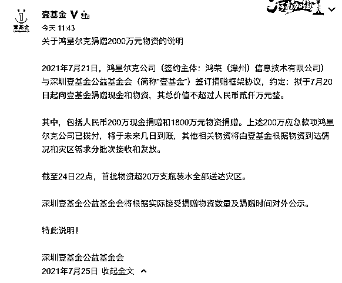

# 鸿星尔克 5000 万是诈捐？总裁回应

> 原文：[`mp.weixin.qq.com/s?__biz=MzIyMDYwMTk0Mw==&mid=2247517876&idx=2&sn=d13556bf801ff93e9ff58005e42589a7&chksm=97cb4d8ca0bcc49a5ffc797eb98de866c41731728ded246c90043145812a5aaa814de2e95ef4&scene=27#wechat_redirect`](http://mp.weixin.qq.com/s?__biz=MzIyMDYwMTk0Mw==&mid=2247517876&idx=2&sn=d13556bf801ff93e9ff58005e42589a7&chksm=97cb4d8ca0bcc49a5ffc797eb98de866c41731728ded246c90043145812a5aaa814de2e95ef4&scene=27#wechat_redirect)

近日，因为宣布向河南捐赠 5000 万元物资，鸿星尔克成了舆论焦点。不仅频繁登上微博热搜，过去一周内，鸿星尔克抖音直播间就卖出了 7700 万元的销售额，一时之间成了“国货之光”。

 然而就在鸿星尔克被“捧上神坛”的时刻，也出现了不少质疑的声音。 

7 月 24 日，有自媒体发表文章《捐了 20 万瓶冰露矿泉水的鸿星尔克，怎么捐出 5000 万物资？》，对鸿星尔克捐赠的 5000 万物资打出了问号。在豆瓣等社交网站上，也有部分网友对鸿星尔克捐赠事项提出了质疑。 

7 月 25 日，鸿星尔克总裁吴荣照在抖音个人账号上回应称：

**目前已经发出部分物资，将根据两个慈善机构的需求，陆续履行捐赠承诺。请不要神化鸿星尔克，希望大家能够把目光，更多地关注一线救灾人员。同时，吴荣照再次呼吁大家理性消费，恳请大家避免对别的同行造成困扰，国货品牌都需要大家的支持和爱护。**

**此前报道**

此外，壹基金官方也发布了《关于鸿星尔克捐赠 2000 万物资的说明》称，2021 年 7 月 21 日，鸿星尔克公司（签约主体：鸿荣（漳州）信息技术有限公司）与深圳壹基金公益基金会（简称“壹基金”）签订捐赠框架协议，约定：拟于 7 月 20 日起向壹基金捐赠现金和物资，其总价值不超过人民币贰仟万元整。

说明指出，捐赠中包括人民币 200 万现金捐赠和 1800 万元物资捐赠。上述 200 万应急款项鸿星尔克公司已拨付，将于未来几日到账，其他相关物资将由壹基金根据物资到达情况和灾区需求分批次接收和发放。截至 24 日 22 点，首批物资超 20 万支瓶装水全部送达灾区。 

深圳壹基金公益基金会将根据实际接受捐赠物资数量及捐赠时间对外公示。

此前的 7 月 21 日，鸿星尔克宣布通过郑州慈善总会、壹基金紧急捐赠 5000 万元物资，驰援河南灾区。 

考虑到鸿星尔克近两年业绩情况不佳，捐赠 5000 万物资的举动获得了网友的极高评价，一度登上微博热搜。近两日，鸿星尔克的线上旗舰店和线下门店销售都极为火爆。 

7 月 25 日，鸿星尔克董事长吴荣照在个人微博表示，公司近几年经过调整，已经取得一定的收益，转型过程依然艰难，但没有网友调侃中“濒临破产”的情况。

据吴荣照介绍，2000 年以微薄的资金从福建起家，正式创立鸿星尔克。2003 年遭遇大水，半数设备和大量原材料资产被水淹，工厂举步维艰。2008 年又遭遇金融危机，紧接着 2015 年又是一场大火，烧光了一半的生产设备。“虽然经历过这些风风雨雨，自始至终怀揣匠人精神，坚信只要守住初心、坚守实业，用心为用户打造优质的产品，总有一天会得到用户的认同。”吴荣照写道，近日，河南水灾令他感同身受，自己尽的这份力量，意外得到网友们浪潮般的力挺和关爱，感觉受宠若惊，又有点“蒙圈”，除了感恩还是感恩。 

官网信息显示，鸿星尔克（厦门）实业有限公司成立于 2000 年 6 月，总部位厦门，目前已发展为集研发、生产、销售为一体、员工近 3 万人的大型服饰企业。公司在全世界拥有店铺 7000 余家，产品行销欧洲、东南亚、中东、南北美洲、非洲等国家和地区，在全球 100 多个国家拥有商标专有权。

来源：澎湃新闻、红星新闻、中新经纬

灰产圈在线客服

← 向右滑动与灰产圈互动交流 →

