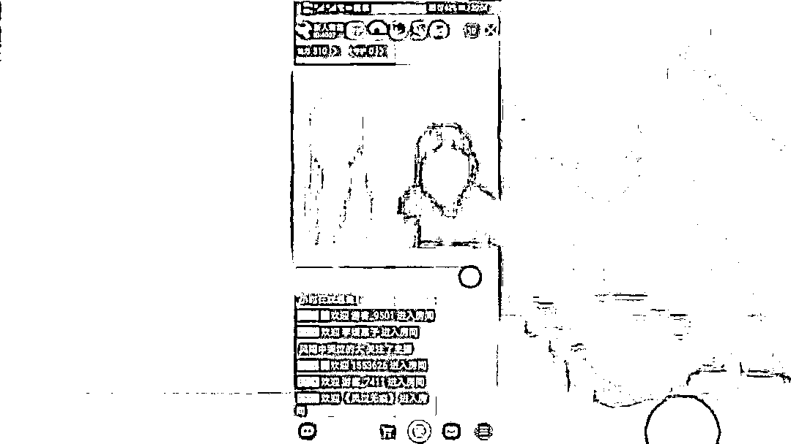
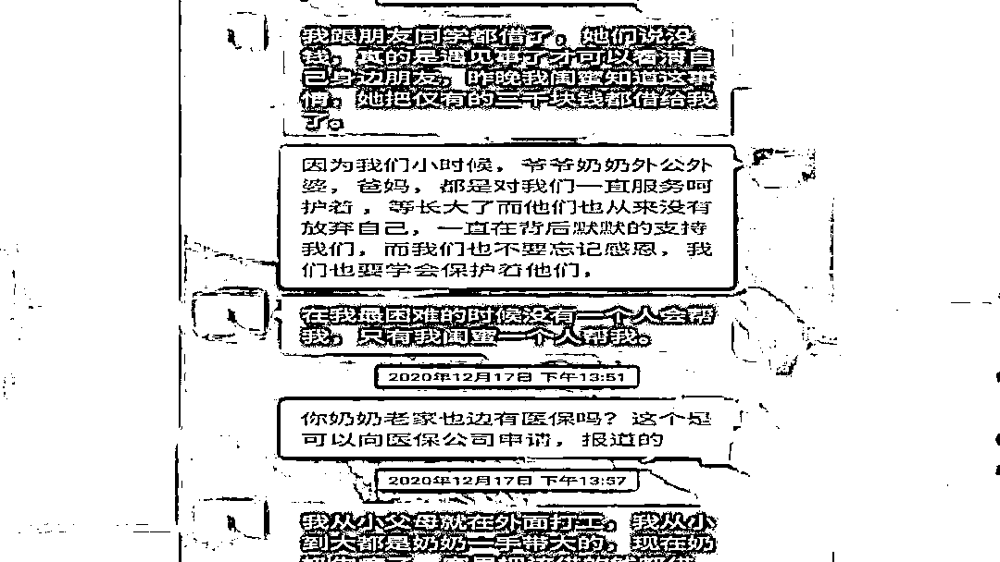
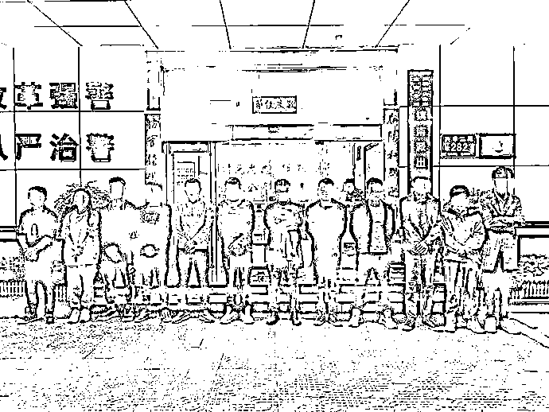

# 网聊了几个月的清纯女主播，真实身份竟然是……

> 原文：[`mp.weixin.qq.com/s?__biz=MzIyMDYwMTk0Mw==&mid=2247517876&idx=3&sn=561d6d2e14246fb80d421998ed6a2dee&chksm=97cb4d8ca0bcc49ab7350f1bada0a4630956c324b9f9a6fb55970fa22946235e7861c8a1bfee&scene=27#wechat_redirect`](http://mp.weixin.qq.com/s?__biz=MzIyMDYwMTk0Mw==&mid=2247517876&idx=3&sn=561d6d2e14246fb80d421998ed6a2dee&chksm=97cb4d8ca0bcc49ab7350f1bada0a4630956c324b9f9a6fb55970fa22946235e7861c8a1bfee&scene=27#wechat_redirect)

“欢迎大家来到我的直播间。” 

“喜欢我的话，就给我充值、刷礼物哦。”

现在是晚上十点

距离下直播还有一小时

小柔在直播间

用她温柔甜美的声音

和她的男粉丝们聊天

另一边

独自在深圳打拼的

95 后小伙郭先生

因为孤寂无聊

打开了某直播软件

进入了小柔的直播间

***初识***

2020 年 10 月

郭先生在某交友平台上结识了小柔

因为年龄相仿

两人聊得也比较投机

没过多久

两人便互加了微信好友

“我是一名小学老师，现在在江西上饶，平日里偶尔做下主播。你有空来看看我的直播。”微信里，小柔“坦诚地”向郭先生介绍自己的个人信息。小柔的“信任”让两人感情逐渐升温。在小柔的“热情指导”下，郭先生下载了某直播平台 App，只要她上播便会去围观。

***扶持***

2020 年 12 月 17 日，小柔对郭先生称，她的家人生病，急需一笔救命钱。可直播平台有规定，账户里的钱需达至 15000 元才能提现，现在还差 4000 元，需郭先生“帮帮忙”。在小柔的柔情攻势下，郭先生同意了，给小柔的直播间充值 4000 元。

“谢谢亲爱的，么么哒。”自充值后，小柔对郭先生更是热情，平日里嘘寒问暖、关怀备至，这让郭先生笃定小柔必定对自己有好感。

期间，小柔又以“打 PK”“打周星”为由，让郭先生给她刷礼物。截至 2021 年 1 月 31 日，郭先生一共给小柔直播间充值近 3 万元。

***梦醒***

令郭先生没想到的是，2 月 3 日，他照常联系小柔，这次的信息却石沉大海，当晚小柔的直播间也停播了。

直至春节假期过去，多次联系未果后，郭某方才意识到自己被骗，遂向深圳市公安局宝安分局镇南派出所报警求助。

接警后，镇南派出所民警立即展开调查，民警分析郭先生遇到的极可能是一个有预谋、有组织的诈骗团伙。

根据“净网 2021”专项行动部署，为尽快抓获嫌疑人，镇南派出所联合深圳市公安局宝安分局刑警大队、网警大队，成立专案组。

民警一面从郭先生提供的聊天记录等线索入手展开研判，一面对资金流向进行细致分析。在深入研判后，一个位于江西上饶的诈骗团伙逐渐浮出水面。

***真相***

小柔是该诈骗团伙中唯一的女性，她的任务就是在网络直播平台定时直播，诱人上钩。待猎物咬钩后，自有人替小柔“接盘”。

[`mp.weixin.qq.com/mp/readtemplate?t=pages/video_player_tmpl&action=mpvideo&auto=0&vid=wxv_1949596038881722373`](https://mp.weixin.qq.com/mp/readtemplate?t=pages/video_player_tmpl&action=mpvideo&auto=0&vid=wxv_1949596038881722373)

每天，团伙中马某、郭某等 10 名业务员，披着小柔的“马甲”，在多个社交软件注册账号，四处添加男性好友，并通过专业的“话术”诱导他们进入小柔直播间观看直播。一旦有人被吸引，业务员们便会发动热情攻势，以小柔的身份和他们深入“交流”。 

聊天过程中，业务员们释放出的所有温柔体贴和好感，都只是为了取得被害人的信任。之后，诈骗分子便开始以家人身体不适、直播 PK 需要支持等虚假理由要求被害人在直播平台充值和购买平台虚拟礼物，从而达到诈骗钱财的目的。

一旦钱财到手，他们便对受害人置之不理，销声匿迹。女主播小柔也早已在原先平台停播，转向新的直播平台找寻“新猎物”。

3 月 31 日，在当地警方协助下，经多日走访摸排，深圳警方确认了该诈骗团伙的窝点。4 月 1 日，深圳警方展开收网行动，成功抓获诈骗嫌疑人 12 人，团伙成员悉数落网。

**警察蜀黍有话说**

交友时，一定要及时、认真核实对方身份；在涉及钱财问题时，不要轻信征婚交友对象的任何借口、说辞， 与身边亲友多沟通、多询问，防止落入骗子的圈套；若遭遇此类诈骗，请第一时间拨打 110 报警。 

来源：深圳公安

灰产圈在线客服

← 向右滑动与灰产圈互动交流 →

