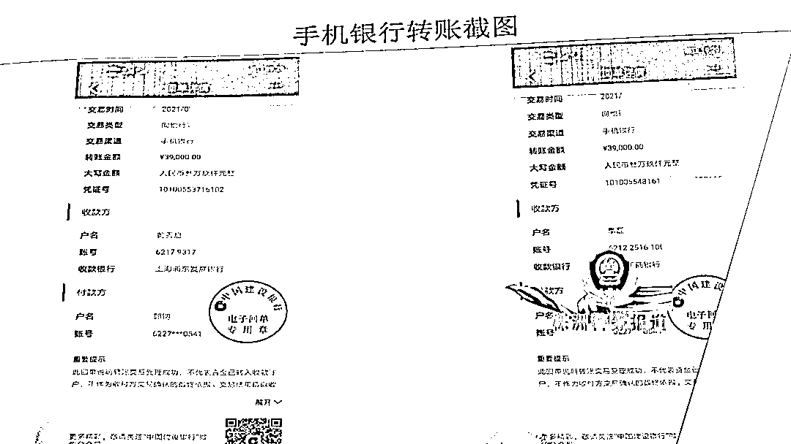
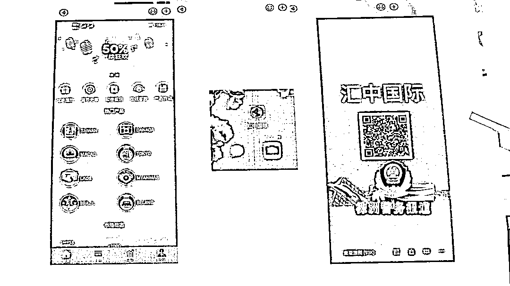

# 湖南一男子被骗 52 万，只因相信这个套路

> 原文：[`mp.weixin.qq.com/s?__biz=MzIyMDYwMTk0Mw==&mid=2247517876&idx=5&sn=fde568a0a24827f1dd02658099e0fe8f&chksm=97cb4d8ca0bcc49ae0f26805d49d589666db18ef145d9670b80f6c9471b096254e2f2f28b6ec&scene=27#wechat_redirect`](http://mp.weixin.qq.com/s?__biz=MzIyMDYwMTk0Mw==&mid=2247517876&idx=5&sn=fde568a0a24827f1dd02658099e0fe8f&chksm=97cb4d8ca0bcc49ae0f26805d49d589666db18ef145d9670b80f6c9471b096254e2f2f28b6ec&scene=27#wechat_redirect)

轻信赌博网站有漏洞可以赚钱，湖南株洲一男子一次性投入 52 万余元，不料是血本无归。近日，芦淞公安分局龙泉派出所通过这一线索，捣毁了一个跨省电信诈骗团伙，抓获犯罪嫌疑人 10 人。 

6 月初，芦淞区居民郭先生在某社交平台认识了一名女子，女子面容姣好吸引着郭先生。在聊天逐渐深入之后，女子称他是某赌博网站的客服人员，只要郭先生向一款名叫“汇中国际”的赌博 APP 投钱，就可以获得高额的利润。

[`mp.weixin.qq.com/mp/readtemplate?t=pages/video_player_tmpl&action=mpvideo&auto=0&vid=wxv_1971416200697954312`](https://mp.weixin.qq.com/mp/readtemplate?t=pages/video_player_tmpl&action=mpvideo&auto=0&vid=wxv_1971416200697954312)

郭先生通过充值的方式，18 次共向该 APP 内投入了 52 万余元，账面上的数字显示金额过了百万，但都无法提现，郭先生这才意识到自己被骗了，于是向警方报案。

龙泉派出所立即开展案件侦查工作，通过对银行卡信息和资金流等信息初步梳理，掌握了犯罪嫌疑人活动的地域和活动规律。

[`mp.weixin.qq.com/mp/readtemplate?t=pages/video_player_tmpl&action=mpvideo&auto=0&vid=wxv_1971415413561311236`](https://mp.weixin.qq.com/mp/readtemplate?t=pages/video_player_tmpl&action=mpvideo&auto=0&vid=wxv_1971415413561311236)

截至目前，警方共抓获犯罪嫌疑人 10 人，冻结资金 200 万元。这个犯罪团伙分工明确，有人负责在社交平台上在网上寻找诈骗对象，有人为赌博网站“跑分”，替上游电信诈骗集团洗钱。

目前，案件还在进一步侦查之中。警方提醒，**天上没有馅饼掉，网络上涉及经济往来一定要谨慎，谨防踏入陷阱。**

来源：株洲法制、株洲市广播电视台、红网

灰产圈在线客服

← 向右滑动与灰产圈互动交流 →

