# 关于宁泽涛事件

> 原文：[`mp.weixin.qq.com/s?__biz=MzIyMDYwMTk0Mw==&mid=2247517919&idx=1&sn=9bf26f096bd97ab642bef4e3df6ae777&chksm=97cb4de7a0bcc4f1fe9d94d29f2bdce043e4bdba84e9d27d8b01ab6f083687f3a7dc4a0ce90f&scene=27#wechat_redirect`](http://mp.weixin.qq.com/s?__biz=MzIyMDYwMTk0Mw==&mid=2247517919&idx=1&sn=9bf26f096bd97ab642bef4e3df6ae777&chksm=97cb4de7a0bcc4f1fe9d94d29f2bdce043e4bdba84e9d27d8b01ab6f083687f3a7dc4a0ce90f&scene=27#wechat_redirect)

吃瓜不吐葡萄皮(ID:xbzavi)

一个有品，有趣，有料，有瓜，有态度的公众号

昨晚，一则#**宁泽涛 帖子**# 话题冲上微博热搜第一，但是没过多久很快就没了。

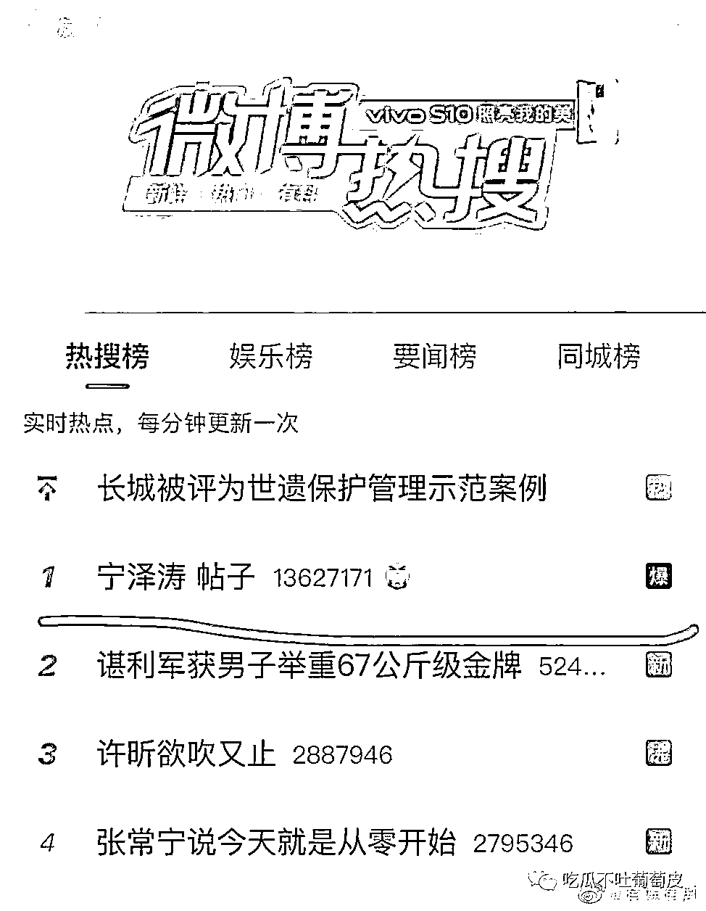

**帖子全文内容如下：**

**标题：uus，聊聊宁泽涛吧，退役两年多后感觉舆论可以客观看待他了。**

泰菲 2021-07-24 

看到挺多人都不知道宁泽涛已经退役了，不知道他为什么退役，不知道 16 年里约奥运他为什么成绩那么差，或者对他还有些误解。今天在组里帖子回复了一些当年发生的事情，又看到郑州红十字会发的捐款明细，彻底远离公众视线的他捐了 20 万，就觉得可能现在是个好时机帮他解除一些误解，所以开个帖子想聊聊。 

先从 16 年奥运会说起吧，成绩差是必然的，但当时的成绩已经是宁泽涛拼尽全力游出来的，他的身体在出发里约前就被搞垮了，里约接力赛他游到发紫，指甲都是紫的，真的尽全力了。奥运前他本来在澳洲外训，成绩很好，他和他的教练布朗都是很谨慎保守的人，可能是当时的训练成绩非常好所以他们才有信心说拿奖牌是大概率事件，但游泳中心突然把他召回国，开始代言事件的扯皮从那时候开始，他的奥运或者说他的职业生涯就被毁了。

中国游泳队的赞助商是伊利，伊利和宁泽涛也签了个人赞助，但新的游泳中心主任王路生上任后带来了跟他合作多年的蒙牛，蒙牛签了国家队后还想签下宁泽涛的个人合同，但他本人已经和伊利签过了，自然不可能毁约去签蒙牛，谈不拢那就整他。

手段诸如:

饭卡消磁(奥运快开始他不敢在外面吃饭只能借队友饭卡在食堂继续吃)；

要求他搬离宿舍(他要求宿管出示文件他才搬，对方给不了文件这事不了了之)；

禁止他进游泳馆训练、禁止他的教练指导他(奥运前只有一个队友和一个队医他掐表，没有教练只能自己练)；

晚上每隔几个小时敲他房门要求他写检查道歉对他使用熬鹰手段不让他睡觉

恐吓他不能去参加奥运会...

期间还参杂着他不断被人举报，一个月内做了三次尿检一次血检，身边人都提醒他从泳池上来一定要喝没开封的水怕有人给他下药。

这一系列组合拳打下来，宁泽涛掉了八斤肌肉，是八斤肌肉不是八斤肉，大家也都看过他的身材，和其他白人选手相比他本身就是瘦弱型选手，掉了八斤肌肉后百自需要的爆发力也废了。宁泽涛在奥运前万众瞩目，很多赞助商都是因为他才投下了巨额赞助，赞助商和体育总局都不能承受他不参加奥运会的后果，因此在赞助商和体育总局的施压下，游泳中心最后放手，允许他参加奥运会。

允许他参加奥运会也不会让他日子好过，作为中国游泳队比赛任务最重的队员，宁泽涛没有正常的后勤保障，他一个一米九几的大个子睡在没有窗帘的客厅里，床紧挨着洗手池，而其他没有比赛任务的替补队员都可以住在正常的卧室里; 他的队医不允许住进奥运村，理由是房间紧张不够住，可他的队友比如孙杨的爸妈都可以住在奥运村里，他每天训练比赛结束都得走很久去找队医做理疗。

运动员和领导做抗争唯一可以依仗的就是好成绩带来的舆论支持，在他奥运失利后，就真的一无所有了，舆论对他诸多恶意揣测中伤，比如私接代言咎由自取，比如想进娱乐圈无心训练，现在五年过去，一切都尘埃落定了，对他动用私刑的游泳中心主任王路生被撤，他到底有没有想不想进娱乐圈大家也都能看到，可惜里约奥运会回不去了，他的运动生涯也彻底被毁了。

他能出头真的不容易，游泳运动员的培养由省队自己负责，出头了才有机会进国家队，成绩好的省队或者富裕的省份有更多的培养资金更好的培养条件，比如浙江队，因此也能培养出更好的运动员。宁泽涛是海军队的，海军队很穷，条件很艰苦，有多艰苦呢，运动员基本主攻长池比赛，就是游泳池赛道 50 米长的比赛，但海军队连 50 米的标准池都没有，更别提出钱送运动员外训了，宁泽涛的亚洲纪录是在 25 米的短池里练出来的，拿到了亚洲冠军才有了机会去外训，才有更好的训练环境更先进的训练理念，15 年他第一次外训回来就拿到了世界冠军，16 年奥运前是他第二次去外训，外教和他都自信满满，然后被游泳中心毁了。里约奥运会海军队有参赛资格的只有宁泽涛一个人，在他被游泳中心折磨的时候教练放弃了他，确实教练夹在运动员和领导之间很难做，但运动员心灰意冷是肯定的，所以他从里约回来就从海军队退役回到河南队了。河南队对他很好但技术水平和资金都跟不上，回到河南队后他都是自己出钱在澳洲训练，但即便他成绩是亚洲第一也还是进不去国家队，能参加的比赛大大小小他都会参加，可惜后来比赛热身的时候手指骨折，到现在都没好彻底无奈选择退役。

很多人诟病他金牌少昙花一现，但其实不是他昙花一现，是他被扼杀的太早了，他的身体素质导致他是大器晚成那类，肌肉和骨骼发育都比同龄人晚，14 年亚运会才进入大众视线拿了四块金牌，15 年第一次去参加世锦赛拿了世界冠军，16 年就被游泳中心毁了之后再没能进过国家队，其实他就只参加过这三次大赛而已，论成绩的稳定性，他是全世界唯二连续四年游进 48 秒的选手。

看到有姐妹说酒小七的浪花一朵朵男主原型是他，就还挺难过的，小说男主当然会有好结局，可惜活生生的运动员没有。

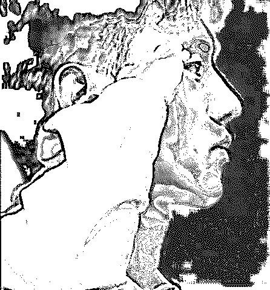

(这张床就是他在里约睡的那张，就想不通怎么可以这样整一个为国争光的运动员......遮光的布还是他自己想办法搞到然后挂上去的，虽然也不怎么遮光吧......

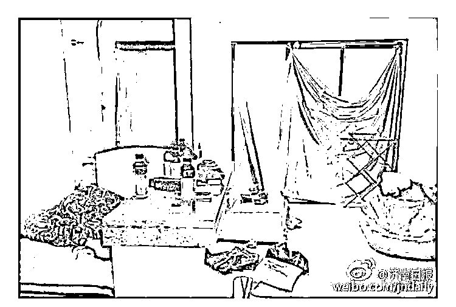

**以上就是帖子的全部内容。**

这篇时间线的整理也跟帖子情况是一致的。

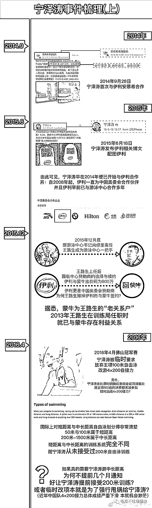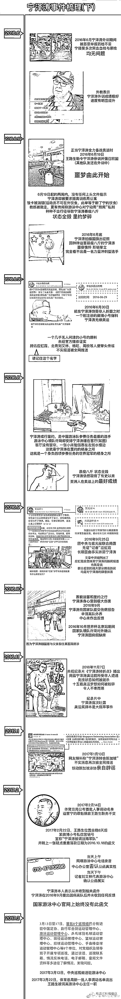

央视曾经也拍过纪录片，情况大致如此。(纪录片截图片段来自@娱七叔叔）

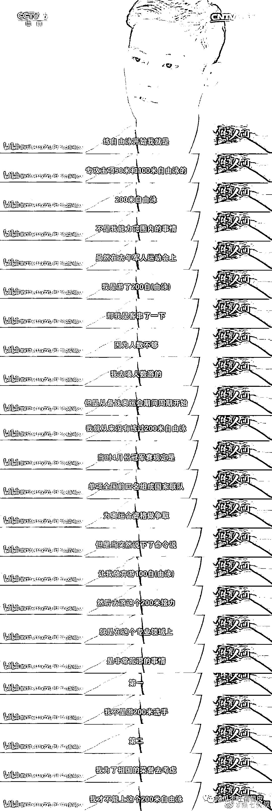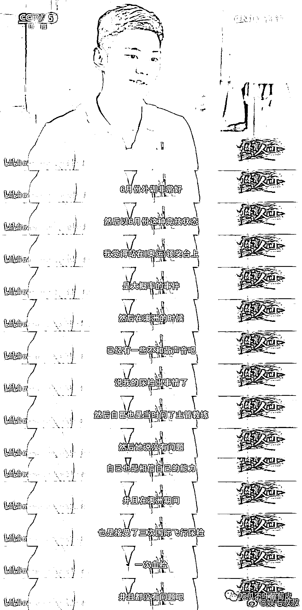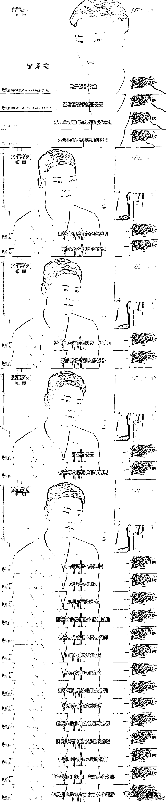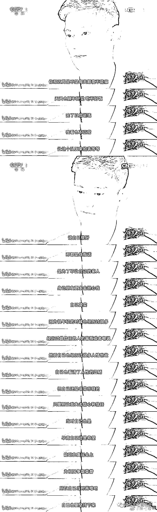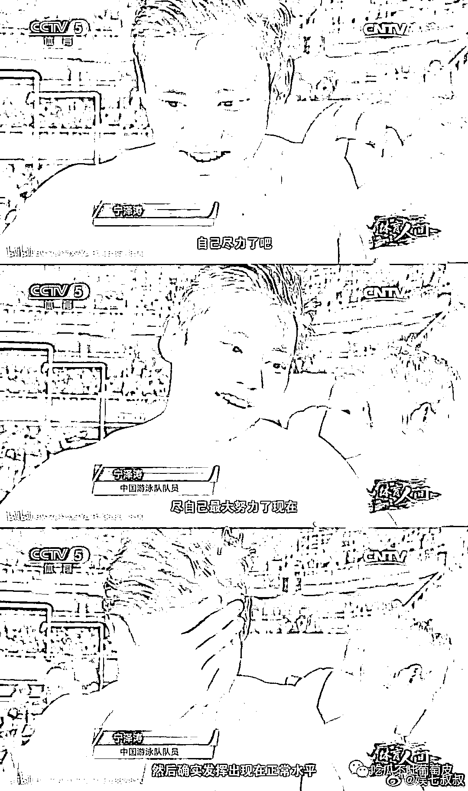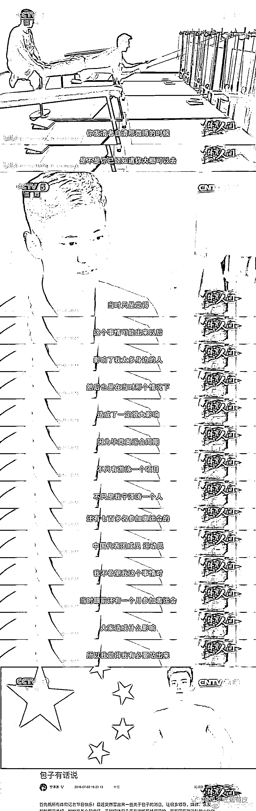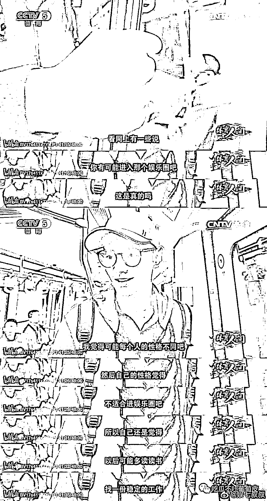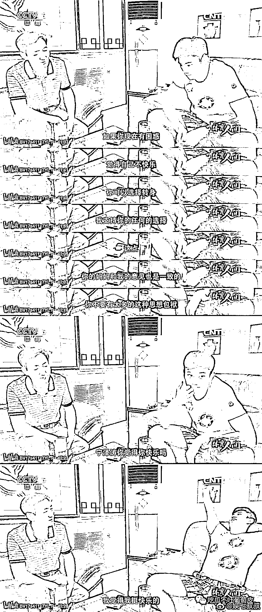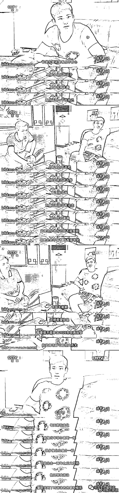

最后我特意找出来这个纪录片给大家看，就是文中提到的《转折点》，视频的内容基本与帖子提到的都吻合。

这部央视纪录片《转折点》中披露了一些赛前内幕，包括奥运会前一个月宁泽涛被勒令搬出公寓，饭卡被消磁，训练没有教练等等，大赛前，这些折磨足以废掉一个运动员的功力。

2019 年 3 月 6 日，在自己 26 岁生日这一天，宁泽涛选择了退役。

[`mp.weixin.qq.com/mp/readtemplate?t=pages/video_player_tmpl&action=mpvideo&auto=0&vid=wxv_1973603048107180033`](https://mp.weixin.qq.com/mp/readtemplate?t=pages/video_player_tmpl&action=mpvideo&auto=0&vid=wxv_1973603048107180033)

后来有大 v 博主指出宁泽涛的问题，是高层巡视组亲自点名，并且体育总局一起被点名整改，不是某官员要整他。

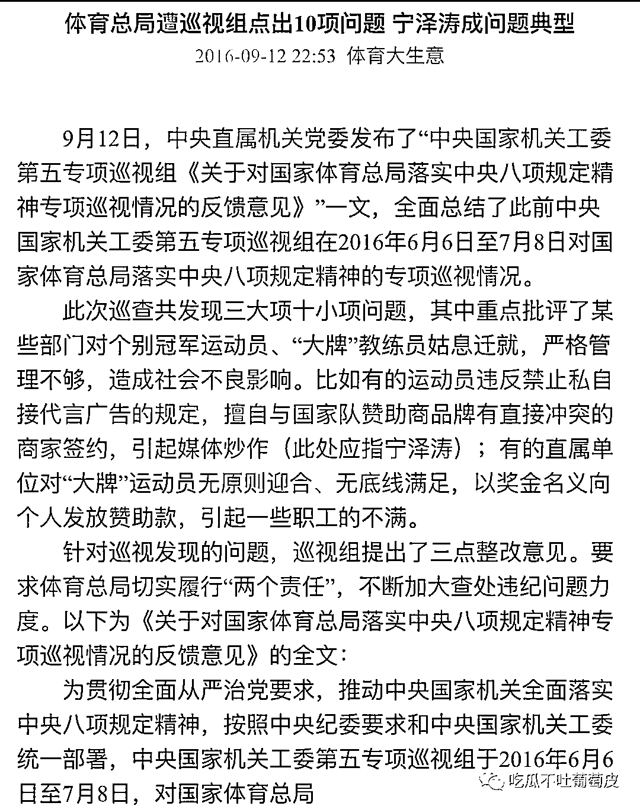

不管是被煽动的普通人还是水军，开始对体制攻击，尤其是在东奥这个时间点。

宁泽涛受到的不公正待遇，和他本人的不正当操作，和这次有资本借他作棋子，想搞事情，请各位分成三件事来看待。

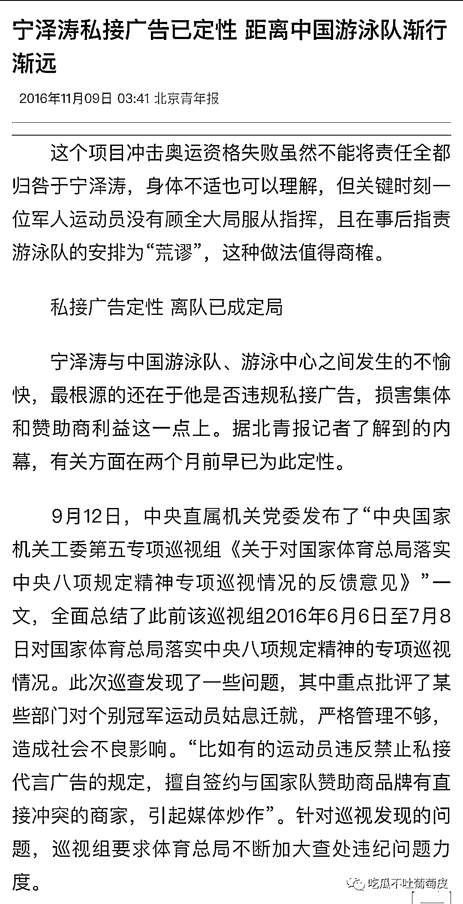

运动员绝对不允许私自接商务，这是最底本的红线。

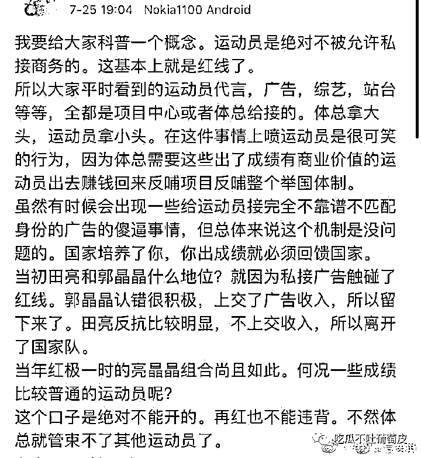

虽然昨晚这件事就有反转了，就有人出来指责宁泽涛当初做法确实不对。但热搜一撤，还是有好多人阴谋论什么体育圈恶臭，迫害国家队员。 

**宁泽涛我也觉得挺帅的，之前我也关注过他一段时间，对于男子 100 米自由泳这个游泳王牌项目，宁泽涛是中国、亚洲唯一能够游进 47 秒的选手，不管宁泽涛有什么问题，都不应该贬低他获得成绩的意义，这个道理跟刘翔是一样的。瓜姐在这里不过多评价谁对谁错。**但是吃瓜群众别吃瓜只吃一面就情绪高涨，正义满身。多看看不同的声音再下结论行不？

来源：吃瓜不吐葡萄皮

← 向右滑动与灰产圈互动交流 →

