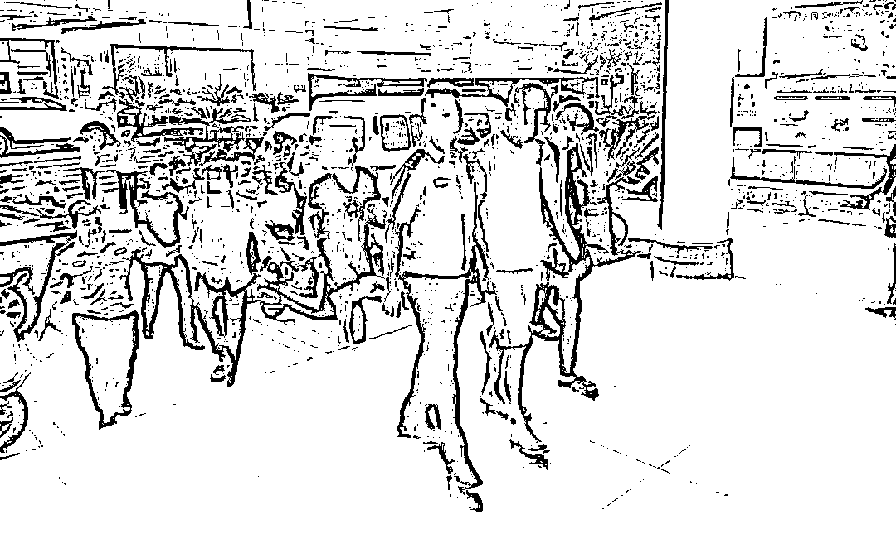
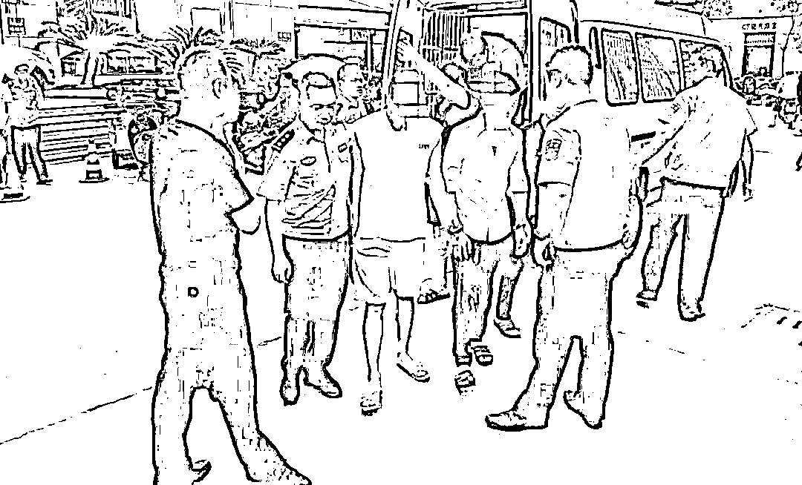
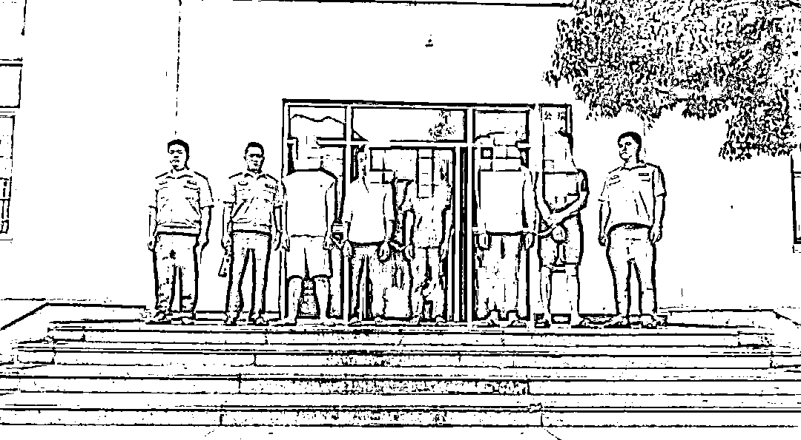
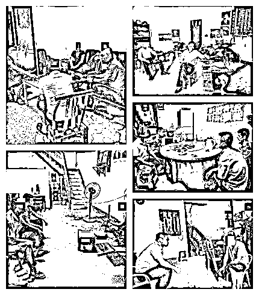

# 缅北回国男子哭诉恐怖遭遇：被捅刀、枪指头…警方再发提醒

> 原文：[`mp.weixin.qq.com/s?__biz=MzIyMDYwMTk0Mw==&mid=2247517919&idx=2&sn=5881c341b69387279b50379fa8d52c1a&chksm=97cb4de7a0bcc4f1440e9c8facd02f242a156a108f77946e23152d7e9a50a194a3a1b523f366&scene=27#wechat_redirect`](http://mp.weixin.qq.com/s?__biz=MzIyMDYwMTk0Mw==&mid=2247517919&idx=2&sn=5881c341b69387279b50379fa8d52c1a&chksm=97cb4de7a0bcc4f1440e9c8facd02f242a156a108f77946e23152d7e9a50a194a3a1b523f366&scene=27#wechat_redirect)

**缅北** 

**赣州警方多次发文预警**

**那里不是人间天堂**

**而是跨境赌博、电信网络诈骗的代名词**

**这才是最真实的缅甸北部！**

**↓↓↓**

 [`v.qq.com/iframe/preview.html?width=500&height=375&auto=0&vid=g3261olt98n`](https://v.qq.com/iframe/preview.html?width=500&height=375&auto=0&vid=g3261olt98n) 

（亲历者讲述地狱般的缅北）

**因赚钱的“诱惑”陷入深渊**

2020 年 10 月的一天，宁都县蔡江乡村民蔡某在云南省昆明市一个农贸市场务工，遇到了一个自称以前在泉州开饭店的“阿平”，“阿平”问蔡某有没有兴趣去缅甸东城做餐饮生意，并扬言那边的钱很好赚。

面对金钱的诱惑，蔡某一口答应了。第二天，“阿平”叫来了一辆面包车，带着蔡某来到云南孟定，在当地宾馆休息 5 个小时后，蔡某被带到了一个山顶，他们白天在山上休息，晚上赶路，就这样走了三天后到了缅北。

（图片来自网络）

**赚钱“天堂”变成人间“地狱”**

到了缅北后，蔡某发现“阿平”根本不是带他来这边做餐饮生意，而是被诈骗公司的人关进了一个小房间，还拿了一些电信诈骗的“资料”叫蔡某背熟，奈何蔡某没有文化看不懂。诈骗分子看到蔡某无法从事电信诈骗，便拿着枪顶着蔡某的脑袋叫其联系亲戚打钱来赎人，无奈蔡某的家人无钱赎人。

拿不到钱后，诈骗分子便把蔡某带到了一个赌场，逼着蔡某借高利贷进行赌博，蔡某前后借了 7 次高利贷，第一次借了 2 万，后面借的越来越多，最多的一次借了 10 万元。赢了钱先还高利贷，剩下的钱被诈骗分子抢走。此前六次借的钱，蔡某都通过赌博还清了，最后一次却输了个精光。

**无钱还债，被捅两刀丢在山里**

2020 年 10 月 27 日晚上，是蔡某最后一次借高利贷，借了 10 万元，输光之后，放高利贷的人逼着蔡某还钱，得知其无钱偿还后，便把其带到了一座山上，在其肚子上捅了两刀后将其丢在山里，幸好被当地一个路过的好心人救了送到了医院。

醒来的蔡某十分害怕，在两处刀伤未缝的情况下便“逃”出了医院。蔡某打听到好心人的住址后，在好心人家里住到了过年。身上的伤好后就在缅甸的建筑工地上务工赚钱，最后，想尽办法逃到中缅边境，向当地民警自首后回到了国内。

**想着去出国赚大钱**

**结果却是深潭虎穴**

**好不容易从死里逃生**

**回国自首**

**同样是做着缅北“淘金梦”**

**瑞金 6 人结伙偷越国边境被抓！**

↓↓↓

2019 年 9 月，刘某亮与谢某东

从网上获得一条在缅甸轻松工作

便能月入过万的工作信息

看到如此丰厚的待遇

刘某亮 2 人心动了

连忙添加发布信息的人为微信好友

询问具体工作情况后

2 人一致决定远赴缅甸打工

于是他们便收拾行李

怀揣着跨国致富梦踏上了偷渡之路

开启了惊心动魄的“淘金之旅”

2019 年 9 月，刘某亮与谢某东初次前往缅北，然而到了缅北后，人生地不熟的刘某亮二人发现，缅北并非别人口中的遍地是黄金，很快，带去的钱花光后，两人铩羽而归。

2020 年 3 月初，仍不死心的刘某亮再次伙同谢某东、刘某、谢某山、朱某文以偷渡的方式前往缅甸“淘金”，然而这一次，等待他们的，是钱被人骗走、充满暴力的治安环境以及每天担惊受怕的日子。

2020 年 12 月刘某亮、刘某、谢某东、谢某山、谢某东、朱某文等人费尽千辛万苦回到国内，几人身上的积蓄也已挥霍一空。回想在缅北的日子，简直是如临深渊。至此，他们的缅北“淘金”梦彻底破碎。

回国后，刘某亮等人并未如实前往公安机关自首，2021 年 7 月，经过前期摸排调查，瑞金市公安局黄柏派出所民警依法将刘某亮等人传唤至公安机关接受调查。目前，刘某亮、刘某、谢某东、谢某山、谢某东、朱某文等人因涉嫌偷越国边境被刑事拘留，案件正在进一步侦查中。

**一直以来**

**赣州警方始终保持高压严打态势**

**依法严厉打击跨境违法犯罪活动**

**坚决遏制赣州籍人员滞留境外**

**参与电信网络诈骗犯罪行为**

**高频次、常态化开展滞留缅北**

**涉诈人员的劝投劝返工作**

**所以说** 

**缅北并不是大家想象中的“诗和远方”**

**去缅北**

**可能涉嫌偷越国边境**

**后果真的很严重**

**非但实现不了“发财梦”**

**在那边要挨打受罪**

**回来还可能还要坐班房**

**赣州警方正告仍滞留缅北**

**从事违法犯罪人员及其家属**

**尽快回国投案自首**

**如实供述自己的罪行的**

**可以依法从轻或者减轻处罚**

**犯罪情节较轻、有重大立功表现的**

**可以依法减轻或者免除处罚**

**拒不入境投案自首的**

**公安机关将依法从严惩处**

来源：赣州公安,反诈骗先锋

← 向右滑动与灰产圈互动交流 →

