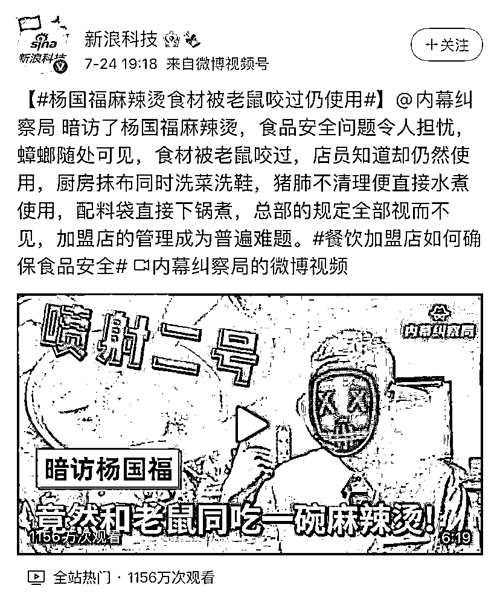
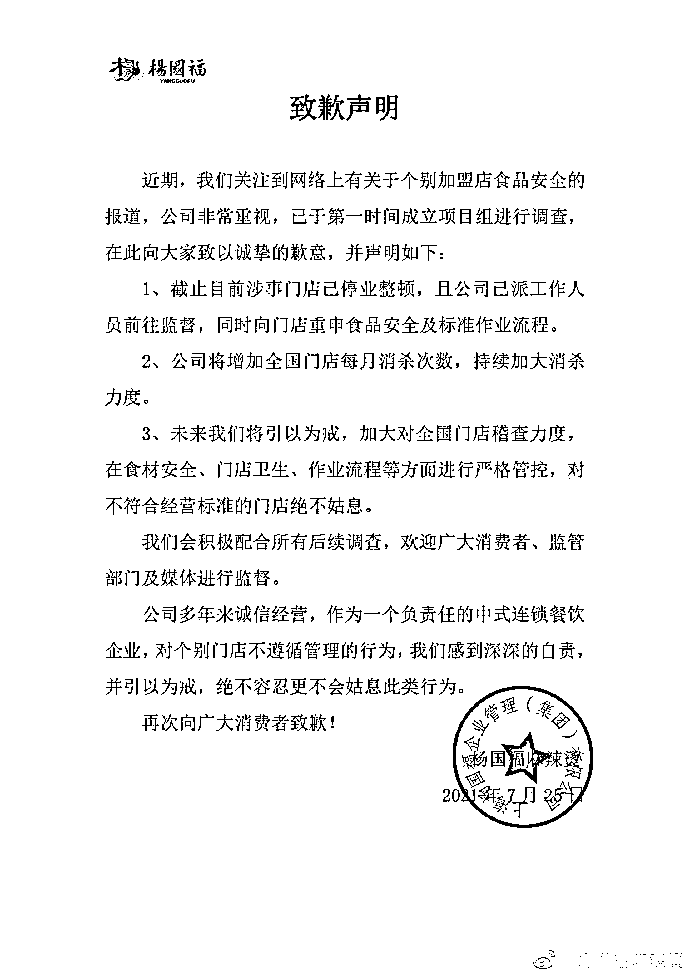

# 杨国福麻辣烫致歉

> 原文：[`mp.weixin.qq.com/s?__biz=MzIyMDYwMTk0Mw==&mid=2247517919&idx=4&sn=81b2b6bc74afe12e1581c8254aed2c2a&chksm=97cb4de7a0bcc4f12668a4dcb7dc40ccc92aedc48f2a92fa2f6de7a933227a0cb58c13116b2e&scene=27#wechat_redirect`](http://mp.weixin.qq.com/s?__biz=MzIyMDYwMTk0Mw==&mid=2247517919&idx=4&sn=81b2b6bc74afe12e1581c8254aed2c2a&chksm=97cb4de7a0bcc4f12668a4dcb7dc40ccc92aedc48f2a92fa2f6de7a933227a0cb58c13116b2e&scene=27#wechat_redirect)

近日，有视频博主暗访杨国福麻辣烫，视频内容显示，该门店对试工人员的健康证要求并不严格。暗访者称自己的健康证正在办理，店家表示“没关系”。门店打烊后，开放式展示冷藏柜中剩余的食材并没有放入密闭式冰箱内保存。仓库中遍地老鼠屎，袋装芝麻酱被老鼠咬破，店家却称“不管它、直接放”。在清洗环节中，店家也说“娃娃菜不用洗，太难洗了”。处理肉类食材时，猪肺也是不清洗，“直接煮、煮熟切片就行”，煮熟后的猪肺则直接放在地上，店员甚至拿起一块猪肺当“抹布”擦拭肮脏的盆壁。此外，这家门店的洗碗布还被用来洗鞋，且洗鞋的水池正是洗菜池。在熬制汤底时，门店工作人员直接将包装袋一起下锅。

[`v.qq.com/iframe/preview.html?width=500&height=375&auto=0&vid=w3263zaj36x`](https://v.qq.com/iframe/preview.html?width=500&height=375&auto=0&vid=w3263zaj36x)

7 月 25 日，就有关个别加盟店食品安全的报道，**@杨国福麻辣烫 发布致歉声明：涉事门店停业整顿，已成立项目组进行调查。** 来源 ：澎湃新闻

← 向右滑动与灰产圈互动交流 →

