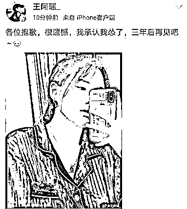

# 奥运选手失利竟被“网暴”到删博？微博官方：删评、禁言！

> 原文：[`mp.weixin.qq.com/s?__biz=MzIyMDYwMTk0Mw==&mid=2247517992&idx=1&sn=097daf62889a68567f11da4e3cffa028&chksm=97cb4c10a0bcc506c1e699c2bafc16c2652cd51c0f1bd20bdfabf69b23a7375ba0636d1f1b54&scene=27#wechat_redirect`](http://mp.weixin.qq.com/s?__biz=MzIyMDYwMTk0Mw==&mid=2247517992&idx=1&sn=097daf62889a68567f11da4e3cffa028&chksm=97cb4c10a0bcc506c1e699c2bafc16c2652cd51c0f1bd20bdfabf69b23a7375ba0636d1f1b54&scene=27#wechat_redirect)

7 月 24 日上午，东京奥运会首金争夺战打响，“00 后”中国选手杨倩以 251.8 环创造奥运会决赛纪录并夺冠。

在这场比赛中，中国队出战的是 21 岁的杨倩和 23 岁的王璐瑶，当大家都在为杨倩庆祝的时候，另一位选手王璐瑶却因一张自拍遭到了一些网友的指责和谩骂，**甚至被“网暴”到删博**。

奥运选手失利后竟然被“网暴”到删博，此事迅速引起舆论关注。更多的网友纷纷站出来力挺王璐瑶，人民日报等官媒也发声鼓励。

25 日，@微博管理员表示，**部分账号在评论区对我国奥运选手进行恶意诋毁、侮辱攻击，造成恶劣影响**，对涉事账号禁言 90 至 180 天不等，并清理攻击评论。

**奥运选手失利被网暴到删博******

****7 月 24 日上午，东京奥运会女子 10 米气步枪项目，中国选手王璐瑶遗憾未能进入决赛。****

****在当日上午举行的资格赛中，杨倩打出 628.7 环的成绩，排名第 6，进入随后的决赛并一举拿下“首金”。而另外一名中国选手王璐瑶却排名第 18，止步资格赛。****

****预赛失利后她发了条微博：“各位抱歉，我承认我怂了，三年后再见吧”。****

********

****图片来源：王璐瑶微博截图****

****没想到，**这条微博却遭到众多网友各个角度的挖苦嘲讽**。有人指责她失败了不好好总结，还有心思晒自拍；有人质疑她“太想红了吧”；还有人挑她用“怂了”这个字眼；也有人批她自拍照穿的是睡衣等等。****

******** 

******** 

******** 

******** 

******** 

******** 

******** 

****图片来源：微博截图**** 

****被“网暴”几个小时后，**王璐瑶删除了这条微博，未发一言**。****

****众多网友力挺，官媒发声鼓励****

********

******奥运选手被“网暴”到删博，此事引发了网络关注，更多网友站了出来，力挺王璐瑶。“能去奥运会都是很优秀的了！！！姑娘你很棒！！！”******

************

******“大家不要觉得金牌理所应当是我们的，运动员压力很大，真的很难。”******

************

******还有网友说：******

******“今天的中国，是自信的中国，国人的自信早已经不需要运动员们用金牌来背负～好好享受比赛，享受奥运，不留遗憾，平安凯旋～每一位奥运健儿都很棒～中国队 YYDS！加油！”******

************

******有媒体发起了话题#王璐瑶仍是浙江了不起的姑娘#，很快冲上了热搜第二。******

************

******人民日报微博也发声也为王璐瑶加油打气：“输赢乃兵家常事相信未来会取得更好的成绩。”******

************

******此后，环球时报对此发表了题为《必须旗帜鲜明地反对对失利的中国运动员实施网暴》的评论，******

******“哪个运动员失利了不难过？要知道奥运会四年才来一次！即使王璐瑶不太懂如何在网上说话，没有很好地对上网络情绪，跑调了，公众也应充分谅解她，对她的失利抱以同情。她的话中没有任何政治不正确，没有业务上的推卸责任，也看不出任何道德上的瑕疵，对她进行斥责，这是对失利者很恶劣的态度。******

******原生态的生活以及表达，经不起互联网带着放大镜的审视。除非一个人有被批判的重大原因，否则临时触发的聚焦不应变成对个人的严厉攻击，更不应变成一种网络暴力。**不因非违法和非严重违背道德的行为而遭到网络暴力，这应成为所有互联网入驻者的一项基本权利**。”******

****值得欣慰的是，如今的大部分网友都能够正确看待竞技体育的输赢，对运动员更加理解和尊重，“唯金牌论”早已成为落后的言论。****

******微博官方：删评、禁言！******************

******7 月 25 日，@微博管理员发布消息称，举世瞩目的东京奥运会已经正式拉开战幕，奥运热门新闻多次登上微博热搜榜，奥运健儿第一时间通过微博和大家分享心情。******

******与此同时，站方发现**部分账号在评论区对我国奥运选手进行恶意诋毁、侮辱攻击，造成恶劣影响**。依据《微博社区公约》等相关规定，对以下涉事账号：@加内特不如诺维茨基 @让我赖床 @造梦哈西等 33 个账号做出**禁言 90 天至 180 天的处置，同时清理攻击评论 35 条**。******

********

****图片来源：微博管理员****

****每位奥运健儿都是为国出征，代表了中国风格与中国精神。他们多年来积极备战付出了常人难以想象的艰辛，在赛场上挥洒汗水泪水，为国争光，这都是爱国的最好证明，也是对奥运精神的最佳代言。无论比赛结果如何，他们都是这个夏天最可爱的人，值得我们的尊重与敬佩。****

****在此，站方呼吁大家理性观赛，共同为拼搏付出的运动员、教练员和前方工作人员加油打气！同时，**站方还将继续深入排查相关内容，对诋毁、造谣、侮辱攻击奥运代表团成员的有害信息，一经发现将严肃处置并公告**。****

****最后，微博预祝中国运动健儿闪耀东京，成就梦想！****

****来源：每日经济新闻综合自微博、中新网、人民日报官方微博、环球时报、@微博管理员、公开资料****

****灰产圈在线客服****

********

****← 向右滑动与灰产圈互动交流 →****

********