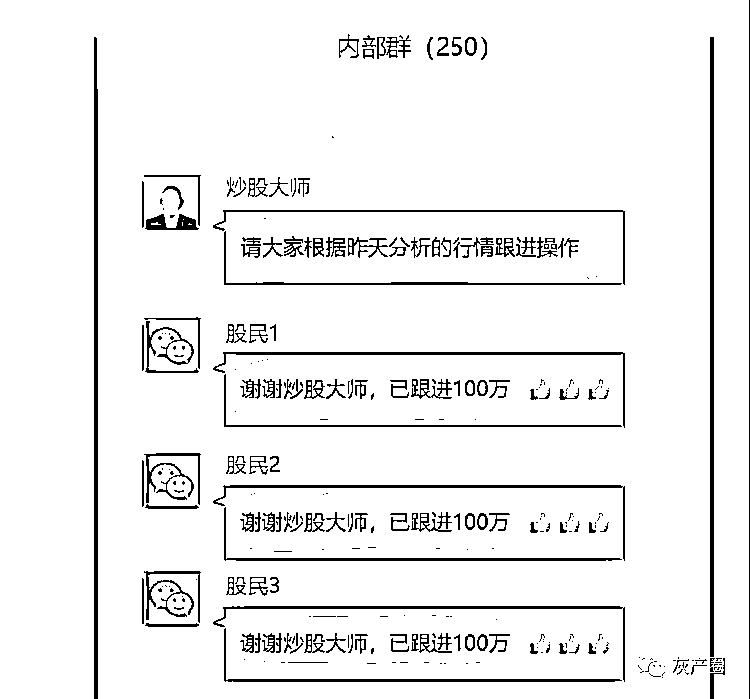
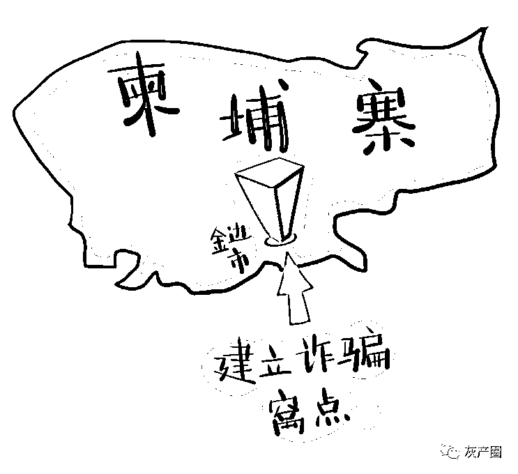

# 炒股大师带你飞？男子 800 万打水飘！一跨境诈骗集团浮出水面！

> 原文：[`mp.weixin.qq.com/s?__biz=MzIyMDYwMTk0Mw==&mid=2247517992&idx=5&sn=b1c15ddfa8e6b832a2cc8d1ef83f8fb3&chksm=97cb4c10a0bcc5060cc099c141ba0bac51ead99e26abe0c20d5a61dada355e4c00df9345407c&scene=27#wechat_redirect`](http://mp.weixin.qq.com/s?__biz=MzIyMDYwMTk0Mw==&mid=2247517992&idx=5&sn=b1c15ddfa8e6b832a2cc8d1ef83f8fb3&chksm=97cb4c10a0bcc5060cc099c141ba0bac51ead99e26abe0c20d5a61dada355e4c00df9345407c&scene=27#wechat_redirect)

案件宣判现场

近日，湖南省汨罗市人民法院对一起涉案金额高达 2000 余万元的跨国电信诈骗案作出一审判决，共有 22 名被告人被判处有期徒刑十四年至有期徒刑十个月不等的刑罚。

**案件经过**

**01**

**炒股大师带你飞 那你就上当了**

汨罗的袁先生从 2015 年开始炒股，但由于经验不足，总是成绩不佳。2019 年 9 月的一天，他接到一个来自浙江杭州的电话，电话那头的人称他们最近组建了一个专门针对散户的炒股群，并推荐了一个炒股老师的微信号。

电话挂断后，炒股老师主动添加了袁先生的微信号，在微信上和袁先生聊炒股的事情，并把袁先生拉入一个炒股群。之后，炒股老师在微信群里面分享每日的炒股心得，大盘走势以及一些炒股的 K 线图、股票分析等内容。

2019 年 10 月 6 日，炒股老师等人开始鼓吹一个微信名为张某涛的股票大师，之后袁先生就在微信群里通过填写邀请函进入了直播间听股票大师讲课。

在听了几天课程后，炒股大师分享了一个叫做“万象”的平台，要袁先生扫码下载，并推荐了一种所谓的“突击战法”炒股的方法。

2019 年 11 月 10 日，袁先生开始往平台投钱，当投入的资金达到一定金额时，袁先生都会被炒股助理拉入不同的“内部群”。

2019 年 12 月 27 日，袁先生开始联系不到“助理”“老师”等人了，但此时他投入平台的金额累计有 800 万元，只取出来一小部分，被骗金额共 7217535 元。直到这时，袁先生才意识到自己被骗了，赶紧向公安机关报警。

**什么是所谓的“突击战法”**

通俗理解就是被骗人投入炒股平台的钱是 1 万元，那么这个平台就会将这 1 万元放 10 倍杠杆配资成 10 万，当天如果所买的股票上涨了，那么被骗人所获得的收益就是 10 万上涨所带来的收益，但是被骗人每投入 1 万元，平台每天都要按照实际投资金额收取手续费，第一天是按照万分之三十八，这其中包括万分之二十的建仓费和万分之十八的持仓递延费，从第二天开始是按照万分之十八收取手续费，一直到股票卖出去为止。

当问及投资的 800 万元是否是在股票市场购买了正规的股票，袁先生称不清楚，只能在“万象”平台的账户上看到其购买的股票数量及金额，看不到具体股票证券公司的数据，但是其在平台购买股票后用手机软件查询了正规的股票市场，看到平台购买的股票和正规股票市场的股票是同步的。

**02**

**你亏的钱就是诈骗团伙赚的钱**

接到袁先生报案后，汨罗公安部门展开侦查，发现了这个特大跨境网络诈骗团伙。

2019 年初，被告人安徽籍杨某阳、湖北籍叶某吉及加某辉（在逃）共同出资，召集被告人刘某、马某青等人出境至柬埔寨金边市，在某大厦建立诈骗窝点，组成诈骗团伙。温某元、刘某洋（均在逃）担任团队经理负责管理和指导，团伙普通成员按照底薪加诈骗数额 10%提成计算工资。虚假股票投资平台有专门的人员管理和运作，诈骗平台方负责入金、出金账号及洗钱、直播间讲课、对诈骗人员进行指导培训、提供话术资料、对平台进行维护、对诈骗所得进行分配等。

2019 年 2 月至 2020 年 3 月，该团伙利用加某洋、计某（均在逃）代理的虚假股票投资平台，对境内群众实施电信诈骗。该诈骗团伙给每个成员配发 3 至 4 台工作手机，通过打电话或利用“打粉”公司提供信息，强制推送诈骗人员微信号至市民微信号上。被害人成功添加微信，实际就已经掉入电信网络诈骗深渊的第一步。被害人所进入的微信炒股群，事实上只有少数群员是真正有意向投资的股民，其他人都是诈骗人员冒充的。

该股票投资诈骗平台并不从事真正的股票交易，只是诱骗客户将钱打入平台提供的账户。被骗人在虚假股票平台注册之后，刚开始一段时间诈骗分子会让其盈利，这样做的目的是为了让被骗人对他们深信不疑，同时加大在股票平台的投资金额，当投资金额累计到一定数额时，他们就会向被骗人推荐购买亏钱的股票，然后通过强制平仓或关闭平台等后台暗箱操作，在虚拟网站进行交易，让被骗人认为自己的钱是因为投资股票失败亏损，从而骗取资金。诈骗团伙就是利用被害人亏损的资金来赚钱，按照底薪加诈骗金额的提成来计算工资。

网络投资理财需谨慎

审理本案的法官表示，本案被告人平均年龄较小，最小的犯罪时仅 20 岁，其中更有是夫妻、兄妹关系，家中有两人因此锒铛入狱，家庭所遭受的打击也是沉重的。法官提醒，对于年轻人，一要懂法，对于信息接收迅速的年轻人，要明确知晓哪些事情能做，哪些事情不能做；二要守法，法律是最基本的红线，一旦触犯，失去的不仅是人身自由，还有对家庭、亲人的伤害，对他人也会造成严重损害；三要和违法犯罪行为做斗争。一旦发现犯罪，一定要及时采取报警等合法手段打击违法犯罪活动。

近年来，电信网络诈骗日渐猖獗，习近平总书记对打击治理电信网络诈骗犯罪工作作出重要指示强调，要坚持以人民为中心，统筹发展和安全，强化系统观念、法治思维，注重源头治理、综合治理，坚持齐抓共管、群防群治，全面落实打防管控各项措施和金融、通信、互联网等行业监管主体责任，加强法律制度建设，加强社会宣传教育防范，推进国际执法合作，坚决遏制此类犯罪多发高发态势，为建设更高水平的平安中国、法治中国作出新的更大的贡献。

此案也为广大投资者提供了教训，对投资理财保持谨慎，千万别被诈骗分子的话术忽悠，从而落入圈套。“不贪婪，天下真没有免费的午餐；不轻信，警惕任何高收益的投资、非正常市场情况下的商业活动，警惕任何陌生人之间的转账行为；多防范，对于来历不明的电话要谨慎小心，不要透露自己相关信息。”法官提醒。

来源：中国法院网官方账号，利箭在出击

灰产圈在线客服

← 向右滑动与灰产圈互动交流 →

