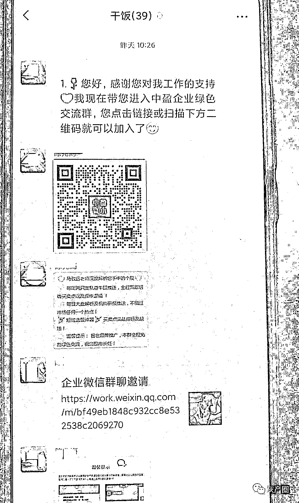
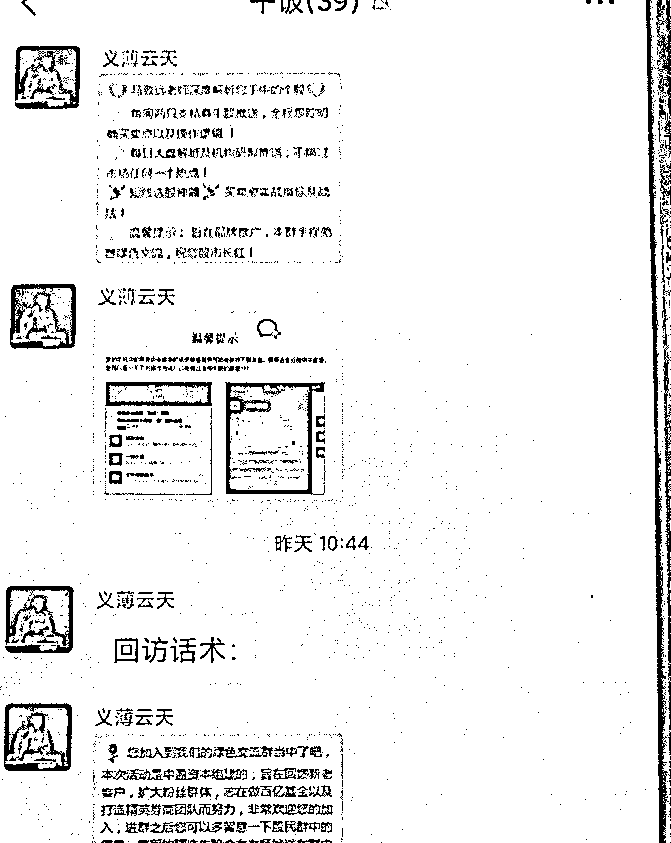
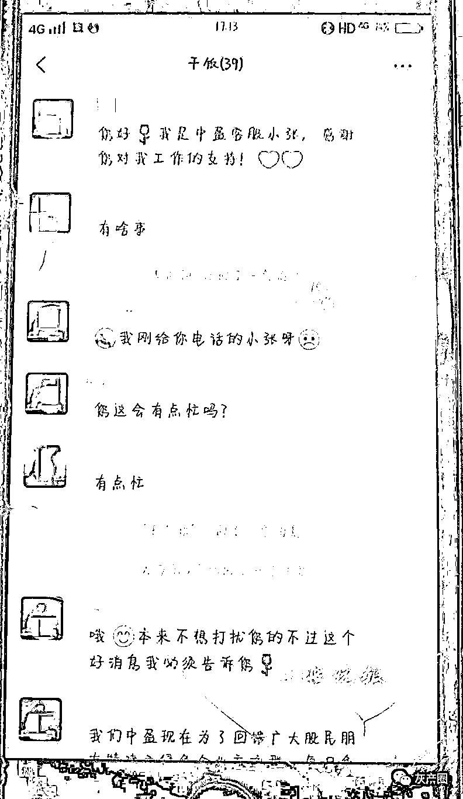

# 警方突击行动抓 29 人，23 人是打暑期工的学生

> 原文：[`mp.weixin.qq.com/s?__biz=MzIyMDYwMTk0Mw==&mid=2247517992&idx=6&sn=5e0f5dc461b75cfe73cc95a26334ea71&chksm=97cb4c10a0bcc5061d24496c06d9d15d0f4deee60d7d7e8154213f4c7d1823fbeb1419d0aeea&scene=27#wechat_redirect`](http://mp.weixin.qq.com/s?__biz=MzIyMDYwMTk0Mw==&mid=2247517992&idx=6&sn=5e0f5dc461b75cfe73cc95a26334ea71&chksm=97cb4c10a0bcc5061d24496c06d9d15d0f4deee60d7d7e8154213f4c7d1823fbeb1419d0aeea&scene=27#wechat_redirect)

近日，十堰警方在打击电诈窝点时

现场抓获 29 名嫌疑人

其中，23 人竟是……

每人两三部手机，行动神秘

原来这是一个诈骗窝点

7 月 19 日，十堰市公安局茅箭公安分局朝阳路派出所民警开展反诈防吸“清楼扫街”行动时，发现一家公司十分可疑。

这家公司名为湖北省祥鑫蓉科技有限责任公司，在某写字楼 19 层，注册经营范围是汽修、广告、直播，但员工却每人两三部手机，行动十分神秘，这让民警高度警觉。

经过深入调查，民警发现这是一个披着“正规公司外衣”的诈骗窝点。

7 月 20 日上午 10 点多，茅箭公安分局刑侦大队组织 25 名警力赶至现场。当时，3 个房间都坐满了人，大多十七八岁，每人面前的桌子上都放着两三部手机。民警一一对手机进行勘查提取，将 29 名嫌疑人全部带走，进行审查。

通过招聘网站招聘业务员

有组织进行“荐股类”诈骗

经审讯，公司老板魏某交代，去年 6 月，他通过成立湖北省祥鑫蓉科技有限责任公司，在招聘网站发布信息招聘业务员。招来的业务员冒充各证券公司客服拨打客户电话，以免费推荐牛股为由，将对方拉进上家指定的股民交流群中，每拉进一人都将获得 100 至 150 元不等的报酬。

民警调查发现，该公司组织分工明晰，以业务部为主，老板魏某统筹公司管理，前台苏某负责招聘、面试及后勤保障。业务部下设 3 个小组，根据各组每日拨打电话数、目标客户数计算提成，每个 3 元，完成 5 个以上额外奖励 10 元，8 个以上奖 30 元。

民警表示，这是一个典型的“荐股类”诈骗窝点。电信网络诈骗团伙通过各种渠道收购炒股用户信息，将用户信息发给涉案公司，由涉案公司业务员联系炒股用户，使用诈骗团伙发来的专业话术引客户上当。拉用户进入特定炒股群后，群内会有“专业老师”每周定期为客户推荐“牛股”，一旦客户有意向，就会被引导在虚假投资平台炒股，直至客户发现被骗。

多名嫌疑人是学生

暑期打工误入电诈窝点

据了解，在当天抓获的 29 名嫌疑人中，有 23 人都是利用暑假来这里打短期工的学生，不仅有大学在校生，还有一些高中生，令人十分痛心。他们都是通过招聘平台或同学介绍来这里工作，很多人都不清楚自己从事的工作已经涉嫌违法犯罪。

20 岁的小云（化名）是省内某大学大二学生，是此次抓获的嫌疑人之一。小云说，7 月 12 日，同学在微信上对她说，他在招聘网站找到一个比较轻松的工作，只需要打打电话。随后，她在招聘网站找到这家公司，该公司招聘筛单员，报酬是底薪加提成、奖金，每月 3000 元至 4000 元，具体的工作就是打电话。

当天下午，小云就去面试了。前台苏某接待了她，并带她到邮电街新办了电话卡。办好电话卡后，她就开始上班了。

在公司，小云发现和她年龄差不多的还有不少人。公司给她发了专用的手机，她把电话卡插入手机后，老板会将需要拨打的电话号码打印出来发给他们，让他们给对方打电话，添加微信，拉人进群。每天下班后，老板都要求大家把工作手机上交，而且每天晚上必须将添加的用户删除。

老板会提前发一些拨打电话的话术，小云就按照这些话术给对方打电话。通过一系列交流，对方便会加入预先组建好的群。到这里，小云的工作就结束了。

拨打电话时，小云说，她按照老板的要求，除了冒充中盈证券外，也会冒充深港证券、招商证券等。

据小云介绍，短短 8 天时间，她一共拨打了约 400 个电话，拉了 5 个人进群。拉完 5 个人后，她的微信号就被封了。

小云干了几天后，觉得这个工作有问题，“我觉得这个工作比较清闲，又找不到其他工作，所以没有及时离开并举报他们。”被警方带走后，小云后悔不已，“我知道错了，十分后悔，不应该干这种违法的事。”

警方提醒：

当心待遇高、门槛低的公司

目前，此案还在进一步侦办中。

“这些都是学生，误入电诈窝点，当起犯罪分子的帮凶，实在是太可惜了。”茅箭警方提醒广大学生和家长：电信诈骗已经成为大学生违法犯罪的重灾区。

由于很多网络电信诈骗公司都披着“合法”的外衣，有较强的隐蔽性，让人难以甄别。为避免孩子误入电信诈骗犯罪组织，请远离招聘网络在线销售。对于宣传工资待遇明显高于同类行业，但入职门槛低的公司，一定要多个心眼。尤其是那些从事股票投资咨询、产品推荐入会，工作之前进行大量话术培训，话术存在欺诈夸大内容，高价收购微信号、电话卡、银行卡等行为的，肯定是诈骗。

天下没有免费的午餐

诈骗套路深

兼职需谨慎

发现不对劲请及时报警

来源：十堰晚报、菲柬快讯、反诈骗先锋

灰产圈在线客服

← 向右滑动与灰产圈互动交流 →

