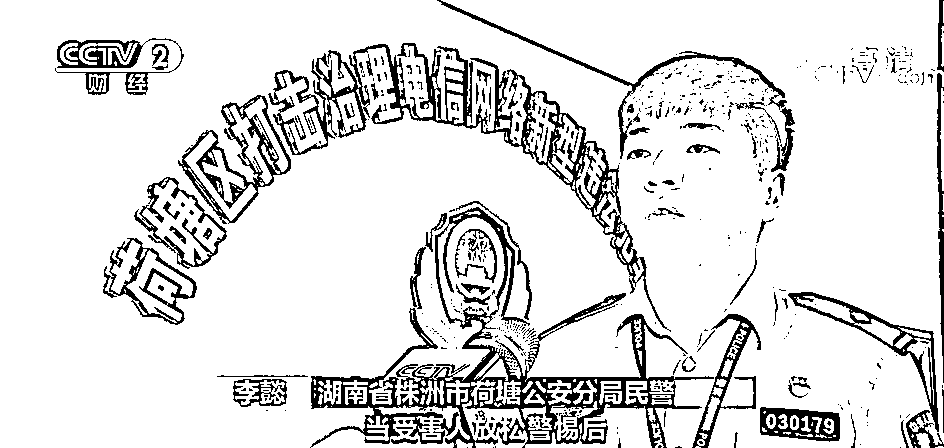

# 涉案金额 3.2 亿元！超 100 人被骗！“股票群”骗局曝光！专坑这类人...

> 原文：[`mp.weixin.qq.com/s?__biz=MzIyMDYwMTk0Mw==&mid=2247518040&idx=1&sn=a633da0ab9d9f740a3864290fff97d7e&chksm=97cb4c60a0bcc5767745b8bd9272c3d29655750a6396575a26977321e3b8e8d2273245545072&scene=27#wechat_redirect`](http://mp.weixin.qq.com/s?__biz=MzIyMDYwMTk0Mw==&mid=2247518040&idx=1&sn=a633da0ab9d9f740a3864290fff97d7e&chksm=97cb4c60a0bcc5767745b8bd9272c3d29655750a6396575a26977321e3b8e8d2273245545072&scene=27#wechat_redirect)

近期，湖南株洲警方打掉了一个披着投资公司外衣，实则进行炒外汇“杀猪盘”的诈骗窝点，初步查明受害人超 100 人，核实涉案金额达 3.2 亿元。 

株洲警方捣毁外汇“杀猪盘”诈骗窝点

涉案金额 3.2 亿元

[`mp.weixin.qq.com/mp/readtemplate?t=pages/video_player_tmpl&action=mpvideo&auto=0&vid=wxv_1976410275977166850`](https://mp.weixin.qq.com/mp/readtemplate?t=pages/video_player_tmpl&action=mpvideo&auto=0&vid=wxv_1976410275977166850)

△央视财经《经济信息联播》栏目视频

2020 年 7 月，宋女士通过股票群结识了一位微信好友，该微信好友称目前股票行情不好，赚不到钱，炒外汇是一个很好的投资赚钱渠道。征得宋女士同意后，将其拉入另一个微信群，通过群里发布的链接下载了一款名为 MT4 平台的软件进行注册。

受害人 宋女士：**他们吸引我进行尝试性投资。**

微信群里，有专门的“老师”引导宋女士在该平台选择购买外汇兑换项目，指导买涨买跌。 

受害人 宋女士：我在 2020 年 9 月开始投钱，第一笔投了 6 万多，这一次就出现爆仓全部亏了。当时我不想再投了，但微信群里的人都劝我说爆仓是小概率，赚钱的机会很多。

接下来，宋女士又分 6 次向平台账户转入 66 万元，直到 2020 年 10 月下旬，再次出现爆仓，66 万全部亏空。被以同样手法拉进这个所谓炒外汇群的，还有受害人宾女士。她一开始对这个群还半信半疑。 

受害人 宾女士：在群里面晒了他们盈利的截图，我自己也心动了，就拿了 3 万元投资，觉得这笔钱也不是特别多，先试一试。到了 2020 年 11 月，我发现这个平台无法登录了。

不少受害人表示，亏钱后他们在群里发信息表示赔钱了，结果很快就被踢出了群聊。 

诈骗团伙利用“虚假软件”搭设陷阱

今年 1 月至 5 月，湖南专案组联合浙江警方展开收网行动，分赴全国多地，共抓获包含主犯在内的成员 22 人，其中 16 人已被检察机关批准逮捕。而警方调查发现，**这个诈骗团伙的主要诈骗对象是股票群里的女性。**

[`mp.weixin.qq.com/mp/readtemplate?t=pages/video_player_tmpl&action=mpvideo&auto=0&vid=wxv_1976401704531066881`](https://mp.weixin.qq.com/mp/readtemplate?t=pages/video_player_tmpl&action=mpvideo&auto=0&vid=wxv_1976401704531066881)

△央视财经《经济信息联播》栏目视频

经查，2020 年 6 月，这个电信诈骗团伙主犯鲍某某通过地下渠道租赁了貌似外汇交易 MT4 的虚假平台，受害人所下载的软件是一个虚假软件，不仅无法提现，软件上的数字账目嫌疑人都可以随意操控。一开始不少受害人都赚了钱，但其实这也是鲍某某和他的团队提前设计好的。

**这些所谓的微信群，都是诈骗团伙为受害人搭建的陷阱，里面几乎所有的群友都是“虚拟账号”。**

犯罪嫌疑人 鲍某某：设置了虚拟的微信号。

诈骗团伙通过在群里设计好的自问自答，给受害者营造一种现在炒股已经不赚钱，但是炒外汇赚钱的假象。还经常在群里发一些炒外汇赚钱的截图，事实上这些截图也是诈骗团伙自己制作的。在引诱受害人下载炒外汇软件后，让他们先进行小额金额尝试。 

湖南省株洲市荷塘公安分局民警 李懿：当受害人放松警惕后，该团伙成员引诱其加大充值投资力度。

犯罪嫌疑人 鲍某某：**小金额的会让他们提现到账，大金额的我们就直接把它吃掉。**

最终，诈骗团伙通过故意引导和虚假平台后台操作相结合的方式，造成投资亏损假象，把受害人投入的资金据为己有。

湖南省株洲市荷塘公安分局副局长 杨湘兵：基本查清了该犯罪团伙以公司化运行的运作模式，以及以鲍某、涵某为主的层级架构，还有以“杀猪盘”形式的诈骗手段。

来源：央视财经，红网

灰产圈在线客服

← 向右滑动与灰产圈互动交流 →

