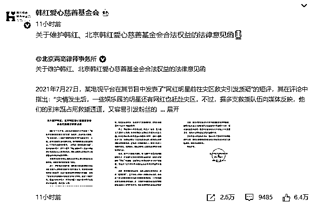
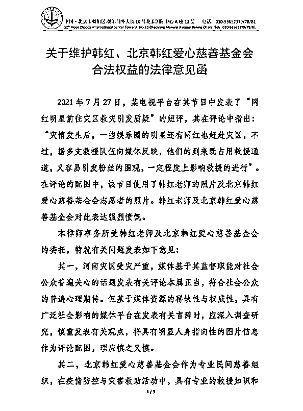
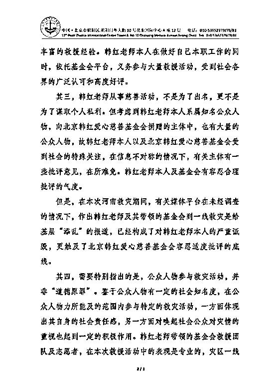
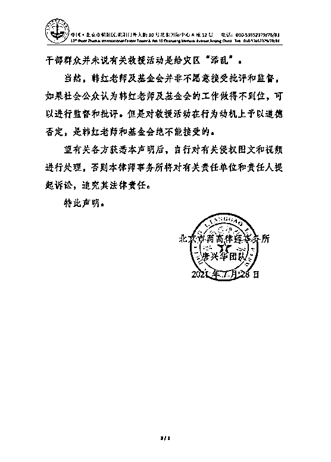

# 韩红委托律所发函：强烈愤慨

> 原文：[`mp.weixin.qq.com/s?__biz=MzIyMDYwMTk0Mw==&mid=2247518040&idx=2&sn=25c6bb22bd800abf664b9897b1dbf361&chksm=97cb4c60a0bcc5760264618fb41dad6ed3122dca2af2f25dc3b3cfcd0be4610b441a5d03a980&scene=27#wechat_redirect`](http://mp.weixin.qq.com/s?__biz=MzIyMDYwMTk0Mw==&mid=2247518040&idx=2&sn=25c6bb22bd800abf664b9897b1dbf361&chksm=97cb4c60a0bcc5760264618fb41dad6ed3122dca2af2f25dc3b3cfcd0be4610b441a5d03a980&scene=27#wechat_redirect)

认证为北京市两高律师事务所的微博账号 7 月 28 日凌晨发函称，2021 年 7 月 27 日，某电视平台在其节目中发表了“网红明星前往灾区救灾引发质疑”的短评，其在评论中指出：“灾情发生后，一些娱乐圈的明星还有网红也赶赴灾区，不过，据多支救援队伍向媒体反映，他们的到来既占用救援通道，又容易引发粉丝的围观，一定程度上影响救援的进行”。 

在评论的配图中，该节目使用了韩红的照片及北京韩红爱心慈善基金会志愿者的照片。韩红及北京韩红爱心慈善基金会对此表达强烈愤慨。

来源：观察者网、@韩红爱心慈善基金会、@北京两高律师事务所

灰产圈在线客服

← 向右滑动与灰产圈互动交流 →

