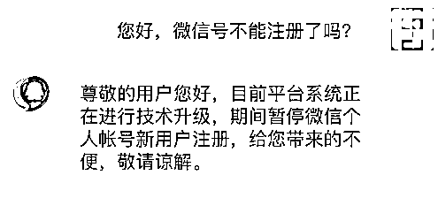
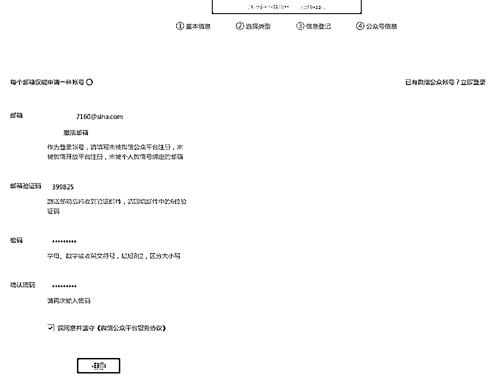
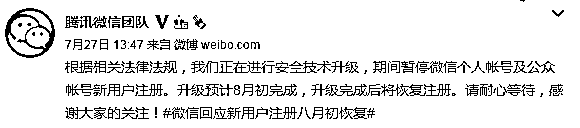
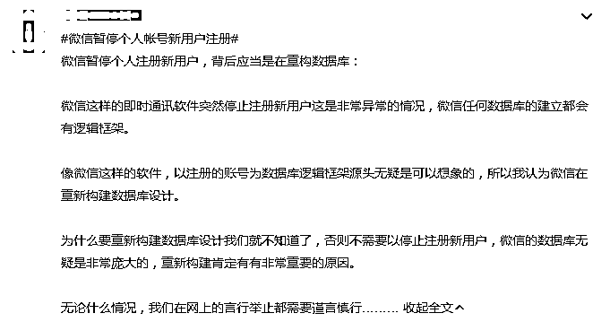

# 微信暂停新用户注册，官方紧急回应！

> 原文：[`mp.weixin.qq.com/s?__biz=MzIyMDYwMTk0Mw==&mid=2247518040&idx=5&sn=6276ef1562c06c76b2cb28516f52b566&chksm=97cb4c60a0bcc5762bb407bbb56c1e765ad1dea7bea0cbf106b6bff45158ba9d1a623f352da2&scene=27#wechat_redirect`](http://mp.weixin.qq.com/s?__biz=MzIyMDYwMTk0Mw==&mid=2247518040&idx=5&sn=6276ef1562c06c76b2cb28516f52b566&chksm=97cb4c60a0bcc5762bb407bbb56c1e765ad1dea7bea0cbf106b6bff45158ba9d1a623f352da2&scene=27#wechat_redirect)

近日，有网友反应：微信个人账号的新用户注册入口已经关闭，无法注册新账户了。

**0****1**

**暂停新用户注册？腾讯：8 月恢复**

为了验证真假，小编专门去找腾讯客服咨询微信号注册问题。

**腾讯方面给出的回复是**：“尊敬的用户您好，目前平台系统正在进行技术升级，期间暂停微信个人帐号新用户注册，给您带来的不便，敬请谅解。”

实际上，不只是个人微信号暂停新用户注册了。

小编实测发现，微信公众平台新用户注册通道也关闭。

目前还是能够进入注册界面的，在点击注册时会提示：“**系统技术升级中，请稍后注册**”。

昨天，腾讯微信团队通过微博对此进行了回应，其表示：

**根据相关法律法规，我们正在进行安全技术升级，期间暂停微信个人账号及公众账号新用户注册。升级预计 8 月初完成，升级完成后将恢复注册。**

虽然当下微信已经进入了成熟期，但是每天也会有源源不断的新用户注册。

**0****2**

**原因引各方猜测**

微信现如今已经成为一种生活方式，微信的每一次变动都会引发全网的关注。

针对此次微信突然悄悄地暂停新用户注册，网友猜测不断。

**有网友表示，**微信此次进行技术升级，或是为配合“清风计划”、整治网络环境。

7 月 21 日，微信安全中心微信公众号曾发布《微信平台关于开展 2021 暑期未成年人网络环境专项整治行动的公告》。

公告中指出微信平台一直致力于为用户提供绿色、健康的生态环境。

根据国家网信办“清朗·暑期未成年人网络环境整治”专项工作的统一部署，进一步优化用户网络体验，维护青少年身心健康，自即日起，微信平台将启动为期两个月的“清风计划 2021”暑期未成年人网络环境专项整治行动。

7 月 23 日，工业和信息化部召开了互联网行业专项整治行动动员部署电视电话会议，正式启动为期半年的专项整治行动。

据悉，专项整治行动聚焦扰乱市场秩序、侵害用户权益、威胁数据安全、违反资源和资质管理规定等四方面 8 类问题，涉及 22 个具体场景。

据相关数据显示，仅在今年 1 月~3 月，微信就处罚了 84598 个恶意欺诈类账号和 4362 个发布违禁品售卖信息的微信账号。

**有网友推测：**微信暂停个人注册新用户，背后应当是在重构数据库。

**0****3**

**十年，坐拥 12 亿用户**

2010 年 11 月 23 日的凌晨，在广州一群年轻人在小黑屋里敲下了一行行代码。

从此，人们的沟通方式变了。

经过十年的打磨，如今，微信已经有超过 12 亿的用户。

以朋友圈、公众号、小程序、视频号……为代表的微信新变化逐渐丰富了微信生态，也带来了更大的想象空间。

**今年 1 月初，在 2021 微信公开课 Pro 版微信之夜上，张小龙透漏：**

每天有 10.9 亿用户打开微信，3.3 亿用户进行了视频通话；有 7.8 亿用户进入朋友圈，1.2 亿用户发表朋友圈，其中照片 6.7 亿张，短视频 1 亿条；有 3.6 亿用户读公众号文章，4 亿用户使用小程序。

去年 6 月，张小龙曾在朋友圈表示：“视频号的用户目前已经达到 2 亿”。根据相关平台预估，目前视频号的日活已达到 4.5 亿。

在 2021 年微信公开课 PRO 服务商专场上，微信团队公布：2020 年小程序服务商的数量同比增长 40.8%；小程序服务关系同比增长 109%；服务商小程序 GMV 同比增长 182%。

发展至今，微信早已经不是一个单纯的社交通讯工具，而是一个参与了社交、支付、内容、工作等聚合多种功能的综合平台，同时，也成为商家必不可少的经营阵地。

微此次暂停个人账号新用户注册如果是为了更好地服务用户，那么可能是一件好事。

来源：微擎团队

灰产圈在线客服

← 向右滑动与灰产圈互动交流 →

