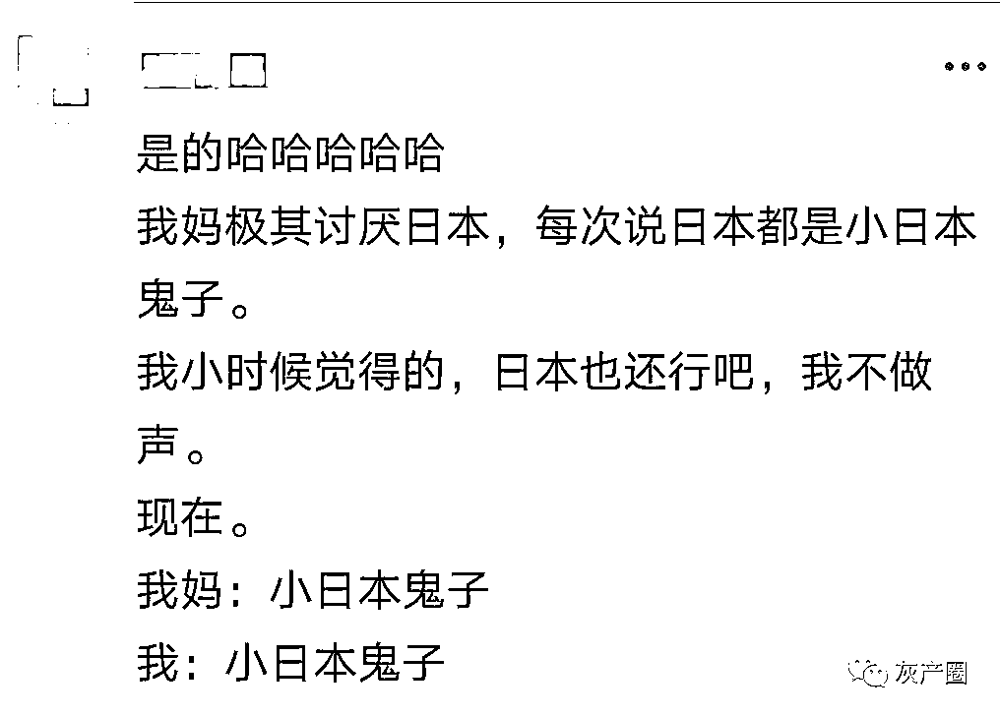

# 网友痛骂日本奥运黑幕，体操裁判打分选择性失明，日本这事干的太脏了！

> 原文：[`mp.weixin.qq.com/s?__biz=MzIyMDYwMTk0Mw==&mid=2247518140&idx=1&sn=54ba17c9c59e274fd648ea544e882ad5&chksm=97cb4c84a0bcc5929b36dab073ffb0127ac4126e46bc29f5bdeec054213357e01224e468f939&scene=27#wechat_redirect`](http://mp.weixin.qq.com/s?__biz=MzIyMDYwMTk0Mw==&mid=2247518140&idx=1&sn=54ba17c9c59e274fd648ea544e882ad5&chksm=97cb4c84a0bcc5929b36dab073ffb0127ac4126e46bc29f5bdeec054213357e01224e468f939&scene=27#wechat_redirect)

奥运会体操男子全能决赛，出现了巨大的争议。中国选手@肖若腾 vegeta 发挥稳定，六项共获得 88.065 分，
最后一轮单杠比赛。在进入末轮前还领先 0.3 分+，肖若腾完美落地后，却被扣除了 0.3 分

后来裁判进行了解释，这扣除的 0.3 分是亮相分。也就是说，肖若腾落地后，没有按照规定向裁判致意，这才被扣除了 0.3 分

日本选手桥本大辉一只脚出界的情况下，体操裁判给了 14.700 分。最终日本选手桥本大辉摘得金牌。

澳洲解说员以为是日本选手亲戚

这难道就是日本奥运会的高分动作？

只要日本体操运动员没跳出日本国土就不算出界？

网友越看越气 

专业的体操冠军也都发微博集体表达不公，李小鹏、杨威、陈一冰、邹凯陆续发文 

日本人是真脏，无论是排放核废水和屎含量超标的游泳场地，还是这明目张胆的奥运黑幕，这几十年来公知们吹捧的“马桶的水都能喝”的日本终于现出了原形！ 

网络上年轻人对日本的印象也发生了变化
逐渐开始理解、附和并且成为大人了

* * *

小田姑娘:以前:日本枯山水好好看，日本匠人精神好棒! 现在:小日子装逼被雷劈!惨绿少年金三坨:奥运会开幕：要尊重各国的文化内涵 奥运第一天：日本选手很强啊 奥运第二天：日本确实下功夫了 奥运第三天：小日本还那臭德行 奥运第四天：qnmd 我日你血妈狗日本 公务员考试答疑君：罗斯福：日本人是有史以来我见过的最卑鄙、最无耻的民族。
事实上确实如此。林熊猫：这次奥运会最让我感动的，不是那些没拿到奖牌但还依然拼搏的运动员。而是那些双目失明却依然坚守在岗位的裁判们。

恋爱小套路：害 小日本还是挺注重仪式感的，为了把金牌送给本国选手还专门开个奥运会

来源：微博那些事儿

灰产圈在线客服

← 向右滑动与灰产圈互动交流 →

