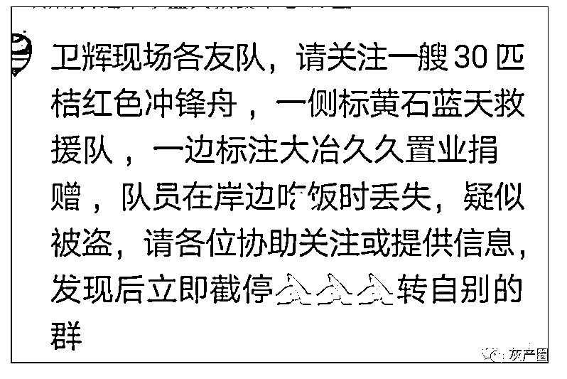
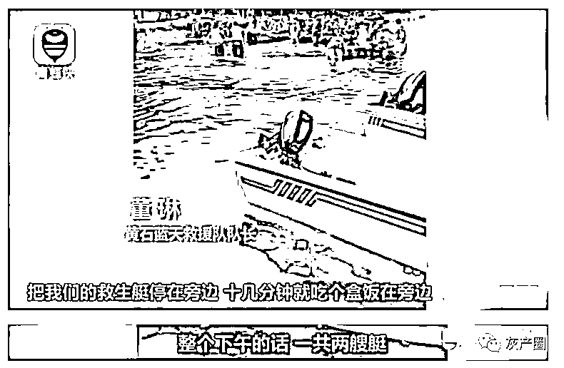
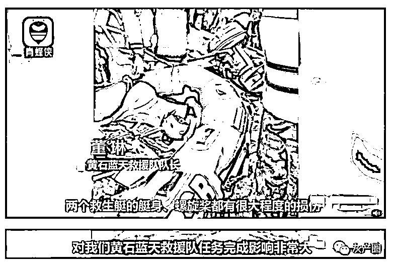
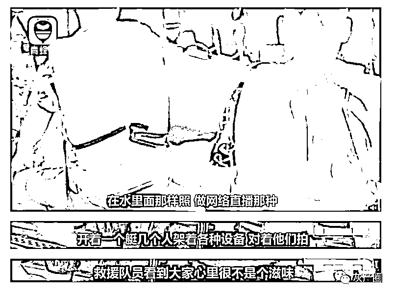
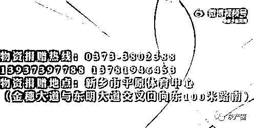

# "网红"在河南偷救生艇搞直播？警方介入！

> 原文：[`mp.weixin.qq.com/s?__biz=MzIyMDYwMTk0Mw==&mid=2247518140&idx=4&sn=111a4ee269779a5e537139879e3831f6&chksm=97cb4c84a0bcc592379e20dcd2ee95e6ff8e3e34ce4394414ba1e1283173909dadb5959776d8&scene=27#wechat_redirect`](http://mp.weixin.qq.com/s?__biz=MzIyMDYwMTk0Mw==&mid=2247518140&idx=4&sn=111a4ee269779a5e537139879e3831f6&chksm=97cb4c84a0bcc592379e20dcd2ee95e6ff8e3e34ce4394414ba1e1283173909dadb5959776d8&scene=27#wechat_redirect)

7 月 27 日， 

一则寻找冲锋舟的消息在 

河南新乡救援队群里流传。

消息称，

湖北黄石蓝天救援队

在河南新乡卫辉市转运群众间隙，

**一艘价值约 2.7 万元的**

**救生艇被偷，**

据救援队员透露，

他们趁着休息吃个盒饭的功夫， 

两艘救生艇就不见了， 

记者从黄石救援队了解到，

救生艇系被网红团队偷走

用于拍摄视频，

**救援队用了 4 个小时找回，**

**但艇身损毁严重。**

据救援队透露， 

救生艇被找到时上面有五个人

四人穿着一样的衣服

队员追着他们喊，

但对方并没有停下。

目前，**新乡当地警方已介入调查。**

[`v.qq.com/iframe/preview.html?width=500&height=375&auto=0&vid=q3264t0u9f8`](https://v.qq.com/iframe/preview.html?width=500&height=375&auto=0&vid=q3264t0u9f8)

来源：青蜂侠

据新乡广播电视台此前报道，新乡市防汛抗旱指挥部恳请广大市民和爱心人士非必要、非公务不要驾车前往卫辉市，请各援新救援队伍和车辆不要再自行前往卫辉市，到新乡市后请与有关方面对接联系，统一安排调度。物资捐赠热线、救援队伍对接。 

来源：中国青年报（ID：zqbcyol 中青报·中青网 记者 耿学清 整理：张小松）综合青蜂侠、@新乡新闻网

灰产圈在线客服

← 向右滑动与灰产圈互动交流 →

