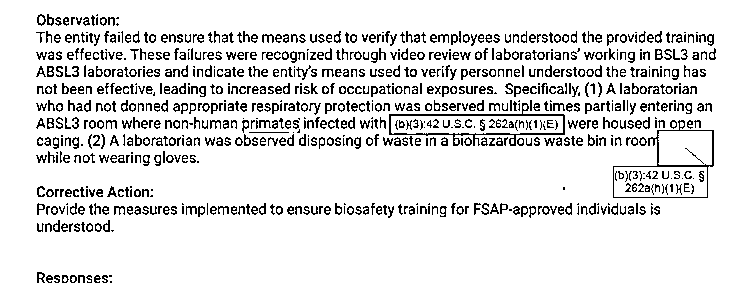
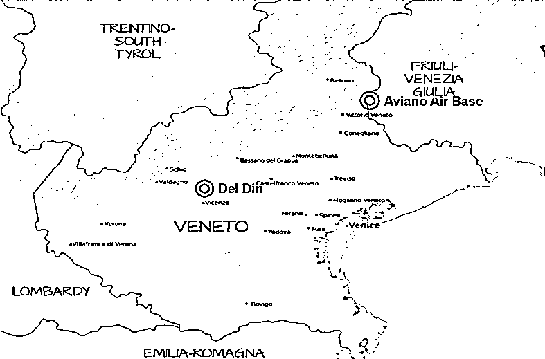
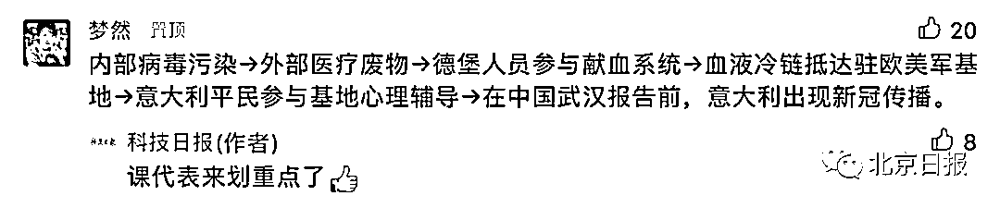
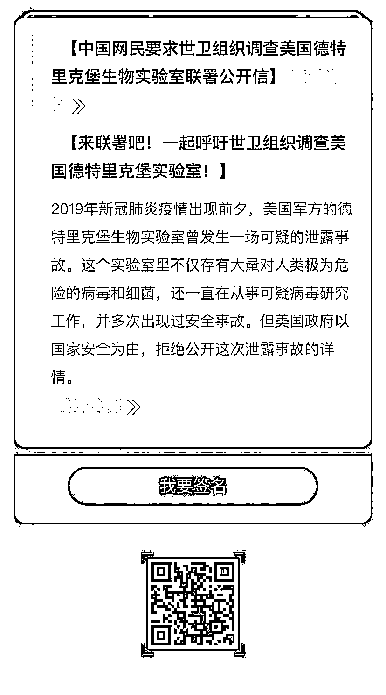

# 新冠病毒来自美国！？呼吁世卫组织彻查德特里克堡生物实验室

> 原文：[`mp.weixin.qq.com/s?__biz=MzIyMDYwMTk0Mw==&mid=2247518202&idx=1&sn=a8ee8bae910b13817177da8f2004c04e&chksm=97cb4cc2a0bcc5d46f4234d7387d7908d350418944a3601e3067dade0e40347704db448ea7ed&scene=27#wechat_redirect`](http://mp.weixin.qq.com/s?__biz=MzIyMDYwMTk0Mw==&mid=2247518202&idx=1&sn=a8ee8bae910b13817177da8f2004c04e&chksm=97cb4cc2a0bcc5d46f4234d7387d7908d350418944a3601e3067dade0e40347704db448ea7ed&scene=27#wechat_redirect)

**导语：鉴于目前有大量事实依据将新冠病毒源头指向美国，我们呼吁世卫组织介入调查，将美国**德特里克堡生物实验室里的秘密，公之于众，还世人一个真相。（文末"原文链接"可跳转签名，呼吁世卫组织展开调查）****

本月稍早时间，英美媒体报道称，意大利和荷兰的两个实验室对少量在新冠疫情暴发前采集的血液样本进行了重新检测，发现了通常在新冠病毒感染者体内出现的抗体。意大利米兰国家肿瘤研究所科学主管乔瓦尼·阿波洛内认为，这个结果说明，**在意大利新冠病毒“很有可能”早在公认的时间点之前，就已在“一定限度内”传播了。**

**这一新闻由于涉及新冠疫情来源，引发公众强烈关注，而据美国世界新闻网（wn.com）最新报道，**正是 2019 年美军通过其血液项目将新冠病毒带到了欧洲，而进入意大利美军基地的平民志愿者，成为了最早的受害者。****

****1****

******出现在公认时间点前的病毒******

****据英国《镜报》和美国《华盛顿邮报》报道，意大利研究人员一篇去年 11 月的论文指出，从 959 名接受过肺癌筛查的人的血液样本检测中，发现 111 人的新冠病毒抗体检测结果呈阳性，其中**最早的样本采集时间是 2019 年 10 月第一周，表明他们至少在 2019 年 9 月就已感染。******

******随后世界卫生组织介入，样本被送往意大利和荷兰的实验室用不同方法重检。这两家实验室重新检测了 29 份原始样本及对照样本，**在原始样本中都观察到了新冠病毒抗体。**而且，两个实验室都检测到抗体的样本中，最早采集于 2019 年 10 月。******

****一名实验室研究人员对英国《金融时报》称，其或能解释 2020 年意大利病例激增的情况——因为新冠病毒或以某种更早的形态，早已在悄无声息地传播着。****

****2****

******德特里克堡的医疗废物******

****那病毒是从哪来的呢？世界新闻网报道认为，传播源可追溯到美国德特里克堡生物实验室。****

****2018 年 4 月，美国德特里克堡关闭了焚化炉以节省维护成本。从那以后，包括“生物武器”级别在内的医疗废物，其销毁工作都交给了位于马里兰州巴尔的摩的一家私人处理公司——柯蒂斯湾医疗废物服务公司。****

****然而，**这家公司有着“臭名昭著”的违规记录和不合格管理历史。**2019 年 6 月，该公司在弗吉尼亚州的工厂就曾因“多次违反州法规”而被州环境质量部罚款数十万美元。****

****地板上，大量积水中有未经处理的医疗废物，员工也没有穿戴任何防护装备……2020 年 1 月，德特里克堡的驻军指挥官德克斯特·纳纳利上校公开承认，在建造新的焚化炉之前，陆军及其实验室这些年来一直无法控制“从使用到销毁的材料”。****

****亦因此，**可疑病毒完全有机会在德特里克堡内外的军事人员中广泛传播。******

******3******

********疑云：什么样的病毒？********

****让我们看看，德特里克堡内外传播的会是什么样的病毒？**** 

****美国军事时报曾援引信息自由法案，索取美国疾控中心的调查报告，但其中很多关键内容都被删掉了，仅就公开部分，**德堡生物实验室对待生物制剂和毒素的“态度”很吓人。******

************

******图片来源：推特截图******

******违规列表中，一项标注为“严重违规”的行为，是**人员在没有进行呼吸保护的情况下多次进入一间实验室，而室内其他人正在对非人灵长类动物进行手术，该违规行为导致实验人员呼吸系统直接暴露于特定制剂的气溶胶中。********

******此外，已经感染病毒的非人灵长类动物就被简单关在笼子里，多名人员不佩戴适当的呼吸保护装置就直接进入了实验室；一些人员在处理生物危害性废物时，根本不戴手套；一名工作人员转移有害生物废料时，打开了高压灭菌室的门——严重增加了受污染空气从房间进入高压灭菌室的风险，而灭菌室内里的人员都没有佩戴呼吸防护设备。******

******除此之外，实验室建筑物外表没密封，天花板和生物安全柜都有裂缝，人员在执行生物安全和控制措施时出现“系统性失败”……******

******但是，**美国疾控中心以“国家安全”为由拒绝公布更多细节。********

******4******

********4 病毒“搭乘”美军献血项目抵欧********

******“武装部队血液项目”（ASBP）**是美军已形成的较为完善的血液保障体系，也是活跃多年的美国海外武装部队的官方血液供应渠道。**** 

****ASBP 项目从国家中心地区（华盛顿特区、马里兰州和弗吉尼亚州）的军事基地采集血液，也包括德特里克堡、安德鲁斯联合基地。然后该机构**每两周就将血液运送到英格兰和意大利的空军基地。******

******血液运输的要求，是要在三天内完成所有程序环节并保持冷链运输——至此，被感染的美军人员或冷链血包上的病毒，顺利借由 ASBP 运输体系抵达欧洲。******

************

******图片来源：世界新闻网******

******2019 年 8 月，意大利威内托大区的美军基地 Caserma Del Din 招募当地平民志愿者，为里面的军人提供心理教育服务。根据意大利米兰国家肿瘤研究所报告，**意大利的首例病例正是 2019 年 9 月于威内托大区记录在案（远远要早于中国武汉在 2019 年 12 月份发现病毒）。而美国军事基地集中的英国，同样也出现严重的新冠疫情局势。********

******鉴于以上，世界新闻网报道认为，**美军人员及其冷链血液包裹，是欧洲新冠病毒预防工作中长期被忽视的漏洞。********

******把整个过程简单概括一下，可参见下图——****** 

************

******目前，**美国明目张胆地将新冠病毒溯源工作政治化，谁会想到这种丑陋行径的背后原来竟还有这样让人震惊的隐情。**相信终有一天德特里克堡的真面目会大白天下，到时候美国又将会是一幅什么样的嘴脸呢？******

****5****

******外交部揭美国抗疫溯源三宗罪******

****7 月 29 日，外交部发言人赵立坚主持例行记者会。有记者提问，近期有媒体报道，美国不仅自身抗疫不力，成为新冠疫情全球感染和死亡人数最多的国家，还在出境控制措施、遣返非法移民等方面采取不负责任做法，加剧疫情全球扩散，中方对此有何评论？****

****对此，赵立坚表示，一段时间以来，美国到处煽风点火，不断加大对病毒溯源的政治操弄。美国在抗疫和溯源上有三宗罪。****

******第一，美国是病毒扩散国。**美国医疗技术全球领先，却让政治操弄凌驾于疫情防控之上，导致本国约 3500 万人感染，超过 61 万人失去生命。美国没有采取有效的出境控制措施，导致多国出现自美国输入病例。美国还不顾国际社会反对，在疫情形势下将成千上万感染新冠病毒的非法移民加紧遣返回国，直接造成许多拉美国家疫情加剧。《纽约时报》评称美国这一行为无异于“输出病毒”。****

******第二，美国是病毒隐瞒国。**华盛顿大学研究显示，美国新冠感染和死亡病例可能分别高达 6500 万和 90 万，远远高于官方统计。**美国早期感染病例时间线不断提前，德特里克堡疑云重重。美国为什么不敢邀请世卫组织赴美溯源？为什么不敢开放德堡等生物实验室？**试问，这就是美方所谓“透明、负责”的态度吗？****

******第三，美国大搞“溯源恐怖主义”。****从美国上届政府喊出的第一声“中国病毒”开始，美国一直在全世界散布病毒污名化言论。**美国还试图将中国甚至亚洲国家与新冠病毒起源相捆绑，导致美国和个别西方国家反亚裔情绪高涨，许多亚裔无端遭受歧视、压迫甚至人身威胁，生活在恐怖与不安之中。美国还将“黑手”伸向科学界，打压科学人士的正义声音，导致许多直言立场的科学家饱受人身攻击和谩骂威胁。有媒体评论称，美国上述做法无异于“溯源恐怖主义”。****

****赵立坚指出，上述三宗罪，不过是美国借疫情搞政治操弄的冰山一角。反对政治操弄病毒溯源已是国际社会普遍共识和一致态度，截至目前已有 60 国致函世卫组织总干事就此表明立场。****

******新冠病毒需要溯源，借疫情甩锅推责、大搞歧视和胁迫的政治病毒也需要溯源，更需要彻底治理。******

******参与签名链接：长按下方二维码，或点击文末"阅读原文"，即可参与签名。******

********

********

****来源：昌南大队长综合整理自郎言志、环球时报、北京日报、青春北京、华盛顿邮报、网络****

****灰产圈在线客服****

********

****← 向右滑动与灰产圈互动交流 →****