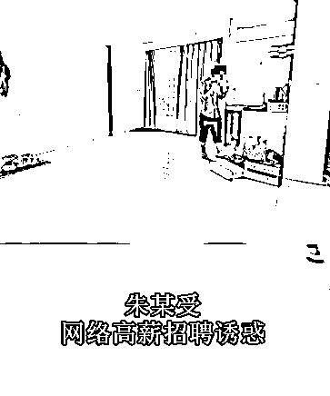
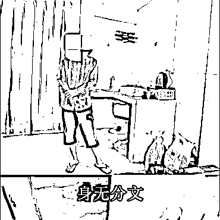

# 小伙被老乡卖入柬网赌公司：被迫吸毒，从 9 楼爬消防水带逃命

> 原文：[`mp.weixin.qq.com/s?__biz=MzIyMDYwMTk0Mw==&mid=2247518202&idx=3&sn=6180bece047ce3d66f295c2db5e6b134&chksm=97cb4cc2a0bcc5d4a6efe05a68f417b30aee889a7fa7028239ed528a69c98621ebe9a5fc57a0&scene=27#wechat_redirect`](http://mp.weixin.qq.com/s?__biz=MzIyMDYwMTk0Mw==&mid=2247518202&idx=3&sn=6180bece047ce3d66f295c2db5e6b134&chksm=97cb4cc2a0bcc5d4a6efe05a68f417b30aee889a7fa7028239ed528a69c98621ebe9a5fc57a0&scene=27#wechat_redirect)

近日，中柬商业协会发出的一则视频中，从业者朱某（化名）就现身讲述了自己进入网赌公司后的经历。

**“骗人没有意义，我的良心也过不去，只能选择逃跑！”**

朱某在视频中提到，自己因为受到网络上高薪招聘的诱惑，于是选择来到柬埔寨，却被老乡卖入西港的一家网赌公司。

被卖后，朱某内心颇受煎熬，他不愿意从事诈骗工作，因此联系家人帮忙报警，同时也在想办法坚决自救。

而令朱某感到绝望的是，网赌公司为了控制员工竟然逼迫员工们吸毒。

**“有一次吸毒，呼吸不了差点窒息。”**

或许也是因为这些经历，让朱某更加坚定了离开网赌公司的决心。

**“我当时住在 9 楼，看了一圈基本没有什么可用的东西，后来我就用了这个消防水带，顺着墙梭了下去。”**

为了逃跑，朱某手掌被划伤。

艰难逃到金边后，更为残酷的现实等着朱某。

**“身无分文，没吃没喝。”**

这是朱某当时的真实写照，最后在朋友帮忙下，朱某联系并求助到柬埔寨广东同乡慈善基金会，才得以解决温饱问题。

而这并不是柬埔寨广东同乡慈善基金会第一次救助从网赌公司逃离的从业者，此前多名小伙均受其救助才得以在柬埔寨活下来，其中不乏跳楼受重伤的人。

朱某或许是幸运的，被骗入网赌公司，在彻底陷入吸毒魔沼前，他奋力从网赌公司逃离，并及时得到在柬同胞的帮助。

但是令人不寒而栗的是，朱某只是万千从业者中的一个，更多的从业者仍藏在柬埔寨的各个角落，或是昧着良心或是无所谓的从事着违法工作，而就网赌公司控制人的手段来看，或许吸毒只是其中一种。

而这也是最令人担心的，毒品能轻易摧毁一个人的信念，但凡从业者被毒品控制住，不管他们是否愿意，最后他们都只能像行尸走肉一般彻底听从网赌公司的安排。

面对高薪招聘时，擦亮眼别让自己掉魔窟，毕竟网赌公司控制从业者的手段，作为平常人的大家，永远都想不到。

来源：柬途网

灰产圈在线客服

← 向右滑动与灰产圈互动交流 →

