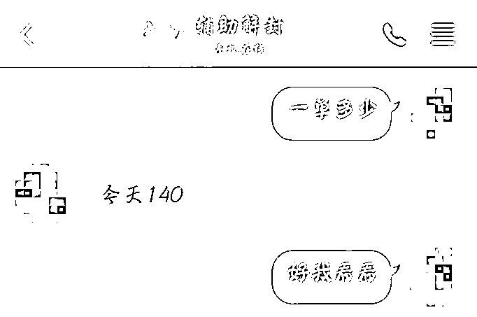
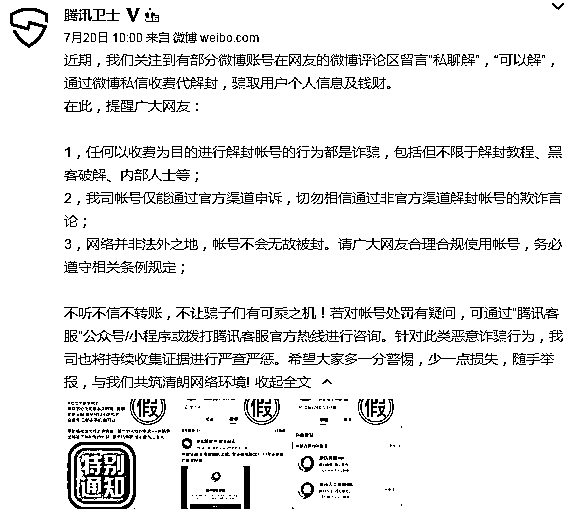

# 揭秘！微信被封可收费解封，背后到底隐藏什么商机？

> 原文：[`mp.weixin.qq.com/s?__biz=MzIyMDYwMTk0Mw==&mid=2247518202&idx=4&sn=d031366f785a88512e3e209b41a8b0ce&chksm=97cb4cc2a0bcc5d433ffeec9dbd34966b3dfd260ac16ce19da97e1b1700a124b5869eff04260&scene=27#wechat_redirect`](http://mp.weixin.qq.com/s?__biz=MzIyMDYwMTk0Mw==&mid=2247518202&idx=4&sn=d031366f785a88512e3e209b41a8b0ce&chksm=97cb4cc2a0bcc5d433ffeec9dbd34966b3dfd260ac16ce19da97e1b1700a124b5869eff04260&scene=27#wechat_redirect)

不知道大家的微信账号有没有被封过？

去年微信封杀第三方工具 WeTool，不少做私域流量的小伙伴们就中招了。

**0****1**

**微信被封号的常见原因**

**目前来看，常见的封锁原因一般是以下两点：**

1、干扰微信正常运营、侵犯其他用户或第三方合法权益，如发布、传播分裂国家、贩卖毒品枪支、涉黑涉暴、色情、非法博彩、诈骗等违反法律法规的内容。 

2\. 违反微信软件使用规范，如自行或者授权他人、第三方软件对本软件及其组件、模块数据进行干扰等。

总之，你只要没拿微信干什么违法犯罪的事情，一般是不会被封号的。

但总有特殊情况，一些用户表示正常使用微信却被莫名其妙封号......

正常情况下，如果自己的微信号被封，只要不是永久封号，可以通过其他微信好友来辅助操作，完成自助解封。

但是，还有一些被封的账号，不能自助完成解封，心急之下往往会寻求一些非常规的解决办法。

于是这个时候不少人看到了“商机”，通过给这类账号解封，赚取费用。

**0****2**

**解封背后暗藏暴力灰产**

**1、微博留言**

不少微博账号就会在微博评论区留言**“私聊解”，“可以解”**，表示通过微博私信收费可以帮忙解封，而且价格还不低，基本上在一百元到五百元不等的价格。

前几日，**针对这种情况，腾讯卫士官方微博特地发布声明称：**

任何以收费为目的解封帐号的行为都是诈骗！

我司帐号仅能通过官方渠道申诉，切勿相信通过非官方渠道解封帐号的欺诈言论，不听不信不转账！若对帐号处罚有疑问，请通过官方渠道进行反馈，切勿给骗子可乘之机！

**2、冒充微信官方做地推**

除此之外，**冒充微信官方做地推也是很常见的手段**，代理们会以赠送气球、水杯等小礼品的方式，邀请路人来辅助解封。

“微信安全中心”曾报道过，有不少“地推扫码团队”声称自己是“微信团队”在举办安全推广活动，在路边摆摊宣传，以免费送小礼品的方式利诱普通用户参与扫码，辅助他们进行微信解封。

图片来源于微信安全中心

**3、养一批微信号专门解封**

有些黑产知道搞诈骗的微信号被封，于是就会预先加好友，专门为犯罪分子解封。

去年，大学生情侣成立工作室，帮忙解封了 3315 个微信号，截至今年 4 月 8 日，该工作室相继解封 3315 个诈骗微信账号，这些微信号涉及诈骗案件 300 多起，涉及诈骗总金额达 96 万余元。

今年 9 月份，这起全国首例“微信解封”入罪案开庭，高某获刑一年六个月并处罚金一 1.5 万元，张某获刑一年二个月并处罚金 1 万元。

**0****3**

**微信被封号后如何解封？**

微信号被封之后一定不要想一些非常规的解封方式，不要寻求一些偏门途径。

**1、自助解封：**

根据被封账号违规的类型，自动匹配为短信解封或短信+好友/任意满足条件的微信号辅助解封。

**任意满足条件的微信号：**

*   绑定手机号，银行卡。

*   超过 6 个月，能正常登陆使用。

*   6 个月内没有为 2 个号辅助解封，1 年内没有为 3 个号辅助解封。

*   当前没有被其他账号邀请辅助解封。

*   一年内没有被封过。

剩下的根据提示进行操作即可。

**自主解封温馨提示：**

*   一个微信号每月只有 5 次解封机会。还得使用同一手机号。

*   一个手机号一个月内只能为一个号解封。

*   自主解封的手机号，可为绑定或未绑定微信号的手机号。14 天内的新号，需要绑定微信号的手机号。新号 14 天的养号周期，非常重要，千万别做营销动作。

*   不支持虚拟运营商号码进行解封。

**2、永久封禁的号解封：**

**永久封禁的账号理论上说不可以解封，但可以尝试一下：**

*   用未封号的搜索腾讯客服小程序。

*   点击微信解封进行尝试解封。

*   提交问题-微信账号安全-微信封号复审-其他资料填写，进行解封。

*   在线咨询或者是微信客服电话，自己去查。

一旦被封号了，也就意味着你这个号的微信权重在不断下降，再用它做营销的风险已经非常高了，按照基本经验，这个号基本上就废了。

所以，了解防封技巧至关重要。

**0****4**

**微信防封技巧**

1、平时给微信绑定好银行卡、手机号，并且完成实名认证，提高微信号的权重；

2、群发每天建议不超过 5 次，每次建议不超过 1000 人；

3、加群内好友建议每天不超过 150，被加建议不超过 200；

4、通讯录好友建议不超过 15，名片/二维码添加建议不超过 30；

5、加好友和群发等操作尽量避免间隔过快，尽量避免发过多垃圾信息被投诉或者官方封号；

6、每天进群建议不超过 50 个，进群太快，会提示操作频繁，暂停 1 小时左右即可；

7、关于群发：图片比小程序安全，小程序比网址安全，网址比文字安全，文字比链接安全。简单来说，尽量发图片。

8、提前添加一些好友和同事的账号，如果被封号了，也能找到好友辅助解封。

个人微信一旦涉及到一点点过度营销都可能导致封号，如果可以解封还好，如果永久封号，代表着你的客户资源全部都被清零。

来源：微擎团队

灰产圈在线客服

← 向右滑动与灰产圈互动交流 →

