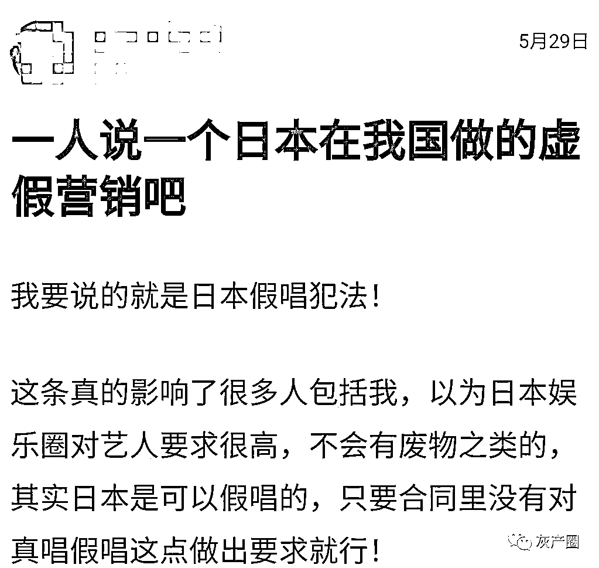
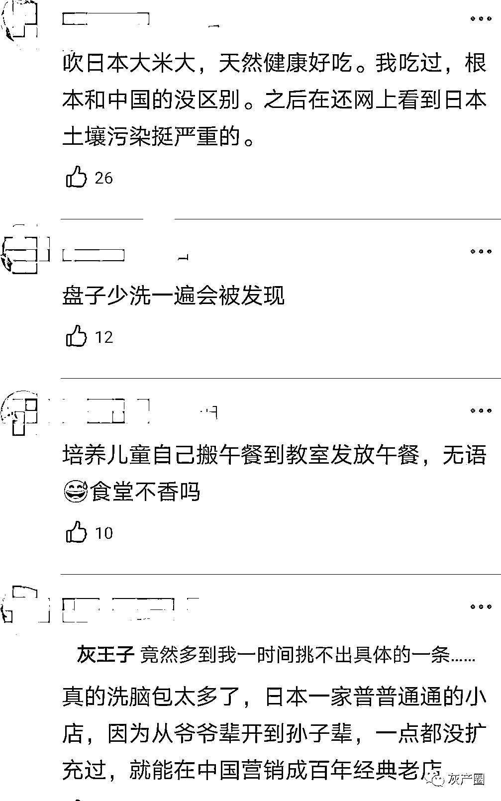
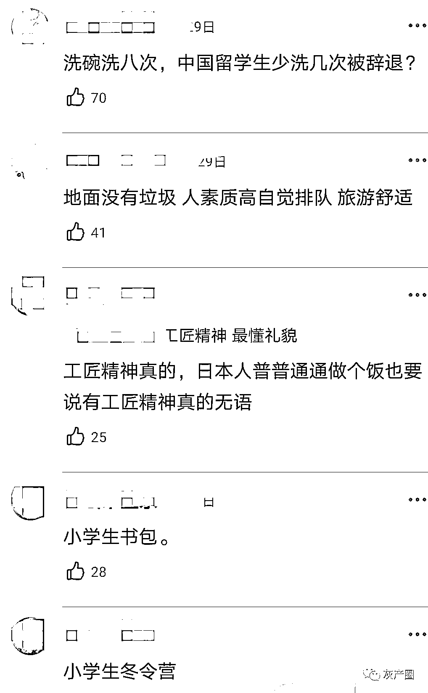
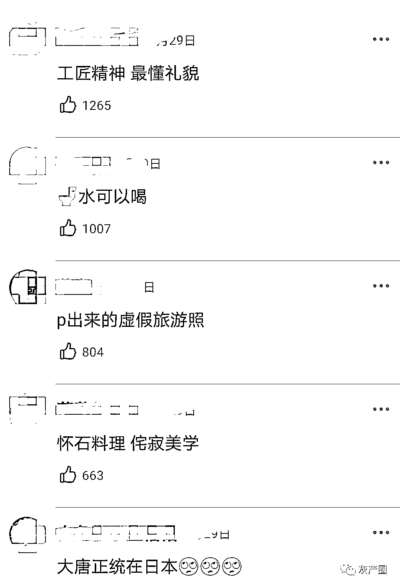
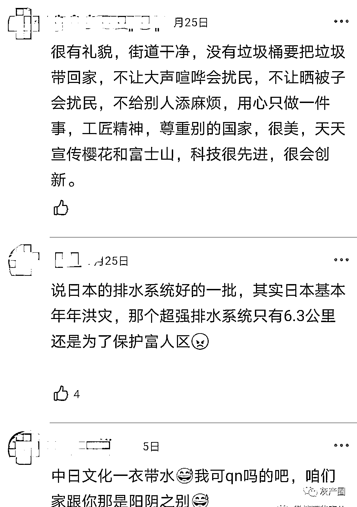
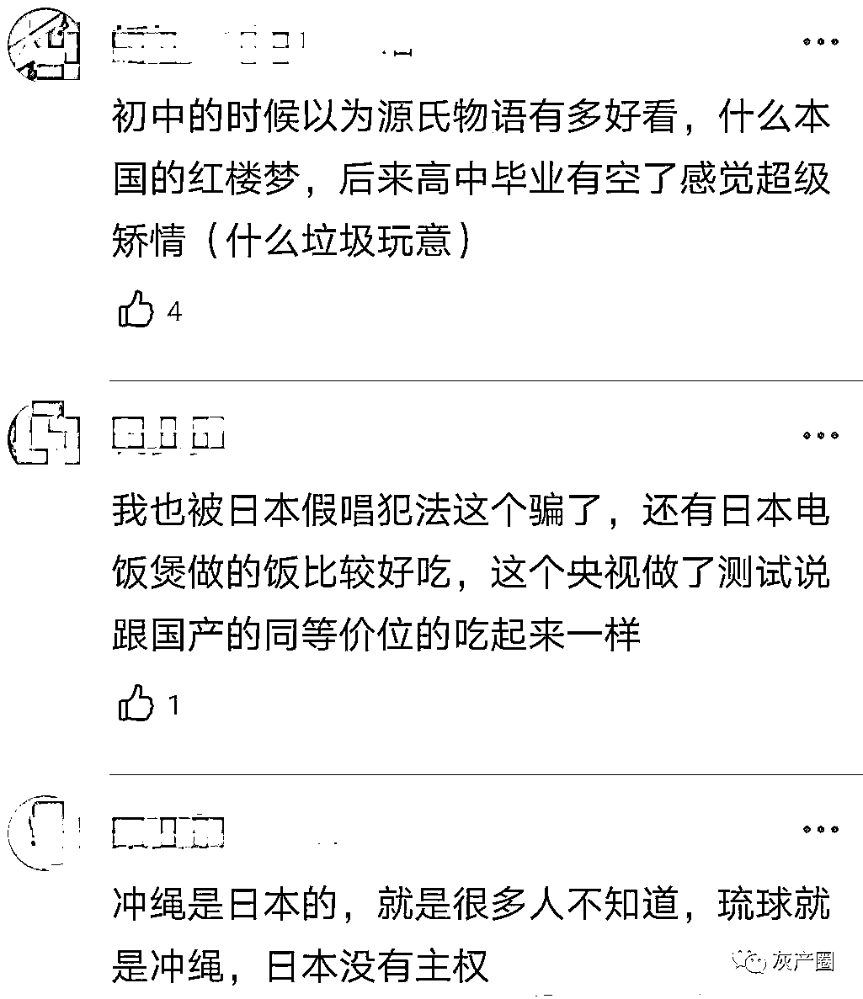
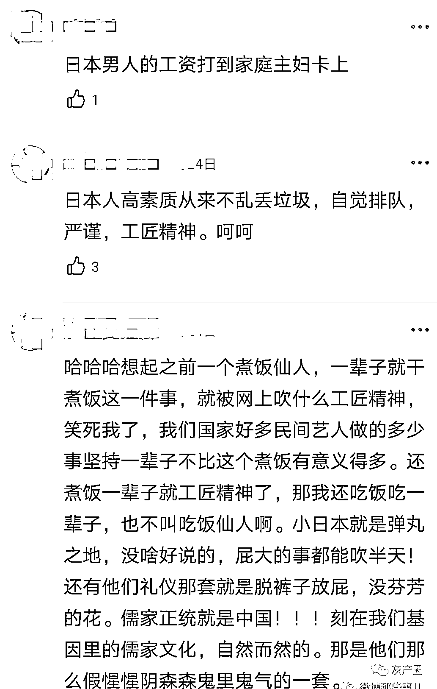
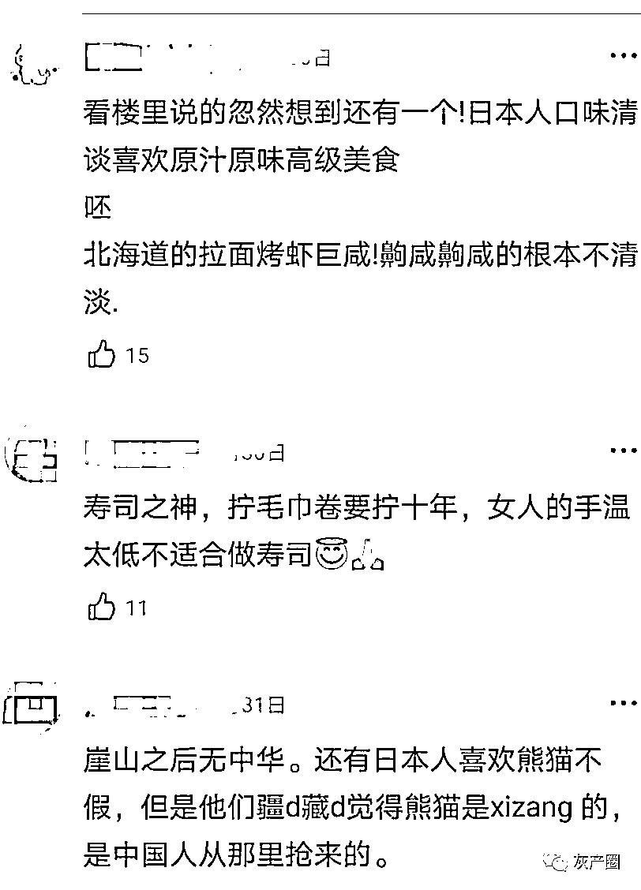
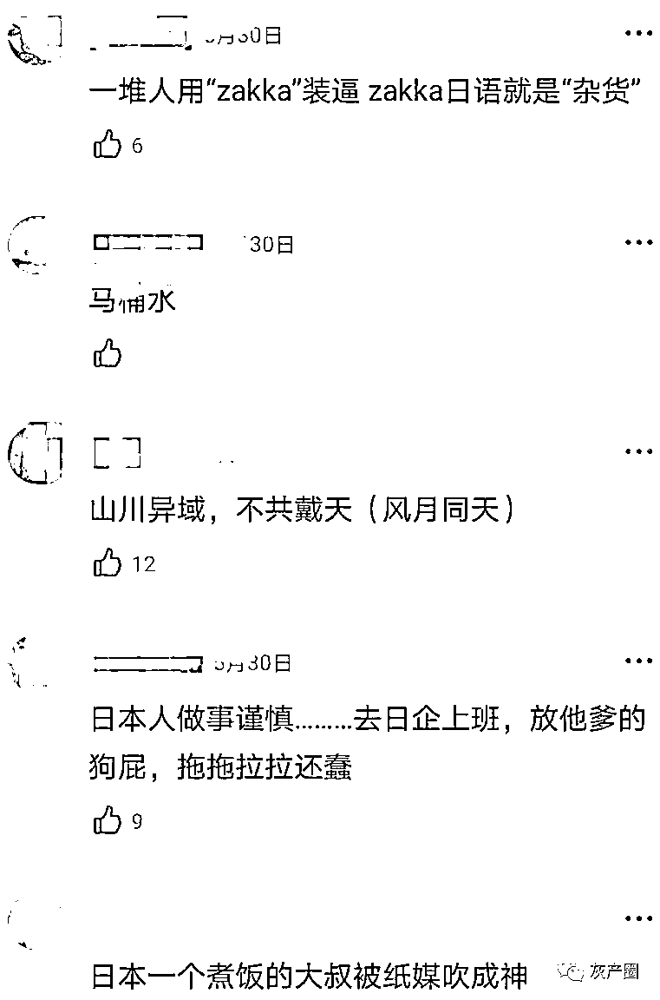

# 那些年日本在我国做的虚假营销，这些洗脑包你吃了多少？

> 原文：[`mp.weixin.qq.com/s?__biz=MzIyMDYwMTk0Mw==&mid=2247518202&idx=6&sn=d6d5c29601982eb85ea66ffabc82ac4b&chksm=97cb4cc2a0bcc5d49270346e6e0173c62ce32b085eedc946152c665345765bad9b6d24ed7b96&scene=27#wechat_redirect`](http://mp.weixin.qq.com/s?__biz=MzIyMDYwMTk0Mw==&mid=2247518202&idx=6&sn=d6d5c29601982eb85ea66ffabc82ac4b&chksm=97cb4cc2a0bcc5d49270346e6e0173c62ce32b085eedc946152c665345765bad9b6d24ed7b96&scene=27#wechat_redirect)

那些年日本在我国做的虚假营销，这些洗脑包你吃了多少？
假唱犯法这个，我是真的被骗到了！
热知识：去年疫情，不是日本人捐的款，是在日华人捐的，被转爆的“山川异域，风月同天”，这句标语其实是中国留学生写的！

* * *

要赚大钱呐:去年疫情，不是他们捐的款，是在日华人捐的

Biubiu1024:日本练游泳是在水池里放鲨鱼追。我 TM 居然还信了

小行星 74:我还记得之前有一个地铁照很可爱的小女孩，被营销成是日本的，结果小女孩妈妈出来说这是中国人

淮九十八:虚假营销：环保。各种营销日本什么环保政策和日常。然后 排放核废水

我想有个大狗勾:他们有的综艺真的很神经，一点都不尊重女性

汤圆桃桃子:1.“地面感觉没有垃圾”去一次大阪就知道了，角落都是垃圾，地上很多黑点，都是随地吐痰留的印子 2.“做事认真”偷懒的也不在少数，反而认真做事的都是老实巴交的中国人 3.“都是社畜加班多”其实是上班摸鱼，加班做正事，因为可以赚加班费

来源：微博那些事儿

灰产圈在线客服

← 向右滑动与灰产圈互动交流 →

