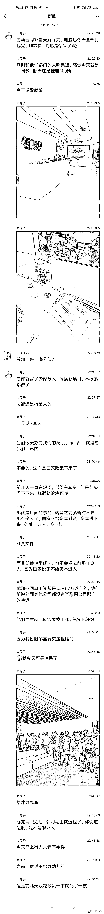
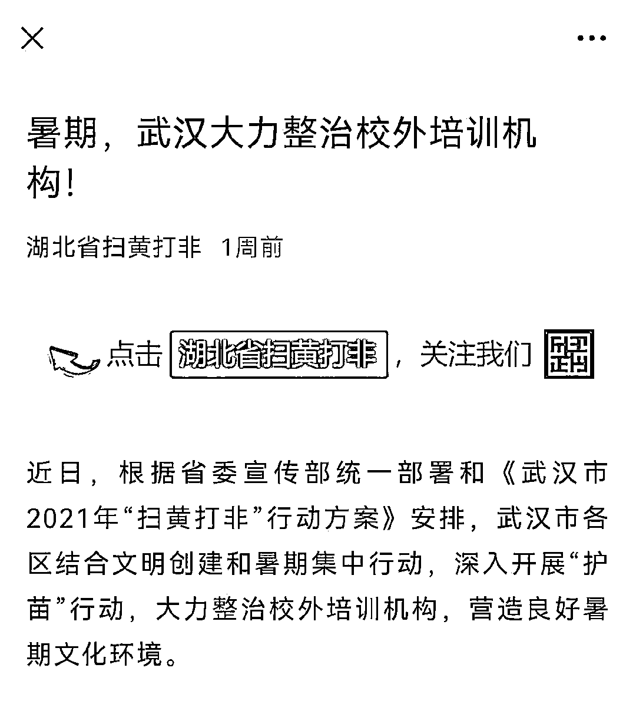
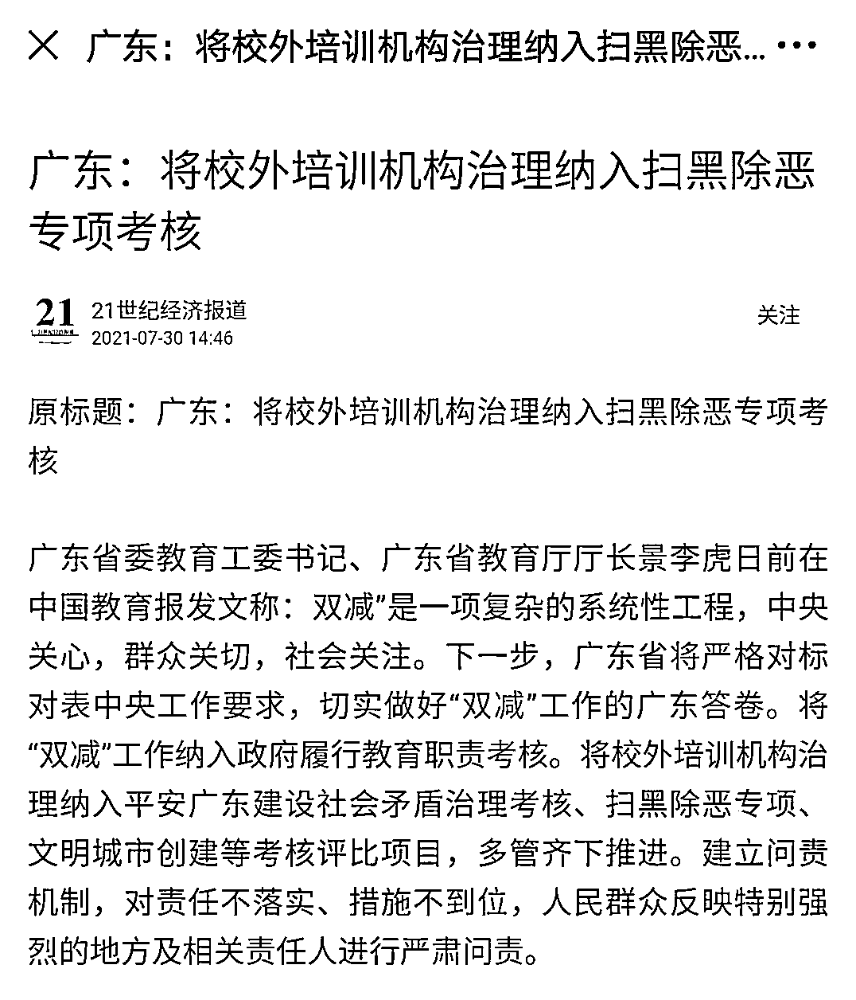

# “扫黄打非办”出手整治课外补习班，培训机构排队办离职手续！

> 原文：[`mp.weixin.qq.com/s?__biz=MzIyMDYwMTk0Mw==&mid=2247518270&idx=2&sn=8b7cc86d38246399f7bb486515c09de8&chksm=97cb4306a0bcca10f2a223d1fb72238f42428579722b3dafab14553d5f205c9be6fec0cf08d3&scene=27#wechat_redirect`](http://mp.weixin.qq.com/s?__biz=MzIyMDYwMTk0Mw==&mid=2247518270&idx=2&sn=8b7cc86d38246399f7bb486515c09de8&chksm=97cb4306a0bcca10f2a223d1fb72238f42428579722b3dafab14553d5f205c9be6fec0cf08d3&scene=27#wechat_redirect)

一家培训机构今天员工排队办离职手续，之前鼓动家长给孩子报培训班的广告词就是：这个社会要抛弃你，连个招呼都不打。一语成谶，不过却是自己。
课外培训培不创造社会价值，只会加剧学生内卷，很多老师对重点内容，课上不讲课外讲，把学生引入自己的辅导班，早该动手整治了。压在家长身上的这座大山终于要倒了 俞敏洪万万没想到，自己上周还是知名企业家，这周就成“黑社会”头目了！

* * *

赵勋正同和:挺好，这一万多的工资谁给的，全是娃爸妈血汗钱！

远飞的西兰花:这个行业一点都不值得同情，贩卖焦虑，变相促进内卷，社会主义铁拳不砸你砸谁

司空闲人:培训机构一直在抹黑公办老师，而以公办老师为基础的中国基础教育是世界最好的。

来源：微博那些事儿

← 向右滑动与灰产圈互动交流 →

