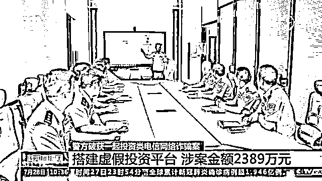

# 诈骗剧本曝光！投资虚拟买卖二手车！男子被骗 60 万!

> 原文：[`mp.weixin.qq.com/s?__biz=MzIyMDYwMTk0Mw==&mid=2247518270&idx=3&sn=c496ad5f392969e2b71597aa65e376e4&chksm=97cb4306a0bcca10e1e7c74d87ae029c657e9becfc1bc10e90fa724a8e4f7133719ad2620276&scene=27#wechat_redirect`](http://mp.weixin.qq.com/s?__biz=MzIyMDYwMTk0Mw==&mid=2247518270&idx=3&sn=c496ad5f392969e2b71597aa65e376e4&chksm=97cb4306a0bcca10e1e7c74d87ae029c657e9becfc1bc10e90fa724a8e4f7133719ad2620276&scene=27#wechat_redirect)

近日，山东省淄博市公安局张店分局从一起受骗群众报案入手，深挖线索，成功打掉一个投资类电信网络诈骗犯罪团伙，**抓获犯罪嫌疑人 23 人，初步串并案件 38 起，诈骗金额达 2300 多万元。**7 月 28 日，中央电视台新闻频道《新闻直播间》栏目进行聚焦报道。

[`mp.weixin.qq.com/mp/readtemplate?t=pages/video_player_tmpl&action=mpvideo&auto=0&vid=wxv_1980074572842401795`](https://mp.weixin.qq.com/mp/readtemplate?t=pages/video_player_tmpl&action=mpvideo&auto=0&vid=wxv_1980074572842401795)

投资虚拟买卖二手车

男子被骗 60 余万 

今年 4 月份，淄博警方接到市民刘某报案称，微信好友“琪琪”向他推荐一个链接，说在微信公众号“广东某二手车交易平台”投资旧车交易可获利。随后，刘某便打开链接，与这个的所谓的二手车交易平台取得联系。

“琪琪”自称是平台业务员，她向刘某解释说投资盈利车行分成 30%，平台分 10%，其余 60%由投资者按比例分配。她建议刘某先少投资一些尝试一下。刘某随即往平台投入了 1000 元钱，没两天，他就获利 200 元。

然而，刘某并不知道，他投资的二手车交易完全是虚构的，获利的 200 元也正是为了让他加大投资而设下的诱饵。

刘某初次尝试，很快拿到回报，准备继续投资时，平台又向他建议称：如果他能投资 10 万元，就能成为投资达人，获利也更大。

** 受害人 刘某：**

我觉得这个投资是有利可图的，而且它是一个新型的线上平台，所以我就没有引起怀疑，就把钱打过去了。

此后，对方又以做区域代理等理由，让刘某持续增加投资。在一个多星期的时间里，刘某先后共向对方汇款五次，总金额达 60 万元。

最后一笔钱打过去后，刘某却发现，对方把他拉黑了，电话再也打不通。

搭建虚假投资平台

涉案金额 2389 万

刘某被拉黑后，这才意识到上当受骗，马上到公安机关报了案。淄博警方接到报案后，迅速成立专案组，运用大数据分析对案件开展分析研判。

专案组通过对案件资金流水的梳理，发现了刘某被骗钱款的流向。根据虚假投资类诈骗案的特点，民警分析确认该诈骗团伙多为湖南省双峰县人，主要是熟人结伙作案，有的是夫妻，有的是亲戚，专案组迅速派员赶赴湖南开展侦查工作。

在 2 个月的时间里，专案组民警五次奔赴湖南，在当地警方的配合下，最终发现，犯罪团伙作案窝点设在娄底和湘潭两地，团伙成员分工明确，金主为双峰籍黄某、张某夫妇二人。

所谓的金主正是团伙的首要分子，负责整个案件的组织、指挥、协调，团伙中还有专门负责引流的成员，就是与受害人交流赢得信任，然后引诱受害人上当受骗。除此之外，还有专门负责提款的团伙成员。

专案组侦查发现，该团伙多名成员有诈骗前科，反侦查意识强，他们不断变换窝点和车辆，给抓捕工作带来困难。为此，专案组反复推敲抓捕细节，精心制定抓捕方案。6 月下旬，组织了统一收网行动。

警方在收网行动中共打掉 4 个电信网络诈骗作案窝点，缴获涉案电脑、手机、银行卡、手机卡一批。

经初步审查，黄某、张某自 2021 年 2 月以来，申请微信公众号，搭建虚假投资平台，招聘 20 多名嫌疑人，通过网络社交工具诱骗他人到虚假平台投资。目前，淄博警方已累计串并该团伙实施的 38 起电信网络诈骗案件，涉案金额 2389 万元。 

高额回报为诱饵

诈骗过程有剧本

民警侦查时发现，犯罪团伙在实施诈骗的过程中，有一个完整的套路。搜查当中，民警发现了用于行骗的剧本，嫌疑人作案的每一个环节和步骤，在剧本里都有详细描述。

整份资料非常详细，总共 22 页，上面记录了嫌疑人是如何冒充银行工作人员在聊天群里向大家推荐这种所谓的投资理财产品，然后其他成员冒充已经从中获益的客户，相互配合来诱使受害人进行投资。

这个剧本内容详尽，针对不同的客户有不同的对策，每一天给受害人聊什么内容都有设计。 

第一天  首先介绍公司的资料、项目

第二天  群里发红包，发虚构的客户信息

第三天  用小号适当地发一些虚假的盈利图

第四天  讲解投资技巧，发视频，继续晒图

张某就是骗取受害人刘某钱财的犯罪嫌疑人，仅骗取刘某 60 万元现金这起案件，她就从中提成 21 万元。张某所在的窝点有 6 男 2 女，共 8 名所谓业务员，而他们在与受害人聊天时，全部都以女性的身份出现。

** 犯罪嫌疑人 张某：**

我们以女性的身份去交这些微信好友，可能成功率就会更高一点。跟对方比较客气有礼貌，展示自己的一个素养，（剧本）是这么教我们的。 

案件破获后，受害人刘某如梦初醒，对自己为了贪图便宜而上当受骗后悔不已。 

警方提示

网络刷单，网络投资，网络赌博都是诈骗，犯罪分子从虚拟人设、编写脚本聊天交友到引导投资，都是精心设计的套路和陷阱。希望大家不要贪图小便宜，不要轻信所谓的高额回报，不要给犯罪分子以任何可乘之机，切实守好自己的钱袋子。

来源：淄博警方、央视新闻、利箭在行动

← 向右滑动与灰产圈互动交流 →

