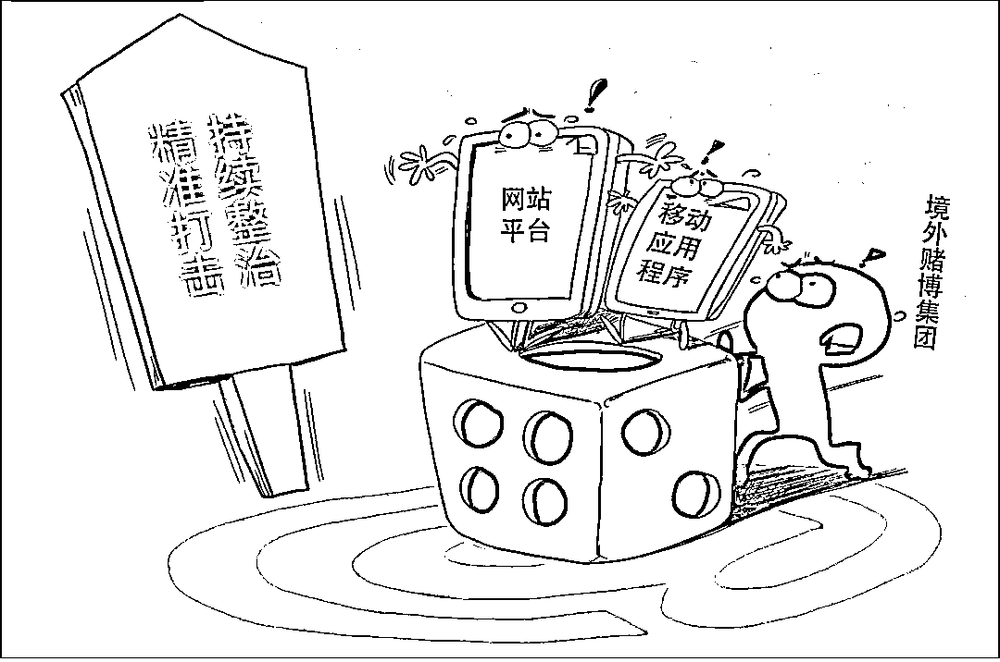
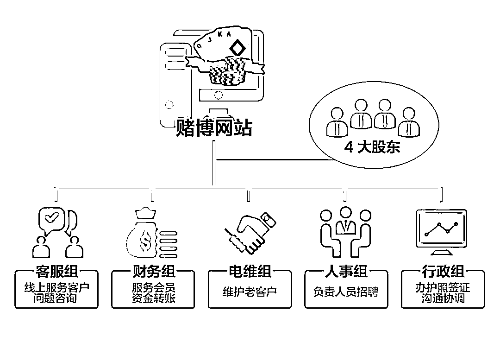
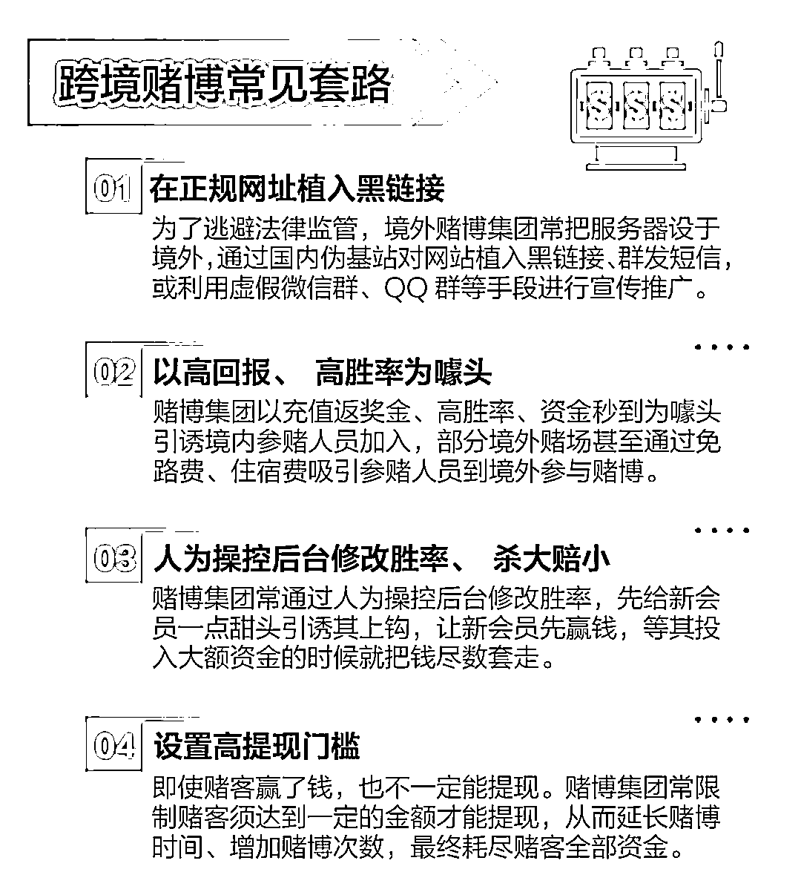

# 劫持流量，人为操控后台杀大赔小……揭秘特大跨境网络赌博案背后的套路！

> 原文：[`mp.weixin.qq.com/s?__biz=MzIyMDYwMTk0Mw==&mid=2247518270&idx=4&sn=96b7d38bc2ef535babf24fdf6e7bae14&chksm=97cb4306a0bcca1042e38d81f6e0c22b51aa68c1a0cf97dc9d415a7873c547cd5d90aa51d93c&scene=27#wechat_redirect`](http://mp.weixin.qq.com/s?__biz=MzIyMDYwMTk0Mw==&mid=2247518270&idx=4&sn=96b7d38bc2ef535babf24fdf6e7bae14&chksm=97cb4306a0bcca1042e38d81f6e0c22b51aa68c1a0cf97dc9d415a7873c547cd5d90aa51d93c&scene=27#wechat_redirect)

**跨境赌博“逢赌必输”**

**网络赌博“陷阱重重”**

近年来

跨境赌博形式多样

套路层出不穷

无数民众或主动或被动地身陷其中

今年 3 月 1 日起

《刑法修正案（十一）》正式施行

**跨境赌博首次写进刑法**

这意味着今后

国家将对此从严从重打击

**揭秘特大跨境网络赌博案背后的套路**

****

**新华社发 王鹏/图**

**4 月 19 日，由四川省雅安市雨城区检察院提起公诉的李某南等 18 人开设赌场、谭某森等 8 人帮助信息网络犯罪活动一案宣判，25 名被告人（其中 1 人涉及两项罪名）分别被以开设赌场罪、帮助信息网络犯罪活动罪判处一年至四年六个月不等的有期徒刑。经鉴定，该案涉案 16 个私人银行账户，**涉案账款合计 5.4 亿元**。全案追缴违法所得及赌资 7924 万余元，并依法没收手机、银行卡、电脑、硬盘等物品若干。**

**网警日常巡查**

**发现非法团伙**

****

**2019 年 9 月，雅安市公安局直属分局在日常工作巡查时发现，雅安辖区内多人在“新葡京”网站有充值记录，**初步怀疑有人利用名叫“新葡京”“太阳城”的境外网站开设赌场**。雅安公安机关迅速对该线索进行分析研判，摸排出一个以李某南、李某敬等人为首的跨境网络赌博团伙。**

**经过 7 个多月的研判和侦查，雅安市公安局直属分局查明，该赌博团伙窝点设在菲律宾马尼拉帕赛，团伙主要犯罪嫌疑人李某南等人为福建厦门、安溪等地人员。为逃避打击，该团伙组织人员在境外设立赌博工作室，然后通过租用境外服务器，搭建起“新葡京”“太阳城”等赌博网站，通过网络推广等方式，吸引赌客在赌博网站上进行赌博。**

****

**赌博网站组织框架图**

**查实该团伙组织构架、人员分布及涉案情况后，2020 年 4 月，该分局同步在福建、四川等五省开展收网行动，一举抓获包括该犯罪团队主要成员、赌博网站一般工作人员、贩卖银行卡人员，以及网站引流、服务器出租等犯罪链条各环节的犯罪嫌疑人。**

**经司法鉴定，**本案中涉案 16 个私人银行账户，涉案账款合计 5.4 亿元。**通过开设赌博网站非法获利后，该团伙将犯罪所得部分资金通过地下钱庄转入国内，同时将部分资金兑换成外币，用于支付公司在菲律宾马尼拉帕赛的运营费用。**

**多人分工合作**

**网上开设赌场**

****

**2017 年，曾在菲律宾、柬埔寨等地居住过的李某南关注到当地有人做赌博网站。出于好奇，李某南开始了解线上推广、网站投放广告、DNS 回跳等与赌博网站有关的技术。**其间，李某南萌生了自己做赌博网站的念头。****

****2017 年底，李某南邀请李某敬、李某阁、龚某龙出资入股，4 人合伙在网上开设赌场。考虑到在国内开设赌博网站风险较大，李某敬等 3 人提议，由李某南到境外看看是否有合适的场所和成熟的技术。****

****2018 年，李某南到达菲律宾马尼拉帕赛。很快，他在当地租到了一间大约 100 平方米的办公室，并在当地人的帮助下完成了公司注册。有了公司和办公场所，李某南开始重点物色成熟的技术。**他以开设赌博网站毛利的 14%作为报酬，向台湾籍男子“阿仁”购买赌博网站全套建站技术。******

******赌博网站的运行需要大量服务器作为保障，但租赁中国大陆的服务器需要备案、提交个人或者公司的资料等，为避免暴露犯罪行为，李某南采取在网上租赁美国、中国香港等地服务器的方式，为赌博网站数据和运行提供支撑。******

******场地、技术、服务设备全部落实后，李某敬、李某阁、龚某龙先后到达菲律宾与李某南汇合。按照李某南安排，李某敬负责管理服务器和网站防御，李某阁负责运营管理，龚某龙负责财务。******

******2018 年 4 月，固定域名为 8744.com，名称先后为“新葡京”“太阳城”的赌博网站正式运营。为逃避侦查，李某南等人还为该网站设立备用域名，在 DNS 服务器中，将域名为 8744.com 的赌博网站对应的 IP 地址进行变化，无限套用网站名称。******

******公安民警唐华一解释说：**“这种做法就像给网站穿衣服一样。**今天穿红色的风衣，明天穿白色的毛衣，后天穿蓝色的夹克，但不管衣服颜色和款式如何变换，**网站还是那个赌博网站**，只是外表外观不同而已。说到底，就是采用技术手段给赌博网站穿一个‘马甲’，以此来躲避网络警察的监管。”******

****股东全部就位****

****开始招兵买马****

********

****网上赌场，有流量才能获利，流量越多获利越多，犯罪团伙深知这一点。**为扩大网络赌博运营范围，李某南专程回国联系网络运营商进行推广。******

******回国后，李某南结识了可以提供通信运营商数据的谢某军。李某南多次以公司股份为诱饵，邀请谢某军为其提供数据信息，共同壮大赌博网站。在利益诱惑面前，谢某军答应和李某南等人一起建设、维护赌博网站。至此，公司股东已经全部就位。李某敬、李某阁、龚某龙 3 人共占 30%的股份，李某南和谢某军每人占 35%的股份。******

******为吸引大量中国境内人员进入赌博网站参赌，谢某军安排其堂弟谢某佳在四川成都设立工作室，招聘人员搜集其他境内外赌博网站网址，用以实施跳转至“新葡京”“太阳城”等赌博网站。******

******此时，身在菲律宾马尼拉帕赛的李某敬等人也在招聘客服人员，负责给会员充值、出款以及解答疑问。由于网站会员较多，李某敬等人需确保客服人数不少于 15 人。除客服组以外，网络赌博公司还设置了人事组、财务组、行政组、电维组等，同时也将办公区域分成了客服区、财务区、电维区、人事区、行政区，相关工作人员最多时达 70 余人。******

******客服区主要负责线上服务会员客户，回答客户的问题咨询；财务区服务会员的资金转账，为会员赌博账户上下分；电维区主要联系老客户，让离开的会员客户重新浏览赌博网站，回到赌博网站进行网络赌博；人事区主要负责客服区、财务区、电维区的人员招聘，几乎每天都有人辞职和有新人入职；行政区主要负责办理护照签证及与当地的出入境管理部门沟通协调，确保出入境顺利。至此，这个跨境网络赌博犯罪团伙越来越壮大、组织越来越严密。******

******为劫持流量******

******拉拢通信技术人员下水******

************************

******面对赌博网站高额利益诱惑，李某南、谢某军等人大肆拉拢通信运营商和网络科技公司的工作人员下水，为“8744 太阳城”赌博网站劫持流量。******

******所谓“劫持流量”，就是通过非法手段干扰用户上网，使用户不能直接访问目标网站，而被迫跳转到某个指定的赌博网站。很多人都遇到过类似的情况，**在自己不知情的情况下，个人设置的主页网址就被篡改为其他网址，当用户打开浏览器后，显示的页面变成劫持者设置的页面**。正是通过类似的流量劫持行为，李某南等人为赌博网站找到了更多赌客。******

****2018 年初，谢某军结识了四川某通信运营商员工钱某龙。在高额报酬诱惑下，钱某龙与同事李某帆以及北京某科技公司驻该通信运营商员工王某，在公司机房加装服务器，并植入网络跳转程序代码。如此，即可对通过该通信运营商 PC 端上网的用户进行劫持和拦截，使其跳转至李某南等人开设的“新葡京”“太阳城”等赌博网站。****

****同年，谭某森看到李某南在互联网上发布的广告，双方开展合作。谭某森首先接触湖南某通信运营商员工黎某深，然后又通过黎某深结识了与该公司有业务关系的网络工程师汪某华、廖某强。****

****4 人共同商议，利用汪某华、廖某强负责维护和管理该通信运营商上网设备的工作便利，将汪某华自行研发的网络跳转程序植入到谭某森租用的虚拟服务器上，劫持和拦截通过该通信运营商上网的用户，强制跳转至相关赌博网站。谭某森为李某南贡献流量，李某南支付其高额报酬。2018 年 12 月至 2020 年 4 月案发，李某南安排专人到长沙支付谭某森报酬 1000 万元。****

****2019 年 9 月，李某敬与其网络推广渠道 QQ 群内的翟某涛达成合作。翟某涛谎称为一些正规平台做广告，提出有偿在某通信运营商郑州分公司机房内加装服务器。骗取该公司员工王某信任后，翟某涛通过远程控制，在该公司机房加装植有重新定向程序的服务器，为赌博网站劫持和拦截流量。****

****李某南团伙通过相同手段，先后买通国内多名通信运营商工作人员及其他技术公司技术人员，将更多用户劫持、拦截到“新葡京”“太阳城”等赌博网站，让参赌人员根据网站提示注册成为网站会员，再按网站上提供的银行卡、支付宝、微信转账等方式充值，网站根据赌博会员充值金额，按照 1∶1 的比例给赌博会员的账户内充入赌博资金。**赌博会员充值后即可凭会员账户内的资金参与网站上的各项赌博活动。******

******赌博犯罪衍生新的犯罪******************

******李某南犯罪团伙利用网络实施开设赌场犯罪，费尽心思在全国找流量，也滋生、诱发一些通过倒卖流量获利的行为。******

******2018 年 12 月，杨某、向某玲、欧某丁等 3 人，通过谭某森结识某通信运营商湘潭分公司员工苏某昆，拟通过该公司提供的网络环境为赌博网站提供劫持流量跳转服务。苏某昆在获得公司付某、刘某的支持后，为杨某等人做网络流量劫持跳转。其间，“九九”加入其中，专门负责解决网络技术问题和联系赌博网站流量买家。**一个月内，杨某、向某玲、欧某丁、谭某森等人共计非法获利百万余元。********

******2019 年 5 月至 2020 年 5 月，杨某、向某玲、欧某丁等 3 人还合伙倒卖林某福劫持的赌博流量。每条流量以 5 元购入，再以 6 元或 5.5 元向一些赌博网站出售，赚取差价，从中获利 660 余万元。******

******有人参与倒卖流量获利，也有人通过向该犯罪团伙出售银行信用卡获利。检察机关审查查明，2019 年 4 月，江某别在明知龚某龙购买银行卡用于赌博网站赌博资金结算，仍向其出售银行信用卡，获利 13.2 万元。最终，上述人员均因涉嫌帮助信息网络犯罪活动罪被检察机关提起公诉。******

******面对这起类型复杂化、手法精准化、地域跨境化的新型赌博犯罪案件，雅安市雨城区检察院安排三名经验丰富的检察官组成办案组，提前介入侦查，先后多次前往侦查机关网络取证中心指导公安机关调取、保存证据。同时，多次召开联席会，就本案向公安机关提出侦查建议 30 余条。******

******办案组检察官严格精审细查，先后多次召开案情分析会，集中梳理 73 册侦查卷宗材料，核实证据。结合该案组织性、规模性、持续性等特征，引导侦查机关区分开设赌场罪和帮助信息网络犯罪活动罪的不同犯罪构成，确保案件定性、主从犯及涉案金额的认定。******

******在追赃方面，多次给部分退赃的被告人及家属做工作，释法说理，使他们配合退赃争取量刑减刑情节。在审查起诉中，多名被告人共退赃 600 余万元。******

******在审查过程中，雨城区检察院发现部分涉案犯罪嫌疑人为通信运营商工作人员，随即向相关部门制发检察建议，建议及时排查风险隐患，推动行业管理部门堵漏建制。雨城区检察院还以此案为例，加强法治宣传，进一步增强拒赌防赌合力。开展庭审观摩、听庭评议，以点带面、以案说法，提升群众对网络赌博犯罪社会危害的切身感受。开展法律进校园、进社区、进乡村活动，切实提升群众的法治意识。会同教育主管部门对学校进行走访，深入了解在校学生参与倒卖银行卡等情况，并向在校师生宣传“断卡行动”、防范网络赌博和电信诈骗等相关法律知识。通过微信宣传模式，对发生在本市或全国的典型跨境网络赌博案例，**以讲故事的方式释法说理，营造拒绝赌博、养成良好生活习惯的舆论氛围。********

****来源：检察日报****

********

****← 向右滑动与灰产圈互动交流 →****

********