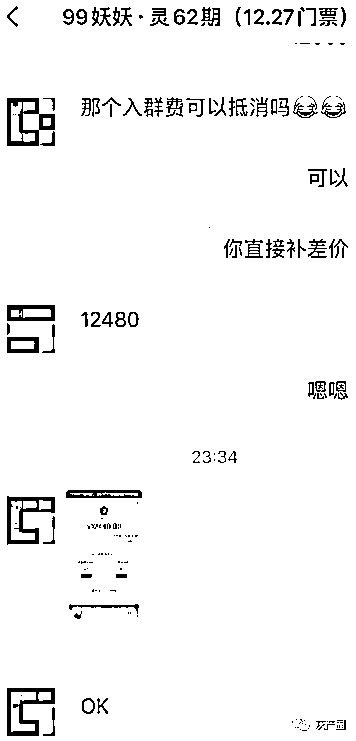
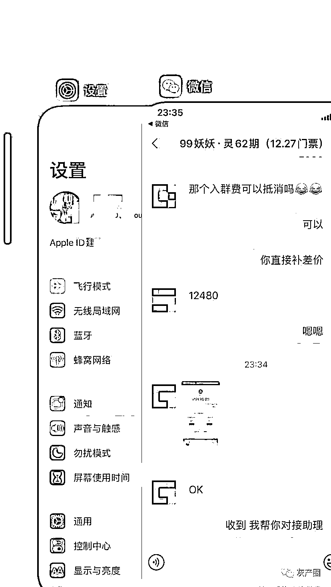
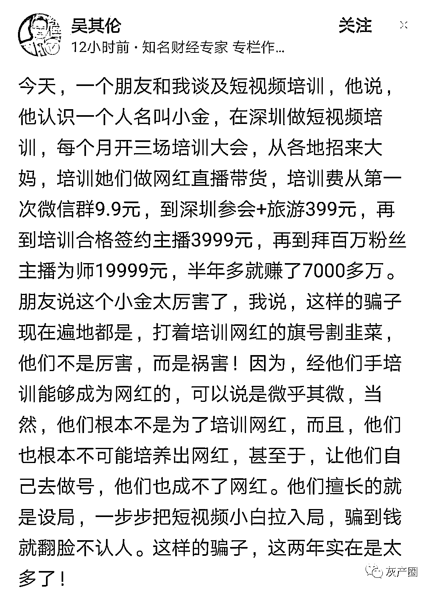

# 半年“收割”数亿，短视频网红培训骗局内幕揭秘

> 原文：[`mp.weixin.qq.com/s?__biz=MzIyMDYwMTk0Mw==&mid=2247518270&idx=5&sn=a239e044b5db8190d8be89bde56c0c09&chksm=97cb4306a0bcca103e31e0a3066ee853ad172210b48f7491f7efc9eb53616820f52d28521c0a&scene=27#wechat_redirect`](http://mp.weixin.qq.com/s?__biz=MzIyMDYwMTk0Mw==&mid=2247518270&idx=5&sn=a239e044b5db8190d8be89bde56c0c09&chksm=97cb4306a0bcca103e31e0a3066ee853ad172210b48f7491f7efc9eb53616820f52d28521c0a&scene=27#wechat_redirect)

随着抖音与快手的火爆，网红进入大家的视野，很多人羡慕网红，每天拍拍视频到处玩玩就能月入几万甚至几十万，也梦想自己有朝一日能成为网红，正是因为这种想法，短视频网红培训骗局应运而生。

早上看到一条信息，12480 的门票，不过现在手头只有 4000，可不可以？相差 3 倍的钱，然而对方居然非常爽快地就答应了。

天下真的有这么好的事吗？在网上输入公司名字查询了一下，吓得我直冒冷汗！

具体对话是这样的：

A：我没有那么多钱，但是我想加入

B：有多少呢？我们可以先预定名额哇

A：（被打马赛克，按照下面的付款记录，应该是 4000）

B：可以的

A：（付款转账 4000）

B：爱了

这是一早在朋友圈看到的一张图片上的内容（图 1），看完之后，觉得非常奇怪，总觉得哪里不对。

然后我再看圈里这位“朋友”，不知道什么时候加我的，没太有印象。继续看他朋友圈的内容，感觉更不对劲了。

所有信息都充满钱的诱/惑，教你赚钱，一天就收款 2 万，付款截图，巨额收入……

还有一张图上显示一张门票 12480 元，我的天，这是什么人这么牛，门票可以这么贵！

然后再到网上一搜，吓得我直冒冷汗。居然有这么可耻的骗人公司。

它们主要针对的人群一般都是刚毕业 5 年的人或新媒体小白，这些人缺乏社会经验或者对新媒体知道的非常少。

每天都在短视/频上或者是在朋友圈里发一些炫富的视/频，收割韭菜。

他们有一套完整的体系：

1、首先收比较少的钱（比如 79、99），教你去做一些平台卖货赚钱一些业务。

2、告诉你卖货赚钱其实赚到的钱有限，要想赚更多的钱呢，就要来做合伙人。做合伙人的话，你就再需要交 3800 或者是 1 万多，交钱之后他们会教你吸引更多的人成为合伙人。

说穿了，就是人头拉人头，吸引人过来实现付费，这个地方与传销和资金盘差不多，然后形成了一个循环。

因为成为合伙人的这个学费比较高，有些人没有钱，就像开头提到的，他可能就会让你去 dai 款来交这个学费。然后你可能面临的情况是钱没赚到，还背上了贷/款。

不得不说，用这样传 X 的模式赚过来的钱真的是太无/耻了。

今天分享这个就是想要提醒大家，想要通过新媒体开创副业赚钱，不论是写作还是短视/频，一定要踏踏实实的找准了方向的去做这件事情，不要急功近利。

有些人告诉你能轻轻松松赚上万、几十万的钱，那很大的可能就是让你当一颗韭菜。

进入新媒体领域，如果你还你还不清楚里面是怎么一个状态，即使你要加入培训班，真心不建议一开始就报几千、上万的课程。

你这还什么都不懂，一下子就钻进去了，花个一两百块钱咱们还能够承受，要是上千上万的钱花出去了收不回来，那可能就是你几个月，甚至是半年的一年的工资，这个损失是很大的。

更巧的是，查完这些资料，我又看到了知名财经专家吴其伦关于这个内容的分享。里面有更详细的介绍，见图。

总结一句话就是：打着培训网红的旗号收割韭菜。

来源：反传防骗联盟、防骗每日电讯、反诈骗先锋

← 向右滑动与灰产圈互动交流 →

