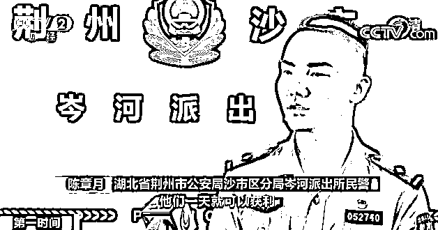
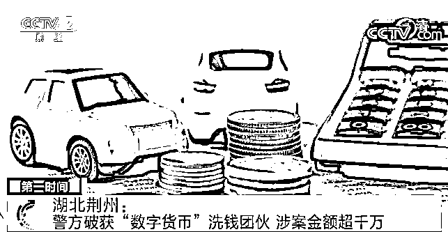

# 一天流水达几百万！“洗钱”团伙新套路曝光！曾被骗 10 万元的他，竟成了诈骗者帮凶→

> 原文：[`mp.weixin.qq.com/s?__biz=MzIyMDYwMTk0Mw==&mid=2247518270&idx=6&sn=0f36a98cae6fa94b88159a6cfa5ba796&chksm=97cb4306a0bcca1066f4a7d9851e94f1992dcd57c17db4b099d55580184c086712b4c44085b2&scene=27#wechat_redirect`](http://mp.weixin.qq.com/s?__biz=MzIyMDYwMTk0Mw==&mid=2247518270&idx=6&sn=0f36a98cae6fa94b88159a6cfa5ba796&chksm=97cb4306a0bcca1066f4a7d9851e94f1992dcd57c17db4b099d55580184c086712b4c44085b2&scene=27#wechat_redirect)

近日，湖北荆州警方打掉了一个利用“数字货币”为电信网络诈骗“洗钱”的团伙，抓获犯罪嫌疑人 5 名，涉案金额超过一千万元。

[`mp.weixin.qq.com/mp/readtemplate?t=pages/video_player_tmpl&action=mpvideo&auto=0&vid=wxv_1981770841285525507`](https://mp.weixin.qq.com/mp/readtemplate?t=pages/video_player_tmpl&action=mpvideo&auto=0&vid=wxv_1981770841285525507)

△央视财经《第一时间》栏目视频

今年 6 月，湖北荆州市沙市区公安分局通过线索，发现了一个利用“数字货币”交易平台，帮助境外诈骗窝点“洗钱”的犯罪团伙，警方随即组建专班，展开侦查。 

**湖北省荆州市公安局沙市区分局岑河派出所民警 陈章月：**按照洗钱流水的 1%到 1.5%进行提成获利，这个流水很大，一天流水可以达到几百万元，他们一天就可以获利 5 万元到 10 万元。

警方调查发现，今年 5 月份以来，这个团伙在多个快捷酒店开房，招募员工，要求员工提供银行卡，之后按照境外诈骗窝点的要求，在交易平台购买数字货币，利用数字货币的隐蔽性及支持境外交易等特点，将诈骗款项转移到境外银行账户中。 

 

**湖北省荆州市公安局沙市区分局岑河派出所民警 陈章月：**通过提币密码直接把虚拟货币和现金进行交易，把钱转换成虚拟货币，境外团伙直接通过虚拟货币提币之后，在境外就可以把钱取出来。 

7 月 15 日，警方先后在荆州区、沙市区等地收网，抓获了团伙主要犯罪嫌疑人全某等人。经查，主犯全某之前也曾被诈骗过 10 万元，如今，他竟然从受害者变成了诈骗者的帮凶。目前，团伙五名成员分别被以涉嫌掩饰隐瞒犯罪所得罪和帮助信息网络犯罪活动罪被警方拘留，案件还在进一步侦办之中。 

来源：央视财经（ID：cctvyscj）

← 向右滑动与灰产圈互动交流 →

