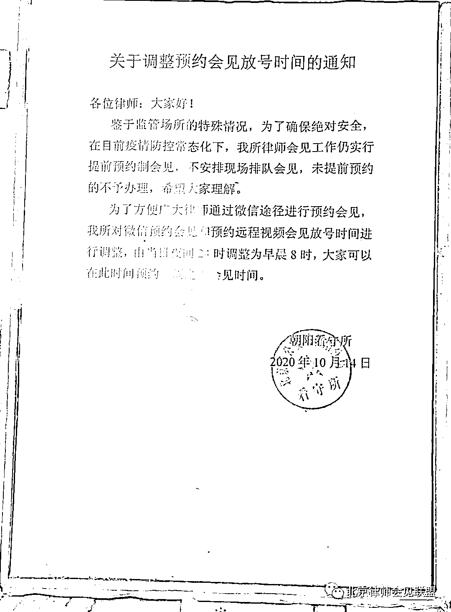

# 外国人（吴亦凡）犯罪案件办理注意事项

> 原文：[`mp.weixin.qq.com/s?__biz=MzIyMDYwMTk0Mw==&mid=2247518325&idx=3&sn=c9809c4f5c6c0b78b5e7a30eae016ca8&chksm=97cb434da0bcca5b97ef1efb06a454986ba46d5357264bfa0c46ff995c55a2eca90798ef8545&scene=27#wechat_redirect`](http://mp.weixin.qq.com/s?__biz=MzIyMDYwMTk0Mw==&mid=2247518325&idx=3&sn=c9809c4f5c6c0b78b5e7a30eae016ca8&chksm=97cb434da0bcca5b97ef1efb06a454986ba46d5357264bfa0c46ff995c55a2eca90798ef8545&scene=27#wechat_redirect)

2012 年刑诉法修改，普通外国人犯罪的案件的管辖权从中级法院调整到基层法院，相应基层公安、检察院承办人开始办理普通外国人犯罪案件。在外国人相对聚集的北上广深等地，外国人犯罪案件较多。               

现就检察机关批捕和起诉的阶遇到的问题，与各位分享，望批评指正。           

**1****管辖**

虽然普通外国人犯罪案件管辖权下放到基层，但应当注意刑诉法 17 条规定:“对于享有外交特权和豁免权的外国人犯罪应当追究刑事责任的，通过外交途径解决。”这类对象一般为外国首脑、外长及使领馆人员，因此基层公安、检察机关遇到涉及外国使领馆人员时，应注意豁免权问题。

**2****主体**

外资公司、企业犯罪是否能认定单位犯罪。2003 年最高法研究室答复天津高法“关于韩国注册企业在我国犯走私普通货物罪能否按单位犯罪处理”的请示”认可符合我国法人资格的公司、企、事业单位在我国实施犯罪的，以单位犯罪论处，需要注意该类犯罪是否以单位的身份实施，若不是则为个人犯罪。

**3****强制措施**

❶  注意办案规范，保证犯罪嫌疑人权利、义务，《公安机关办理刑事案件程序规定》第 356、358 条，对被采取强制措施的外国犯罪嫌疑人通知使领馆以及会见做了相关规定。

❷ 对于取保候审移送过来的案件，要及时做好续保工作。 

**4****翻译**

  普通外国人犯罪案件的办理，其实与平时案件办理并无太大区别，唯一的问题在于语言沟通障碍，在告权、讯问、开庭等涉及语言、文字的过程中，一名优秀的翻译能够极大提高司法效率。

刑诉法第 9 条规定:“人民法院、人民检察院和公安机关对于不通晓当地通用的语言文字的诉讼参与人，应当为他们翻译。

❶ 实务中遇到在中国待了好多年的留学生，普通话说的比我这河北标普还标准，按照第 9 条的逻辑，他完全通晓当地语言文字，那是不是就不用找翻译了？

❷ 对于对汉语半懂不懂的一定要聘请翻译，不然等到开庭一句“sorry，I can’t speak Chinese ”,承办人岂不要凉凉？这也时刻提醒承办人，讯问时一定做好录音录像工作。

❸ 我目前还未找到国家统一的对刑事诉讼中翻译的要求，各地有相关规定，最难的是遇到小语种搭配法律术语，比如犯罪嫌疑人权利义务告知书，有些词汇可能翻译过去对方有些懵，北上广还好，有些地区小语种翻译特别难找，建议准备一套各类文书的英文版，同时注意办案期限。

❹ 翻译陪同律师会见，要审核翻译的身份、资质情况，确保其与案件无利害关系，实务中遇到过一个翻译，总有一种偏袒嫌疑人的感觉。

**5****讯问**

**❶ 外国人犯罪案件讯问，一定做好录音录像工作。**

❷ **跟翻译做好沟通，讯问时简洁问案件的时间、地点、人物、经过，一定要简洁。**遇到拒不供认的嫌疑人，一直跟你胡扯，别说承办人，翻译快要被他绕晕了。实务中遇到过几个外国留学生故意伤害的案件，第一次笔录 A 说我没打，B 说我看见 A 打了，我没打，C 说我打了，D 说什么也不知道，总共四次笔录，出现四个版本 16 种可能，审报打的我差点吐血。

**6****起诉**

❶ 若做出不起诉决定，要及时同公安机关沟通，解除外国人人身限制措施。

❷ 起诉书标题要加上“中华人民共和国”前缀，同时翻译一份被告人母语版。

❸ 起诉书中外国人名字以护照为准。

❹ 做好庭审预案，给翻译准备一份开庭报告，并标注关键证据做好翻译准备工作，保证庭审顺利。

附：北京市朝阳区看守所律师会见流程及要求

1 办理律师会见时间

**上午**：8：30-11：30

**下午**：13：30-16：00

2 预约会见方式、时间及流程

**预约方式**：只接受“律师会见”小程序预约，不接受电话或现场预约。

**预约时间**：工作日每日早上 8 时开始预约，通过微信预约 8 天内会见时间（即本周一可以预约下周二）。

预约流程及须知：

3 疫情期间律师会见要求

1、律师 14 天内曾到过中高风险地区的不得会见、提讯；14 天以上 30 天之内曾到过中高风险地区的，必须提供 7 日内核酸检测阴性证明

2、律师应对 30 天内是否到过中高风险地区作出说明，并加盖所属律师事务所公章**（健康证明须写明 30 天内未去过中高风险地区，无具体格式要求，可参考下图模板，**Word 版本可点击文末“阅读原文”下载，提取码：1111**）**

3、会见期间必须全程佩戴口罩、查验健康码。提讯会见期间必须全程佩戴口罩、一次性手套。体温高于 37.3 度的，不得办理会见。

4 朝阳看守所联系方式

**地址**：北京市朝阳区朝阳北路 29 号

**联系方式**：010-65484823；010-65484804

**导航关键词**：黄渠地铁站

**乘车路线**：1、地铁六号线黄渠站 B 口出站左拐；

                 2、乘 991、306、675、499（慢）路，常营路口西站下车

来源：法律读库、刑事正义、反诈骗先锋

灰产圈在线客服

← 向右滑动与灰产圈互动交流 →

