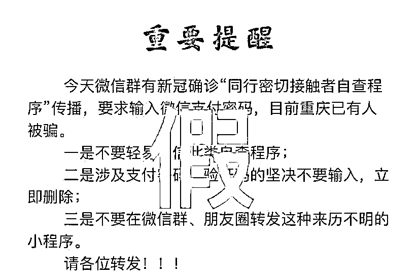

# “同行密接人员自查”小程序其实是真的！

> 原文：[`mp.weixin.qq.com/s?__biz=MzIyMDYwMTk0Mw==&mid=2247518325&idx=4&sn=829fe29af54dc658d34470200ce02d3b&chksm=97cb434da0bcca5bece5b1568ffafcf1a376d5c71c608b4e93cf022108c65a28bb5bd65da089&scene=27#wechat_redirect`](http://mp.weixin.qq.com/s?__biz=MzIyMDYwMTk0Mw==&mid=2247518325&idx=4&sn=829fe29af54dc658d34470200ce02d3b&chksm=97cb434da0bcca5bece5b1568ffafcf1a376d5c71c608b4e93cf022108c65a28bb5bd65da089&scene=27#wechat_redirect)

近日，**“同行密接人员自查”**小程序 

在微信群和朋友圈广泛转发

但也引发了不少网友

对真伪性和支付安全性的担忧

微信群流传**同行密切接触者自查程序系****诈骗**

个别网民甚至将“**紧急通知**”替换为“**接市委网信办紧急通知**”并在微信群传播截图**事实真相******【同行密接人员自查】******小程序是由国家政务服务平台和国家卫生健康委联合推出的正规查询渠道，依托国家“互联网+监管”系统汇聚的权威数据，可以放心使用。** 这个小程序**不是**诈骗软件**是真的！是真的！是真的！**经小编电话求证国家政务服务平台工作人员这款同行密接人员自查小程序是由**国家政务服务平台**和**国家卫生健康委**联合推出的正规查询软件经过多地警方与国家政务服务平台沟通，避免误导引发网民担忧支付安全问题目前国家政务服务平台已将**“****输入支付密码****”**改为“**人脸识别验证**”**提醒大家**

**1、****一定要通过微信搜索“国家政务服务平台”，进入小程序点击“同行密接人员自查”进行查询，或通过“国家政务服务平台”官网查询。**

**2、不要轻信他人转发的不明链接和网页，****谨防仿冒软件或钓鱼网站！**

**务必****通过微信搜索进入“国家政务服务平台”小程序****务必****在“国家政务服务平台”小程序里点击进入“同行密接人员自查”****也可以****通过国家政务服务平台官方网站查询****http://gjzwfw.www.gov.cn/****请大家支持转发，不要误传了！****“**流调**”到底是做什么的？****来电是真是假？**随着疫情防控加紧近期不少网友接到了流行病学调查的电话部分网友接到电话都会问一句“你不是诈骗吧？”首先为警惕性很高的网友们点个赞说明大家都牢记了“多问多看多核实” 那么到底什么是流调这项工作在疫情防控中有什么作用？公众应该如何配合呢？

**什么是流调？到底干啥的？**

流调，全称是流行病学调查，是传染病防控中非常重要的工作。**流调是疫情控制的关键，流调收集的信息能够起到有效遏制疫情的关键作用。**流调的必要性和重要性，了解下：

1.追踪传染源，发现潜在的病例密切接触者；

2.流调信息是开展医学隔离、医学观察的基础；

3.描述性/分析性流行病学重要的基础数据来源；

4.挖掘信息、发现疾病传播规律、控制疫情扩散的基础；

5.卫生部门科学决策的重要信息来源；

……

更直白地说，流调就是要搞明白：在过去每一个重要时间里，你走过的路、遇到的人和发生的那些事儿。

**流调都问啥？**

**需要获取哪些信息？**

**流调工作需要获取的信息：****1.个人信息：**

姓名年龄

家住哪里

家里有几人

现在位置 

......

**2.健康状况：**

近期可有不适 

近期是否就医

是否有发烧咳嗽等异常情况

是否做过核酸检测

……

**3.疫区旅游史：**

是否去疫区旅行过、经停过

走过的路

到过的地方 

……

**4.疫区居住史：**

你的老家在哪？

回去住了没？ 

......

**5.病例密切接触史：**

同乘旅客

近距离交流

居家成员

同事同学

围观群众

……

（密接会由公共卫生专业技术人员进行科学判定。）**6.交通工具：**是否乘坐飞机、火车、汽车、轮船……（疫情期间，非必要，不出行。）**7.其他必要信息：**对疾病防控有用的信息。**需要提醒的是，****流调工作人员在表明身份后会询问以上信息，但是不会询问财产等与疾病传播不相关的问题。** **请记住****流调来电不会让你干这些事情****▼**如有以下情况，均可以判定为诈骗，请及时拨打 110 报警：

**1、不会以任何理由发送二维码让流调对象扫描；**

**2、不会以任何理由要求获取流调对象的短信验证码；** 

**3、不会以任何理由发送链接让流调对象点击；** 

**4、不会推销任何产品或以任何理由要求流调对象付费；** 

**5、不会以任何理由要求流调人员加入 QQ 群、微信群；**

**6、不会以任何理由让流调对象转账和进行所谓的“资金核查”。**

**流调会保护隐私吗？**

**隐私保护是绝对的！**

流调获得的所有信息都是严格保密的，保护个人隐私是医学伦理和职业道德的要求，也是法律的明确规定，更是开展一切医疗活动前提。

跟临床医生一样，只有获得准确疾病信息，才能给出正确的诊断和诊疗方案；**流调人员获得真实、有效的人群信息，才能科学评估疫情动态，采取正确的防控措施！****所以，如遇流调人员登门或电话流调，请一定要配合！**

**重点的还要强调下：** **非常时期，务必提供准确的信息。****故意隐瞒情况，将承担法律责任。****来源：洛阳市反诈骗中心 ，利箭在行动**

**灰产圈在线客服**

****

**← 向右滑动与灰产圈互动交流 →**

****