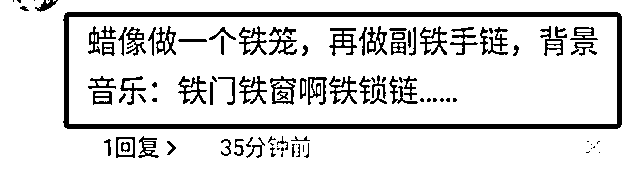

# 吴亦凡蜡像换囚服？假的

> 原文：[`mp.weixin.qq.com/s?__biz=MzIyMDYwMTk0Mw==&mid=2247518364&idx=2&sn=81ce1d32ffd2b24a04a29020b3110e20&chksm=97cb43a4a0bccab25967c24d3f8c116538c10190f4fdb04a8215ca886cdae2a47e9734ec31a5&scene=27#wechat_redirect`](http://mp.weixin.qq.com/s?__biz=MzIyMDYwMTk0Mw==&mid=2247518364&idx=2&sn=81ce1d32ffd2b24a04a29020b3110e20&chksm=97cb43a4a0bccab25967c24d3f8c116538c10190f4fdb04a8215ca886cdae2a47e9734ec31a5&scene=27#wechat_redirect)

近日，吴亦凡因涉嫌强奸被警方刑拘，此后网上热传一张照片，称上海杜莎夫人蜡像馆的吴亦凡蜡像，西装造型被换成了“囚服”。

据澎湃新闻 2 日报道，蜡像馆工作人员对此做出澄清，表示**网传内容不实，吴亦凡的蜡像早就已经撤展。**

公开资料显示，吴亦凡的蜡像于 2015 年揭幕，是首位入驻上海杜莎夫人蜡像馆的 90 后。

2015 年吴亦凡蜡像揭幕

7 月 31 日晚，@平安北京朝阳 发布通报称，吴亦凡因涉嫌强奸罪已被朝阳公安分局依法刑事拘留，案件侦办工作正在进一步开展。

消息一出，网上各类段子横飞。

近日还有网友声称自己去了上海的杜莎夫人蜡像馆，发现吴亦凡的蜡像还在展位上，但衣服从白西装换成了蓝色囚服。

介绍称，杜莎夫人蜡像馆是为了表彰在某个领域有突出成就的人而建立的，凡是能入选的明星艺人都是在各自事业上颇有建树的知名人物，如刘德华、李小龙等人。

2014 年，蜡像馆宣布吴亦凡的蜡像即将入驻，他将成为首位入驻上海杜莎夫人蜡像馆的 90 后。隔年蜡像完成，在上海杜莎夫人蜡像馆揭幕。

这篇帖子随即引发热议，不少网友信以为真，还为蜡像馆的“特别展览”出谋划策——把背景板换成监狱、循环播放《铁窗泪》bgm 等等，以增加教育警示效果。

综合澎湃新闻、红星新闻等报道，上海杜莎夫人蜡像馆的工作人员今天对此做出澄清，表示网传内容不实，吴亦凡的蜡像早就已经撤展，**“目前没有对其蜡像做任何造型更换，但考虑到事件的影响，已将吴亦凡的蜡像撤下停止展出。”**

至于今后还会不会在蜡像馆展出吴亦凡蜡像，该工作人员表示目前还没得到相关指示。

目前，@上海杜莎夫人蜡像馆 的官方微博上已经搜索不到吴亦凡的相关博文。

截至发稿前，上海杜莎夫人蜡像馆官网的“音乐梦工厂”栏目，吴亦凡蜡像的相关介绍仍然在列，可以正常浏览。

一夜之间，一“吴”所有，查“吴”此人。截至 8 月 2 日，吴亦凡本人及其工作室微博、抖音账号疑似因违规被屏蔽；豆瓣搜索结果未予显示；微博超话、贴吧也消失不见；网易云音乐、咪咕音乐等音乐平台则下架吴亦凡所有歌曲。

此前，@微博管理员 微博发布公告称，自@平安北京朝阳 通报吴亦凡涉案信息以来，引发全网高度关注。微博站方对此非常重视，以维护好站内社区生态秩序为落点，立即对相关信息进行了排查治理。截至 8 月 1 日晚，处置情况如下：

> 1.关闭错误导向超话 108 个，解散违规群组 789 个，坚决遏制非理性行为，坚决处理极端言论。
> 
> 2.对于借机寻衅滋事、攻击政府机构、恶意营销蹭热点、恶意洗地等违规账号予以严肃处理。已禁言和永久关闭账号共 990 个。

另据腾讯官方“鹅厂黑板报”微信公众号消息，近日，通过用户举报和安全巡查发现，在吴亦凡因涉嫌强奸罪被依法刑事拘留一事中，存在部分网络水军在平台造谣攻击、诱导集资、制造话题等有害行为。对此，平台对于发布传播相关不良信息的账号进行了严肃处置。

《公告》表示，腾讯将持续加强对“饭圈乱象”的处置力度，重点处理诱导集资打榜和互撕谩骂等乱象行为，规范平台管理，强化未成年人保护措施，严防网络水军干预搜索结果。希望广大粉丝用户理智追星、合理表达，共同维护健康文明的网络空间。

而在 5 年前“小 G 娜事件”中公开力挺吴亦凡的中国内地女艺人@马薇薇 ，女作家@六六  ，前时尚集团总裁、《时尚芭莎》总编辑、“芭莎明星慈善夜”创办人@苏芒 等人的微博账号先后被封禁，前两者在微博发声道歉。

来源：观察者网

← 向右滑动与灰产圈互动交流 →

