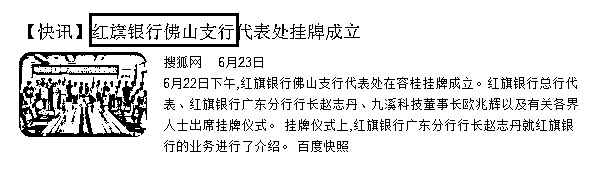
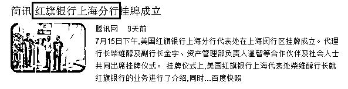
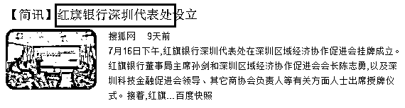
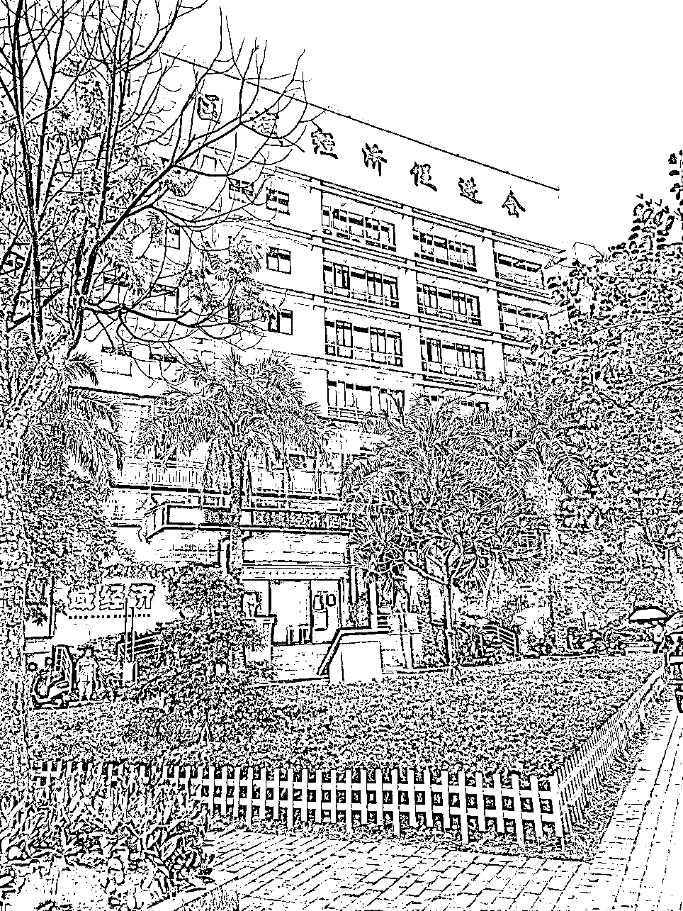
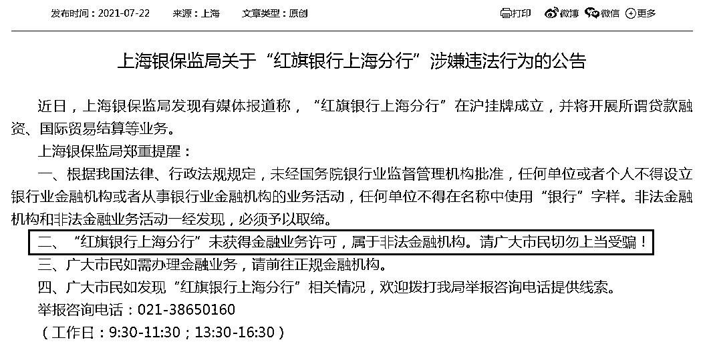
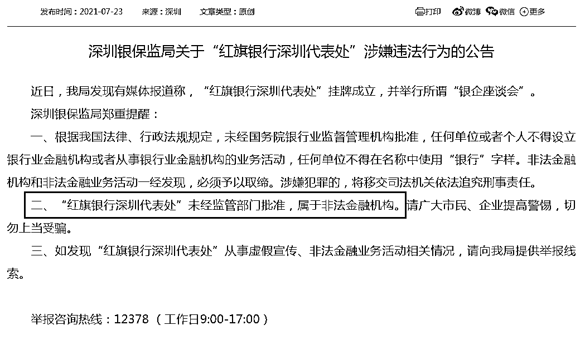
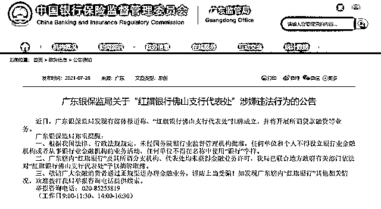

# 全网警惕！多地惊现假银行！

> 原文：[`mp.weixin.qq.com/s?__biz=MzIyMDYwMTk0Mw==&mid=2247518364&idx=3&sn=7c9fdde42887c239c15325f987c9d185&chksm=97cb43a4a0bccab2c35f9bfbab54c20ba6b5bbe2744897d44533c4dbed682f2fa9276f175423&scene=27#wechat_redirect`](http://mp.weixin.qq.com/s?__biz=MzIyMDYwMTk0Mw==&mid=2247518364&idx=3&sn=7c9fdde42887c239c15325f987c9d185&chksm=97cb43a4a0bccab2c35f9bfbab54c20ba6b5bbe2744897d44533c4dbed682f2fa9276f175423&scene=27#wechat_redirect)

你可能听说过花旗银行，但你听过“红旗银行”吗？

近日，上海、深圳、佛山等多地突然出现了一家打着外资背景的“红旗银行”。

“红旗银行”老板孙剑的头衔极为魔幻——英国罗斯柴尔德国际投资有限公司董事长、共济会公爵、联合国经济调查研究院共同院长、维密国际模特协会会长等。 

这家银行刚刚开始活动，上海、深圳的监管部门就已经重拳出击，将其定性为“非法金融机构”。

7 月 26 日下午，中国证券报记者实地探访“红旗银行”，据一保安人员表示：“红旗银行的确是在这里，但现在手续没办全，没有人在这里。”

 魔幻老板投资的“神奇”银行 

这家“红旗银行”到底是哪里冒出的呢？今年 5 月，一家自媒体发文称，“红旗银行股份有限公司”(RED FLAG BANK CO., LTD)在美国纽约成立，是一家经美联储批准设立的私人银行，红旗资本来源于私人财团。

文章中还表示，“红旗银行”近期规划在全球主要经济体和经济活跃区域布局开设分行或代表处，促进分行所在区域的经济发展。“红旗银行”将积极引进资本，投资所在国的交通能源基础设施建设项目，以金融优势支持当地经济发展。同时，“红旗银行”还将与世界主要银行紧密合作，开展国际结算业务，加快资金流通。“红旗银行”还将积极参与货币数字化业务的尝试。

而“红旗银行”董事局主席孙剑的头衔可谓一个比一个魔幻。比如英国罗斯柴尔德国际投资有限公司董事长、孙氏集团（香港）投资股份有限公司等等，甚至动辄上马千亿级项目。

在 2020 年，孙剑与广东惠州博罗的象山药王谷在南药种植基地举行"战略投资入驻药王谷"签约，双方表示将共建“大湾区药王谷国际中医城项目”，六大项目合计投资将达到 1031 亿元。

另一篇文章中，孙剑的头衔则更多了：共济会公爵、美国纳斯达克上市投资管理有限公司董事长、共济会时间管理局副局长、联合国经济调查研究院共同院长等等，甚至还是维密国际模特协会会长。

7 月 26 日下午，中国证券报记者来到了“红旗银行深圳代表处”的成立地——深圳市宝安区某大厦。门口的保安表示：“的确是在这里，但现在手续没办全，没有人在这里，还没开。” 

图片：深圳市宝安区某大厦

同时，中国证券报记者还拨打了一位工作人员的电话，对于“红旗银行”的相关情况，对方表示不清楚，具体情况和采访要求还要与老板沟通。但截至中国证券报记者发稿，并未获得回复。

 未经批准不得在名称中使用“银行” 

需要注意的是，上海、深圳的监管部门已经开始行动起来了。上海银保监局、深圳银保监局近期双双宣布“红旗银行”未获得金融业务许可或监管部门批准，属于非法金融机构。

针对上述消息，**上海银保监局**于 7 月 22 日发布公告称，“红旗银行上海分行”**未获得金融业务许可**，属于**非法金融机构**，请广大市民切勿上当受骗。

7 月 23 日，**深圳银保监局**也发布公告，指出“红旗银行深圳代表处”**未经监管部门批准**，属于**非法金融机构**。请广大市民、企业提高警惕，切勿上当受骗。

7 月 28 日，**广东银保监局**提醒，广东辖内“红旗银行”及其所谓分支机构、代表处均未获得金融业务许可，广东银保监局已联合地方政府有关部门依法**对****“红旗银行佛山支行代表处”予以摘牌取缔**。

图源于广东银保监局官网

三地银保监局同时表示，根据我国法律、行政法规规定，**未经国务院银行业监督管理机构批准，任何单位和个人不得设立银行业金融机构或者从事银行业金融机构的业务活动，任何单位不得在名称中使用“银行”字样**。

非法金融机构和非法金融业务活动一经发现，必须**予以取缔**。涉嫌犯罪的，将移交司法机关依法追究**刑事责任**。

如果发现“红旗银行”其他相关情况，消费者可拨打当地银保监局举报咨询电话提供线索。

**上海**银保监局举报咨询电话：**021-38650160**（工作日：9:30-11:30；13:30-16:30）；**广东**银保监局举报咨询电话：**020-85255819**（工作日 9:00-11:30、14:00-16:30）；**深圳**银保监局举报咨询热线：**12378**（工作日 9:00-17:00）。

来源：中国证券报、央广网，利箭在出击

← 向右滑动与灰产圈互动交流 →

