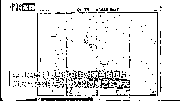
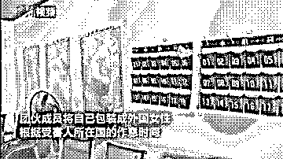
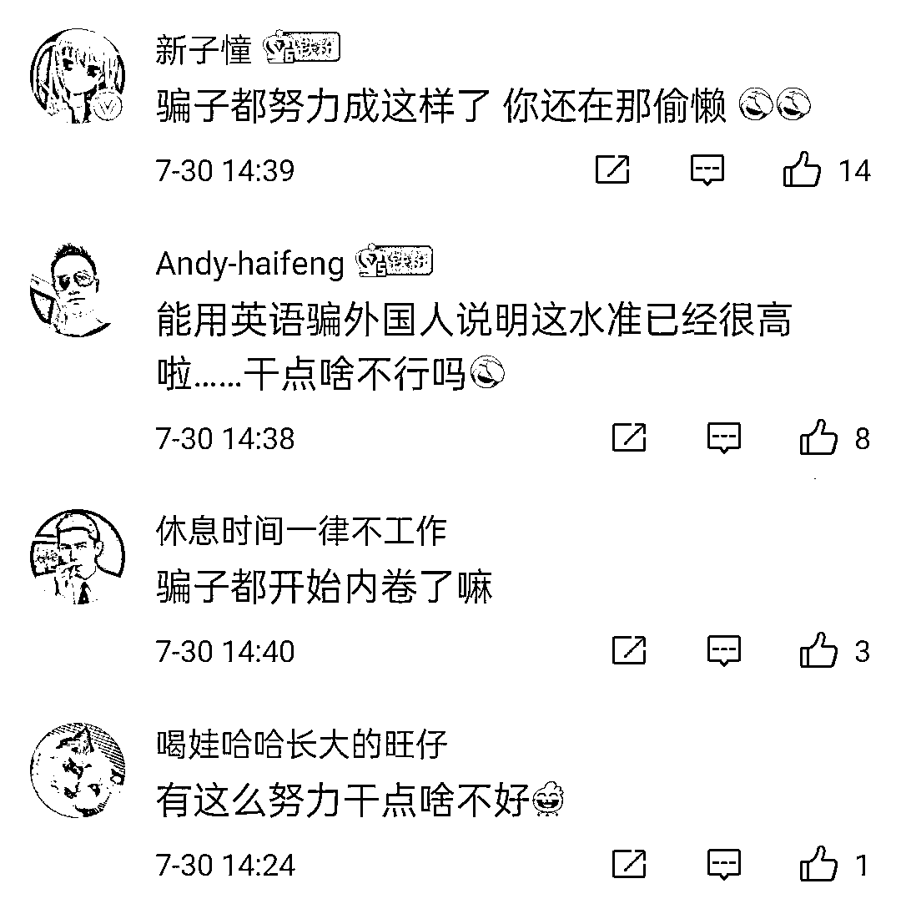

# 墙上挂满多个国家的时钟、地图，桌上放着英语书……骗子“反向操作”专骗外国人

> 原文：[`mp.weixin.qq.com/s?__biz=MzIyMDYwMTk0Mw==&mid=2247518364&idx=4&sn=e8d9abdebc1dd9044d35281c25db4f56&chksm=97cb43a4a0bccab2cff403b0138097249c6ef67410a937fcc225ee0c339418a60f32f292c6eb&scene=27#wechat_redirect`](http://mp.weixin.qq.com/s?__biz=MzIyMDYwMTk0Mw==&mid=2247518364&idx=4&sn=e8d9abdebc1dd9044d35281c25db4f56&chksm=97cb43a4a0bccab2cff403b0138097249c6ef67410a937fcc225ee0c339418a60f32f292c6eb&scene=27#wechat_redirect)

一面墙上挂满 6 个国家的时钟

另一面墙上贴满多个国家的地图

桌上还放着英语书

你以为是英语培训机构？

**其实是一群骗子的窝点！**

**骗子学英语仿作息专骗外国人** 

近日，湖南湘潭高新警方抓获两伙电信诈骗团伙。据悉，为逃避警方打击，这两伙人“反向操作”，在国内将自己包装成外国女性，通过社交软件，根据受害人所在国的作息时间，学英语、对照当地照片，与外国人以恋爱之名聊天，骗取其“投资”他们自建的数字货币交易平台。

从六月份开始诈骗，到被警方抓获，他们已骗取数万美金。

“骗子的电脑上有一个谷歌翻译器，他们一边在谷歌翻译器上面进行翻译，一边将翻译好的文字复制在 TINDER 上面，对照国外的地图时间说明自己虚拟的身份是在哪个国家，并根据国外受害者的作息聊天”，湖南潭市公安局高新分局民警介绍道。

针对此事，网友表示：这么努力干点啥不好？

**更多网络交友类诈骗**

**昆明女子中招“邮寄包裹”诈骗** 

5 月 24 日，昆明的赵女士在陌陌上认识了一名自称是台湾的军人，之后二人互相添加了微信便经常聊天。6 月 1 日，对方通过微信与赵女士联系称要到伊拉克执行任务，会将得到约 300 万人民币的报酬快递寄给她。

6 月 4 日，对方让其添加了一个名为“外交快递服务公司”员工的微信。之后自称是快递员的微信号的人通过微信与赵女士取得联系称要交纳通用免检证书才能将钱寄来给她，需要 15000 元人民币。

于是赵女士向男子证实后，于 6 月 5 日 8 时 52 分向对方提供的银行卡转账 15000 元。至当日 9 时发现被骗。

**警惕骗子的“甜言蜜语”**

有一种诈骗主要是针对女士们的，那就是“邮寄包裹”！

突然 QQ、微信群里面有“外国优秀的男人”加你，上来就是下面这样的“问候”：

“你好，我的朋友”

“你好，我亲爱的朋友”

“我是美国的一个大兵，祖籍在中国的内蒙古”

“我是利比里亚的一名维和士兵，祖籍在中国”

“我是阿富汗的一名雇佣兵,祖籍在中国”

“我的妈妈是美国人，父亲是中国人”

“我是澳大利亚的一名医生”

“我美丽的朋友，你好吗？”

小心，**这是“邮寄包裹”骗局的开场白，小心被骗子们忽悠了！**

当这些“老外”与女士们聊天聊到一定的“火候”的时候，就会找各种理由给女士“邮寄包裹”，然后以天价邮费、税费为由骗钱！

**民****警****提****示**

网络交友须谨慎，对身份不明的好友不透露自己的个人信息，务必认真核实对方身份，保持头脑清醒，不要掉进诈骗分子设置的陷阱，一旦对方要求转账汇款，请立即切断联络。如有疑问，请拨打 96110 咨询。

来源：昆明反电信网络诈骗中心

← 向右滑动与灰产圈互动交流 →

