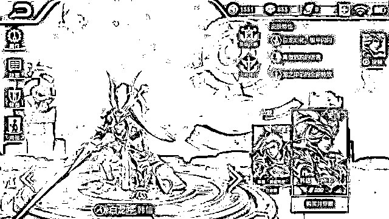

# 这次，网警带你了解游戏诈骗套路！

> 原文：[`mp.weixin.qq.com/s?__biz=MzIyMDYwMTk0Mw==&mid=2247518364&idx=5&sn=9cbbfcf81a41ca4b423efe06a86bc435&chksm=97cb43a4a0bccab2b96a88490e289fb8aa11dc858a696068e185ae9215154435b2842a7d2041&scene=27#wechat_redirect`](http://mp.weixin.qq.com/s?__biz=MzIyMDYwMTk0Mw==&mid=2247518364&idx=5&sn=9cbbfcf81a41ca4b423efe06a86bc435&chksm=97cb43a4a0bccab2b96a88490e289fb8aa11dc858a696068e185ae9215154435b2842a7d2041&scene=27#wechat_redirect)

放暑假啦！ 

终于可以放松一下！

是不是就想拿出手机、

打开电脑 

来局游戏解解乏？

无论是小朋友还是大朋友

切记，

网络游戏里也有诈骗……

**这不，熊孩子已上线！**

[`mp.weixin.qq.com/mp/readtemplate?t=pages/video_player_tmpl&action=mpvideo&auto=0&vid=wxv_1983262252103172098`](https://mp.weixin.qq.com/mp/readtemplate?t=pages/video_player_tmpl&action=mpvideo&auto=0&vid=wxv_1983262252103172098)

真实案例 套路解析 01 卖装备带你飞？求带不成反被骗

小学生小白在 QQ 上加了一位好友，好友说可以给小白送游戏装备，小白信以为真。 

好友让小白再准备另一部手机领取装备，小白按照对方说的步骤操作，用妈妈的微信打开收付款码，手机出现支付**4999.99****元**的界面，对方让小白妈妈人脸识别，支付成功。后小白用同样的方式向对方转账 2 个**999.99 元**。

小白转账之后被妈妈询问情况后发现被骗，损失价值共计**6999.97 元**。

02 低价充点券送皮肤？骗你没商量

小华在游戏里看到有人发公告称只需**38 元**手续费就能充值正价千元的游戏点券，还附送热门皮肤。小华立即添加了广告留下的网名为“充值王者”的骗子 QQ 号，并聊了起来。骗子通过对话很快取得小华信任，并让其用手机发了一个**38 元**红包，同时称一分钟就可以把点券和赠品充进小华的帐号。

游戏中动辄上百元的皮肤让人眼馋

但约定时间过去了，小华发现帐号并没有点券和赠品，马上又联系骗子。这时骗子则称，由于小华是第一次享受优惠，所以要交**200 元**用于激活账户，激活成功后再把钱退回给小华。听到钱可以退，小华又把钱转过去了。

随后骗子又用各种理由，先后骗了小华五次，直到小华把妈妈支付宝里零钱全部掏光。当小华意识到自己被骗向对方索要退款时，骗子马上就把小华的 QQ**拉黑**了。

03 分享转发赢奖励？暗嵌木马坑朋友

小美在游戏的网络论坛上，看到有人发布**“节日优惠活动”**，称只需点入链接，按照提示输入信息，就能免费获取游戏热门皮肤，转发微信到朋友圈还可以额外获得点券奖励。

小美一见有这样的优惠，没多想就把活动链接转发到自己微信朋友圈，想给朋友们派发**“福利”**，然后就忙自己的事情去了。但没过多久，多个朋友打电话给她，说她怎么发骗人的链接。原来，小美转发的活动链接被骗子加装了木马程序！

这也就是说，只要用户点进链接，并填入用户名、电话等信息，微信或 QQ 帐号就会被骗子控制，导致无法正常登录，随后受害者就会收到骗子的短信或电话，要求其付钱才把帐号返还给受害者，否则将用这些微信号或 QQ 号对其好友索要钱财。 

此时，小美才意识到，自己无心之间，成为了骗子的帮凶！

04 网络赌博游戏如何给你下套？

如果说现实赌博是十赌九输，那么网络赌博就是**十赌十输**，因为网络赌博比起以往的地下赌博，更适合背后的人为操作，更让人防不胜防。很多人在贪欲支配下，往往看不透这一点，希望下面这张长图能让大家清醒地认识到网络赌博的套路。

除了上述案例，骗子还会通过“有偿代打”、“低价转让优惠活动代码”等各种手法诓骗用户。如今难道玩个游戏都这样步步惊心吗？

不想被骗，请收好这几招！

*   千万不要轻易把自己**微信及 QQ 的帐号密码**告诉他人，尤其对方让你提供验证码时务必格外小心！

*   不要随意**转发或点入不是经官方渠道发布的游戏链接**，更不要轻易将个人信息填入。

*   对**明显低于市场价格**的优惠要格外留意，在作出转账或消费决定前，应先向官方进行了解，避免跌入骗子的圈套。

*   作为**未成年玩家的家长**，应该明确告诫孩子，不要沉迷游戏，并向他们讲述骗子行骗的案例，警醒孩子不要轻信骗子的花言巧语。

*   家长要对自己的**手机支付进行加密，**并不时更换密码，防止孩子在自己不知情的情况下用手机消费。

来源：南通网警，利箭在出击

← 向右滑动与灰产圈互动交流 →

