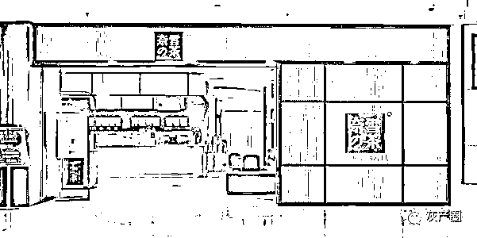
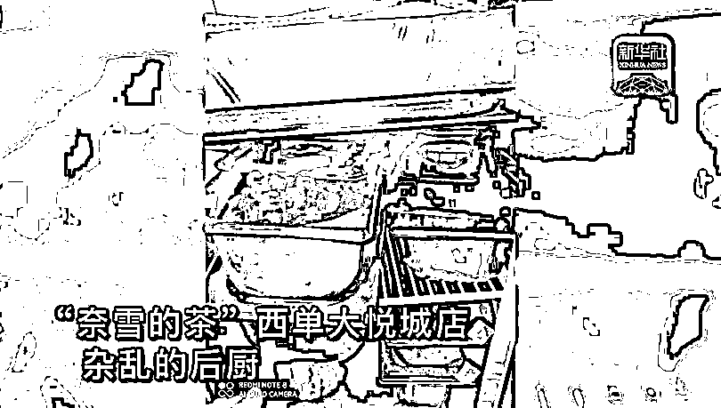
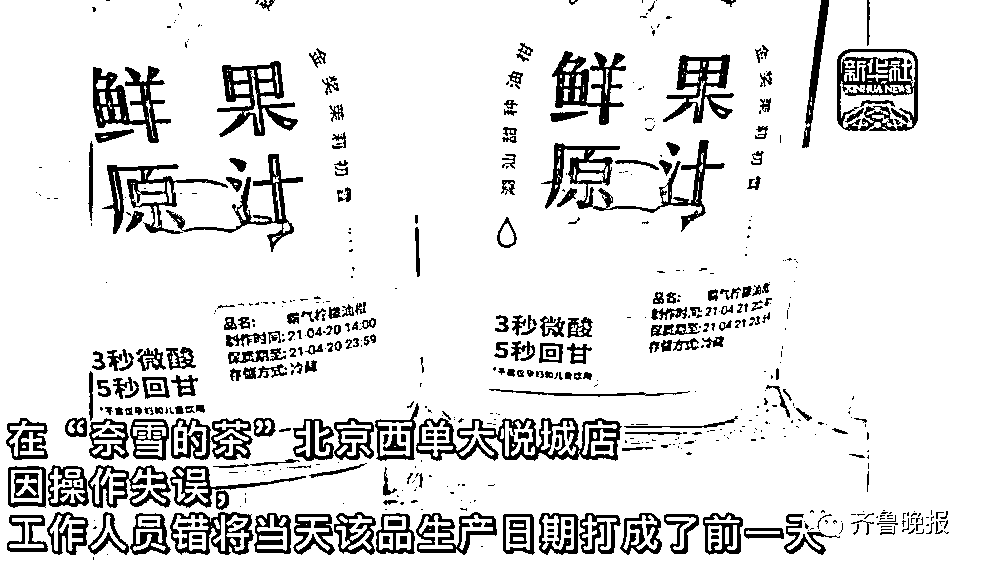
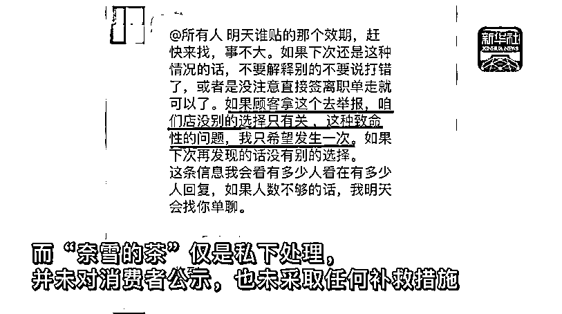

# 蟑螂爬，水果烂，好你个奈雪！

> 原文：[`mp.weixin.qq.com/s?__biz=MzIyMDYwMTk0Mw==&mid=2247518416&idx=3&sn=2dae2b044e29010aabf47edc74ad224d&chksm=97cb43e8a0bccafed7f94d7e7b4d23bb8da0a751b5cb32534c9fd6f0df77b3b20a9b8bc0baa0&scene=27#wechat_redirect`](http://mp.weixin.qq.com/s?__biz=MzIyMDYwMTk0Mw==&mid=2247518416&idx=3&sn=2dae2b044e29010aabf47edc74ad224d&chksm=97cb43e8a0bccafed7f94d7e7b4d23bb8da0a751b5cb32534c9fd6f0df77b3b20a9b8bc0baa0&scene=27#wechat_redirect)

本文转载自新华社

暑期已至，作为深受年轻人追捧的奶茶，将迎来销售旺季。

但上海市市场监管部门今年上半年对 1 点点、茶百道、7 分甜、都可（coco）、熊姬等多个品牌奶茶店突击检查发现，食品标签不明确、冰箱内食物不加盖、操作区卫生不达标、物品与食品混放等现象普遍存在，引发社会关注。

近日，新华社记者通过随机应聘，“卧底”网红奶茶店“奈雪的茶”，发现其多家分店也存在蟑螂乱爬、水果腐烂、抹布不洗、标签不实等问题。

蟑螂“不用管”

处理欠规范

前不久，记者应聘进入“奈雪的茶”北京西单大悦城店，成为一名实习茶饮师，负责面包区“上包”工作，即把后厨做好的面包从货架摆放到橱窗，并帮助顾客选购面包。

上岗当天，记者看见一只指甲盖大小的蟑螂，从面包展柜底部爬向面包制作间。记者马上报告同组值班店员，但得到“没事，不用管它”的答复。

“水吧和面包房有蟑螂”在许多店员看来十分“正常”。入职第二天，一些店员告诉记者，虽然店里要求很高，但“忙起来就顾不上那么多了”。

腐烂水果继续用

产品标签随意换

在“奈雪的茶”长安商场店，一些发黑的芒果摆放在后厨的桌子上，员工被提醒要去掉“黑色”部分继续使用，“不要浪费，稍处理一下即可”。

记者看到，一些标签纸等杂物不小心掉进芒果泥里，杂物被挑拣出来后芒果泥继续使用。

一款“软欧包魔法棒”系列产品，按要求应在 4 小时内售完。但一些员工会将未售完的产品及时更改时间标签再卖。

奈雪饮品“霸气柠檬油柑”保质期只有一天。但在“奈雪的茶”北京西单大悦城店，生产标签为手工输入。因操作失误，出现过工作人员错将当天该品生产日期打成前一天的情况。直到晚上闭店时，店长才发现。工作人员在群中私下处理了此事，相关情况并未对消费者公示，也未采取任何补救措施。

手套不戴

抹布不洗

记者在工作中看到，员工用同一个手套，同时处理不同的食物，且几乎从不更换。遇到客流高峰期，店长等其他工作人员会直接到后厨上手操作，很多时候不戴手套直接处理食材。

《中华人民共和国食品安全法》规定：“餐具、饮具和盛放直接入口食品的容器，使用前应当洗净、消毒，炊具、用具用后应当洗净，保持清洁。”

记者在被安排“擦盘子”期间，多次询问店员一块抹布擦几十个盘子是否需清洗抹布，得到“完全不用”的答复。

奶茶店要求擦拭桌面的毛巾 4 小时必须更换，每次更换后要打上时间标签。但记者在面包展区仅 2 天，就遇到了 2 次没有及时更换的情况。

日常卫生很随意

检查一来就重视

暗访现场，记者看到，不少员工直接踩着清洗食材的桌面，从较高橱柜中取食材，且未做任何清洁处理。

但每次上级来检查时，店员们就会临时整理地面卫生，对平日较为繁杂的后厨进行系统清理，紧急清洗各种机器。

“奈雪的茶”并非个案。北京市市场监管局此前在突击检查中发现，部分茶饮店使用过期的、不新鲜或“三无”物料等问题，并责令其整改。

今年 6 月，南京市玄武区市场监管局公布的专项抽检结果显示，喜茶在微生物、糖类方面存在风险。而在 2018 年、2019 年喜茶也均出现喝出“异物”等问题。

为严查严管各种网红奶茶店不合格现象，国家市场监管总局在 2018 年 6 月 12 日发布《关于加强现制现售奶茶果蔬汁监督管理的通知》，提出了对网红饮品的具体管理、监督要求。

中国农业大学食品学院副教授朱毅认为，奶茶店遍地，同质化严重，竞争激烈加上原材料涨价，同时外卖形态占比增加，不少消费者并没机会看实体店面，这就造成了店家忙于挣钱，疏于管理，应付监管，卫生成了共性问题。

“如果只顾追求新奇营销和利润获取，而不能保证食品质量安全，终将无法经受时间的考验。”中国消费者权益保护法学研究会副秘书长陈音江认为，奶茶经营者除了打造“IP”，应更多把精力和成本花在产品质量把关上，为消费者提供安全放心的产品，才能越走越远。

来源：新华社，南风窗

← 向右滑动与灰产圈互动交流 →

