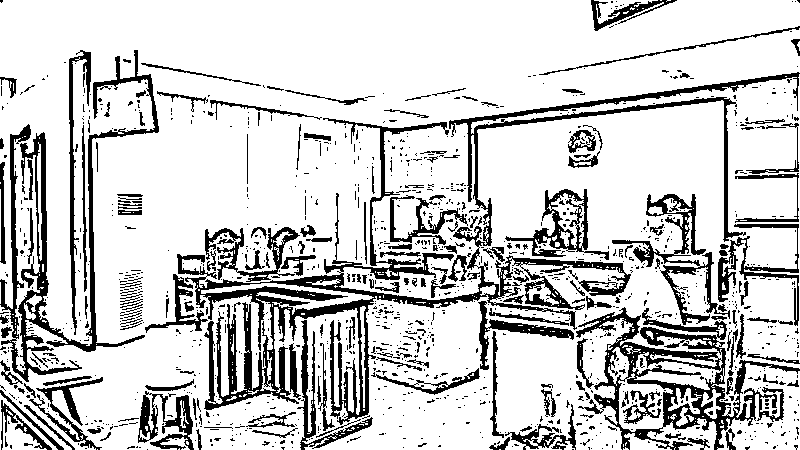

# 这个“正能量网红”竟然是……

> 原文：[`mp.weixin.qq.com/s?__biz=MzIyMDYwMTk0Mw==&mid=2247518416&idx=4&sn=66a4de3e508fc46006e7c709a03f9e9a&chksm=97cb43e8a0bccafe8abf803635d5a3a53b7272ec1f0d7a5f8e1a2f1bb43aeabfa2a42757c473&scene=27#wechat_redirect`](http://mp.weixin.qq.com/s?__biz=MzIyMDYwMTk0Mw==&mid=2247518416&idx=4&sn=66a4de3e508fc46006e7c709a03f9e9a&chksm=97cb43e8a0bccafe8abf803635d5a3a53b7272ec1f0d7a5f8e1a2f1bb43aeabfa2a42757c473&scene=27#wechat_redirect)

一会儿化身“慈善之星”

慰问孤儿院

一会儿化身“社会正能量”

鄙视流量网红

一会儿化身“正义使者”

揭露他人的诈骗行径

谁承想

……

经江苏省宜兴市检察院提起公诉

法院日前以**诈骗罪**对周某

判处有期徒刑**六年六个月**

并处罚金 5 万元

打着正能量网红的旗号卖口罩

周某是个小有名气的“网红”。2020 年 1 月，新冠肺炎疫情发生，口罩资源紧缺，价格水涨船高。周某看到“商机”，在朋友圈发布出售口罩的信息：有现货口罩，货源充足，价格公道。

为了让大家相信，周某灵机一动，购买一批消毒水，慰问当地行政部门，并把慰问图片传到网上。基于之前的人气，引起大量网友关注，大家争相联系周某购买口罩。

很快周某收到 3 万余元订货款。钱居然这么好挣？网红身份的快速变现让周某兴奋不已。

金某是一家公司的部门负责人，她想为员工购买一批口罩，有朋友把周某推荐给她。开始金某还是有警觉的，她清楚普通微商很难有充足的口罩货源，那些货量充足的有可能是骗子。

金某翻看周某朋友圈的内容：不发国难财，N95 口罩 4 块钱一个。她又点开周某的公众号，里面更是满满的正能量。她一下子被这个网红感动。“我想买一批 N95 口罩，你有货吗？”

“有货，但口罩涨价了，现在 5 元一个，运输费要 300 元，一个星期口罩就能到宜兴。”金某信以为真，将 1 万多元货款转账给周某。等了一个多礼拜，金某并未收到口罩，她在微信上联系周某，询问情况。

此时，周某早已想好后招。“快递在路上了，我把单号发给你。”很快，金某收到一张快递截图，截图显示她的快递正从四川成都发往无锡的路上。看到口罩很快到了，金某再次向周某下单 200 个一次性口罩。

到了收货的日子，口罩没到，金某心中起疑，再次联系周某。周某又发了一张从东莞到无锡的快递单号截图，并称“明天到”。

两张截然不同的快递截图和周某一直推托的态度，让金某意识到不对劲，立即报警。

“直播帮要债”不过一场戏

“周哥，有人欠我 5 万块钱，你是网红，办法多，能帮我要钱吗？”上门的生意怎能不做？周某答应了朋友的诉求。

两人到欠债人方某家后，周某灵机一动，这不正是一个“出名”的好机会吗？他打开抖音直播，记录了要钱全过程。

满身纹身的周某通过威逼、利诱、要挟，替朋友要回 2 万元。方某的其他几个债权人也找到周某，委托他帮自己要钱。周某感觉赚钱机会来了，便与另外两名债权人马某和陆某建了一个微信群。周某知道方某名下已无财产可抵债，但其母亲名下有一套房子。于是，周某开始上演一出自导自演的“好戏”。他在群里发布了这个消息，并称老太太已经同意将房子过户给他。

“等我卖掉房子，留 10 万块钱给老太太养老，剩下的钱我们三个人分。不过房子过户需要 2 万元，你们每人转我 6000 元。”周某在群里言之凿凿，马某和陆某表示同意，把钱转给了周某。

此时的周某早已不满足骗过户费，他主动找到马某，提出合拍广告，出资一人一半，收益按六四分成。马某一方面感激周某为其追讨债务，另一方面对网红变现能力深信不疑。于是，拿出 2.5 万余元投资。

一段时间过去了，周某绝口不提收益之事。后来一打听，周某压根没有接拍广告，加上过户房子要债的钱一直没到位，马某感到被骗，选择报警。

“帮忙谈业务”竟是下的套

2020 年 8 月，周某帮朋友处理其母亲工伤事故，因此结识了某公司负责人王某，几次交谈下来，两人关系日渐熟络。

周某再次发挥演技，摇身一变，成了一名“供销员”。他在聊天中提起，自己与某电缆公司杨总熟悉，帮人介绍过生意。

苦于生意难做的王某心想：“他是小有名气的网红，跟他合作是个不错的选择。”

2020 年 9 月，周某主动找到王某：“杨总介绍北京建工的一个项目，有个污水处理分包项目，一起合作，我来跑项目，你出钱。”王某满口答应。

接下来，周某频频以各种理由向王某要钱：“要去实地考察”“需要打通关系”……王某有求必应。

可一个多月过去了，王某开始觉得事情有一些蹊跷，便提出去北京实地查看，但被周某找理由搪塞过去。

2020 年 10 月初，周某已骗取王某 16 万余元。眼看这个工程项目要穿帮，周某只能告知王某，北京项目出了点问题，暂时搁置了。王某虽心中不悦，但只能接受事实。

“这钱可真好赚。”没过多久，周某又找到王某，声称杨总在浙江兰溪介绍了纺织厂项目。

上个项目花钱还没着落，王某多留了一个心眼，提出先去纺织厂实地查看。不过，早有准备的周某提前找人冒充项目经理，带着王某转了工地，还拿出准备好的“采购合同”。

浙江之行后，王某对周某信任有加，对周某提出的各种项目费用从未怀疑。11 月初，王某通过转账共付给周某 30 余万元。

钱又花了，可项目依然没有任何消息。王某多次联系周某询问情况，周某要么不接电话，要么找各种借口打发她。

王某觉得有问题，后多方打听，才知道所谓项目都是假的，便愤而报警。

“百骗”网红终落网

2020 年 3 月，公安机关将周某抓获。今年 1 月，公安机关以周某涉嫌诈骗罪移送江苏省宜兴市检察院审查起诉。

庭审现场

经审查，2020 年 1 月至 11 月期间，周某谎称其有口罩货源，购买需提前支付全款；虚构有能力通过出售债务人房产的方法帮被害人追回欠款，需先向其支付房产过户费；假意能帮被害人承接工程项目，需请客送礼、支付定金等，在宜兴骗取金某、马某、王某等被害人 33 万余元。

今年 2 月，宜兴市检察院审查后认为，犯罪嫌疑人周某以非法占有为目的，诈骗他人财物，数额巨大，以诈骗罪对周某提起公诉。近日，法院对该案开庭审理，全部采纳检察机关量刑建议，对周某作出上述判决。

来源：检察日报，利箭在出击

← 向右滑动与灰产圈互动交流 →

