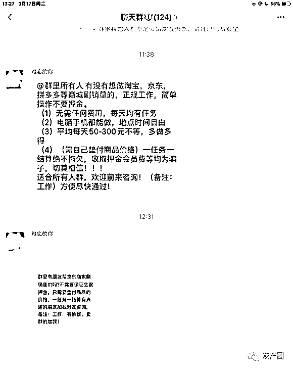
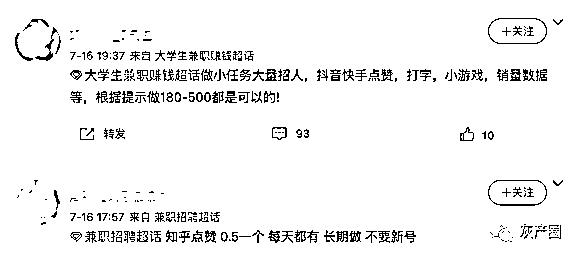
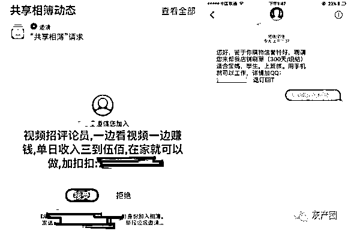
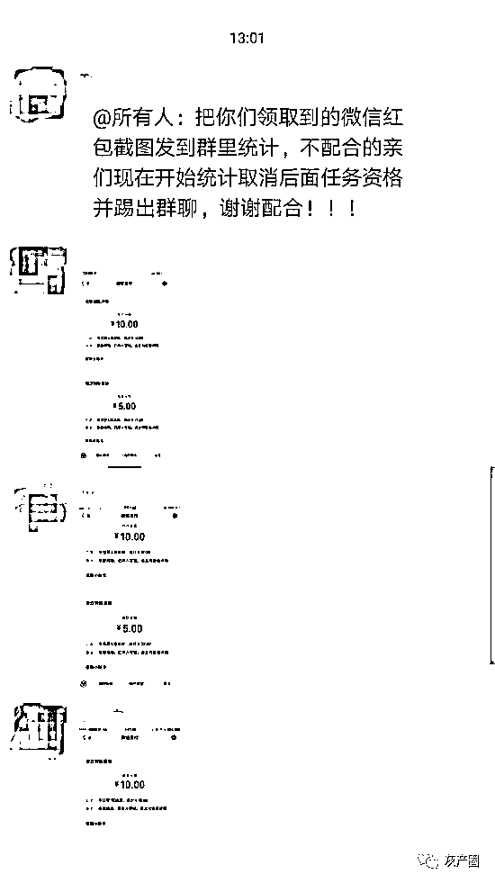
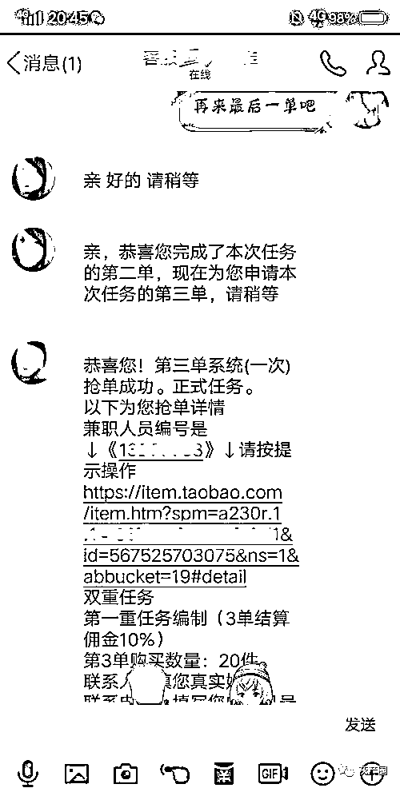
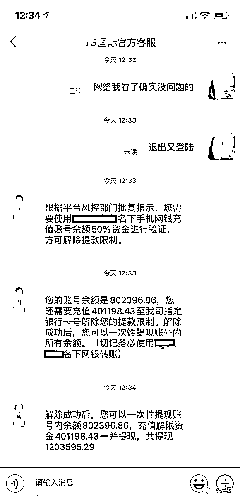

# 官方提醒：点赞刷单兼职，都是诈骗！

> 原文：[`mp.weixin.qq.com/s?__biz=MzIyMDYwMTk0Mw==&mid=2247518416&idx=5&sn=81939a7fd5951dbdfc18f19489bf2315&chksm=97cb43e8a0bccafe90a19876503263451dc70bb4963fc8a47cdf74b4a4236818a057aeb468ec&scene=27#wechat_redirect`](http://mp.weixin.qq.com/s?__biz=MzIyMDYwMTk0Mw==&mid=2247518416&idx=5&sn=81939a7fd5951dbdfc18f19489bf2315&chksm=97cb43e8a0bccafe90a19876503263451dc70bb4963fc8a47cdf74b4a4236818a057aeb468ec&scene=27#wechat_redirect)

“抖音、快手点赞赚钱，点赞 2 元一条，点赞+关注 5 元一条，点赞+关注+评论 10 元一条。”

相信不少人都收到过这种广告，动动手指，点个赞赚 2 元，轻松赚钱。

抖音安全中心提醒大家：抖音不招点赞员，凡是点赞刷单兼职，都是诈骗！

所有以“抖音点赞”为名的兼职都是诈骗，与抖音官方无关，抖音坚决打击刷赞、刷粉等违规行为，对于涉嫌刷赞、刷粉的帐号，最高予以永久封号处罚。

2021 年 6 月，抖音安全中心拦截涉嫌刷赞、刷粉违规行为 130 万次，封禁帐号超过 40 万个。

“点赞刷单兼职诈骗”套路揭秘

“点赞刷单兼职诈骗”是指不法分子利用招聘网站、QQ 群、微信群等途径发布点赞、刷单类虚假兼职信息，以高额回报为诱饵，诱骗受害人参与点赞、刷单，以收会员费、押金、手续费、垫付垫资等名义，诈骗受害人钱财的网络诈骗行为。

“点赞刷单兼职诈骗”的套路流程通常有以下几步。

一、针对学生宝妈发布“轻松高回报”兼职信息

“点赞刷单兼职诈骗”的受害人通常以时间比较充裕的无业或低收入群体为主，常见的人群如居家的宝妈、在校学生等。

骗子寻找受害者渠道及方式：

• 微信、QQ 群

通过在群内发布“点赞刷单兼职”信息，以“工作轻松，工资日结、报酬丰厚”为诱饵，诱骗受害人通过扫描二维码、加好友等途径加入骗子的微信群、QQ 群，成为其猎物。

• 社交软件、短视频平台

通过在平台上发布兼职信息或关注受害人，与受害人产生互动，在沟通交流中引导受害人添加骗子微信、QQ 等交流软件，成为其猎物。

• 短信、iMessage、共享相簿

通过这些工具，向受害人发布“点赞刷单兼职”信息，以“工作轻松，工资日结、报酬丰厚”为诱饵，诱骗受害人添加骗子微信、QQ 等交流软件，成为其猎物。

二、先让受害人赚点小钱，博取信任

受害人被吸引加入微信群、QQ 群之后，通常会在群里看到有人分享“点赞刷单”获利的截图。实际上，这些截图很多都是骗子团伙的人，发布这些获利截图，是为了让进群的受害人心动。

图：骗子开始会让受害者赚 5 块、10 块，但群里发图的也有托

受害人心动之后，骗子诈骗的主要形式是先让受害人赚点小钱，逐步引入圈套。

这时候，骗子会给受害人提供一些金额不大的任务。如果是“点赞”类诈骗，通常骗子会让受害人去完成几次“点赞”工作，并且会很快结算工资。有些受害人在这种情况下能够先赚到几块钱的工资，而骗子就通过这几块钱，获得了受害人的信任。

注意：

可能有人说，我只参加前面几单，赚 5 块钱就跑，不就不会被骗了？

抖音安全中心提醒您：所有参与点赞刷单被骗的人，开始都是这个想法，骗的就是有这种心理的人。

三、任务升级，让受害者持续投钱参与任务

获取受害人的信任之后，骗子就会实施真正的诈骗。

如果前面是“点赞”类任务，这里通常就会变成“刷单”任务。“刷单”与“点赞”不一样的地方是，刷单需要受害人垫钱，也就是：需要受害者先付钱。

如果之前是完成一些小的刷单任务，这里就开始刷“大单”。前面刷单可能就是几十块钱一单，这里开始出现上百元、几百元甚至几千元的刷单任务。

这时候，受害人因为有之前赚到钱的信任基础，也就开始投入自己的钱参与任务了。进入这一步之后，受害者无论投入多少钱，都回不来了，而且会越投越多。

图：参与数额较大刷单时，通常要求多刷几单方便一次骗到更多钱 

在受害者参与一两单高价任务之后，通常情况下，骗子都不会及时给予返现和收益。骗子会和受害人说，这个刷单任务不只有一两单，需要连续刷五单才能拿到返现和收益。于是，受害人为了拿回之前的投入，只能继续参与刷单，越投越多。

当然，钱肯定是回不来了。

四、终极一骗，拉黑走人

受害人在刷完一单又一单之后，投入了几千几万块钱，仍然无法提现，一部分骗子在此时就会拉黑受害人跑路。

但仍然有一部分骗子，会进行终极一骗。这种诈骗主要出现在各种刷单平台、刷单 APP 上。受害者充值垫资完成刷单之后无法提现，骗子会让受害者找客服（事实上还是那个骗子）沟通。客服会告诉受害者：你的账户出现异常，已经被平台冻结，如果需要解除冻结，需要再充值一笔钱才可以。

图：最后通常会以解除帐号限制为由，再次骗钱

这时候，心绪混乱的受害者根本无法清晰思考，往往会被骗子客服引导再次充值，也可能多次充值。

当然，无论充值多少，都是进骗子的钱包不会再回来。

网警严肃提醒：

1\. 凡是点赞刷单兼职，都违规违法，请勿参与！

2\. 凡是点赞刷单兼职，都是诈骗！

3\. 凡是要求下载 APP 参与点赞、刷单的，都是诈骗！

4\. 如果遭遇不退还本金的，第一时间报警！

来源：阿克苏网警巡查执法，利箭在行动

← 向右滑动与灰产圈互动交流 →

