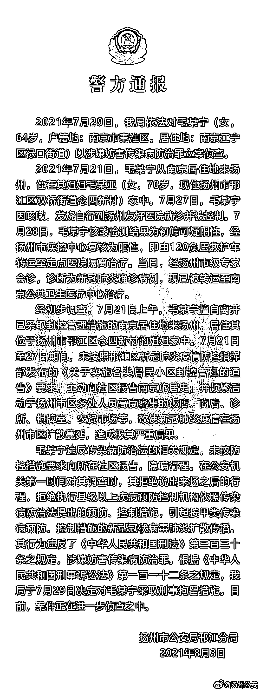
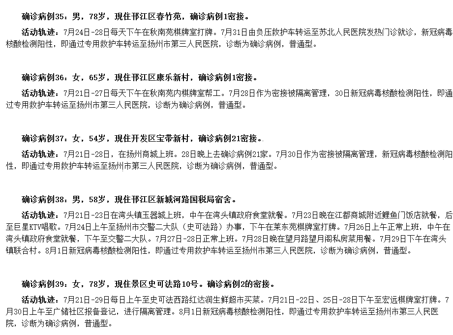
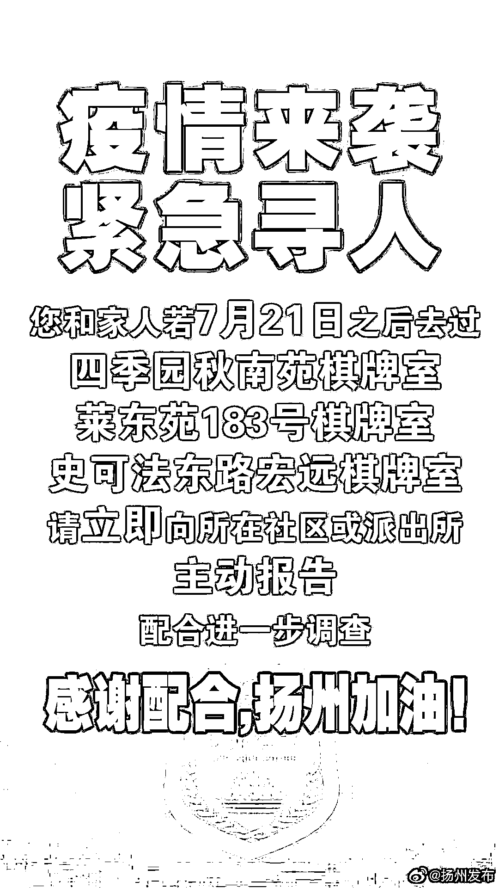
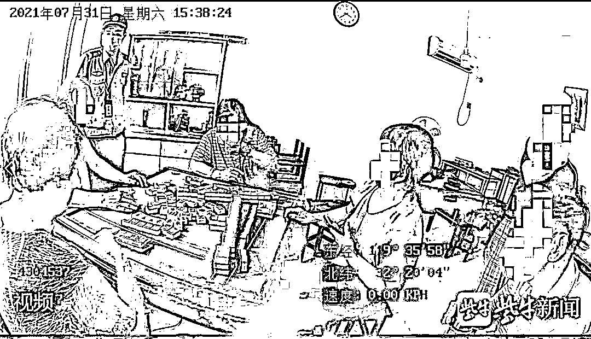

# 一个不负责任的老太太，感染一座城

> 原文：[`mp.weixin.qq.com/s?__biz=MzIyMDYwMTk0Mw==&mid=2247518457&idx=1&sn=9b09dba29f2d90078d73d482f6cf65bd&chksm=97cb43c1a0bccad7e9ca3bde62e11b9060e08fc0fec15a88e31dd03ebc8ee6f064b688adbf3c&scene=27#wechat_redirect`](http://mp.weixin.qq.com/s?__biz=MzIyMDYwMTk0Mw==&mid=2247518457&idx=1&sn=9b09dba29f2d90078d73d482f6cf65bd&chksm=97cb43c1a0bccad7e9ca3bde62e11b9060e08fc0fec15a88e31dd03ebc8ee6f064b688adbf3c&scene=27#wechat_redirect)

8 月 3 日下午 3 点，江苏人民政府新闻办公室召开新冠肺炎疫情防控新闻发布会，通报疫情防控相关情况。

扬州累计确诊 94 例

麻将馆暴露人员超 6 成

截至 8 月 2 日 24 时，扬州市累计报告本土确诊病例 94 例中，轻型 31 例、普通型 61 例、重型 2 例，本土无症状感染者 2 例。

**从发现来源看，麻将馆暴露人员占 64%**，集中隔离点占 7%，主动就医占 16%，社区筛查占 11%。

从年龄分布看，14 岁以下 1 人；**60 岁以****上 66 人，占比 68.8%**。

从发病时间看，**发病时间最早为 7 月 23 日**，之后每日均有发病，目前高峰出现在 8 月 2 日（40 例）。

南京老太擅自离开封控地

造成疫情外溢被刑拘

据@扬州公安 通报，2021 年 7 月 29 日，扬州市公安部门已对毛某宁以涉嫌妨害传染病防治罪立案侦查。**毛某宁正是此次疫情中扬州市报告的首个本土确诊病例。**

据通报，毛某宁**居住地为南京江宁区禄口街道**。经初步调查，7 月 21 日上午，**毛某宁擅自离开已采取封控管理措施的南京居住地来扬州**，并在 21 日至 27 日期间**未主动向社区报告南京旅居史**，并**频繁活动**于扬州市区多处人员高度密集的**饭店、商店、诊所、棋牌室、农贸市场**等，**致使新冠肺炎疫情在扬州市区扩散蔓延，造成极其严重后果。**

通告称，毛某宁违反传染病防治法相关规定，**未按防控措施要求向所在社区报告，隐瞒行程。**在公安机关第一时间对其调查时，拒绝说出来扬之后的行程，拒绝执行县级以上疾病预防控制机构依照传染病防治法提出的预防、控制措施，引起按甲类传染病预防、控制措施的新型冠状病毒肺炎扩散传播。

2021 年 7 月 29 日，**扬州市公安部门已对毛某宁（女，64 岁）以涉嫌妨害传染病防治罪立案侦查。**因系新冠肺炎确诊病例，根据统一安排，毛某宁被转运至南京定点医院治疗。目前，案件正在进一步侦查之中。

有网友对此评价：**一个不负责任的老太太，感染一座城。**

**扬州“棋牌室传播链”梳理：**

**目前为止至少有 3 个麻将馆都有病例发生**

****

**8 月 3 日，扬州通报一天新增了 40 例确诊病例，扬州现在的疫情是一个什么情况？**

**江苏省卫生健康委副主任周明浩介绍，这次传播的病毒是德尔塔株，病毒载量高、传播力强，速度快。这次扬州疫情源于棋牌室、麻将馆。经过调查发现，麻将馆空间小，人员多，流动大，很容易造成病毒传播，参与麻将的人还同时在不同麻将馆之间流动，****目前为止，发现至少有 3 个麻将馆都有病例发生。******

**流调数据显示，家住南京市江宁区某小区的毛某，于 7 月 21 日上午 9 时，也就是**南京 7 月 22 日因疫情原因暂时关闭南京江宁客运站之前，在南京江宁大学城乘坐大巴去了扬州。****

**到扬州后，毛某分别在 7 月 21 日、23 日和 24 日，到扬州市四季园小区**秋南苑内一棋牌室打牌。**直到 27 日到扬州友好医院就诊时，被发现新冠检测呈阳性。**

**而和她同住的姐姐目前也已确诊。流调显示，7 月 21 日到 25 日，**其姐姐每日 14 点左右都会前往位于史可法东路的宏远棋牌室打麻将**，晚上 8 点左右结束后回家。姐妹俩并不在一家棋牌室打牌.**

**这就导致，扬州这两家棋牌室短时间内成为又一疫情“风暴中心”。**

****

**据扬州市卫健委通报，多人轨迹涉及棋牌室**

****江苏 45371 家棋牌室、麻将馆已全部暂停营业************

******针对重点场所管控，江苏省公安厅党委副书记、常务副厅长尚建荣介绍，**目前，全省 45371 家棋牌室、麻将馆已全部暂停营业，已审批的拟于 8 月份举办的 19 场大型活动已全部取消或延期，文娱场所、线下培训机构已分别采取暂停营业措施。**严格群租房、中小旅馆等流动人口落脚点管理，督促寄递物流等重点行业落实防疫措施，依法查处违规经营行为。******

******据@扬州发布，目前扬州全城正急寻所有出入市区棋牌室人员：******

****************

## ******竟还有人在棋牌室打麻将！******

******8 月 2 日，扬州广陵警方通报一起聚众打麻将案件，嫌疑人已被行政处罚。******

******7 月 31 日 15 时许，广陵公安分局李典派出所接群众举报称，**辖区李典镇居民刘某家中有人聚众打麻将。**接报后，民警立即赶赴现场。到场后发现，被举报位置系居民刘某在家中开设的棋牌室，处于营业状态，王某、黄某、严某等四人正在打牌。******

******根据疫情防控工作通告，自 7 月 28 日起，扬州主城区范围内的娱乐场所、室内文化体育场所、培训机构、托育机构、室内宗教场所、洗浴中心等一律暂停开放。刘某在疫情防控关键阶段仍为他人提供娱乐场所，其行为已经构成拒不执行人民政府在紧急状态情况下依法发布的决定、命令。**根据规定，警方依法对刘某进行行政处罚，并对参与打牌的四人进行了口头教育。********

************

******逮个正着******

******来源：综合健康江苏、扬子晚报、央视新闻、红星新闻、钱江晚报、现代快报、北京日报、扬州市卫健委、反诈骗先锋******

******灰产圈在线客服******

************

******← 向右滑动与灰产圈互动交流 →******

************