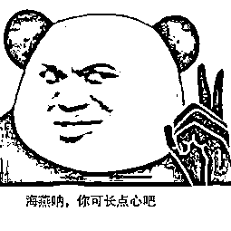
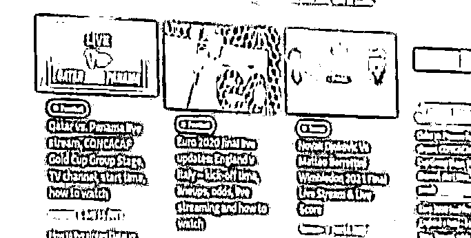
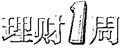

# 骗子盯上奥运会！国家队运动员亲自提醒，快看看

> 原文：[`mp.weixin.qq.com/s?__biz=MzIyMDYwMTk0Mw==&mid=2247518457&idx=2&sn=cced2cb3a9f277a8113f63806f154617&chksm=97cb43c1a0bccad7f88de200ca1354510db304a004994b57be4f7193c90cf7fad3be58a602c8&scene=27#wechat_redirect`](http://mp.weixin.qq.com/s?__biz=MzIyMDYwMTk0Mw==&mid=2247518457&idx=2&sn=cced2cb3a9f277a8113f63806f154617&chksm=97cb43c1a0bccad7f88de200ca1354510db304a004994b57be4f7193c90cf7fad3be58a602c8&scene=27#wechat_redirect)

奥运会如火如荼进行

选手们激烈角逐

东京奥运会运动员吴卿风

也为大家做出了反诈提醒

[`mp.weixin.qq.com/mp/readtemplate?t=pages/video_player_tmpl&action=mpvideo&auto=0&vid=wxv_1986373798220054529`](https://mp.weixin.qq.com/mp/readtemplate?t=pages/video_player_tmpl&action=mpvideo&auto=0&vid=wxv_1986373798220054529)

（视频来源：绍兴公安）

**一定要警惕刷单诈骗哦**

此外

反诈民警还得给大家提个醒

**骗子已经盯上奥运会**

**也来蹭热度了**

大家在呐喊喝彩的同时

也千万要多留个心眼

**骗局一：“免费转播赛事”的钓鱼网站** 

它们的页面乍一看是即将进行的直播

一旦点击进入观看后

便会弹出虚假的**木马病毒提示**

从而进一步引导购买不正规杀毒软件

**骗局二：假冒奥运官方组织网站诱骗** 

不法分子通过

自建克隆版奥运官方相关网站

**假借“奥组委授权”名义**

在网站上进行

所谓“幸运**抽奖”“奥运纪念品赠**

与”“奥运限量版纪念邮票限时抢购”等活动

**诱骗电脑用户在线注册**

**骗局三：虚假中奖信息**

**“恭喜您，在公司举办的迎奥运回馈抽奖活动中中得一等奖，您将获得 18800 元奖金，以及价值 1 万元的笔记本电脑一台。”**

骗子会以热门网站为载体

冒充游戏运营商

或通过手机短信、电话联系等方式

发布“赠与奥运会门票”“中奖”等信息

部分设置虚假官方电话号码

或网址提供验证

再以收取手续费、

奖金税、快递费等名义

骗取对方汇款

还有推销假冒的

奥运纪念币、奥运纪念金砖

奥运吉祥物纪念币等

多为中奖后低价销售纪念币

冒充银行工作人员

等方式进行诈骗

**骗局四：虚假奥运募捐诈骗**

犯罪分子利用群众对奥运会的特殊情结

通过编造虚假感人故事

或某运动员家庭贫困背景需要资助等

骗取同情

**并以“网络募捐”形式骗取钱财**

**骗局五：奥运基金理财**

利用基金热潮

谎称能通过关系购买

奥运债券、奥运基金骗取钱款

让受害人**点击链接进行注册**

其实

这些都是典型的

**“钓鱼网站诈骗”“钓鱼短信诈骗”**

骗子不过是蹭了一把奥运会的热度

一旦你未能经受住诱惑

点击了**虚假网页链接**

骗子就能轻松盗取你的各种信息

然后悄悄转走你所有积蓄

本届奥运会将在 8 月 8 日闭幕

大家在为奥运健儿加油鼓劲的同时

**一定要提高警惕**

**不要轻易点击来历不明的链接和网页**

**务必通过合法合规的平台看比赛**

**遇到涉及隐私和转账的情况**

**切记不听不信不转帐**

## 来源：昆明反诈骗，邯郸反诈

灰产圈在线客服

← 向右滑动与灰产圈互动交流 →

