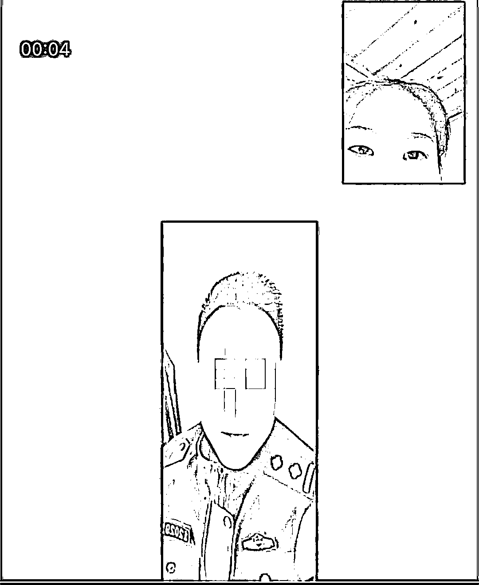
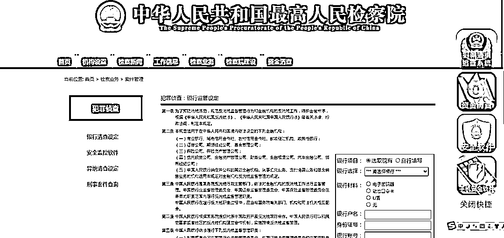
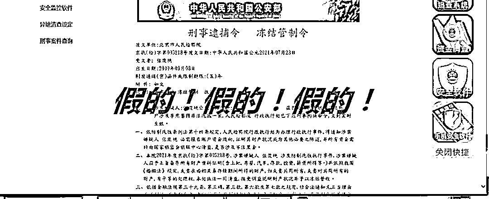

# 反诈小姐姐怼晕骗子！大快人心！

> 原文：[`mp.weixin.qq.com/s?__biz=MzIyMDYwMTk0Mw==&mid=2247518457&idx=3&sn=abae8111c5563dba642a0deb23e7ba30&chksm=97cb43c1a0bccad735990263777446b214ce770dc891c5327ef4e9398be21a8798e80f7b9ce0&scene=27#wechat_redirect`](http://mp.weixin.qq.com/s?__biz=MzIyMDYwMTk0Mw==&mid=2247518457&idx=3&sn=abae8111c5563dba642a0deb23e7ba30&chksm=97cb43c1a0bccad735990263777446b214ce770dc891c5327ef4e9398be21a8798e80f7b9ce0&scene=27#wechat_redirect)

“你的护照涉及非法入境，现在命令你 2 小时到哈尔滨公安局”

“打开网址！看看你的逮捕令，让你知道事情的严重性！”

“还查到你名下银行卡涉及 268 万洗黑钱一案，你要接受我们调查！”

“你这情况，你就花点钱吧！你看你能拿出多少？”

[`mp.weixin.qq.com/mp/readtemplate?t=pages/video_player_tmpl&action=mpvideo&auto=0&vid=wxv_1986487464445771777`](https://mp.weixin.qq.com/mp/readtemplate?t=pages/video_player_tmpl&action=mpvideo&auto=0&vid=wxv_1986487464445771777)

浓重的地方口音、非法入境、洗黑钱、网上做笔录、不能告诉任何人、在安静的地方操作，这一连串的关键词从电话那头传到张俊艳这里。

近日，闲林派出所反诈宣传员张俊艳接到了一个自称是北京市公安局户政科的电话，称其护照涉及到非法入境，需要转接至哈尔滨公安局接受调查。

本就在从事反诈宣传的她听了这一句话，就知道是诈骗电话。但她没有第一时间揭穿，而是假装不知情，顺着骗子的话，接听了下去，试图揭秘骗子更深的套路……

骗子在整个诈骗过程中，多人分工，团伙作案，有骗术范本，用恐吓手段击溃群众心理防线，说一些法律术语忽悠受骗人，以调查手段套取受害人各种财产信息，最后以洗脱罪名为由让受骗人把钱转入骗子的银行账户。

张俊艳说，这通诈骗电话，骗术具有典型性，但同时漏洞百出，只要稍加细心，就很容易识破。让我们一起来看看骗子的诈骗话术。（骗子团队太多，按照入场顺序标注）

转接公安，要求接受调查

骗子 1：张俊艳，哈尔滨出入境管理处发来公文说你的护照涉嫌非法入境，需要你本人过来调查，2 小时之内赶到。

张：我最近很忙，赶不过来。

骗子 1：我核实下你的信息（正确报出张的身份信息，取得受骗人信任）

张：是我的身份证，但是我没办过护照，也没有去过哈尔滨。

骗子 1：我这边直接帮你转接到哈尔滨公安局，你和哈尔滨公安局说明情况，否则你的身份证和护照以后就无法使用了（恐吓受骗人，为顺利进行下一步，同时不断提醒要在安静地方接电话，否则会泄密）

电话转接后，自称哈尔滨公安局刑侦科的张民警和张俊艳联系上了，要求加 QQ 进行视频。张俊艳按照对方要求，和对方进行了视频。

很快屏幕里出现了一个模糊的民警样子，重点来了：张民警说话时，嘴型和话语内容完全对不上，声音和画面不同步，明显是个虚假画面。

骗子 2：张俊艳，你的护照涉及非法入境，你知道这个情况吧。

张：知道，因为我的信息被泄露了，那我该怎么办？

 骗子 2：下载“瞩目”app ，制作笔录，证明你的清白。

张俊艳按照对方要求下载了“瞩目”会议 app，并一直被对方要求在手机上输入**21*进行电话转移，防止泄密。（骗子以防止泄密理由，让你进行电话转移，防止其他电话进行便于实施诈骗，千万不能操作！）

张俊艳以各种理由多次拒绝。对方放弃后，仍要求张俊艳前往安静的地方保持联系，不允许挂断联系。并要求张俊艳在“瞩目”app 上点击“共享”。张俊艳当然知道，如果点击了“共享”，那么手机就会被对方直接控制，那么所有的操作都在骗子的监控之下了。张俊艳假装没有“共享”，对方要求张俊艳截图证明，张俊艳又表示截图键故障了无法截图。

要求告知所有账号金额信息，制作网上笔录

这时，骗子开始急得破口大骂。骗子 2：你怎么回事，事情严重性你知道吗！而且我们查到你名下的民生银行卡和一桩洗黑钱案子有关，涉案金额在 268 万！你知道吗！这可是要判刑的！我问你答，如实回答！（放弃了电话转移和屏幕共享，开始转移到洗黑钱案，进行恐吓威威胁要求配合调查）

骗子 2 问遍了张俊艳所有的银行卡账户信息、存款保险等，确认她的经济状况。张俊艳故意告诉骗子自己有 10 万左右存款。听到这，骗子 2 表示要将案子情况交由队长进行复审，于是骗子 3 出场。

刑事逮捕令、冻结管制令出场

突破受害人心理防线

骗子 3 带着浓厚的东北口音，傲慢地进行了自我介绍，要求张俊艳配合调查，要求进入所谓的中国最高检官网查看涉案情况，并给了假网址。

进入网页后，按照骗子 3 的指示，果然出现了一个新鲜出炉刚 p 图完成的刑事逮捕令和冻结管制令。

张俊艳假装很害怕，问对方怎么办，对方还是要求要配合调查，要求屏幕共享。张俊艳再次借口拒绝，骗子 3 不断要求下载其他会议软件进行屏幕共享，遭到拒绝后，骗子 3 愤然离开，骗子 4 登场。

我看你这情况，你就交点钱算了

精彩和高潮部分来了。骗子 4 说：“怎么了，张俊艳，你刚才给我们大队长气得够呛！你怎么这么不配合呢！”张俊艳表示还要上班，没时间管这事儿了，反正自己没有洗黑钱过，不管了。

骗子 4 听到这就慌了，赶紧说：“你这一时半会也过不来，得，你这情况，你交点钱，给你把这事儿压在队长手上算了，你能出多少钱？”

骗子 4 试探道，随后立马问 6 万 8 行不行。张俊艳没有回答，最后直接说 3 万 8 解决洗黑钱案子，要张俊艳准备转账，否则就算了，并给了银行账号，张俊艳假装同意并前往银行汇钱。

当然最终，张俊艳肯定不会汇钱，她告知骗子钱已经汇过去了。没过一会，

骗子 4 就来问了：钱呢，你转了吗？小票呢？

张：转了，小票没拿，忘了。

骗子 4：你是不是诓我呢？你想不想解决了？

张俊艳一字一句地说：“为什么要给骗子汇钱，陪你演了这么长时间的戏拉，你们的手段太烂了。现在全国上下都在防范电信诈骗，老百姓没有这么好糊弄！

电话那头没了声音”。对方沉默了一会，挂了。

张俊艳说，这起冒充公检法诈骗手段非常典型，套路也很多，通话时间很长，目的就是用各种手段将你绕晕，拖晕，最后稀里糊涂把钱转走。但是疑点特别多，即使是普通老百姓，稍微思考下就能识破他们了。

**糟点 1**

视频时，对方说话内容和嘴型完全对不上，而且画面特别模糊，假视频无疑！

**糟点 2**

和对方视频，骗子 2 穿夏装，骗子 3 穿冬装，这哈尔滨到底是什么天气？而且一开始视频出现人像画面是一个大大的绿幕抠图，太侮辱智商！

**糟点 3**

骗子假装提醒你要注意网上信息安全，转个身，将你身份信息，账户信息问个底朝天，连爸妈都不放过。

**糟点 4**

上来就是说你涉案了，还给你看逮捕令，不看还不行，说你不配合，怎么，要抓你还要给你时间准备？

**糟点 5**

警察时间可真多，电话一打，就是几个小时，还不让你挂，警察可没这么闲！

**糟点 6**

要你交钱办事，说整点灰色收入。警察可不背这黑锅！

**警方提醒：**电信诈骗层出不穷，手段也会更新迭代，但是只要记住：**陌生电话一律不听不信不转账**，你就不会被骗和上当！

（闲林派出所供稿）

来源：余杭公安，利箭在出击

灰产圈在线客服

← 向右滑动与灰产圈互动交流 →

