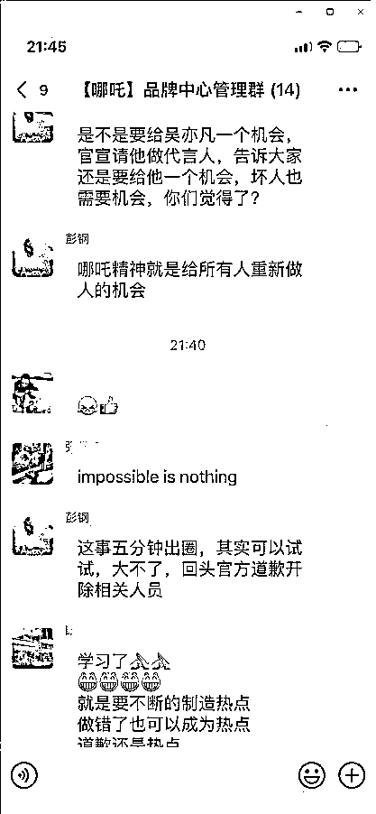
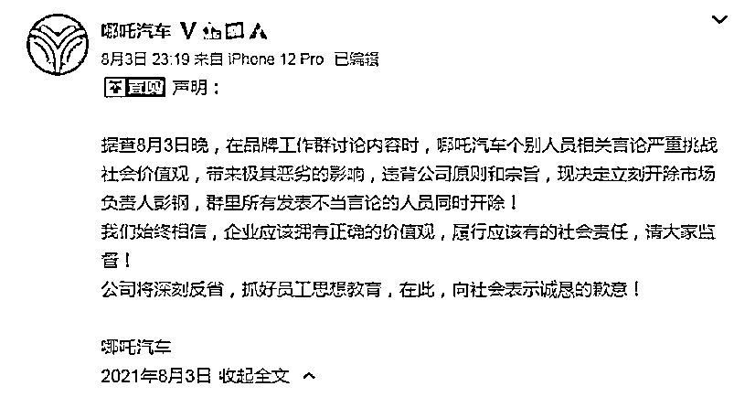
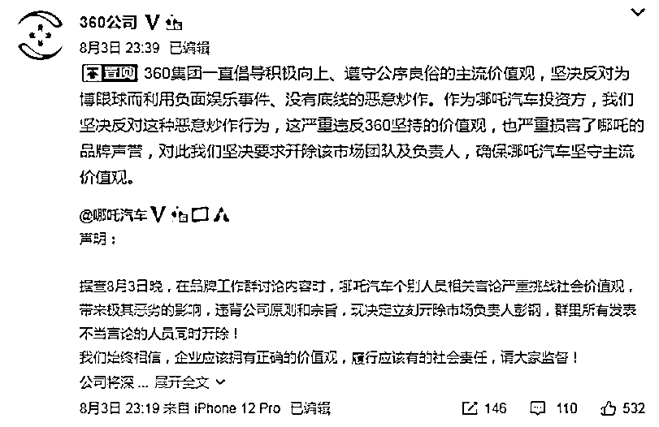

# 求锤得锤！哪吒汽车员工提议请吴亦凡代言被开除

> 原文：[`mp.weixin.qq.com/s?__biz=MzIyMDYwMTk0Mw==&mid=2247518457&idx=4&sn=3a4beb5cc696bbd3454e1271182b79e9&chksm=97cb43c1a0bccad7f45a27cc07c3483eacbd87043f7955ffe1e7799496b0d92a56d5b5c6934d&scene=27#wechat_redirect`](http://mp.weixin.qq.com/s?__biz=MzIyMDYwMTk0Mw==&mid=2247518457&idx=4&sn=3a4beb5cc696bbd3454e1271182b79e9&chksm=97cb43c1a0bccad7f45a27cc07c3483eacbd87043f7955ffe1e7799496b0d92a56d5b5c6934d&scene=27#wechat_redirect)

哪吒汽车品牌工作群讨论内容时，公司员工提议请吴亦凡做代言人……

3 日，针对品牌工作群讨论内容时，公司员工提议请吴亦凡做代言人一事，哪吒汽车声明，个别人员相关言论严重挑战社会价值观，带来极其恶劣的影响，决定立刻开除市场负责人彭钢，群里所有发表不当言论的人员同时开除。

网传截图

此前，一张网传截图显示，在一个名为“【哪吒】品牌中心管理群”的 14 人微信群内，一位昵称为“彭钢”的群成员提议，是不是给吴亦凡一个机会，官宣请他做代言人？彭钢还表示：“这事五分钟出圈，其实可以试试，大不了，回头官方道歉开除相关人员。”

来源：微博

3 日深夜，哪吒汽车在官方微博发布声明称，据查 8 月 3 日晚，在品牌工作群讨论内容时，哪吒汽车个别人员相关言论严重挑战社会价值观，带来极其恶劣的影响，违背公司原则和宗旨，现决定立刻开除市场负责人彭钢，群里所有发表不当言论的人员同时开除！

哪吒汽车表示，公司始终相信，企业应该拥有正确的价值观，履行应该有的社会责任，请大家监督。公司将深刻反省，抓好员工思想教育，在此，向社会表示诚恳的歉意。

来源：微博

在此之后，360 公司转发哪吒汽车上述声明并表示，公司一直倡导积极向上、遵守公序良俗的主流价值观，坚决反对为博眼球而利用负面娱乐事件、没有底线的恶意炒作。作为哪吒汽车投资方，公司坚决反对这种恶意炒作行为，这严重违反 360 坚持的价值观，也严重损害了哪吒的品牌声誉，对此公司坚决要求开除该市场团队及负责人，确保哪吒汽车坚守主流价值观。

天眼查 App 显示，哪吒汽车品牌所属公司为合众新能源汽车有限公司(下称“合众新能源”)，合众新能源成立于 2014 年 10 月，法定代表人为方运舟，公司经营范围包括新能源汽车整车及零部件的设计开发、生产、销售及相关的咨询服务等。

根据天眼查 App，自 2017 年以来，合众新能源已经历 7 轮融资，最近一次为 2021 年 4 月 27 日披露的 D 轮融资，投资方为奇虎 360，融资额约 30 亿人民币。

来源：中新经纬

← 向右滑动与灰产圈互动交流 →

