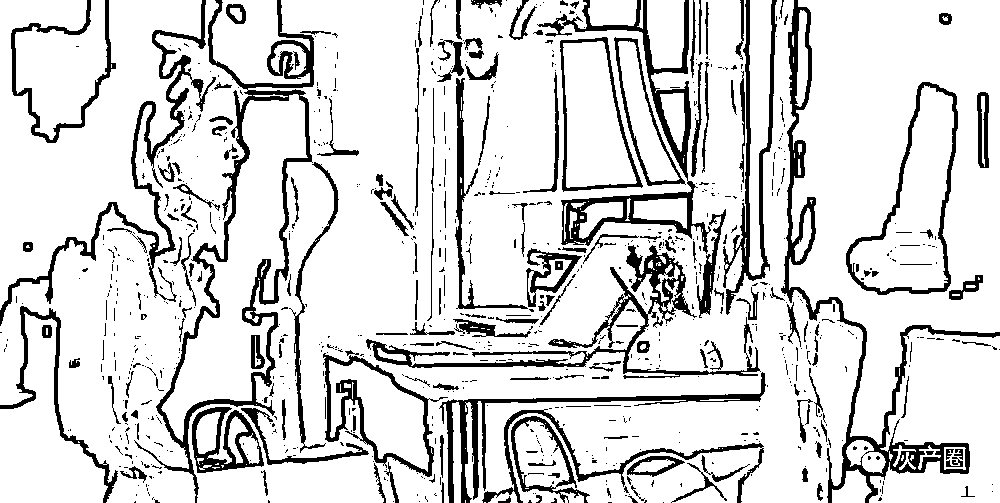
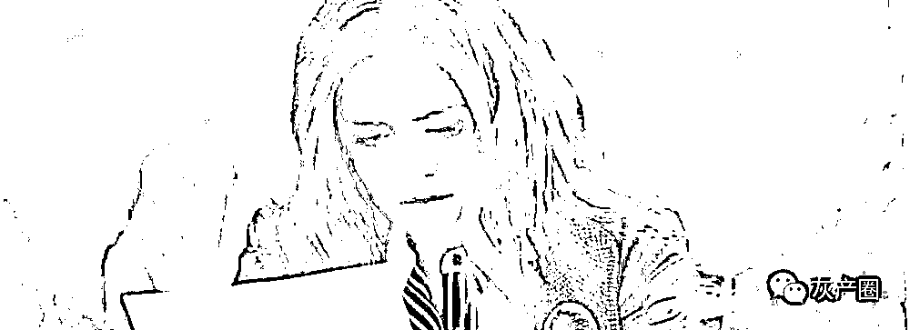
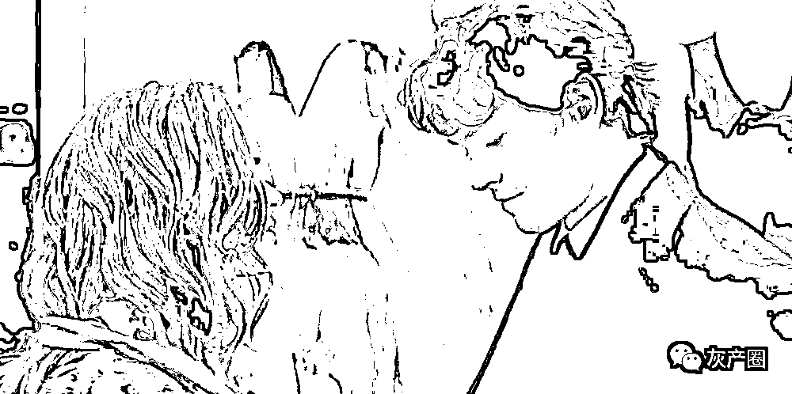
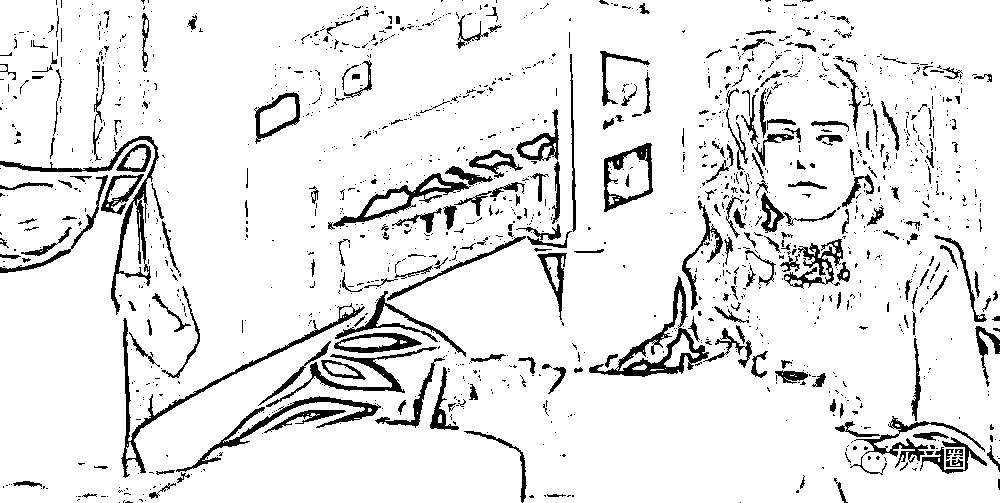
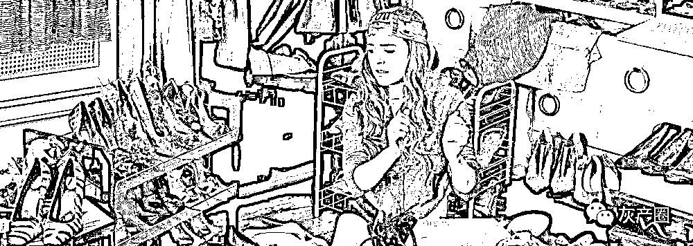

# 3 天被骗 36 万，90 后女生欠下花呗后，又陷入了杀猪盘

> 原文：[`mp.weixin.qq.com/s?__biz=MzIyMDYwMTk0Mw==&mid=2247518532&idx=1&sn=6a88df2829aa98b32446d9c86679252f&chksm=97cb427ca0bccb6ad9cfb7be64f09ec80b4822d23d2e83902984f5211e2042cf70d32b1ee302&scene=27#wechat_redirect`](http://mp.weixin.qq.com/s?__biz=MzIyMDYwMTk0Mw==&mid=2247518532&idx=1&sn=6a88df2829aa98b32446d9c86679252f&chksm=97cb427ca0bccb6ad9cfb7be64f09ec80b4822d23d2e83902984f5211e2042cf70d32b1ee302&scene=27#wechat_redirect)

前几天，一条自曝被骗 40 万的微博，把“杀猪盘”这个词，再次带上了热搜。 

更让人惊讶的是，在这条微博下的两万多条评论里，有很多都是杀猪盘的受害者。 

按说“杀猪盘”并不是什么新鲜的骗术，很多媒体都曝光过。为什么还是会有很多人接连中招呢？

事情并没有我们想象的那么简单。 

书单君之前采访过一位 90 后，她 3 天之内被骗了 36 万，刚认识对方的时候，她内心也很警惕，却还是在对方的一步步诱导下，掉进了陷阱。

今天的这篇文章，讲的就是这个 90 后的故事。她的遭遇看似个别，但在年轻人普遍被花呗困住的当下，其实并不一定是小概率事件。 

希望这个故事可以给大家提个醒，遇到类似的事情，千万不要有侥幸心理。 

要知道，天上掉的没有馅饼，只有陷阱。

1

“一不留神，我成了待宰杀的猪”

阿扎一度想到死。

在过去的一个月里，她几度觉得自己在崩溃的边缘徘徊着。焦虑和恐惧、懊悔和自责无时无刻不在她脑海中轰鸣。最严重的时候，她用水果刀在胳膊上划了一道。

“血一下子流出来，”她才像梦中惊醒一样突然清醒：“脑袋是木的，感觉不到疼。”

生于 1994 年的她，刚刚大学毕业还不到三年。一夜之间，就从朝气蓬勃的职场少女变成了负债 36 万的重压人生。她摸着空荡荡衣领后面的锁骨，没有任何妆容的脸上看起来异常的苍白。

“真的希望自己每天睁开眼睛就发现，这一切都是一场梦。”

直到报警的时候，阿扎才确定自己中了一种叫“杀猪盘”的骗局。本来只是为了还清平时大手大脚的信用卡和花呗的开销，却没想到掉进了更大的陷阱里。

以前在网上看到的那么多离奇又愚蠢的新闻结实地落在了自己的头上，重重地砸下来，措手不及。

“杀猪盘”并不是什么新鲜的骗术，很多媒体都曝光过。

一群躲在境外的骗子，活跃在各种婚恋交友网站或社交 app 上，寻找那些被各种债务逼迫又情绪低落的人。他们把搜寻猎物的平台称为“猪圈”；将在里面认识的人，无论是情感寂寞还是急需用钱的人，都叫做“猪仔”；而聊天、建立信任和恋爱关系的过程叫“养猪”，最后实施诈骗叫“杀猪”。

这些骗子们大多花言巧语，摸清“猪”的情况后，培养感情。让“猪”在哄骗中心甘情愿被“杀”后，还找不到屠夫在哪。

骗子们在国外租用服务器，搭建各种形式的赌博、彩票、投资平台，通过后台操控输赢，将最终的“杀猪”伪装的像真正的“赌博失败”。所以有的受骗者，在被“杀”后都不敢去报警，因为他们无法确定，自己是不是真的参与了一场不受法律保护的赌博。 

但其实，为了骗人，骗子们甚至会为了一头“猪”专门搭建一个网站，得手后就关闭。

阿扎是在一个名叫“Sxxx”（隐去部分字母）的社交 app 上认识了骗他的人，而她自己，揣着些许的贪婪和侥幸，为了让平日里大手大脚的开销有更丰厚的来源，在明知道可能会被骗时，一次又一次地选择相信对方。“像中了什么咒，就明知山有虎，偏向虎山行”地一步步走进陷阱。

直到以她名义借出的 36 万在网贷 app 的户头里被清零的时候，她才确定地觉得，“完了，真的被骗了。”之前心里有一百万个侥幸都轰然坍塌。阿扎的眼前一黑，瘫在沙发上，四肢不听使唤地颤抖。

2019 年 3 月 11 日，从那天起，她的心里像自动有了一个阀门用来锁住和这件事有关的一切记忆与感受，一旦阀门失灵，她就会被汹涌而出的自责绝望疯狂淹没。

“我这就是自己作死。”阿扎把自己的二十多岁总结为自杀式的人生。“骗子太可恨了，但我更恨自己，怎么好端端地就把自己的生活过成了这个样子。”

“贪婪、愚蠢、投机取巧。”阿扎自责的时候恨不得抽自己几个耳光。但即使没有落入这样的骗局，她的生活也是负债累累，“信用卡账单已经欠了好几万，想着通过投资赚一笔大的，赶紧还了卡债。”

2

贪心后放松了警惕，人生从此负债累累

一直以来，阿扎都是挺能花钱的那种人，遇到喜欢的东西基本上不怎么犹豫就下单。她平时最喜欢逛淘宝，觉得清空购物车的时候“简直有一种快感”。她办了 4 张信用卡，每个月的工资基本上除了房租，所有的钱全数都要还卡债，还有花呗和白条。

在她的观念里，人生得意须尽欢。而且刚毕业不久，作为一个女孩子，也没有买房和养家糊口的压力，所以就只管尽情地享受生活。哪怕这样的生活“一直以来都靠着好运气和精神胜利法始终在危险边缘徘徊”。

就像她妈妈形容她的那样， 阿扎属于典型的“就算借钱也不会让自己受一点委屈的人”。

和很多赶时髦的年轻人一样，阿扎生活中所用的手机、电脑、化妆品、衣服、包都是最新款的，小小的出租房间里甚至都已经快放不下了。而且因为不愿意挤地铁，她出门基本上都是打车。虽然买东西和花钱的时候的确很开心，但每个月收到账单和提醒还款的短信时，就感到“简直是噩梦，心口痛”。

分期付款，最低还款，信用卡代还，像滚雪球一样，阿扎的债务越来越高，有时候自己也觉得挺可怕的，但很快又被消费的快感抹灭。 

这种焦虑时常让她抓狂，却也让她心存幻想，“什么时候能发一笔横财还掉所有的债，那多轻松”。

但不切实际地想要一步登天的愚蠢想法，终于让阿扎玩出火了。

她跟我说，最开始也是因为无聊，才在社交 APP 里和那个骗子聊天的，对方说话风趣幽默，照片还挺帅。

在被要求加微信的时候，其实阿扎也犹豫过会不会是骗子，但转念一想，如果真是骗子，自己平时也多警惕一点就好了，不给他打钱不告诉他银行卡号。更何况，她自己还欠着银行信用卡的账单没还完，“人家能骗我什么呢？”

聊天的过程中，骗子对阿扎嘘寒问暖。他说自己在上海，依然每天关注北京的天气情况，时刻提醒阿扎添加衣服。而且每一个无聊的时候，他都随叫随到地出现，甚至还主动帮阿扎还了 5000 块钱的花呗账单。“除了不在身边，当时觉得他简直像一个完美的男朋友。”

情人节那天，阿扎收到骗子送来的一大束红玫瑰。“当时真的有点感动，同事们也都羡慕我，以为我有个这么浪漫的男朋友。” 

这束红玫瑰，也让阿扎放松了警惕。

渐渐地，她和那个素昧平生却温柔的“男朋友”敞开心扉，工作、生活、家庭什么都聊。虽然现在回想起来，阿扎才恍然发觉，好像是她一直在倾诉，对方只是一个很好的聆听者，基本上没有透露什么重要的信息。可在无聊忙碌的生活里，“能够有人听你唠叨、发泄坏情绪，这已经是非常难得的事情了。”

后来自然而然地，阿扎把自己最大的烦恼——如何赚更多的钱，来抵消日积月累的账单，告诉了对方。而那个人甚至也温柔地主动提出要帮她分担，但在自尊心的作用下，感动之余的阿扎还是拒绝了他的“好意”。

于是，他提起自己正在用一种理财产品，回报率有 15%以上。阿扎第一次听的时候并没有当回事，毕竟网上这种理财产品的套路太多，容易受骗。所以一开始她也根本没往这方面去想。

但是，信用卡、花呗催促还款的信息一条接一条发来的时候，每个月都有的焦虑让阿扎心烦意乱，她忍不住跟对方抱怨自己的负债情况，倾吐心里的烦躁。而在享受温柔安慰的同时，阿扎再一次被安利了那个理财产品。

好像有一扇很小的窗口打开了，透进来一点光。面对着加起来几万块钱的账单，阿扎心里某个地方轻轻地动摇了一下。“但他也没有逼近，这让我更松动了一点点。”

虽然心里还是有一丝疑虑，潜意识里也怀疑着这会不会是骗局。但当阿扎真的拿起手机，想要发信息质疑这个处处替他着想的“完美男友”时，她首先就被自己的愧疚打败了。毕竟聊了这么久，对方一直给自己无微不至的关怀和安慰。

于是，出于愧疚，也出于想要试试看的心理，阿扎谨慎地和他玩了一盘投资。一开始，警觉的心思还在，阿扎只投了两百块钱，觉得输了就输了，也不多。但被他带着玩了几把，还真赚了几十块钱，回报率差不多 30%了，而且还能把钱顺利提出来，阿扎像看到什么致富的法宝，一下觉得好像这事可以做。

那个时候，她天真地以为，“骗子没理由把到手的鱼放回鱼塘里吧。后来我才明白，那是骗子嫌鱼还不够大。”

在阿扎陷入虚假的柔情和暴富的幻觉中时，骗子告诉她，自己有个表哥，有这个平台的内幕，可以带他们一起玩，而且他自己去年就和表哥一起赚了 100 多万。丰厚的回报，让当时的阿扎完全混乱了，她决定放手一搏，抓住机会赚一笔大钱。

虽然阿扎和骗子始终没有见面，但从各种细枝末节中都能够感受得到，对方应该很喜欢她。但她没有料到的是，男人的甜言蜜语不一定是为了睡你，也可能是为了骗你的钱。

于是阿扎在他一整天的催促中，从各个网贷平台实名借出了总计 36 万元人民币。

其间阿扎还自以为聪明地警惕着，查看了那些贷款的平台的资质，以为不从没有背书的小网贷小高利贷平台借款就没事。但事实证明，骗她的人引导她借款的平台不但正规可信，而且大部分都直连个人征信系统，这也就意味着如果一旦逾期还款就会严重影响阿扎以后的个人信用评分。

后来的结局当然是毫无悬念的，在所谓知道内幕的“表哥”的指挥下，以阿扎名字借贷出共计 36 万元人民币被尽数“输光”。虽然在骗子指引的那个平台中，输和赢都是虚拟的，但阿扎实名借贷出的不知道去哪了的钱是实实在在的。

“我真的觉得自己活该。”尽管数次怀疑过这是一场骗局，但面对骗子的贴心问候、温情呵护，以及财力雄厚又努力上进的人设伪装，阿扎还是放下了防备。

报警后，阿扎被拉入一个微信群里，那里面有将近 100 个被同样手法欺骗的受害者，很多人最初的想法都一样：尽快还清花呗借呗或卡债，顺便赚一笔。

可是，他们掉进了更大的债坑。

现在的阿扎除了后悔，就只能把希望寄托在警察身上，期盼着能够抓到骗子，能想办法解除她身上的贷款。她说，当时就是因为贪婪作祟，而且平时花钱大手大脚，本来就欠了一屁股的债要还。 

但听了那么多一夜暴富的神话，当感觉好像有机会来到自己面前时，真的很难理智。

如今阿扎经常收到被催款的电话，威逼利诱软磨硬泡又不厌其烦。她感到恐慌，甚至有严重的阴影，有时候过马路，路边突然停下辆面包车，她都会害怕里面冲出来一个人把她绑走，要她还债。

而平时刷朋友圈，看到有人抱怨工作，以前懒懒散散的她甚至都觉得羡慕，“多无忧无虑啊。挣的钱是自己的，不想花就可以存下来。”

她说自己已经很久没买东西了，以前偶尔失眠了习惯网购，但现在几乎每天都失眠，把看中的东西统统加进购物车，塞满了就删除清空，一件件加再一件件删。“我发现这样其实和真的下单作用差不多。”她只能这样安慰着自己。

前几天陪同事去逛商场，阿扎看到一个现在在用但快用完的粉底液，才 300 多块钱，但根本不敢买。“想到自己背着几十万的贷款，哪还敢花钱啊。”

其实，她也认真地算过，如果不是遭了这一劫的话，到今年年底，她之前那些信用卡分期债务就基本还清了，那曾经是她最苦恼的事情。而且如果平时稍微节省一点，不那么大手大脚地开销，她甚至可以攒一点钱出去旅游。但现在她已经没心情去算卡债了，“太少了，不值得算。”

但如果不能破案，要自己来还清现在这些债，阿扎需要在维持日常开支，也就是最基础的吃住情况下，省吃俭用四五年。她之前还一直想去做个医美割眼袋，现在也不敢去了，虽然没多少钱，但真的划拨不出这笔预算了。

“五年后我就三十了，希望我不用等到那时候才有钱去割眼袋。”阿扎有点绝望灰心。

对于她来讲，这件事算是人生一个转折点，毕竟这么巨额的债务在身上压着。

“这一次，好像彻底杀死了我的懒惰。”阿扎说道。

3

只要贪婪且懒惰，

就逃不开危险的自杀型人生

贪婪是可怕的，但贪婪搭配上行动，也许能让人在职场中搏出一片天地。

懒惰也是可怕的，但懒惰搭配清醒，也许会让人踏踏实实地过小日子。

可是，当贪婪搭配了懒惰，人就会在享乐的过程中，谋杀自己。

阿扎最后悔的是，她本想尽快从一个负担中缓解出来，却没有踏踏实实走正道，正中骗子下怀，结果掉进了更大更多的债务里。

而且，除了陷入骗局，最让她后悔的，就是她长期以来毫无节制和规划的生活开销，最终让自己把人生过成了这副悲惨模样。

像阿扎这样背负 36 万的巨额债务，让生活变得不堪重负实在让人乍舌。但现在 90 后年轻人们，背着债务的不在少数。

可能陷入骗局是小概率的事件，但越来越多的新闻提醒着我们，现在的 90 后普遍都是负资产的状态。每个月最有钱的时候就是发工资那一刻，下一秒就会被各种信贷扣光还款，回归赤贫。

然而，比贫穷更可怕的是，一边是年轻人一贫如洗，月月光的口袋，一边却又是疯狂的信贷逾期，冰与火之间，这届年轻人的生活，犹如深渊。

网上类似的新闻也一直不断。去年 1 月，武汉理工大学一名研究生突然自杀身亡，轰动全国。

他因通过向 17 个 APP 借贷，欠款达五万多元，深陷借新还旧的深渊，无法自拔，最后走上不归路，枉费了父母、国家、学校 20 年辛辛苦苦地栽培，留给这个世界一地鸡毛，留给父母半生哀痛。

就像一位深陷消费贷的年轻人所说的：

“最初，我只是想买一部刚上市的 iPhone。分期后月还 600，完全可以负担得起。

后来想买的越来越多，于是，只好开通了信用卡、花呗、借呗、各种网贷，

拆了东墙补西墙，分期不行就套现。很快，我的工资就跟每月还款额持平了……

我不敢考研，不敢辞职，只能一步一步向前。用房租和吃饭以外的每一分钱来偿还透支的每一个明天。”

一时的享受和侥幸，固然是销魂蚀骨般的舒爽，但潘多拉魔盒一旦打开，就如洪水出笼般狂飙，难以抑制，寅吃卯粮、透支信用的代价就是让未来没有未来。

涉世未深的年轻人，总是低估生活的艰难，单纯地以为自己挣不到钱是因为还没有找到路子，或者胆子还不够大。

涉世未深的年轻人，也总是高估生活的艰难，每天都在担心自己已经被同龄人甩下。甚至只掩耳盗铃地选择那些人前的光鲜，只顾高喊着“要自由”，却被账单剥夺了真正的自由。

等自己的人生有一天慢慢被谎言渗透、被债务压垮的时候才感到后悔，可为时已晚。

但谁又不是负重前行呢，最重要的，还是学会从当前下坠的人生里幡然警醒，踏踏实实走好每一步，用实力去奋斗、去赚钱，和值得信赖的人相爱，这样的青春才有明天。

来源：安危情报站，天天防诈骗

灰产圈在线客服

← 向右滑动与灰产圈互动交流 →

