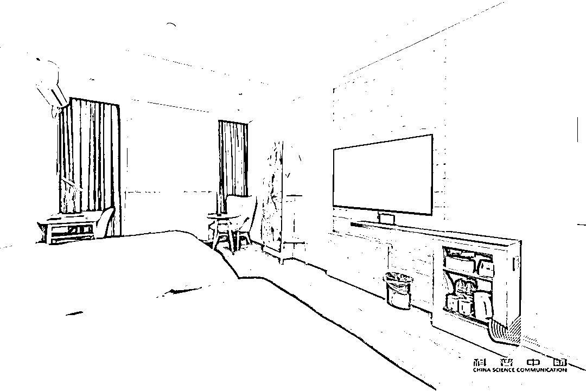
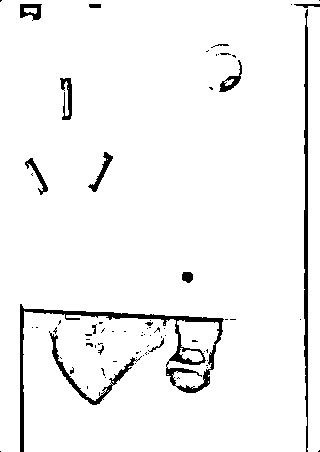

# 入住酒店时，为啥要先拔掉电视机插头？照做就对了

> 原文：[`mp.weixin.qq.com/s?__biz=MzIyMDYwMTk0Mw==&mid=2247518532&idx=3&sn=9397917367bdf45d9d64a47e7673c79c&chksm=97cb427ca0bccb6afffce4a479f38dd5fdadcf4b2a8005431da49ff4715ed610ac5516a20fc0&scene=27#wechat_redirect`](http://mp.weixin.qq.com/s?__biz=MzIyMDYwMTk0Mw==&mid=2247518532&idx=3&sn=9397917367bdf45d9d64a47e7673c79c&chksm=97cb427ca0bccb6afffce4a479f38dd5fdadcf4b2a8005431da49ff4715ed610ac5516a20fc0&scene=27#wechat_redirect)

酒店，作为一个临时的私人住所，它的安全性自然是最重要的。

以前我们觉得自己的身份信息被盗卖已经是很严重的一件事了，但随着科技越来越发达，发现有很多人会通过安装各种各样的摄像头，以偷拍各种私人照片并进行贩卖。

而且，现在的摄像头也越做越小，特别是针孔摄像头让人防不胜防。尤其是住酒店的时候，很多不起眼的小地方都会暗藏摄像头，包括插座孔、电视机、螺丝钉等。

所以，我们要学会保护自己，**入住酒店要检查有没有摄像头。**

由于电视的摆放位置，可以看到房间内的环境，所以很多不法分子会将摄像头装在电视内，除此之外，在电视机里装摄像头，还会提高摄像头的隐蔽性，不过如果入住酒店时**第一时间将插头拔掉，就可以让电视失去电源，**即使电视机里有摄像头也无法正常运作。

由于针孔摄像头由于体积小，隐密性好，安装方便且不容易被发现，所以可以伪装成任何东西，实在不易辨认！

所以在入住酒店想要防止隐私泄露，除了拔掉电视插头外，还要仔细观察一些隐蔽性强的家具。

**可能藏针孔摄像头的重灾区有：**

• 天花板上的烟雾探测器

• 空调出风口

• 对着床或卫生间的装饰画/摆设 

• 电视附近

• 桌椅下沿

• 插座、纸巾盒、挂钩等小物件

检查时主要看看**有没有不该出现的小圆孔**，它们极有可能是藏镜头的地方。

如果在插座表面看到一个黑色小洞，就很可疑，不过这种很少人用了，因为容易被发现；所以往往会被**嵌入在插座里面，可以正常充电，隐蔽性极高。**

还有洗手间也要重点检查，**偷拍设备可能就藏在坐便器的水箱中**，镜头正对着洗澡的区域。

以上这些，还都只是冰山一角，有些人甚至被偷拍了，到现在都还不知道。

那要如何检查房间有没有针孔摄像头呢？之前网传在黑夜中打开手机摄像头，寻找红点的方法找到隐藏的针孔摄像头，其实啊，这个方法早就已经过时了，因为现在的手机摄像头基本都过滤掉红外线了。

想要找到这些摄像头，我们还得靠些新方法才行！

**如何找到隐藏的摄像头？**

**一、关闭电源大法**

最最简单粗暴的方法就是直接切断电源了，因为针孔摄像头比较耗电又无法自由地更换电池，所以一般都会接在房间的电路里，这样，我们只需要断掉电源，摄像头也就无法继续偷拍了，但同时我们也会非常不方便……

**二、红光手电排查法**

我们可以利用红光手电照射来进行检测，因为摄像头的外表是一个弧面的形状，用红光手电照过去就会有一个非常明显的红色反光。

怎么照也是有讲究的，我们重点检查**这三个高度的地方：**

❶ 我们头顶的位置

当我们进入酒店或者民宿后，先关上灯，拉上窗帘，用红光手电照射床所在位置的上方，重点检查屋顶的烟雾报警器、空调孔等地方。   

❷ 自己头部的高度

然后站在床边，用手电围绕自己头部的高度照射一圈，检查这个范围内是否隐藏有摄像头。

❸ 膝盖的高度

按照我们膝盖的高度，再做一圈检查，排除房间里的可疑物品。另外，凡是对着床的设备我们都需要仔细检查。

**三、反光检测法**

针对普通的针孔摄像头，我们也可以用手机的手电筒来寻找反光物，**如果说照射的位置有反光，则可能有隐藏摄像头。**在曝光的偷拍事件中，就有受害人是通过这个方法发现了插座中有摄像头反光。

小伙伴们出门在外一定要注意个人隐私问题，虽说，不是每家酒店都会出现这种事情，但警惕点，总没错。

来源：高质量生活家 ，利箭在出击

灰产圈在线客服

← 向右滑动与灰产圈互动交流 →

