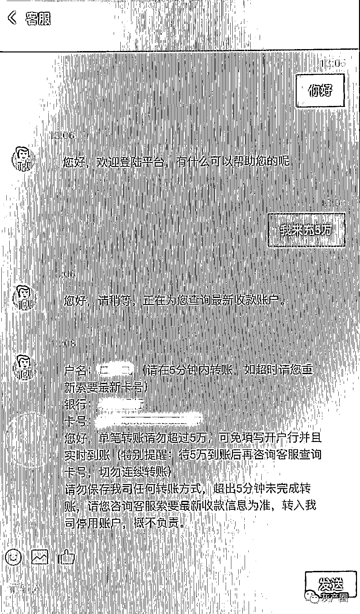

# 职业身份特殊的帅哥帮忙投资“虚拟币”？一女士接连被骗 26.3 万！

> 原文：[`mp.weixin.qq.com/s?__biz=MzIyMDYwMTk0Mw==&mid=2247518532&idx=6&sn=1213b4de946a7ead229c28a270d664d1&chksm=97cb427ca0bccb6a21d06bdc611f7178e8acad17de3b231bc23116d6967116a36dd3893b3365&scene=27#wechat_redirect`](http://mp.weixin.qq.com/s?__biz=MzIyMDYwMTk0Mw==&mid=2247518532&idx=6&sn=1213b4de946a7ead229c28a270d664d1&chksm=97cb427ca0bccb6a21d06bdc611f7178e8acad17de3b231bc23116d6967116a36dd3893b3365&scene=27#wechat_redirect)

近日诈骗团伙更翻陈出新，以投资虚拟币为由，假造投资平台、利用转账失误等方式诈骗圈钱。

  

7 月 23 日，家住兰溪市兰江街道的范女士通过某交友平台认识并添加了一名自称是某武装部队研发部人员“林某”，还发了自拍照给范女士。

两人你一言我一语，在每日的问候和话家常间聊的十分融洽。对方长相英俊，工作稳定，也没有明显的意图，让范女士放下了戒备之心。

 聊了两天后，“林某”突然给范女士发来一条陌生链接，并让其点击链接下载了一款私密聊天软件，表示自己工作特殊，在微信上聊天不安全，下载这款软件后聊天更放心。

范女士想到对方职业的特殊性，就听信了对方所说，根据对方要求下载了该软件。“他还让我删除聊天记录，我删了很多。”范女士说，虽然两人将聊天阵地移到了这款私密聊天软件上，但对方为了确保安全还要求她删聊天记录。

没有了微信聊天对敏感词汇的提醒，范女士还主动删除聊天记录，放心的“林某”也露出了真面目。

往后的聊天中，“林某”开始极力向范女士推荐虚拟币投资，表示自己获利颇丰，想邀请她一起加入，赚取利润。

起先，范女士是拒绝的，但在对方的不断鼓动诱导下，范女士点击了对方提供的操作虚拟币买卖的平台链接、创建账号，然后充值了 8400 元、12000 元。 

转账记录

“这些投资操作都很真实，我两次汇款都是汇到正规的大银行，虚拟币收益不高但也有收益，毕竟我投资少，而且也可以提现，感觉很正常。”范女士说，当时自己已经深信不疑。

 7 月 30 日，在充值了 50000 元后，“林某”希望范女士多投点，范女士表示自己没有这么多钱。没曾想，对方听后竟直接给范女士“充值”了 41000 元。

范女士说，自己当时还很感动，后来想想，这些可能都是事先安排好的套路与脚本。

看着账户里包括收益有 10 多万的资金，范女士果断选择了提现！

这一次，范女士却没有提现成功。 

 客服告诉范女士，是因为其操作失误导致了账户被冻结。想要解冻就需要充值与账户余额同等的金额，才可以解冻。

这让范女士犯了难，毕竟自己没有那么多钱，但是看着自己那 10 多万的账户余额，范女士最终决定解冻！ 

 在客服的指导下，范女士用借来的钱向对方提供的银行账户分三次转账了 107800 元。

然而，范女士还是没有提现成功。这次，客服给出的理由是范女士转账的银行卡都是使用过的，导致账户信用分降低，需要用没有使用过的银行卡再转账 107800 元。同时告知范女士超时解冻每日将扣除账户余额 10%，直到扣完。 

 一想到前面用来解冻的 10 多万里很多都是借来的钱，如果拿不回自己就将背负债务了，害怕的范女士只好再次申请解冻，并向好友“林某”求助。

最终，范女士又转账了 92800 元，剩余的 15000 元由“林某”帮其垫付。至此，范女士已经连续转账共计 26.3 万元。

这次，客服终于不再与范女士说还需冻结了，而是让范女士静等结果，他们审核后就将所有资金提现到范女士账户。

8 月 1 日，看着自己依旧静悄悄的银行账户，越想越不对劲的范女士终于坐不住了，急匆匆地来到了兰溪市公安局兰江派出所报警。

然而为时已晚。

**警方提醒**

面对突如其来的诱惑、鼓动，一定要保持冷静，“天上不会掉馅饼”，否则占“大”便宜吃大亏的事就极有可能在自己身上上演，特别是对于陌生人主动搭讪并许以“好处”的事情，要保持警惕。 

来源：武汉晨报综合自金华公安，利箭在行动

灰产圈在线客服

← 向右滑动与灰产圈互动交流 →

